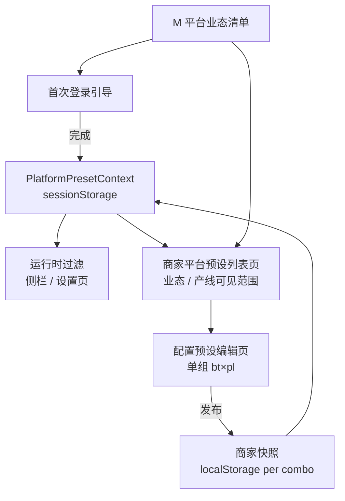

# 平台预设 · 商家后台按登录引导业态/产线展示 — 设计方案

> 版本：v0.1 · 2026-06-26  
> 状态：已实现（方案 A · 2026-06-26）  
> 关联：`platform-preset-onboarding.ts`、`platform-preset-context.ts`、`platform-preset-ui.ts`、`平台预设-产品需求与设计说明.md`

---

## 一、背景与目标

商家完成**首次登录引导**（选择经营业态 → 选择产线 → 功能确认）后，系统已将所选组合写入门店上下文，侧栏与设置页按对应预设快照过滤展示。

但当前**商家后台 · 系统设置 · 平台预设**列表页仍展示**全部经营业态**与**全部 9 条产线**，与引导选择脱节，容易造成：

- 运营误以为需为未使用的业态/产线单独配置；
- 无法直观看到「本店实际生效的是哪几组业态×产线」；
- 与侧栏运行时过滤范围不一致，增加理解成本。

### 1.1 目标

进入商家后台后，**平台预设管理页**的展示范围应与登录引导所选**业态、产线**对齐：

| 区域 | 引导后展示规则 |
|------|----------------|
| 左侧经营业态 | 仅展示引导中**已选业态**（含 M 平台下发的自定义业态） |
| 右侧产线卡片 | 仅展示引导中**已选产线** |
| 配置预设编辑 | 仅允许打开引导范围内的「业态 × 产线」组合 |
| 页头说明 | 明示当前门店生效范围，并提供「重新引导」入口 |

### 1.2 非目标

- 不改变 M 平台企业级预设的编辑范围（M 平台仍管理全量业态与产线）；
- 不在商家后台新增经营业态（已由 M 平台统一维护）；
- 不修改预设树的生成规则与 L1～L4 节点定义。

---

## 二、现状与差距

### 2.1 已有能力（可复用）

```
首次登录引导完成
  └─ applyPlatformPresetContext(businessTypeIds, productLineIds)
       └─ sessionStorage: menusifu:platform-preset-context-v1
            ├─ businessTypeIds: string[]
            ├─ productLineIds: ProductLineId[]
            ├─ combos: { businessTypeId, productLineId, version }[]
            └─ appliedAt

运行时过滤（侧栏 / 设置页）
  └─ getMergedPlatformPresetSelection(ctx)
       └─ 多组 selection 并集 → filterNavByPlatformPreset / filterModuleSettingsGroupsForPreset
```

### 2.2 当前差距

| 能力 | 引导 / 运行时 | 商家平台预设页 |
|------|---------------|----------------|
| 业态范围 | 用户所选子集 | 全量内置 + M 平台自定义 |
| 产线范围 | 用户所选子集 | 固定 9 条全展示 |
| 上下文提示 | 引导页步骤③有摘要 | 列表页无「本店范围」说明 |
| 深链校验 | — | 可手动访问未选组合的 edit URL |

---

## 三、设计原则

1. **单一数据源**：商家平台预设页的可见范围以 `PlatformPresetContext` 为准，与侧栏过滤共用同一份上下文，禁止另维护一套「展示用业态/产线列表」。
2. **只读范围、可写内容**：引导决定「看哪几组」；组内的 L1～L4 勾选仍由商家发布预设快照决定（在引导范围内微调）。
3. **多选并集一致**：引导支持业态、产线多选时，列表页展示**笛卡尔积涉及的业态集合与产线集合**，与运行时 `combos` 一致。
4. **无上下文降级**：未完成引导或上下文被清除时，列表页给出明确空态与操作指引，不静默展示全量（避免误导）。

---

## 四、交互设计

### 4.1 列表页（`#/settings/platform-preset`）

#### 页头信息条（新增）

在现有说明下方增加**本店生效范围**条：

```
当前门店（来自登录引导）：快餐、茶饮 · POS、Kiosk
共 4 组预设并集 · 上次应用 2026-06-26 14:30
[重新引导]
```

- 业态名、产线名从 catalog 解析；自定义业态读 M 平台清单；
- 「重新引导」复用顶栏同一能力（`restartPlatformPresetOnboardingFromStart`）；
- 若引导后上下文与侧栏不一致（如仅 session 丢失），提示用户重新引导或联系管理员。

#### 左侧 · 经营业态

| 状态 | 展示 |
|------|------|
| 有引导上下文 | 仅 `ctx.businessTypeIds` 中的项，按「服务方式 → 品类 → 自定义」分组；**无「+ 新增」**（已定） |
| 无引导上下文 | 空态：「请先完成登录引导以确定本店业态范围」+ 按钮「去引导」 |

- 默认选中：上下文内第一个业态；若本地 `selectedBusinessTypeId` 仍在范围内则保留。
- 切换业态：右侧产线区刷新，仍只显示 `ctx.productLineIds`。

#### 右侧 · 产线卡片

| 状态 | 展示 |
|------|------|
| 有引导上下文 | 仅渲染 `ctx.productLineIds` 对应卡片（1～9 条的子集） |
| 无引导上下文 | 与左侧一致的空态，不展示产线网格 |

卡片内容与现有一致：推荐数、启用数、版本、配置预设、变更记录。

#### 变更记录

- 「全部产线变更记录」仅汇总**当前可见产线**；
- 单卡「变更记录」逻辑不变。

### 4.2 编辑页（`#/settings/platform-preset/:bt/:pl/edit`）

- 进入前校验：`businessTypeId ∈ ctx.businessTypeIds` 且 `productLineId ∈ ctx.productLineIds`；
- 不合法：重定向列表页并 `alert`「该业态×产线不在本店引导范围内」；
- 合法：行为与现有一致（四列矩阵、保存并发布、恢复推荐默认）。

### 4.3 与「重新引导」的联动

顶栏或列表页触发重新引导后：

1. 清除 `PlatformPresetContext` 与引导完成标记；
2. 用户重新选择业态、产线并完成功能确认；
3. `applyPlatformPresetContext` 写入新上下文；
4. 再次进入平台预设列表页时，按**新选择**过滤展示；
5. 侧栏与设置页同步按新并集过滤（已有逻辑）。

---

## 五、数据流



**读取顺序（列表页 mount）**

1. `ctx = readPlatformPresetContext()`
2. 若 `ctx == null` → 渲染空态
3. `visibleBusinessTypes = filterBuiltinAndCustom(ctx.businessTypeIds)`
4. `visibleProductLines = PLATFORM_PRESET_PRODUCT_LINES.filter(id => ctx.productLineIds.includes(id))`
5. `selectedBt = clamp(selectedBusinessTypeId, visibleBusinessTypes)`
6. 渲染左侧业态 + 右侧 `visibleProductLines` 卡片

---

## 六、方案对比与推荐

| 方案 | 描述 | 优点 | 缺点 |
|------|------|------|------|
| **A. 严格过滤（推荐）** | 列表仅展示引导范围内的业态与产线 | 与运行时一致、认知负担低 | 无上下文时无法配置 |
| B. 全量展示 + 高亮 | 全量列表，引导范围内高亮，范围外置灰 | 无上下文仍可浏览 | 易误解、与「本店范围」目标冲突 |
| C. 按 combo 分 Tab | 每个「业态×产线」一个 Tab | 组合关系最清晰 | 多选时 Tab 过多，改动面大 |

**推荐方案 A**：商家平台预设是「本店配置」入口，范围应等于引导结果；无上下文时引导用户完成引导，而非展示全量。

---

## 七、边界与异常

| 场景 | 处理 |
|------|------|
| 引导选 1 业态 × 1 产线 | 左侧 1 项，右侧 1 张卡片，无切换成本 |
| 引导选 2 业态 × 3 产线 | 左侧 2 项；右侧始终 3 张产线卡（与当前选中业态组合为 6 组运行时并集） |
| 自定义业态仅在 M 平台存在 | 引导可选；列表左侧「自定义业态」分组仅显示在 `ctx.businessTypeIds` 内的项 |
| sessionStorage 清空、引导完成标记仍在 | 列表空态 +「重新引导」；侧栏不过滤（与现有一致） |
| 手动输入未选组合 edit URL | 重定向列表 + 提示 |
| 连锁多店（后续） | 上下文升级为「门店级」存储；本方案接口预留 `storeId`，演示阶段仍用 session |

---

## 八、实现要点（供开发拆分）

### 8.1 新增模块函数（建议）

`platform-preset-merchant-view.ts`（或扩展现有 `platform-preset-context.ts`）：

```typescript
interface MerchantPresetViewScope {
  hasContext: boolean;
  businessTypeIds: string[];
  productLineIds: ProductLineId[];
  comboCount: number;
  appliedAt?: string;
}

function resolveMerchantPresetViewScope(): MerchantPresetViewScope;
function isComboInMerchantViewScope(bt: string, pl: ProductLineId): boolean;
function clampSelectedBusinessTypeId(preferred: string, allowed: string[]): string;
```

### 8.2 修改点

| 文件 | 变更 |
|------|------|
| `platform-preset-ui.ts` | 列表页按 scope 过滤业态/产线；页头信息条；编辑页路由守卫 |
| `platform-preset-scope.ts` | 更新 `MERCHANT_PLATFORM_PRESET_SCOPE.listIntro`，说明范围来自引导 |
| `platform-preset-onboarding.ts` | 完成引导后可选：将 `selectedBusinessTypeId` 设为 `businessTypeIds[0]` |
| `main.ts` / 路由 | edit 路径非法时重定向 |

### 8.3 验收标准

- [ ] 引导选择「快餐 + POS、Kiosk」后，平台预设列表仅 1 个业态、2 张产线卡；
- [ ] 切换左侧其他已选业态时，产线卡仍为引导所选产线子集；
- [ ] 访问 `#/settings/platform-preset/tea/cds/edit` 且 CDS 未在引导中 → 拦截；
- [ ] 重新引导并更改选择后，列表与侧栏同步更新；
- [ ] M 平台 `/m-platform/platform-preset` 不受此过滤影响；
- [ ] 无上下文时显示空态，不展示全量 9 产线。

---

## 九、与既有文档的关系

- 本文是对《平台预设 — 产品需求与设计说明》**§4.1 列表页**在商家后台场景的**范围约束补充**；
- §二「三者关系」中「平台预设（管理员配置）」在商家侧细化为：**在引导确定的业态×产线子集内，商家可发布本店快照**；
- 经营业态来源以 M 平台为准（商家不可新增）——见近期已落地规则。

---

## 十、待确认问题

1. **无引导上下文时**：是否允许「高级模式」查看全量（方案 B），还是强制空态（方案 A，当前推荐）？
2. **引导多选业态**：右侧产线卡是否需要在卡片角标标注「与当前业态组合数」（如 2 业态 × 2 产线 = 4 组）？
3. **持久化**：演示环境上下文在 `sessionStorage`；生产是否改为「门店档案」接口持久化（引导完成即写入门店，换浏览器仍有效）？

---

## 附录：页面线框（列表页）

```
┌─────────────────────────────────────────────────────────────┐
│ 平台预设                                                     │
├──────────────┬──────────────────────────────────────────────┤
│ 经营业态      │ 快餐 · 产线预设                               │
│              │ 当前门店（来自登录引导）：快餐 · POS、Kiosk      │
│ ● 快餐       │ [重新引导]                                    │
│ ○ 茶饮       │                                              │
│              │ ┌─────────┐ ┌─────────┐                      │
│              │ │ POS     │ │ Kiosk   │                      │
│              │ │ 配置预设 │ │ 配置预设 │                      │
│              │ └─────────┘ └─────────┘                      │
└──────────────┴──────────────────────────────────────────────┘
```

（未选中的业态/产线不出现在列表中。）
