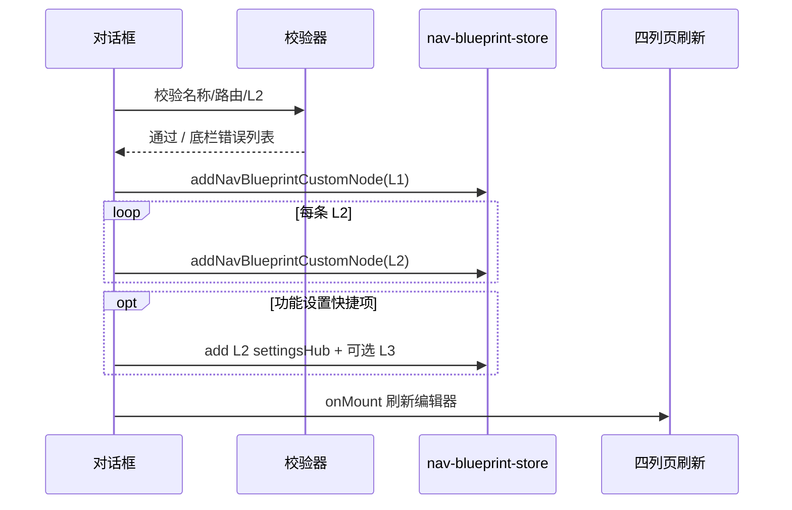

# M 平台 · 新增一级导航对话框 — 设计方案

> 版本：v1.0 · 2026-06-30  
> 状态：P1+P2 已落地（新增一级导航对话框）  
> 关联：`M平台-菜单路由可视化配置设计方案.md`、`nav-blueprint-ui.ts`、`navigation.ts`、`permission-registry.ts`、`一级导航定义说明.md`

---

## 一、背景与问题

### 1.1 现状

菜单路由编辑页点击 **「+ 一级导航」** 时，使用浏览器原生 `window.prompt` / `window.alert`：

| 步骤 | 当前交互 | 问题 |
|------|----------|------|
| 名称 | `prompt("一级导航名称")` | 无校验、无英文名、无预览 |
| 路由 | `prompt("一级导航路由", "/ops-center")` | 需手填路径，易错；不知道系统已有哪些页面 |
| 子级 | 无 | 创建后须再点「+ 二级导航」，流程割裂 |
| 设置 | 无 | 无法在同一入口挂载设置 Hub / 功能点 |

与平台预设「变更记录」等对话框体验不一致，也无法支撑「一次配齐 L1 + 路由 + 功能 + L2」的产品目标。

### 1.2 目标

用**模态对话框**替代 `prompt` / `alert`，在新增一级导航时支持：

1. **命名**：一级导航显示名称（必填，可选英文名）
2. **路由页面选择**：从系统**固定路由注册表**中选择（展示「页面名称 + 路由路径」），作为 L1 默认落地页
3. **功能点选择**：从系统**功能点目录**中勾选要挂到该 L1 下的业务能力（对应权限树 L2）
4. **新增二级导航**：在同一对话框内可添加 0～N 条 L2（名称 + 路由 / 是否设置 Hub）

**成功标准**：用户可在**一次提交**中完成「空壳 L1 → 有默认路由 → 有子功能页 → 有设置入口」的最小可用结构，无需返回四列页多次点按钮。

### 1.3 设计原则（继承蓝图文档）

| 原则 | 说明 |
|------|------|
| 路由只读注册 | 路由与页面名称来自 `navigation.ts` / `permission-registry`，不在对话框里「发明」新路径 |
| 设置只读注册 | L4 仍来自 `module-settings-catalog`（`seq`），对话框只做**归属预选**，详细 L3/L4 仍在四列页微调 |
| 自定义节点 | 新建 L1/L2 仍写入 `customNodes`，`id` 前缀 `custom-` |
| 风格一致 | 复用 `platform-preset-ui` 变更记录对话框的遮罩、圆角卡片、顶栏/底栏按钮样式 |

---

## 二、方案对比

### 方案 A：单页滚动对话框（推荐）

一个对话框内自上而下四个区块（均可折叠，默认全展开）：

```
┌─ 新增一级导航 ─────────────────────────────────────┐
│ ① 基本信息：名称、英文名、侧栏展示方式(sheet/…)   │
│ ② 默认路由：搜索 + 分组列表单选「页面名称 · 路径」 │
│ ③ 功能点：按原一级模块分组的多选（L2 功能）       │
│ ④ 二级导航：可增删行（名称 / 路由 / 是否设置Hub） │
├──────────────────────────────────────────────────┤
│ 校验摘要 · 取消 · 创建一级导航                    │
└──────────────────────────────────────────────────┘
```

| 优点 | 缺点 |
|------|------|
| 符合「一个对话框里全配完」的诉求 | 小屏需滚动 |
| 与现有四列编辑页同屏完成，心智简单 | 区块多时要做好折叠与校验提示 |
| 实现成本适中 | — |

### 方案 B：三步向导

步骤 1 命名 → 步骤 2 选路由/功能 → 步骤 3 配 L2。

| 优点 | 缺点 |
|------|------|
| 每步字段少 | 无法一眼看到全貌；与「同页展示路由+功能+L2」诉求略背离 |
| 适合极复杂校验 | 多一次「上一步/下一步」成本 |

### 方案 C：Tab 三选一（互斥）

Tab：「绑定路由页」|「挂载设置」|「配置二级」三选一，只能做一种。

| 优点 | 缺点 |
|------|------|
| 逻辑清晰 | **无法满足**「同时选路由 + 加 L2 + 挂设置」的组合场景 |

**推荐：方案 A**。区块 ②③④ 可组合；② 与 ③ 不互斥（L1 既有默认路由，又可挂多个 L2 功能页）。

---

## 三、对话框信息架构

### 3.1 触发与挂载

| 项 | 说明 |
|----|------|
| 触发 | 编辑页 `data-nb-add-l1` 点击 |
| 实现文件 | 新建 `nav-blueprint-add-l1-dialog.ts`（`render` + `open` + `bind`） |
| 挂载 | `document.body` 追加，`z-index` 与 `pp-changelog-dialog` 同级（`z-[70]`） |
| 关闭 | 遮罩 / Esc / 取消；未保存时二次确认 |

### 3.2 区块 ① — 基本信息

| 字段 | 类型 | 规则 |
|------|------|------|
| 一级导航名称 | 文本 | 必填，1～32 字 |
| 英文名称 | 文本 | 可选 |
| 侧栏展示方式 | 单选 | `sheet`（默认）/ `sidebar` / `tabs` |
| 说明文案 | 只读提示 | 「创建后可在四列页继续调整 L3/L4 归属」 |

### 3.3 区块 ② — 路由页面选择

**数据源**：新建只读模块 `nav-route-registry.ts`，聚合：

| 来源 | 内容 | 展示字段 |
|------|------|----------|
| `NAV_MODULES` | 各 L1 `path` + `title` | 模块首页 |
| `NAV_MODULES[].children` | L2 子页 | 滑层/侧栏二级页 |
| `PRODUCT_CENTER_DEEP_NAV` 等 *\_SUBNAV | 深层业务页 | 三级业务页（可选展开） |
| `permission-registry` L2 | 带 `path` 的功能节点 | 与蓝图树键对齐 |

每条记录结构：

```typescript
interface NavRouteRegistryEntry {
  id: string;           // 稳定键，如 "orders:list" 或 "nav:orders:order-list"
  path: string;         // 如 "/orders"
  title: string;
  titleEn?: string;
  level: 1 | 2 | 3;     // 页面层级（展示用）
  groupId: string;      // 分组：原 L1 moduleId 或「商品中心」「系统」
  groupTitle: string;
  /** 是否已被其他自定义 L1 占用 */
  occupied?: boolean;
}
```

**交互**：

- 顶栏搜索：按名称 / 路径 / 分组过滤
- 列表：单选（Radio）；选中项写入 L1 的 `route` 与 `defaultChildRoute`（若选 L2，则 L1 `route` 取所属模块根路径 + `defaultChildRoute` 为所选路径）
- 可选「暂不绑定路由」：仅当区块 ④ 至少有一条 L2 时允许；L1 `route` 取第一条 L2 的路径或模块聚合前缀

### 3.4 区块 ③ — 功能点选择

**定义**：功能点 = 权限注册表中 **level 2** 且带业务 `featureId` 的节点（即四列页第二列中的「功能页」，非 L4 设置项）。

| 交互 | 说明 |
|------|------|
| 展示 | 按原一级模块分组；每项：`功能名称` + `路径` + 复选框 |
| 行为 | 勾选后，在提交时**自动为该 L1 创建对应 custom L2**（`label` 默认取功能点名，可在本区块行内改简称） |
| 与区块 ② 关系 | 若某功能已在区块 ④ 手动添加同路径 L2，去重 |
| 与区块 ④ 关系 | 勾选功能点 ≈ 快捷填充 L2 行，用户仍可在 ④ 中删改 |

**「功能设置」快捷入口**（本阶段简化）：

- 在功能点列表顶部提供 **「添加设置入口」** 勾选项
- 勾选后自动在区块 ④ 增加一行：`名称=设置`，`isSettingsHub=true`，`settingsPath` 默认 `{L1根路由}/settings` 或从注册表选已有 `*/settings` 路径
- L3/L4 细项不在本对话框全量配置，创建后**选中该 L2** 并在四列第四列勾选 `seq`（与现网一致）

> **Phase 2 增强**：在对话框内嵌「未归属设置池」多选（穿梭框），直接写入 `seqAssignments` + 自动建 L3「默认分组」。

### 3.5 区块 ④ — 新增二级导航

内联**可增删表格**（至少 0 行）：

| 列 | 控件 |
|----|------|
| 二级名称 | 文本 |
| 路由 | 下拉（同区块 ② 注册表）或只读展示（从功能点带入） |
| 类型 | 普通页 / **设置 Hub** |
| 操作 | 删除行 |

底部 **「+ 添加二级导航」** 增加空行。

**与系统默认 L2 的区别**：此处创建的是 `customNodes` level 2；若用户选的是注册表里已有系统 L2，仅创建**引用型 custom L2**（`source: custom`，`systemRefKey` 可选扩展字段，Phase 1 可仅用 path 对齐）。

---

## 四、提交与数据写入

### 4.1 提交流水线



### 4.2 写入规则

| 对象 | 字段 |
|------|------|
| custom L1 | `level:1`, `label`, `labelEn?`, `route`, `subNavPlacement`, `parentKey:null`, `sortOrder` 追加到末尾 |
| custom L2 | `level:2`, `parentKey` = L1 的 `moduleKey`（custom id）, `route`, `isSettingsHub`, `settingsPath?` |
| structureSelection | 新 L1/L2 节点默认 `enabled: true`（与四列勾选一致） |
| seqAssignments | Phase 1 不在对话框写入；Phase 2 支持预选 |

### 4.3 校验规则（底栏常驻）

| 规则 | 提示 |
|------|------|
| 名称必填 | 「请填写一级导航名称」 |
| 路由或 L2 二选一 | 「请选择默认路由，或至少添加一个二级导航」 |
| 路径唯一 | 「路由 /xxx 已被占用」 |
| 设置 Hub | `isSettingsHub` 时 `settingsPath` 必填且以 `/settings` 结尾（可配置放宽） |
| L2 名称重复 | 同一 L1 下二级名称不可重复 |

---

## 五、UI 规范（对齐现有对话框）

复用 `platform-preset-ui` 中 `pp-changelog-dialog` 结构：

- 遮罩：`bg-black/40 backdrop-blur-[1px]`
- 容器：`max-w-3xl`（本对话框比变更记录略窄）、`max-h-[min(92dvh,44rem)]`
- 顶栏：标题「新增一级导航」+ 关闭按钮
- 内容：`overflow-y-auto` 分区，分区间 `border-b border-border`
- 底栏：左侧校验摘要（错误数 / 成功提示），右侧「取消」「创建一级导航」

**区块标题样式**：`text-sm font-semibold` + `text-xs text-muted-foreground` 副标题。

**列表行**：与四列页相同的 `rounded-lg border border-border` 卡片行，hover `bg-muted/40`。

---

## 六、模块划分（实现期）

```
src/config/
├── nav-route-registry.ts          # 只读：路由 + 页面名称清单
├── nav-feature-registry.ts        # 只读：L2 功能点清单（派生 permission-registry）
├── nav-blueprint-add-l1-dialog.ts # 对话框 render / open / bind / submit
└── nav-blueprint-ui.ts            # data-nb-add-l1 改为 openAddL1Dialog(...)
```

| 模块 | 职责 |
|------|------|
| `nav-route-registry` | 构建、缓存、搜索 `NavRouteRegistryEntry[]` |
| `nav-feature-registry` | 构建 L2 功能点列表，带 `groupId` |
| `nav-blueprint-add-l1-dialog` | 表单状态、校验、调用 store 批量写入 |
| `nav-blueprint-ui` | 仅保留入口绑定，删除 `window.prompt` L1 逻辑 |

**不在本需求范围**：新增 L2/L3 的对话框改造（可后续复用同一 registry）。

---

## 七、分期实施

| 阶段 | 范围 | 验收 |
|------|------|------|
| **P1** | 对话框 + 名称 + 路由注册表单选 + L2 内联表 + 写入 store | 可一次创建 L1 及多条 custom L2，四列页立即可见 |
| **P2** | 功能点多选（自动生 L2）+ 设置 Hub 快捷行 | 勾选功能点后 L2 自动出现且可编辑 |
| **P3** | 对话框内预选 L4 `seq` + 自动 L3 分组 | 创建后第四列已勾选归属项 |
| **P4** | 从系统 L1「复制结构」、路由占用检测、英文名校验 | 运营效率增强 |

建议**先落地 P1+P2**，满足「路由 / 功能 / 二级」三类配置同屏完成。

---

## 八、示例场景

### 场景 1：新建「运营中心」仅作容器

1. 名称：运营中心  
2. 路由：暂不选  
3. 功能点：不选  
4. L2：添加「营业分析」→ `/ops-center/analytics`；添加「运营设置」→ Hub `/ops-center/settings`  
5. 提交 → L1 `route` 取 `/ops-center`（由首条 L2 前缀推导）或提示用户补 L1 根路由

### 场景 2：绑定已有「订单」模块首页

1. 名称：订单中心（显示名可不同于系统「订单」）  
2. 路由：选注册表「订单 · /orders」  
3. 功能点：勾选「订单列表」「退款记录」  
4. L2：自动带出 2 行，可删改  
5. 提交 → 侧栏出现 custom L1，下滑层为所选 L2

### 场景 3：只要设置

1. 名称：门店策略  
2. 路由：选某模块 `/store-mgmt`  
3. 勾选「添加设置入口」→ L2 自动「设置」Hub  
4. 提交后在四列页选 L3、勾选 L4

---

## 九、待确认问题

1. **L1 根路由推导**：当用户只加 L2、不选区块 ② 时，L1 `route` 是强制手选模块根路径，还是由第一条 L2 路径自动推导父前缀？（建议：**自动推导 + 可选手动覆盖**）
2. **功能点范围**：是否仅允许选择「当前蓝图树中未挂载到其他 custom L1 下」的功能，还是允许从系统任意 L2 复制？（建议：**全量可选 + 占用提示**）
3. **深层路由**：区块 ② 是否默认只展示 L1/L2，三级页收在「展开更多」？（建议：**默认 L1+L2，三级折叠**，避免列表过长）

---

## 十、决策摘要

| 维度 | 决策 |
|------|------|
| 交互载体 | 模态对话框，不用 `prompt` / `alert` |
| 布局 | 单页四区块（方案 A） |
| 路由数据 | 新建 `nav-route-registry`，只读聚合 `navigation.ts` + 子导航常量 |
| 功能点 | L2 权限树节点，多选后生成 custom L2 |
| 设置 | Phase 1 用「设置 Hub」快捷行；L4 仍在四列页配置 |
| 风格 | 对齐 `pp-changelog-dialog` 与平台预设四列页 |
| 实施顺序 | P1 对话框骨架 → P2 功能点 → P3 设置预选 |

---

## 十一、相关文档

| 文档 | 说明 |
|------|------|
| [M平台-菜单路由可视化配置设计方案.md](./M平台-菜单路由可视化配置设计方案.md) | 蓝图总体模型 |
| [一级导航定义说明.md](./一级导航定义说明.md) | 28 个一级模块定位 |
| [平台预设-配置预设四级导航树.md](./平台预设-配置预设四级导航树.md) | L1～L4 节点清单 |
