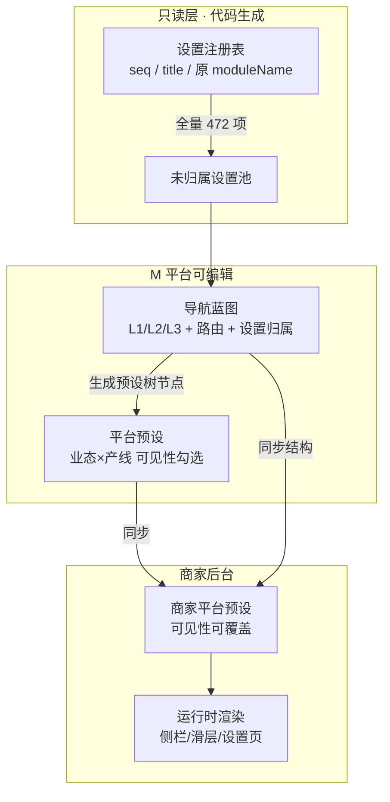
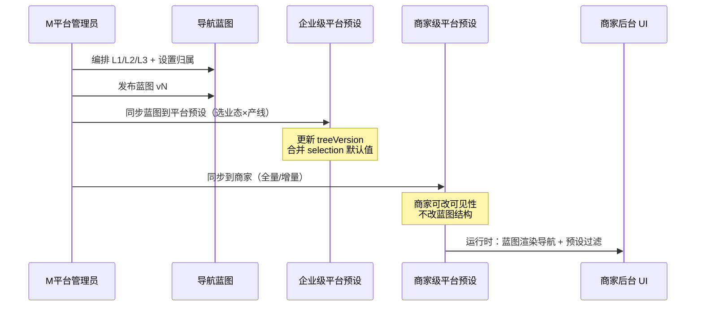

# M 平台 · 菜单路由可视化配置 — 设计方案

> 版本：v1.0 · 2026-06-26  
> 状态：设计稿  
> 关联：`M平台-企业级平台预设设计方案.md`、`平台预设-产品需求与设计说明.md`、`一级导航定义说明.md`、`navigation.ts`、`module-settings-catalog.ts`

---

## 一、问题与现状

### 1.1 现状（代码驱动、结构固定）

当前商家后台导航与设置归属由代码单源维护：

| 层级 | 数据源 | 是否可在线改 |
|------|--------|--------------|
| L1 一级导航 | `navigation.ts` → `NAV_MODULES` | ❌ |
| L2 二级导航 | 各模块 `children` | ❌ |
| L3 三级分组 | `module-settings-catalog.ts` 的 `groupKey` | ❌ |
| L4 设置项 | catalog 的 `seq` | ❌ |

**平台预设**只做一件事：在**固定树**上勾选「展示 / 不展示」（业态 × 产线），**不能**改归属关系。

### 1.2 新需求（结构可编排）

需要支持：

1. **新增 L1**：填写名称 + 访问路由
2. **在 L1 下新增多个 L2**：每个 L2 配置菜单页路由
3. **在 L2 下新增 L3**：三级分组
4. **在 L3 下从「全部设置」池勾选归属项**（L4）
5. **M 平台编排 → 同步到企业级平台预设 → 商家后台再从 M 平台同步**

### 1.3 核心原则（与现有文档对齐）

| 原则 | 说明 |
|------|------|
| **设置注册表只读** | 472 个 `seq` 仍由 `module-settings-catalog` 生成，M 平台不能「发明」新设置项 |
| **蓝图改归属，预设改可见** | 导航蓝图管「放哪」；平台预设管「显不显」 |
| **企业 → 商家单向** | M 平台发布不回写；商家可局部改可见性，不改企业蓝图 |
| **路由可运行** | 自定义 L1/L2 必须绑定可访问路由（占位页或已有页面） |

---

## 二、概念模型：三层分离



| 概念 | 英文名 | 职责 |
|------|--------|------|
| **设置注册表** | Setting Registry | 全部 L4（`seq`）主数据，只读 |
| **导航蓝图** | Navigation Blueprint | L1→L2→L3 结构、路由、设置归属 |
| **平台预设** | Platform Preset | 在蓝图树上按业态×产线控制可见性 |

与现有节点键保持兼容：

```
nav:{moduleId}                           // L1
nav:{moduleId}:{childId}               // L2
settings:{settingsPath}:{groupKey}       // L3
setting:{seq}                            // L4
```

自定义节点使用 `custom-` 前缀 id，避免与系统 id 冲突。

---

## 三、数据模型

### 3.1 导航蓝图节点

```typescript
type NavNodeLevel = 1 | 2 | 3;
type NavSubNavPlacement = "sheet" | "sidebar" | "tabs";
type NavNodeSource = "system" | "custom"; // 系统映射 or 企业自建

interface NavBlueprintNode {
  id: string;                    // 稳定 id，如 brand-mgmt / custom-ops-001
  level: NavNodeLevel;
  parentId: string | null;
  label: string;
  labelEn?: string;
  sortOrder: number;

  /** L1/L2：页面路由，如 /ops-center/analytics */
  route?: string;
  /** L1：侧栏展示方式 */
  subNavPlacement?: NavSubNavPlacement;
  /** L1：默认子路由 */
  defaultChildRoute?: string;

  /** L2 为设置 Hub 时：设置页根路径，如 /queue-call/settings */
  settingsPath?: string;

  /** L3：分组键（蓝图内唯一） */
  groupKey?: string;
  /** L3：已归属的设置 seq 列表（有序） */
  assignedSeqs: number[];

  source: NavNodeSource;
  /** source=system 时映射到代码模块 */
  systemModuleId?: string;
  systemChildId?: string;

  /** 预设节点键（发布时生成） */
  presetKey?: string;
}

interface NavBlueprintSnapshot {
  enterpriseId: string;
  blueprintId: string;           // 如 default / fast-food-kiosk
  businessTypeId?: string;       // 可选：按业态差异化蓝图
  productLineId?: string;        // 可选：按产线差异化蓝图
  version: number;
  publishedAt: string;
  nodes: NavBlueprintNode[];
  /** seq → L3 nodeId，发布时校验唯一归属 */
  seqAssignmentIndex: Record<number, string>;
}
```

### 3.2 与平台预设的关系

发布蓝图 `vN` 时：

1. 由蓝图生成**完整预设树节点清单**（L1～L4）
2. 写入企业级平台预设的「树结构版本」`treeVersion: N`
3. 平台预设的 `selection` 仍按节点键存 `enabled`
4. 新节点默认策略：继承上级勾选 / 按业态推荐 / 默认关闭（可配置）

```typescript
interface PlatformPresetSnapshot {
  businessTypeId: string;
  productLineId: ProductLineId;
  blueprintVersion: number;      // 新增：绑定的蓝图版本
  treeVersion: number;           // 新增：树结构版本
  version: number;               // 预设发布版本
  selection: Record<PresetNodeId, { enabled: boolean }>;
}
```

### 3.3 商家侧扩展

```typescript
interface MerchantPresetMeta {
  syncedBlueprintVersion: number;
  syncedPresetVersion: number;
  structureCustomized: boolean;  // 商家是否改过可见性
}
```

---

## 四、M 平台入口与信息架构

### 4.1 侧栏新增模块

在 M 平台 Shell 增加：

```
M 平台
├── 平台预设          （已有：业态×产线 可见性）
└── 菜单路由配置      （新增：导航蓝图编排）
    ├── 蓝图列表
    └── 蓝图编辑器
```

### 4.2 路由建议

```
#/m-platform/nav-blueprint                          // 蓝图列表
#/m-platform/nav-blueprint/:blueprintId/edit        // 可视化编辑器
#/m-platform/nav-blueprint/:blueprintId/preview     // 全屏预览（可选）
```

蓝图与平台预设联动入口：

- 蓝图列表页：**「同步到平台预设」** → 选择业态×产线批量应用
- 平台预设编辑页：顶栏展示 **「当前蓝图 v3」** + 跳转蓝图编辑器

---

## 五、可视化页面方案（核心）

### 5.1 整体布局：蓝图工作室（Blueprint Studio）

三栏 + 顶栏 + 底栏，参考现有四列预设编辑页，但交互重心在**结构编排**而非单纯勾选。

```
┌─────────────────────────────────────────────────────────────────────────────┐
│ 顶栏：菜单路由配置 · 默认蓝图  │  导入系统默认  变更记录  预览  保存草稿  发布 v4 │
├──────────────┬──────────────────────────────┬───────────────────────────────┤
│ 左栏         │ 中栏（属性 + 设置归属）         │ 右栏（实时预览）                 │
│ 导航树       │                              │                               │
│              │  [选中节点属性表单]             │  ┌─ 侧栏 mock ─────────────┐  │
│ ▼ 品牌管理   │  名称 / 路由 / 展示方式…        │  │ 主页                     │  │
│   ├ 品牌总览 │                              │  │ 前厅管理中心  →          │  │
│   └ 设置     │  ─────────────────────        │  └─────────────────────────┘  │
│ ▼ 运营中心*  │  [L3 选中时：设置归属面板]      │  ┌─ 滑层 mock ─────────────┐  │
│   ├ 营业分析 │                              │  │ 设置 | 平面图 | …        │  │
│   └ 设置     │  未归属(12) │ 已归属(8)       │  └─────────────────────────┘  │
│     ├ 营业*  │  [搜索] [按原模块筛选]          │  ┌─ 设置侧栏 mock ─────────┐  │
│     └ 打印*  │  □ seq 418 营业时段            │  │ 营业与运营              │  │
│ [+ 一级导航] │  ☑ seq 77  营业周期            │  │ 打印与票据              │  │
│              │  拖拽排序 / 批量移入            │  └─────────────────────────┘  │
├──────────────┴──────────────────────────────┴───────────────────────────────┤
│ 底栏：校验 3 项待处理（2 个设置未归属 · 1 个路由冲突）  │ 取消  发布并同步到平台预设 │
└─────────────────────────────────────────────────────────────────────────────┘
```

### 5.2 左栏：导航树（L1～L3）

| 交互 | 行为 |
|------|------|
| 树形展示 | L1 可折叠；L2/L3 缩进；自定义节点带「自定义」标签 |
| 拖拽排序 | 同级 `sortOrder`；跨级拖拽 = 移动归属（L3 不可挂到 L1 下） |
| 选中高亮 | 驱动中栏属性表单 + 右栏预览定位 |
| **+ 一级导航** | 打开抽屉：名称、中英文、路由、图标、展示方式、默认子路由 |
| **+ 二级导航** | 在选中 L1 下新增：名称、路由；可勾选「此为设置 Hub」→ 填 `settingsPath` |
| **+ 三级导航** | 在选中 L2（且为设置 Hub）下新增：分组名称、`groupKey`（可自动生成） |
| 右键菜单 | 编辑 / 复制 / 删除 / 在系统默认中定位 |
| 系统节点 | 来自 `NAV_MODULES` 导入，`source=system`，删除需确认（仅隐藏或还原） |

**约束：**

- L1 必须有 `route`（模块根路径）
- L2 必须有 `route`；若为设置入口，`settingsPath` 通常 = `{L2.route}` 或 `{module}/settings`
- L3 必须挂在 `settingsPath` 已定义的 L2 下
- 自定义 `groupKey` 在同一 `settingsPath` 内唯一

### 5.3 中栏：节点属性 + 设置归属

#### A. 通用属性（L1/L2/L3 按层级显隐）

| 字段 | L1 | L2 | L3 |
|------|----|----|-----|
| 名称 / 英文名 | ✅ | ✅ | ✅ |
| 路由 | ✅ 模块根 | ✅ 子页 | — |
| 侧栏展示方式 sheet/sidebar/tabs | ✅ | — | — |
| settingsPath | — | ✅（Hub 时） | 继承父级 |
| groupKey | — | — | ✅ |
| 图标 | ✅ | 可选 | — |

路由输入带**校验器**：格式、唯一性、与系统路由冲突检测；支持「选择已有页面」下拉（从 `NAV_MODULES` + 占位页注册表）。

#### B. 设置归属面板（仅 L3 选中时）

双栏穿梭框 + 拖拽列表：

| 区域 | 内容 |
|------|------|
| **未归属池** | 全部 `seq` 减去已被其他 L3 占用的项；支持按原 `moduleName`、关键词、`seq` 搜索 |
| **已归属列表** | 当前 L3 的 `assignedSeqs`；可拖拽排序（影响设置页卡片顺序） |
| 批量操作 | 从原三级分组「整组迁入」、按标签迁入、清空归属 |
| 冲突提示 | 某 `seq` 已在「营业与运营」→ 点击可跳转冲突节点 |

每个设置项卡片展示：`seq`、设置名称、原归属模块（灰色参考）、产线适用范围标签（如前厅 seq 仅部分产线）。

### 5.4 右栏：实时预览

三层联动 mock（不需真跳转）：

1. **侧栏 L1**：按蓝图 `sortOrder` 渲染；选中项高亮
2. **滑层 L2**：点击 L1 后展示其 L2 列表
3. **设置侧栏 L3 + L4 标题列表**：进入 L2 设置 Hub 后展示 L3 分组及组内设置名

预览顶栏可切换 **业态 × 产线**（叠加平台预设可见性），看到「编排 + 预设」叠加效果。

### 5.5 顶栏 / 底栏操作

| 操作 | 说明 |
|------|------|
| 导入系统默认 | 从 `permission-registry` 一键生成初始蓝图（与现网一致） |
| 保存草稿 | 本地 / 服务端草稿，不 bump 版本 |
| 发布 vN | 校验通过 → 生成 `seqAssignmentIndex` → bump `blueprintVersion` |
| **发布并同步到平台预设** | 发布蓝图 + 打开对话框选择业态×产线，合并到企业级预设树 |
| 变更记录 | 对比版本：节点增删、路由变更、seq 迁移明细 |
| 预览 | 新标签全屏模拟商家 Shell |

---

## 六、配置示例

### 示例：新建「运营中心」并重组设置

**步骤：**

1. 左栏 **+ 一级导航**
   - 名称：运营中心
   - 路由：`/ops-center`
   - 展示方式：sheet

2. 在「运营中心」下 **+ 二级导航**
   - 营业分析 → `/ops-center/analytics`（普通业务页）
   - 运营设置 → `/ops-center/settings`（勾选设置 Hub）

3. 在「运营设置」下 **+ 三级导航**
   - 营业与运营 → `groupKey: ops-hours`
   - 从设置池勾选：`seq 418 营业时段`、`seq 77 营业周期`、`seq 170 餐厅模式`

4. 再建三级「打印相关」→ 从池中加入原属前厅/打印中心的若干 `seq`

5. **发布 v1** → **同步到平台预设** → 选择「快餐 · Kiosk」

6. 进入 **平台预设编辑页**：树结构已是新蓝图；运营人员再按业态勾选要启用的 L1/L3/L4

7. **同步到商家后台**（Phase 2 能力）：商家获得相同蓝图 + 企业默认可见性

---

## 七、同步链路



| 阶段 | 同步内容 | 商家可否改 |
|------|----------|------------|
| 蓝图发布 | L1/L2/L3 结构、路由、seq 归属 | ❌ 结构不可改 |
| 企业平台预设 | 各节点 enabled | ❌（仅 M 平台） |
| 商家平台预设 | 各节点 enabled | ✅ 仅影响本商家侧栏 |
| 首次引导 | 复制企业蓝图 + 预设 | 写入商家上下文 |

**商家未自定义时**：企业蓝图或预设更新可自动覆盖。  
**商家已自定义可见性**：保留商家 `selection`，结构升级走「迁移向导」（新增节点默认关闭并提示）。

---

## 八、校验规则（发布门禁）

| 类别 | 规则 |
|------|------|
| 结构 | L3 必须有父 L2 且父级为设置 Hub |
| 归属 | 每个 `seq` 全局最多归属 1 个 L3（或明确标记「仅预览不启用」池） |
| 路由 | L1/L2 路由唯一；不与系统保留路径冲突 |
| 完整度 | 可选：要求 100% seq 已归属，或允许「未归属」但发布警告 |
| 预设 | 同步时若删除 L3，其下 enabled 节点需迁移或自动 disable |
| 产线 | 前厅 seq 在蓝图归属后，仍受 `fohSeqAppliesToLine` 运行时过滤 |

底栏常驻校验条：`✓ 472 项中 468 已归属 · ⚠ 4 未归属 · ✓ 路由无冲突`

---

## 九、运行时改造要点

发布蓝图后，运行时由「读 `NAV_MODULES`」改为「读有效蓝图 + 叠加预设」：

```
有效蓝图（企业 → 商家）
  → resolveNavModulesFromBlueprint()
  → filterVisibleNavModules()        // RBAC
  → filterNavByPlatformPreset()      // 预设
  → renderSidebar() / renderSettingsSubnav()
```

| 组件 | 改造 |
|------|------|
| `permission-registry` | 保留为**系统默认蓝图**生成器 |
| `platform-preset-tree` | 改为从蓝图快照生成，而非仅 permission-registry |
| `module-settings-catalog` | 仍为 L4 主数据；设置页按蓝图 L3 的 `assignedSeqs` 渲染 |
| 自定义 L1 路由 | 注册占位页或映射到 iframe/通用 Hub 模板 |

**兼容模式**：`blueprintId = system-default` 时行为与现网完全一致。

---

## 十、实施分期建议

| 阶段 | 范围 | 验收 |
|------|------|------|
| **P0** | M 平台「菜单路由配置」只读视图：展示系统默认 L1/L2/L3 + seq 归属 | 与 `平台预设-配置预设四级导航树.md` 一致 |
| **P1** | L3 设置归属可编辑（不改 L1/L2 结构） | 可把 seq 从 A 三级迁到 B 三级，设置页即时生效 |
| **P2** | L2/L1 可新增、改路由；蓝图发布；同步到企业级平台预设 | M 平台编排后预设树节点变化 |
| **P3** | 商家同步 + 首次引导引用企业蓝图 | 新商家看到编排后的导航 |
| **P4** | 多蓝图（按业态×产线）、版本 diff、迁移向导、拖拽预览增强 | 运营可审计、可回滚 |

---

## 十一、与现有「平台预设四列页」的分工

| 页面 | 回答的问题 | 主要用户 |
|------|------------|----------|
| **菜单路由配置（新）** | 设置项**放在哪条导航路径下**？L1/L2/L3 长什么样？ | 产品 / 实施 / 企业架构师 |
| **平台预设四列页（已有）** | 该业态×产线下**哪些节点要展示**？ | 运营 / 企业管理员 |

建议交互：

- 菜单路由配置发布后 → 自动打开对应业态的「平台预设」并提示「请确认可见性」
- 平台预设四列左侧树数据源改为**蓝图树**，而非写死的 permission-registry

---

## 十二、决策摘要

| 维度 | 决策 |
|------|------|
| 设置项来源 | 只读注册表（`seq`），M 平台只做归属不重定义 |
| 导航结构 | 企业级「导航蓝图」可增删改 L1/L2/L3 与路由 |
| 可见性 | 仍由平台预设（业态×产线）控制 |
| 配置入口 | M 平台「菜单路由配置」可视化工作室 |
| 同步方向 | 蓝图 → 企业预设 → 商家预设（单向） |
| 节点键 | 延续 `nav:` / `settings:` / `setting:` 格式，兼容 RBAC |

---

## 十三、相关文档

| 文档 | 说明 |
|------|------|
| [M平台-企业级平台预设设计方案.md](./M平台-企业级平台预设设计方案.md) | 企业级平台预设与商家同步 |
| [平台预设-产品需求与设计说明.md](./平台预设-产品需求与设计说明.md) | 平台预设原始需求 |
| [平台预设-配置预设四级导航树.md](./平台预设-配置预设四级导航树.md) | 四级树节点清单 |
| [一级导航定义说明.md](./一级导航定义说明.md) | 28 个一级导航定位与边界 |
