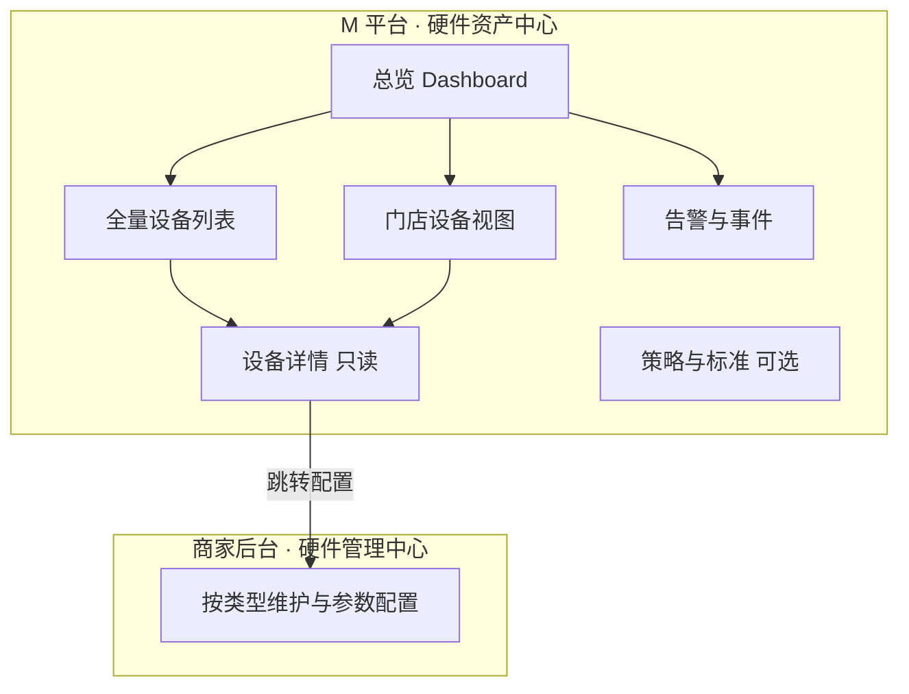

# M 平台 · 企业级硬件资产中心设计方案

> 版本：草案 v1  
> 适用范围：M 平台（企业级）· 跨商家硬件监控与治理  
> 关联模块：商家后台「硬件管理中心」、M 平台「平台预设 / 权限管理」

---

## 1. 背景与定位

### 1.1 现状

- **商家后台**已有「硬件管理中心」一级模块，覆盖支付、打印机、CDS、Kiosk、eMenu、钱箱、税控、来电显示等 9 类硬件 UI 与 localStorage 原型数据（`device-management-*-hardware-ui.ts`）。
- **M 平台**当前 Phase 1 聚焦企业级平台预设、菜单路由、权限管理；**尚无**跨门店硬件台账或监控能力。
- 一级导航定义中，硬件管理中心定位为：**物理设备资产** — POS、打印机、KDS、客显、读卡器、钱箱等的注册、状态、参数与门店绑定（见 `一级导航定义说明.md` §22）。

### 1.2 企业视角的核心诉求

M 平台「看全量商家硬件」**不是**复制门店后台的设备编辑页，而是建设**跨门店的设备资产与运行态势层**：

| 场景 | 典型问题 |
|------|----------|
| **全局态势** | 全企业多少台设备？多少在线/离线/异常？哪些门店风险最高？ |
| **故障响应** | 某门店收银/厨打/支付挂了，影响什么？谁负责？多久未恢复？ |
| **合规与资产** | 设备是否授权、是否超期未升级、是否绑定正确门店/区域？ |
| **规模化治理** | 新开店设备是否达标？某型号是否要统一升级/替换？ |

### 1.3 模块定位

建议在 M 平台侧栏新增可折叠一级 **「硬件资产中心」**（或挂在「运营监控」下）：

- **M 平台**：只读监控 + 轻量治理（列表、总览、告警、导出、深链跳转）
- **商家后台**：设备增删改、参数配置、单店调试（现有「硬件管理中心」）

---

## 2. 企业应关注的信息与状态

按 **身份 → 归属 → 运行 → 业务关联 → 治理** 五层建模，与商家侧已有字段对齐并扩展企业维度。

### 2.1 身份与分类（Who / What）

| 字段 | 说明 | 商家侧已有参考 |
|------|------|----------------|
| 设备类型 | 支付 / 打印机 / CDS / Kiosk / eMenu / 钱箱 / 税控 / 来电显示… | `DEVICE_MANAGEMENT_HARDWARE_SUBNAV` |
| 设备 ID / SN / 许可证 | 唯一标识；Tripos `deviceId` / `sn` / `license` | 支付、Kiosk 等 |
| 品牌 / 型号 | PAX `terminalBrand` / `terminalModel`；CDS `model` | 各 hardware-ui |
| 固件 / 应用版本 | `appVersion`、`shellVersion`、`webviewVersion`、`systemVersion` | 终端类设备 |
| 数据来源 | 终端上报 vs 门店手工配置 | Tripos vs PAX |

### 2.2 归属（Where）

| 字段 | 企业特有 |
|------|----------|
| 品牌 / 区域 / 门店 | 企业视角的核心筛选维度 |
| 门店状态 | 营业中 / 筹备 / 停业 |
| 物理区域 | CDS `area`（前厅/吧台/取餐口）；eMenu `tableNo` |
| 绑定关系 | 支付终端 ↔ POS 客户端、`paymentTerminalId`、打印机备份链 |

### 2.3 运行状态（Health）— 企业最敏感

| 状态维度 | 建议枚举 | 用途 |
|----------|----------|------|
| **连接状态** | 在线 / 离线 / 未知 | 已有 `online` + `lastSeenAt` |
| **健康度** | 正常 / 告警 / 故障 | 综合心跳、错误码、依赖链 |
| **最后活跃** | `lastSeenAt`、最后交易/最后打印时间 | 区分「假在线」 |
| **告警** | 离线超 N 分钟、版本过低、许可证将过期、依赖设备离线 | 企业值班台 |
| **依赖链** | 支付终端离线 → 关联 POS/Kiosk 不可用 | 影响面分析 |

### 2.4 业务影响（So What）

| 信息 | 为什么企业要看 |
|------|----------------|
| 是否关键路径设备 | 主收银 POS、主支付、主厨打 |
| 影响能力 | 能否收银 / 能否厨打 / 能否自助点餐 |
| 当前门店营业状态 | 营业中设备离线 = P0，打烊后离线 = P3 |

### 2.5 治理与合规（Governance）

| 信息 | 企业用途 |
|------|----------|
| 授权 / License 类型与到期 | 批量续费、违规使用 |
| 版本分布 | 「全企业还有 12% 终端低于 x.y」 |
| 配置漂移 | 与 M 平台「推荐模板/最低版本策略」对比 |
| 操作审计 | 谁改了什么（M 平台只看汇总，明细在商家侧） |

### 2.6 企业最关心的状态清单（摘要）

1. **在不在线**（及最后心跳时间）
2. **影不影响营业**（是否关键设备、门店是否在营业）
3. **能不能用**（版本、License、依赖链是否完整）
4. **在哪、归谁**（品牌/区域/门店/区域位）
5. **要不要管**（告警级别、持续时长、是否批量异常）
6. **要不要换/升**（版本分布、型号生命周期）

---

## 3. 信息架构与页面设计

建议 **「总览 → 列表 → 门店视图 → 设备详情 → 告警」**，与商家「按类型分 14 个子页编辑」区分开。



### 3.1 总览（企业首页）

- **KPI 卡片**：设备总数、在线率、24h 离线数、告警数、按类型分布
- **地图/区域热力**：按区域/门店着色（在线率、告警密度）
- **Top 风险门店**：离线设备多、关键设备离线、版本过旧
- **趋势**：近 7/30 天在线率、新增/退役设备

**建议路由**：`/m-platform/hardware/overview`

### 3.2 全量设备列表（核心）

统一表格，支持：

- **筛选**：品牌、区域、门店、设备类型、在线状态、版本区间、License 状态
- **列（默认）**：门店、类型、名称、SN/ID、在线状态、最后心跳、版本、关键标记
- **批量操作（企业级轻量）**：导出、标记关注、创建工单（若对接 ITSM）、跳转商家配置（深链）

不按 14 种硬件拆 14 个一级页 — 企业要**一张表搜全**，详情里再按类型展示扩展字段。

**建议路由**：`/m-platform/hardware/devices`

### 3.3 门店设备视图

选中一家门店后：

- 按 **前厅 / 后厨 / 支付 / 自助** 分组展示拓扑（可选）
- 显示 **依赖关系**：POS ↔ 支付 ↔ 打印机 ↔ 钱箱 ↔ CDS
- 门店级在线率、未解决告警

**建议路由**：`/m-platform/hardware/stores/:storeId`

### 3.4 设备详情（只读为主）

- **通用**：身份、归属、状态时间线、最近告警
- **按类型扩展**（复用商家模型）：
  - 支付：Tripos/PAX、IP、通讯方式
  - 打印机：类型、厨房名、备份机
  - CDS/Kiosk/eMenu：区域、绑定客户端、分辨率等
- **操作**：「在商家后台打开配置」（带门店上下文）

**建议路由**：`/m-platform/hardware/devices/:deviceUid`

### 3.5 告警中心

| 告警类型 | 示例 |
|----------|------|
| 离线 | 主支付终端 >15min 无心跳 |
| 版本 | App 低于企业最低版本 |
| 授权 | License 30 天内到期 |
| 依赖 | 主打印机离线且厨打队列积压（需订单/后厨数据） |
| 异常峰值 | 某门店同类型设备批量离线（网络/门店问题） |

支持按区域订阅、静默规则（打烊时段不报离线）。

**建议路由**：`/m-platform/hardware/alerts`

### 3.6 策略与标准（Phase 2，可选）

- 企业最低 App 版本、推荐设备型号清单
- 新开店 **硬件检查清单**（支付 + 主厨打 + CDS 必须在线才允许开业）
- 与 M 平台「平台预设」联动：只控制模块可见性；**设备数据独立服务**，不写入 preset localStorage

**建议路由**：`/m-platform/hardware/policies`

### 3.7 M 平台侧栏结构建议

与「权限管理中心」一致，采用可展开/收起的一级导航：

```
M 平台
├── 菜单路由配置
├── 平台预设
└── 硬件资产中心          ← 一级（可折叠）
    ├── 总览
    ├── 全量设备
    ├── 告警
    └── 策略（Phase 2）
```

---

## 4. 与商家后台的边界

| 能力 | 商家「硬件管理中心」 | M 平台「硬件资产中心」 |
|------|---------------------|------------------------|
| 增删改设备、改 IP/参数 | ✅ 主战场 | ❌ 不做（或仅超级管理员例外） |
| 单店调试、绑定客户端 | ✅ | ❌ |
| 跨门店列表、筛选、导出 | ❌ 单店视角 | ✅ |
| 在线率、告警、版本分布 | 单店列表有 `online` | ✅ 聚合 + 趋势 |
| 区域/品牌维度对比 | ❌ | ✅ |
| 平台预设（模块是否启用） | 受 preset 影响 | ✅ 已有 |

商家侧设备类型与路径参考（`navigation.ts` · `DEVICE_MANAGEMENT_HARDWARE_SUBNAV`）：

| 细项 | 路径 | UI 状态 |
|------|------|---------|
| 支付设备 | `/device-management/hardware/payments` | ✅ |
| 打印机 | `.../printers` | ✅ |
| CDS | `.../cds` | ✅ |
| Kiosk | `.../kiosk` | ✅ |
| eMenu | `.../emenu` | ✅ |
| 钱箱 / 税控 / 来电显示 | 各子路径 | ✅ |
| POS / KDS / 路由器 / 电子秤 / 叫号屏 | 各子路径 | ⏳ 占位 |

M 平台聚合视图应覆盖**已上线类型**，占位类型可显示「暂无数据」或隐藏。

---

## 5. 数据模型建议（后端）

当前商家原型数据存于 localStorage（`readModuleSettingJson`），**不可**作为 M 平台数据源。企业层需独立服务：

```text
EnterpriseDevice（聚合视图）
├── tenantId / brandId / regionId / storeId
├── deviceType, deviceUid, sn, name
├── status: online | offline | unknown
├── health: ok | warn | critical
├── lastSeenAt, lastTransactionAt (optional)
├── versions: { app, shell, system, webview }
├── license: { type, expiresAt, valid }
├── bindings: { posClientId, paymentTerminalId, printers[], ... }
├── tags: [critical, deprecated_model]
└── sourceStoreRef → 跳转商家后台 edit URL

DeviceEvent / Alert
├── storeId, deviceUid, type, severity, openedAt, resolvedAt
```

### 5.1 与商家侧类型的字段映射（示例）

**支付 Tripos**（`PaymentTriposDevice`）：

- `deviceName`, `deviceId`, `sn`, `license`, `licenseType`
- `online`, `lastSeenAt`
- `appVersion`, `shellVersion`, `webviewVersion`, `systemVersion`

**支付 PAX**（`PaymentPaxDevice`）：

- `name`, `terminalBrand`, `terminalModel`
- `ipAddress`, `port`, `communicationMethod`, `paymentTimeoutMs`
- 连接状态需主动探测或网关上报

**终端客户端绑定**（`TerminalClientBinding`，seq 370–385）：

- 收据/厨房/打包/支付/等位打印机 ID
- `paymentTerminalId`, `cashDrawerId`, `customerDisplayEnabled`

数据应来自 **终端心跳 + 商家配置快照的定期同步**。

---

## 6. 分阶段落地

| 阶段 | 范围 | 价值 |
|------|------|------|
| **P0** | 全量列表 + 总览 KPI + 在线/离线 + 门店/类型筛选 + 导出 | 满足「看见所有商家硬件」 |
| **P1** | 告警规则 + 设备详情 + 版本/License 分布 + 深链商家后台 | 可运维 |
| **P2** | 依赖拓扑、营业态加权告警、最低版本策略、新开店检查 | 可治理 |
| **P3** | 与报表/财务联动（支付终端离线 vs 当日交易额） | 可决策 |

### 6.1 P0 前端原型建议（admin-web）

- 在 `m-platform-shell.ts` 增加「硬件资产中心」侧栏分组（模式同权限管理中心）
- 新增 `enterprise-hardware-*` 模块：演示数据 + 总览/列表页
- 设备字段对齐现有 `device-management-*-ui.ts` 类型定义
- 存储：`menusifu:enterprise-hardware-demo-v1`（演示），后续替换 API

---

## 7. 非功能需求

| 项 | 要求 |
|----|------|
| 权限 | 企业级 RBAC：按区域/品牌数据范围过滤设备列表 |
| 性能 | 万级设备列表需服务端分页、索引（storeId、type、status） |
| 刷新 | 总览 KPI 可 1–5 分钟延迟；告警近实时 |
| 导出 | CSV/Excel，含当前筛选条件 |
| 深链 | 跳转商家后台硬件编辑页需带 `storeId` + `deviceId` |

---

## 8. 关联文档与代码

| 资源 | 路径 |
|------|------|
| 一级导航 · 硬件管理中心 | `docs/项目文档/一级导航定义说明.md` §22 |
| 硬件设置重设计 | `docs/项目文档/硬件管理中心-设置二级导航重设计方案.md` |
| 平台预设四级树 · device-management | `docs/项目文档/平台预设-配置预设四级导航树.md` |
| M 平台企业预设 | `docs/项目文档/M平台-企业级平台预设设计方案.md` |
| 商家硬件 UI | `src/config/device-management-*-hardware-ui.ts` |
| M 平台 Shell | `src/shell/m-platform-shell.ts` |

---

## 9. 修订记录

| 日期 | 版本 | 说明 |
|------|------|------|
| 2026-06-26 | v1 | 初稿：企业视角信息/状态、信息架构、边界、数据模型、分期 |
