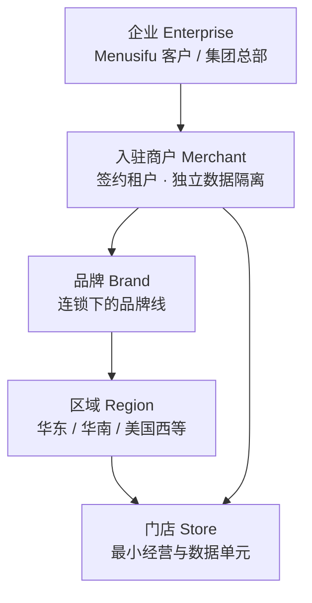
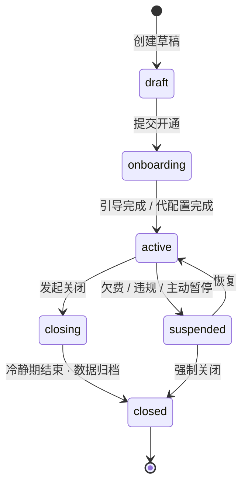
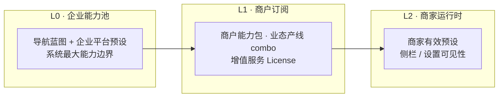
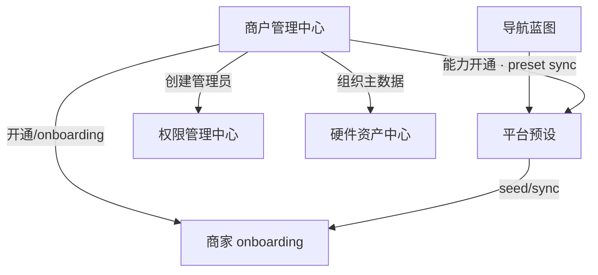

# M 平台 · 入驻商户管理中心 — 设计方案

> 版本：草案 v1  
> 适用范围：M 平台（企业级）· 入驻商户全生命周期与组织治理  
> 关联模块：平台预设、菜单路由、权限管理、硬件资产中心、商家后台 onboarding / 品牌管理 / 门店管理

---

## 1. 背景与定位

### 1.1 现状

当前 M 平台已具备 **配置与策略** 能力，但缺少 **商户运营** 能力：

| 已有能力 | 实现 | 缺口 |
|----------|------|------|
| 企业级平台预设 | `enterprise-platform-preset-store` | 预设面向「抽象租户」，无具体商户实体 |
| 导航蓝图 | `nav-blueprint-store` | 不能按商户单独下发 |
| 企业 RBAC | `enterprise-rbac-store` | 员工数据范围为 demo 品牌/区域/门店，非真实商户树 |
| 硬件资产中心 | `enterprise-hardware-store` | 设备挂 demo 门店，无商户归属主数据 |
| 商家 onboarding | `/onboarding` | 仅在**商家侧**自助完成，M 平台不能代开商户 |
| 品牌 / 门店管理 | 商家后台 `/brand/*`、`/stores/*` | **单商户内**维护，非企业跨商户治理 |

演示环境中：`enterpriseId`、`merchantId` 未建模；顶栏 scope 使用硬编码 `DEMO_SCOPE_*`；全浏览器仅模拟**一个**商家实例。

### 1.2 企业视角的核心诉求

M 平台面向 **软件服务商 / 餐饮集团总部**，需要管理其名下的 **入驻商户（Tenant / Merchant）**：

| 场景 | 典型问题 |
|------|----------|
| **商户开通** | 新签约客户如何开户、选业态产线、分配初始管理员？ |
| **商户治理** | 哪些商户在营、暂停、已关闭？合同与 License 是否有效？ |
| **连锁扩张** | 某连锁品牌下如何批量开新店、挂区域、启用统一菜单/支付？ |
| **能力开通** | 该品牌能用 Kiosk / 会员 / 报表吗？开通了哪些增值服务？ |
| **合规与审计** | 谁开通/修改/关闭了哪家店？变更是否可追溯？ |

### 1.3 模块定位

在 M 平台侧栏新增一级 **「商户管理中心」**（建议 `merchant-mgmt`），与现有模块关系：

```
M 平台
├── 菜单路由配置      → 定义「系统能有什么」
├── 平台预设          → 定义「默认开放什么」（业态×产线×四级树）
├── 商户管理中心      → 定义「谁可以用、开哪些店、启用什么」  ← 本方案
├── 权限管理中心      → 定义「企业运营人员谁能管什么」
└── 硬件资产中心      → 定义「设备资产跨商户怎么看」
```

**边界**：

- **M 平台**：商户主数据、生命周期、能力/服务开通、连锁组织树、代入驻与批量治理
- **商家后台**：单商户内日常经营配置（菜单、员工、单店参数）；继承 M 平台下发的范围，可局部覆盖预设可见性

---

## 2. 概念模型

### 2.1 组织层级（五层）



| 层级 | 说明 | 示例 |
|------|------|------|
| **Enterprise** | M 平台登录主体；一个集团或 SaaS 运营方 | 米聚餐饮集团 |
| **Merchant** | 独立租户；拥有独立商家后台、数据隔离、License | 「张记火锅」连锁客户 |
| **Brand** | 商户内品牌线；影响菜单、视觉、多品牌首页 | 张记火锅 / 张记小面 |
| **Region** | 可选中间层；区域督导、区域报表 | 华东大区 |
| **Store** | 物理门店；scope 最小单元、硬件绑定、日结 | 上海陆家嘴店 |

**单店商户**：Merchant 下仅 1 个 Store，`orgTier = store`，隐藏品牌/区域管理入口（与现有 `AccountOrgTier` 一致）。

**连锁商户**：Merchant 下多 Store，可挂 Brand / Region，`orgTier = chain`。

### 2.2 商户 vs 门店 vs 账号

| 对象 | 归属 | 用途 |
|------|------|------|
| **Merchant 租户** | Enterprise | 数据隔离边界、License、平台预设实例、服务订阅 |
| **Store 门店** | Merchant | 经营数据、硬件、日结、员工排班 |
| **Staff 员工** | Merchant（数据范围可限 brand/region/store） | 商家后台登录与 RBAC |
| **Enterprise Staff** | Enterprise | M 平台运营人员；可访问部分或全部商户 |

### 2.3 三类「开通」（避免混淆）

| 类型 | 含义 | 配置位置 | 影响 |
|------|------|----------|------|
| **账号开通** | 创建商户管理员 / 员工登录账号 | 商户详情 · 账号；或商家后台权限中心 | 能否登录 |
| **组织开通** | 创建门店 / 区域 / 品牌节点 | 商户详情 · 组织树 | 数据范围与 scope |
| **能力开通** | 启用模块、产线、增值服务 | 商户详情 · 能力与服務；联动平台预设 | 侧栏可见性、功能可用性 |

---

## 3. 商户生命周期

### 3.1 状态机



| 状态 | 说明 | 商家后台 |
|------|------|----------|
| `draft` | 销售/运营录入基本信息，未激活 | 不可登录 |
| `onboarding` | 待完成业态产线选择或 M 平台代配置 | 仅初始管理员可进 `/onboarding` |
| `active` | 正常营业 | 全功能（在能力开通范围内） |
| `suspended` | 暂停服务 | 只读或禁止登录（策略可配置） |
| `closing` | 关闭中，数据导出窗口 | 只读 |
| `closed` | 已关闭，数据归档 | 不可登录 |

### 3.2 开通方式

**方式 A · 商户自助（现有延伸）**

1. M 平台创建 Merchant（`onboarding`）并邮件邀请初始管理员
2. 管理员首次登录 `#/onboarding` → 选业态 / 产线 → 确认功能
3. `seedMerchantPresetsFromEnterprise()` 写入商家预设
4. M 平台回调更新 Merchant → `active`

**方式 B · M 平台代开通（企业运营常用）**

1. M 平台运营在「新建商户」向导中一次性填写：基本信息、业态产线、初始管理员、首店信息
2. 系统自动：创建 Merchant + Store + 管理员账号 + seed 预设 + 跳过或完成 onboarding
3. 商户收到「账号已就绪」通知，直接登录经营

**方式 C · 连锁批量开新店**

1. 在已有 Merchant 下选择「批量新增门店」
2. 导入 CSV / 表单：门店名、地址、区域、复制模板店配置
3. 可选：复制支付模板、菜单模板、硬件清单、平台预设 combo
4. 批量创建 Store + 可选门店店长账号

### 3.3 关闭与合规

- **关闭前检查**：未结账单、活跃 License、硬件在线、子账号
- **冷静期**：默认 30 天只读，允许数据导出
- **审计**：开通/暂停/关闭/能力变更写入 `MerchantChangeLog`（对齐权限中心 change-log 模式）

---

## 4. 连锁多门店管理

### 4.1 组织树管理（M 平台 · 商户详情）

```
张记火锅（Merchant）
├── 品牌：张记火锅
│   ├── 区域：华东
│   │   ├── 上海陆家嘴店 [active]
│   │   └── 杭州西湖店 [active]
│   └── 区域：华南
│       └── 广州天河店 [preparing]
└── 品牌：张记小面
    └── 区域：华东
        └── 南京新街口店 [active]
```

**能力**：

- 拖拽调整归属（品牌 ↔ 区域 ↔ 门店）
- 门店状态：筹备中 / 营业中 / 停业 / 已关闭
- 从模板店「复制配置」到新店（菜单结构、支付、打印、部分设置）
- 区域级汇总：门店数、在线设备、未处理告警（接硬件资产中心）

### 4.2 与商家后台的分工

| 操作 | M 平台 | 商家后台 |
|------|--------|----------|
| 新建 Merchant | ✅ | ❌ |
| 新建 Store（连锁） | ✅ 可批量 | ✅ 单店视角可申请/维护档案 |
| 品牌主数据 CRUD | ✅ 主数据 | ✅ 连锁账号只读或受限编辑 |
| 门店营业参数 | 模板下发 | ✅ 店长维护 |
| 顶栏 scope | 企业运营按商户过滤 | 商户员工按 brand/region/store |

### 4.3 组织层级与导航布局

继承 `导航维度-连锁与单店.md`：

- Merchant 创建时指定 **默认组织层级** `store | chain`
- 单店 Merchant：强制 `store`，侧栏隐藏 `brand-mgmt` 等连锁模块
- 连锁 Merchant：默认 `chain`，可切换门店版/连锁版布局

---

## 5. 能力与服務开通

### 5.1 能力模型（三层）



| 层级 | 内容 | 示例 |
|------|------|------|
| **L0 企业能力池** | M 平台已配置的导航 + 企业预设 | 火锅业态 × POS 产线：开启报表、厨打、会员 |
| **L1 商户订阅** | 该 Merchant 被允许使用的 combo + 增值模块 | 仅开通「火锅×POS」「火锅×Kiosk」；加购「高级报表」 |
| **L2 商家有效预设** | sync 到 `menusifu:platform-preset-v1` 的实际 selection | 商家可在 L1 范围内关闭部分叶子节点 |

### 5.2 能力与服務清单（建议字段）

**基础能力（与平台预设 combo 绑定）**

| 字段 | 说明 |
|------|------|
| `businessTypeIds` | 经营业态（火锅、快餐…） |
| `productLineIds` | 产线（POS、Kiosk、eMenu…） |
| `presetCombos` | 具体 combo 列表及版本 |
| `navLayoutDefault` | 默认门店版 / 连锁版 |

**增值服务 / 模块 License（可独立于 combo）**

| 服务 ID | 名称 | 说明 |
|---------|------|------|
| `svc-advanced-report` | 高级报表 | 多店对比、自定义报表 |
| `svc-member-plus` | 会员 Plus | 等级、储值、营销自动化 |
| `svc-delivery-hub` | 外卖聚合 | 多平台订单接入 |
| `svc-hardware-monitor` | 硬件监控 | 企业级硬件资产中心只读 |
| `svc-api-open` | Open API | 第三方对接配额 |

**字段**：开通状态、生效/到期日、门店范围（全商户 / 指定区域 / 指定门店 list）

### 5.3 开通联动（与现有 sync 对接）

```
M 平台 · 商户详情 · 保存能力
  → 计算 MerchantCapabilitySnapshot
  → 裁剪 EnterprisePlatformPreset（不超过 L0）
  → syncEnterprisePresetsToMerchant(merchantId)   // 扩展现有 sync，按商户写入
  → 可选：触发商家侧 onboarding 已完成标记
  → 写 MerchantChangeLog
```

商家后台 **不能** 开通 L0 中未包含的模块；**可以** 在 L1 范围内关闭叶子功能（现有平台预设规则不变）。

---

## 6. 信息架构与页面设计

### 6.1 M 平台侧栏结构

```
商户管理中心                    ← 一级（可折叠）
├── 总览                      /m-platform/merchants/overview
├── 商户列表                  /m-platform/merchants
├── 组织树                    /m-platform/merchants/org-tree
├── 能力与服務                /m-platform/merchants/capabilities
├── 开通申请 / 待办           /m-platform/merchants/requests
└── 变更记录                  /m-platform/merchants/change-log
```

### 6.2 总览 Dashboard

- KPI：入驻商户总数、在营 / 暂停 / 关闭、本月新开 / 关闭、即将到期 License
- 地图或区域分布：按区域统计门店数
- 待办：待审核开通申请、onboarding 未完成、合同即将到期
- 快捷入口：新建商户、批量开新店

**路由**：`/m-platform/merchants/overview`

### 6.3 商户列表（核心）

统一表格，支持：

- **筛选**：状态、业态、产线、品牌、区域、合同到期、能力包
- **列（默认）**：商户名称、商户 ID、组织类型（单店/连锁）、门店数、状态、主管理员、能力摘要、开通时间、操作
- **批量**：导出、批量暂停、批量续费提醒
- **行操作**：查看详情、进入商家后台（impersonate / 深链）、暂停、关闭

**路由**：`/m-platform/merchants`

### 6.4 商户详情（Tab 结构）

**路由**：`/m-platform/merchants/:merchantId`

| Tab | 内容 |
|-----|------|
| **概览** | 状态、License、门店数、最近登录、告警摘要 |
| **基本信息** | 名称、编码、联系人、合同、时区、默认语言 |
| **组织** | 品牌 / 区域 / 门店树；新增门店、批量导入 |
| **账号** | 初始管理员、企业对接人；跳转企业/商家 RBAC |
| **能力与服務** | 业态产线 combo、增值模块、到期日；保存触发 preset sync |
| **平台预设** | 该商户 effective preset 只读预览 + 「与企业默认 diff」+ 强制同步 |
| **硬件** | 跳转硬件资产中心并带 `merchantId` 筛选 |
| **变更记录** | 该商户审计日志 |

### 6.5 新建 / 开通向导

步骤建议：

1. **基本信息**：商户名称、类型（单店/连锁）、联系人
2. **能力与业态**：选择业态、产线 combo（从企业 L0 能力池多选）
3. **增值服务**：勾选增值模块与有效期
4. **首店信息**（单店必填；连锁可跳过或填样板店）
5. **初始管理员**：邮箱（Menusifu 企业邮箱规则复用）、姓名、是否发送邀请
6. **确认**：预览将开通的功能树摘要 → 提交

**路由**：`/m-platform/merchants/new`

### 6.6 组织树视图（跨商户）

- 左：Enterprise 下 Merchant 列表
- 中：选中 Merchant 的品牌 → 区域 → 门店树
- 右：节点详情 + 快捷操作（开新店、复制模板、变更状态）

**路由**：`/m-platform/merchants/org-tree`

---

## 7. 数据模型（草案）

### 7.1 核心实体

```typescript
type MerchantStatus = "draft" | "onboarding" | "active" | "suspended" | "closing" | "closed";
type MerchantOrgType = "single-store" | "chain";
type StoreStatus = "preparing" | "open" | "closed" | "archived";

interface EnterpriseMerchant {
  merchantId: string;
  enterpriseId: string;
  name: string;
  code: string;                    // 企业内唯一编码
  orgType: MerchantOrgType;
  status: MerchantStatus;
  timezone: string;
  locale: string;
  contractExpiresAt?: string;
  primaryAdminEmail?: string;
  createdAt: string;
  updatedAt: string;
  activatedAt?: string;
  closedAt?: string;
}

interface MerchantOrgBrand {
  brandId: string;
  merchantId: string;
  name: string;
  code: string;
  status: "active" | "inactive";
}

interface MerchantOrgRegion {
  regionId: string;
  merchantId: string;
  brandId: string;
  name: string;
  code: string;
}

interface MerchantOrgStore {
  storeId: string;
  merchantId: string;
  brandId: string;
  regionId: string;
  name: string;
  code: string;
  status: StoreStatus;
  address?: string;
  openedAt?: string;
}

interface MerchantCapabilitySnapshot {
  merchantId: string;
  businessTypeIds: string[];
  productLineIds: string[];
  presetCombos: { businessTypeId: string; productLineId: string; version: number }[];
  services: {
    serviceId: string;
    enabled: boolean;
    effectiveFrom?: string;
    effectiveTo?: string;
    storeScope: "all" | "regions" | "stores";
    scopeIds?: string[];
  }[];
  syncedPresetAt?: string;
  enterprisePresetVersion?: number;
}

interface MerchantChangeLogEntry {
  id: string;
  merchantId: string;
  action: string;
  operatorEmail: string;
  detail: string;
  at: string;
}
```

### 7.2 与现有模型的映射

| 现有（演示） | 升级后 |
|--------------|--------|
| `DEMO_SCOPE_BRANDS` | `MerchantOrgBrand` 聚合 |
| `DEMO_SCOPE_REGIONS` | `MerchantOrgRegion` 聚合 |
| `DEMO_SCOPE_STORES` | `MerchantOrgStore` 聚合 |
| `PlatformPresetContext` session | 增加 `merchantId`；按商户隔离 sessionStorage |
| `enterprise-hardware-store` 门店 | 设备增加 `merchantId`，scope 从组织主数据读取 |
| `StaffStoreAccess` | 企业运营人员：`mode: merchants` + merchantIds |

### 7.3 存储与 API（分期）

| 阶段 | 存储 | 说明 |
|------|------|------|
| **P0 演示** | `menusifu:enterprise-merchants-demo-v1` | localStorage + 种子数据 3～5 个商户 |
| **P1** | REST `/api/enterprises/{eid}/merchants` | 主数据 CRUD |
| **P2** | 与 License / 计费系统对接 | 到期自动 suspended |

---

## 8. 权限与安全

### 8.1 M 平台 RBAC 扩展

在企业 RBAC 四级树中新增 **商户管理中心** 节点，权限粒度建议：

| 权限 | 说明 |
|------|------|
| `merchants:read` | 查看商户列表与详情 |
| `merchants:create` | 新建商户 |
| `merchants:update` | 编辑基本信息、组织 |
| `merchants:capability` | 能力与服務开通 |
| `merchants:lifecycle` | 暂停 / 恢复 / 关闭 |
| `merchants:impersonate` | 代登录商家后台（强审计） |

**数据范围**：Enterprise Staff 的 `storeAccess` 扩展为可限定 **可管理的 merchantIds**（类似现有 brand/region/store）。

### 8.2 代登录（Impersonate）

- M 平台运营点击「进入商家后台」→ 生成短期 impersonation token
- 商家后台顶栏显示「代管模式 · 操作人 xxx · 退出」
- 所有写操作写入审计日志

---

## 9. 与现有模块集成



| 集成点 | 行为 |
|--------|------|
| **平台预设** | 商户保存能力 → 裁剪企业预设 → per-merchant sync |
| **导航蓝图** | 能力池上限不超过蓝图已发布节点 |
| **权限管理** | 商户初始管理员 ↔ 商家 RBAC 超管角色自动绑定 |
| **硬件资产** | scope 筛选改为 Enterprise → Merchant → Brand/Region/Store |
| **onboarding** | `draft/onboarding` 商户跳转或跳过引导 |

---

## 10. 分阶段实施建议

### P0 · 可演示闭环（建议 2～3 周）

- M 平台侧栏「商户管理中心」+ 总览 + 商户列表 + 商户详情（基本信息 / 组织 / 能力只读）
- localStorage 种子：3 商户（单店×1、连锁×2）、组织树、能力快照
- 新建商户向导（代开通，写 localStorage）
- 状态：draft → active → suspended（手动切换）
- 与现有 `DEMO_SCOPE_*` 对齐或逐步替换

### P1 · 组织与能力联动

- 组织树 CRUD + 批量开新店
- 能力与服務 Tab：combo + 增值服务勾选 → 触发 `syncEnterprisePresetsToMerchant(merchantId)`
- 变更记录 Tab
- 硬件资产中心按 merchantId 筛选

### P2 · 生命周期与审计

- onboarding 联动（邀请邮件演示）
- 关闭流程 + 冷静期
- 代登录商家后台 + 审计
- 开通申请 / 待办队列

### P3 · 生产化

- REST API + 多 Enterprise 隔离
- License / 计费到期自动 suspended
- 与 CRM / 合同系统对接
- 商户级报表与 SLA 看板

---

## 11. 路由与存储键（建议）

| 路由 | 页面 |
|------|------|
| `/m-platform/merchants/overview` | 总览 |
| `/m-platform/merchants` | 商户列表 |
| `/m-platform/merchants/new` | 新建向导 |
| `/m-platform/merchants/:merchantId` | 商户详情 |
| `/m-platform/merchants/org-tree` | 组织树 |
| `/m-platform/merchants/capabilities` | 能力模板 / 增值包管理 |
| `/m-platform/merchants/change-log` | 变更记录 |

| 存储键（演示） | 内容 |
|----------------|------|
| `menusifu:enterprise-merchants-v1` | Merchant + 组织树 |
| `menusifu:enterprise-merchant-capabilities-v1` | 能力快照 |
| `menusifu:enterprise-merchant-changelog-v1` | 变更日志 |

---

## 12. 非目标（本阶段不做）

- 商户自助注册门户（C 端签约）
- 完整计费 / 发票 / 合同 PDF（仅预留字段）
- 替代商家后台内的日常经营配置
- 单浏览器多 Merchant 真实数据隔离（演示期可模拟切换 context）

---

## 13. 相关文档

| 文档 | 关系 |
|------|------|
| [M平台-企业级平台预设设计方案.md](./M平台-企业级平台预设设计方案.md) | L0 能力池、sync 机制 |
| [平台预设-产品需求与设计说明.md](./平台预设-产品需求与设计说明.md) | 商家运行时过滤 |
| [导航维度-连锁与单店.md](./导航维度-连锁与单店.md) | orgTier、scope、侧栏维度 |
| [M平台-企业级硬件资产中心设计方案.md](./M平台-企业级硬件资产中心设计方案.md) | 跨门店设备与组织 scope |
| [门店管理-设置二级导航重设计方案.md](./门店管理-设置二级导航重设计方案.md) | 商家侧门店档案 |

---

## 14. 小结

**商户管理中心** 补齐 M 平台从「配置中心」到「租户运营中心」的关键一环：

1. **管谁**：Enterprise 下所有入驻 Merchant 与组织树（品牌 / 区域 / 门店）
2. **怎么开**：账号开通 + 组织开通 + 能力开通，支持代开通与连锁批量
3. **怎么管**：生命周期状态机、能力与服務、平台预设联动、审计与代管
4. **怎么衔接**：复用现有平台预设 sync、RBAC 双轨、scope 模型与 onboarding，仅新增 Merchant 主数据层与 M 平台 UI

建议 **P0 优先落地商户列表 + 详情 + 组织树演示数据**，与硬件资产中心、企业 RBAC 共用同一套组织主数据，避免 demo scope 多处硬编码。
