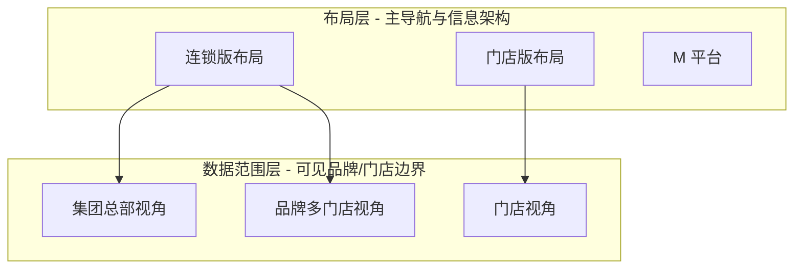
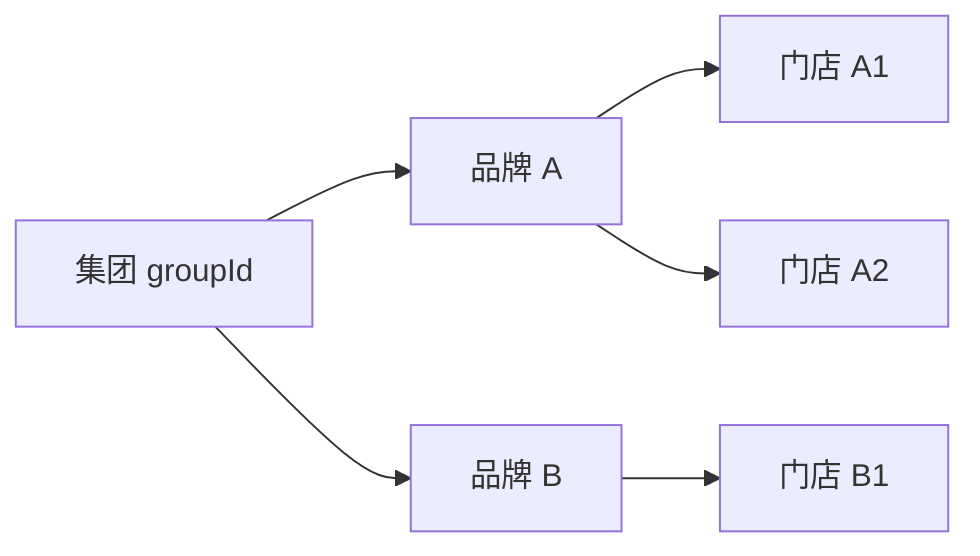

# 商家后台 · 连锁视角分层设计方案

## 一、背景与问题

当前顶栏「视角切换」为三层：

| 视角 | 含义（现状） |
|------|----------------|
| 门店版 | 单店布局，顶栏锁定一家门店 |
| 连锁版 | 展示品牌/区域/门店三级筛选，可看集团下多品牌 |
| M 平台 | 运营后台 |

连锁版内部**尚未区分**：

- **集团总部**：要看集团下所有品牌、所有门店
- **品牌多店**：只看某一个品牌下的多家门店
- **门店**：只看自己这一家店

与业务诉求的差距：同一套「连锁版」UI，无法表达三种不同的数据可见边界。

---

## 二、设计目标

1. 在**不改变 M 平台主数据模型**的前提下，商家后台按视角收敛数据范围。
2. 集团 / 品牌 / 门店数据**统一来自 M 平台同步**（`ChainBrandOrgSnapshot`），废弃与真实主数据脱节的演示 ID（如 `shanghai-ljz` / `miju`）。
3. **权限（RBAC）** 与 **数据范围（Scope）** 分离：能进哪个模块由权限决定，能看到哪些品牌/门店由视角 + `storeAccess` 决定。
4. 视角切换后，顶栏筛选、侧栏集团名、业务页数据**联动刷新**。

---

## 三、概念模型：两层视角

建议拆成**布局层**与**数据范围层**，避免与现有「门店版 / 连锁版」冲突。



| 布局层 | 可选的数据范围层 | 说明 |
|--------|------------------|------|
| **门店版** | 仅 **门店视角** | 与现有一致，顶栏显示当前门店，无品牌/区域筛选 |
| **连锁版** | **集团总部** 或 **品牌多门店** | 新增二级选择，默认可由账号类型推断 |
| **M 平台** | 不适用 | 运营视角，不走商家 Scope |

**门店视角**在「门店版布局」下强制生效；在「连锁版布局」下可作为子选项（例如区域经理模拟单店），但默认不暴露给集团总部账号。

---

## 四、三种数据范围定义

以当前选中**集团**（侧栏集团切换，来自 M 平台）为根：



| 视角 | 枚举值 | 可见范围 | 顶栏筛选行为 |
|------|--------|----------|--------------|
| **集团总部** | `group-hq` | 当前集团下**全部品牌 + 全部门店** | 品牌 / 区域 / 门店均可选；默认「全部」 |
| **品牌多门店** | `brand` | **一个品牌**下的全部门店 | 品牌**锁定**（或仅 1 个可选）；区域 / 门店可选 |
| **门店** | `store` | **一家门店** | 三项均锁定，只读展示当前门店 |

**有效数据范围** = 视角上限 ∩ 员工 `storeAccess` ∩ 当前 `scopeFilters`（用户在下拉里的进一步筛选）。

---

## 五、状态与存储设计

新增核心状态（建议 `session-scope.ts` 或独立 `merchant-scope-context.ts`）：

```typescript
/** 连锁版下的数据范围视角 */
type ChainDataPerspective = "group-hq" | "brand" | "store";

interface MerchantScopeContext {
  /** 当前集团（已有：ACTIVE_MERCHANT_GROUP_KEY） */
  groupId: string;
  /** 连锁版下的数据视角 */
  perspective: ChainDataPerspective;
  /** 品牌视角锚定品牌（merchantId） */
  anchorBrandId?: string;
  /** 门店视角锚定门店（storeId / BID） */
  anchorStoreId?: string;
  /** 用户在顶栏的进一步筛选 */
  filters: { brand: string; region: string; store: string };
}
```

| 存储键 | 内容 |
|--------|------|
| `menusifu:merchant-active-group-v1` | 已有，当前集团 |
| `menusifu:chain-data-perspective-v1` | `group-hq` / `brand` / `store` |
| `menusifu:chain-anchor-brand-v1` | 品牌视角下的 merchantId |
| `menusifu:chain-anchor-store-v1` | 门店视角下的 storeId |
| `header-scope-filter-*` | 已有，顶栏细筛 |

**切换规则：**

| 操作 | 行为 |
|------|------|
| 切到「门店版布局」 | `perspective = store`，锁定 `anchorStoreId` |
| 切到「连锁版布局」 | 按账号默认 `group-hq` 或 `brand`；重置 filters |
| 切集团（侧栏） | 重置 filters；保留 perspective；重算 anchor |
| 切视角（集团↔品牌） | 重置 filters；更新 anchor；触发 `menusifu:scope-perspective-change` |

---

## 六、UI 方案

### 6.1 视角切换控件（顶栏）

在现有「视角切换」菜单中，**连锁版展开二级**：

```
视角切换 ▼
├─ 门店版                    ← 门店视角
├─ 连锁版 ▶
│   ├─ 集团总部视角  ✓
│   └─ 品牌多门店视角
└─ M 平台
```

或：选「连锁版」后，顶栏 scope 区左侧增加 **「数据视角」** 分段控件：`集团总部 | 品牌 | 门店`（门店项仅对有权限账号显示）。

**推荐方案 A（菜单二级）**：与现有 `view-switch-control` 一致，认知成本低。

### 6.2 顶栏 Scope 区（连锁版）

| 视角 | 品牌 | 区域 | 门店 |
|------|------|------|------|
| 集团总部 | 下拉（含「全部」） | 下拉 | 下拉 |
| 品牌多门店 | **只读标签**（当前品牌名） | 下拉 | 下拉 |
| 门店 | **只读**（当前门店名） | 隐藏 | 隐藏 |

侧栏左上角：**集团切换**（已有）→ 决定 `groupId`；与数据视角正交。

### 6.3 页面标题区

面包屑 / kicker 展示完整上下文，例如：

> 张记餐饮集团 · 集团总部 · 全部品牌 · 华东大区

---

## 七、数据与权限

### 7.1 主数据来源（M 平台）

```
EnterpriseGroup
  └─ EnterpriseMerchant（品牌）
       └─ MerchantOrgStore（门店）
```

`getScopedFilterOptions()` 改造为：

1. 读取 `groupId` → `loadChainBrandOrgForContext()`
2. 按 `perspective` 裁剪选项树
3. 再经 `filterScopeOptionsForAccess(storeAccess)` 收敛

**需废弃**：`DEMO_SCOPE_BRANDS` / `DEMO_STORE_SCOPE_META` 中与 M 平台不一致的硬编码映射，改为基于 `merchantId` / `storeId` 的动态元数据。

### 7.2 员工数据范围（`StaffStoreAccess`）

| storeAccess.mode | 最高可达视角 | 说明 |
|------------------|--------------|------|
| `all` | 集团总部 | 如 `hq.admin` |
| `brands` | 品牌多门店 | 限定 merchantId 列表 |
| `regions` | 品牌多门店（按区域筛） | 区域经理 |
| `stores` | 门店 | 单店 / 多店店长 |

**原则**：用户不能切换到高于 `storeAccess` 允许的视角；菜单项灰显 + tooltip 说明。

### 7.3 账号默认视角

| 演示账号 | 默认布局 | 默认数据视角 | 默认集团 |
|----------|----------|--------------|----------|
| `zhangji.admin@menusifu.cn` | 连锁版 | 集团总部 | 张记餐饮集团 |
| `hq.admin@menusifu.cn` | 连锁版 | 集团总部 | 账号绑定集团 |
| `xiaoming.wang@menusifu.cn` | 门店版 | 门店 | — |
| 连锁版演示（单店账号切换） | 连锁版 | 可演示切到集团总部 | 张记（现逻辑） |

---

## 八、各模块行为约定

| 模块 | 集团总部 | 品牌多门店 | 门店 |
|------|----------|------------|------|
| 品牌管理 `/brand/*` | 集团下全部品牌 | 当前品牌详情 | 隐藏或只读本店 |
| 报表 / 库存 / 订单 | 按 scope 聚合 | 按品牌聚合 | 单店数据 |
| 权限管理 | 可见（总部职能） | 品牌级配置 | 门店级配置 |
| 导航模块 | 连锁完整导航 | 连锁导航（可隐藏「品牌管理」） | 门店导航（隐藏 `brand-mgmt`） |

**导航裁剪**建议复用现有 `isStoreTierHiddenNavModule` + 新增 `isBrandPerspectiveHiddenNavModule`，按 `perspective` 而非仅 `orgTier` 判断。

---

## 九、核心 API（建议新增）

```typescript
// 解析当前有效范围（给业务页调用）
function resolveEffectiveScope(): {
  groupId: string;
  perspective: ChainDataPerspective;
  brandIds: string[];      // 空 = 全部（在权限内）
  storeIds: string[];      // 空 = 全部（在权限内）
  isAggregated: boolean;   // 是否多店汇总视图
};

// 视角切换
function writeChainDataPerspective(
  perspective: ChainDataPerspective,
  anchors?: { brandId?: string; storeId?: string }
): void;

// UI 辅助
function shouldShowBrandScopeFilter(): boolean;  // 仅 group-hq
function shouldShowRegionScopeFilter(): boolean; // group-hq | brand
function isStoreScopeLocked(): boolean;          // store 视角或门店版布局
```

业务页统一监听 `menusifu:scope-perspective-change` 与 `menusifu:scope-filter-change`，避免散落读取 sessionStorage。

---

## 十、与现有实现的关系

| 已有能力 | 改造方向 |
|----------|----------|
| `view-switch-control`（门店/连锁/M平台） | 连锁项增加二级：集团总部 / 品牌多门店 |
| 侧栏集团切换 | 保持不变，作为 `groupId` 来源 |
| `getScopedFilterOptions` | 增加 perspective 裁剪层 |
| `store-access.ts` | ID 体系对齐 M 平台；`storeMeta` 从 snapshot 动态生成 |
| `merchant-chain-brand-sync` | 提供 `listBrandsInGroup` / `listStoresInBrand` 工具函数 |
| `isChainScopeMode()` | 细化为 `isGroupHqPerspective()` 等 |

---

## 十一、实施分期建议

| 阶段 | 内容 | 产出 |
|------|------|------|
| **P1** | 状态模型 + perspective 切换 UI + scope 裁剪 | 顶栏筛选随视角变化 |
| **P2** | `storeAccess` 与 M 平台 ID 对齐；演示账号矩阵 | 权限与视角一致 |
| **P3** | 业务页接入 `resolveEffectiveScope`；品牌管理页按视角展示 | 端到端数据正确 |
| **P4** | 导航裁剪、报表聚合、代登录锁定规则 | 体验完整 |

---

## 十二、边界与例外

1. **代登录**：锁定为被登录品牌的 `brand` 视角，禁止切集团总部（除非 M 平台操作员显式授权）。
2. **跨集团**：仅集团总部账号 + 侧栏集团切换；品牌/门店视角不允许跨集团。
3. **单店入驻品牌**：品牌视角下仅 1 家门店时，UI 等同门店视角，但布局仍可为连锁版。
4. **演示模式**：单店账号切「连锁版」时，默认集团总部 + 张记演示数据（与现逻辑兼容）。

---

## 十三、小结

- **门店版** = **门店视角**（一种布局，一种范围）。
- **连锁版** = **集团总部视角** 或 **品牌多门店视角**（同一布局，两种范围，顶栏二级切换）。
- **集团**由侧栏切换（M 平台数据）；**品牌/门店**由数据视角 + 顶栏细筛共同决定。
- 所有可见门店必须可追溯到 `groupId → merchantId → storeId` 链路。

---

## 相关代码路径

| 模块 | 路径 |
|------|------|
| 视角切换 UI | `src/shell/view-switch-control.ts` |
| Scope / 会话 | `src/auth/session-scope.ts` |
| M 平台 → 商家同步 | `src/config/merchant-chain-brand-sync.ts` |
| 员工数据范围 | `src/permissions/store-access.ts` |
| 集团切换（侧栏） | `src/main.ts`（`renderSidebarBrandHeader`） |
| 品牌管理只读页 | `src/config/merchant-chain-brand-ui.ts` |
