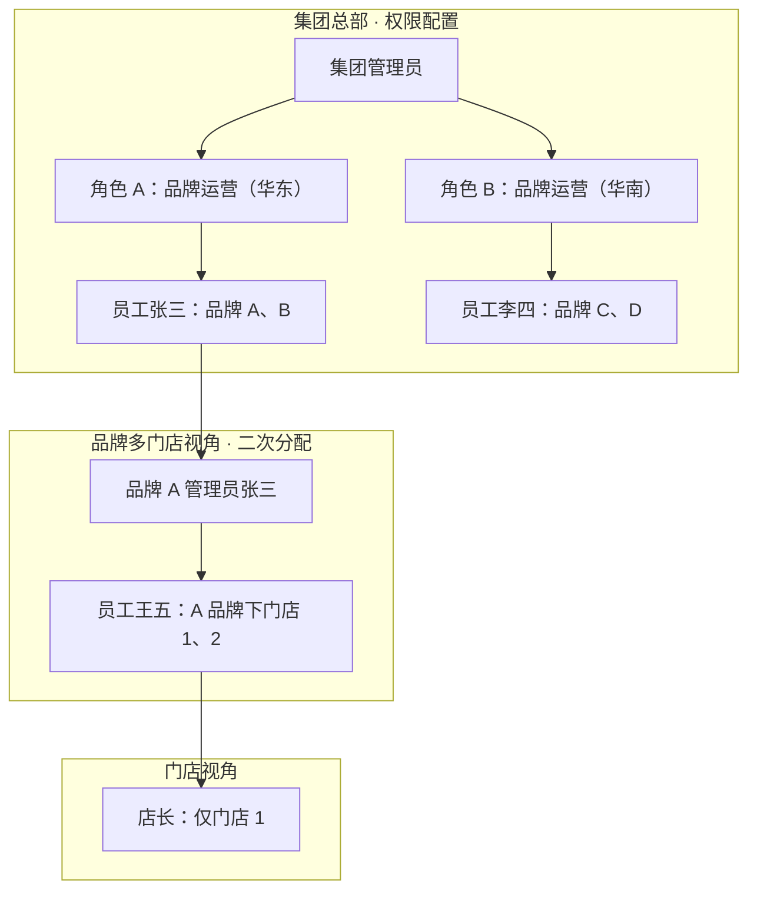

# 集团 · 品牌 · 门店分级权限方案

> 版本：v0.1 · 2026-07-02  
> 状态：待评审  
> 关联：`商家后台-连锁视角分层设计.md`、`store-access.ts`、`rbac-ui.ts`、`session-scope.ts`

---

## 一、背景与目标

### 1.1 业务场景

同一集团下可有多个品牌（例如 4 个品牌）。集团需通过角色与员工授权实现：

- **角色 A**：可管理品牌 A、B（功能权限 + 数据范围）
- **角色 B**：可管理品牌 C、D

员工进入**品牌多门店视角**后，顶栏**品牌筛选**必须与集团在集团总部视角下配置的权限一致，不能看到未授权品牌。

集团完成品牌级授权后，获得品牌管理权限的账号，可在授权范围内**二次分配**下属员工可见的门店。

### 1.2 设计目标

1. **功能权限**与**数据范围**分离（沿用现有 RBAC + `storeAccess` 架构）。
2. 集团 → 品牌 → 门店三级授权，下级权限为上级权限的**子集**（授权天花板）。
3. 品牌多门店视角的品牌筛选，自动与集团侧 `storeAccess` 同步。
4. 不改变 M 平台主数据模型（`groupId → merchantId → storeId`）。

---

## 二、设计原则

| 维度 | 决定什么 | 存储位置 |
|------|----------|----------|
| **功能权限（RBAC）** | 能进哪些模块、能操作哪些功能 | 角色 `selection` |
| **数据范围（Scope）** | 能看到哪些集团/品牌/门店 | 员工 `storeAccess` |
| **数据视角（Perspective）** | 以集团总部 / 品牌 / 门店哪种方式看数据 | `chain-data-perspective` |

**有效可见范围**（与《商家后台-连锁视角分层设计》一致）：

```
有效可见范围 = 视角上限 ∩ 员工 storeAccess ∩ 顶栏细筛（scopeFilters）
```

品牌多门店视角下的**品牌筛选选项**，必须来自集团侧授权，不能超出上级给的范围。

---

## 三、组织与权限层级



### 3.1 同一集团 4 品牌示例

| 角色 | 功能权限（示例） | 数据范围 storeAccess | 最高视角 |
|------|------------------|----------------------|----------|
| 集团超管 | 全部模块 | `mode: all` | 集团总部 |
| 角色 A（华东运营） | 品牌管理、门店列表、报表… | `mode: brands, ids: [A, B]` | 品牌多门店 |
| 角色 B（华南运营） | 同上 | `mode: brands, ids: [C, D]` | 品牌多门店 |
| 品牌 A 管理员 | 品牌内模块（无集团品牌管理） | `mode: brands, ids: [A]` | 品牌多门店 |
| 门店店长 | 门店模块 | `mode: stores, ids: [A-门店1]` | 门店 |

---

## 四、数据模型

### 4.1 员工数据范围（已有，需 UI 补全）

```typescript
type StaffStoreAccessMode = "all" | "brands" | "regions" | "stores";

interface StaffStoreAccess {
  mode: StaffStoreAccessMode;
  ids: string[];  // 依 mode 解释为 brandId / regionId / storeId
}
```

逻辑实现见：`src/permissions/store-access.ts`（`getAllowedStoreIds`、`filterScopeOptionsForAccess` 等已具备）。

### 4.2 员工授权记录（建议扩展）

```typescript
interface StaffAssignment {
  employeeId: string;
  roleIds: string[];              // 功能权限（已有）
  storeAccess: StaffStoreAccess;  // 数据范围（已有）

  // 建议新增：授权追溯与天花板
  grantedBy?: string;             // 授权人 employeeId
  scopeCeiling?: StaffStoreAccess; // 授权时记录的上限
  maxPerspective?: "group-hq" | "brand" | "store";
}
```

### 4.3 功能角色模板（建议扩展）

```typescript
interface RbacRole {
  id: string;
  name: string;
  selection: Record<string, PlatformPresetNodeSelection>;
  // 建议新增
  defaultStoreAccess?: StaffStoreAccess;
  maxPerspective?: "group-hq" | "brand" | "store";
}
```

**推荐做法：** 数据范围绑在**员工授权**上；角色可提供 `defaultStoreAccess` 作为默认值，保存时可按人覆盖。

### 4.4 角色种子示例

```typescript
// 华东品牌运营
{
  id: "brand-ops-east",
  name: "华东品牌运营",
  defaultStoreAccess: { mode: "brands", ids: ["brand-a", "brand-b"] },
  maxPerspective: "brand",
  selection: { /* 品牌管理、门店列表、报表… */ }
}
```

---

## 五、各层级配置能力

### 5.1 集团总部（集团视角）

**可配置：**

- 创建账号 / 员工登录账号
- 创建**功能角色**（模块权限矩阵）
- **员工授权**：角色 + 数据范围
  - 全部品牌
  - 指定品牌（多选）
  - 指定区域
  - 指定门店
- 指定**最高数据视角**（集团总部 / 品牌多门店 / 门店）

**员工授权 UI 建议：**

```
数据范围：[全部品牌 ▼ | 指定品牌 | 指定区域 | 指定门店]
指定品牌：☑ 品牌A  ☑ 品牌B  ☐ 品牌C  ☐ 品牌D
最高视角：[集团总部 | 品牌多门店 | 门店]
```

> **现状差距：** `rbac-ui.ts` 员工授权页目前仅支持「全部 / 指定门店」；`brands`、`regions` 模式需在 UI 层补全（`store-access.ts` 逻辑已支持）。

### 5.2 品牌多门店视角（二次分配）

**前提：** 账号在集团侧已获得 `storeAccess.mode = brands` 且包含当前品牌。

**可配置：**

- 为本品牌下员工分配**功能角色**（仅限集团已开放、且授权人自身拥有的模块子集）
- 分配**门店数据范围**，受**授权天花板**约束

**授权天花板规则：**

```
被授权人.storeAccess ⊆ 授权人.effectiveScope
被授权人.maxPerspective ≤ 授权人.maxPerspective
```

**品牌筛选同步规则：**

顶栏品牌选项 =

```
集团下全部品牌 ∩ 员工 storeAccess 允许的品牌 ∩ 当前 groupId
```

对应现有 `filterScopeOptionsForAccess()`：

| storeAccess.mode | 品牌筛选行为 |
|------------------|--------------|
| `all` | 集团下全部品牌可选 |
| `brands` | 仅 `ids` 中的品牌；1 个则锁定只读，多个可切换锚定 |
| `regions` / `stores` | 由下属门店反推可见品牌 |

### 5.3 门店视角

- 仅可分配 `mode: stores`，门店 ID 须属于授权人可见集合
- 不可再授权品牌级或集团级视角
- 顶栏品牌/区域/门店锁定（见《连锁视角分层设计》§6.2）

---

## 六、授权校验规则（保存时强制）

```typescript
function canGrantScope(
  grantor: StaffAssignment,
  granteeAccess: StaffStoreAccess,
  granteePerspective: ChainDataPerspective,
): boolean {
  const grantorStores = getAllowedStoreIds(grantor.storeAccess);
  const granteeStores = getAllowedStoreIds(granteeAccess);

  // 1. 门店集合必须是子集
  if (!granteeStores.every((id) => grantorStores.includes(id))) return false;

  // 2. 视角不能高于授权人
  if (PERSPECTIVE_RANK[granteePerspective] > PERSPECTIVE_RANK[maxPerspective(grantor)])) {
    return false;
  }

  // 3. 品牌范围不能超出授权人
  if (granteeAccess.mode === "brands") {
    const grantorBrands =
      grantor.storeAccess.mode === "all"
        ? allBrandsInGroup()
        : grantor.storeAccess.ids;
    if (!granteeAccess.ids.every((b) => grantorBrands.includes(b))) return false;
  }

  return true;
}
```

**功能权限下放（可选加强）：**

被授权角色启用的 RBAC 节点，应为授权人有效权限的**子集**（防止品牌管理员为员工开通集团专属模块）。

---

## 七、与导航 / RBAC 矩阵的关系

| 配置位置 | 集团总部 | 品牌视角 | 门店视角 |
|----------|----------|----------|----------|
| 角色矩阵（功能） | 全量模块（按视角过滤展示） | 隐藏集团专属模块（如品牌管理） | 门店导航集 |
| 员工数据范围 | 可配全部/品牌/区域/门店 | 仅可配本品牌下门店 | 仅本店 |
| 顶栏品牌筛选 | 全部（在权限内） | 锁定或限权多选 | 隐藏 |

**正交关系：**

- RBAC 矩阵：决定**有没有**「门店列表」等模块的操作权
- `storeAccess`：决定**看得到**哪些品牌/门店的数据

RBAC 一级导航按数据视角过滤（避免「门店列表」重复展示），见 `isRbacMatrixNavModuleVisible`（`nav-access.ts`）。

---

## 八、典型场景走查

### 场景 1：4 品牌，角色 A 管 A+B，角色 B 管 C+D

1. 集团管理员创建角色「华东运营」「华南运营」，配置默认 `storeAccess`。
2. 张三绑定「华东运营」→ `brands: [A, B]`，`maxPerspective: brand`。
3. 张三登录连锁版 → 品牌多门店视角 → 顶栏品牌可在 A、B 切换，**看不到 C、D**。
4. 张三进入「员工授权」→ 为王五分配 `stores: [A-1, A-2]`（须在 A、B 下属门店内）。
5. 王五登录 → 品牌锚定 A → 顶栏门店仅 A-1、A-2。

### 场景 2：李四（角色 B）与张三数据隔离

- 李四 `brands: [C, D]`，顶栏品牌筛选仅 C、D。
- 业务 API 查询统一带 `resolveEffectiveScope().brandIds` / `storeIds`。

---

## 九、实施分期

| 阶段 | 内容 | 主要改动 |
|------|------|----------|
| **P1** | 员工授权 UI 支持 `brands` / `regions` 多选；品牌视角顶栏与 `storeAccess` 联动 | `rbac-ui.ts`、`filterScopeOptionsForAccess` |
| **P2** | 保存授权时 `canGrantScope` 校验；角色带 `defaultStoreAccess` | `rbac-store-factory.ts`、`store-access.ts` |
| **P3** | 品牌视角员工授权页（仅显示可下放角色与门店） | `rbac-ui.ts` + 视角判断 |
| **P4** | 业务 API 统一 `resolveEffectiveScope()`；授权链审计日志 | `session-scope.ts`、changelog |

---

## 十、相关代码路径

| 模块 | 路径 |
|------|------|
| 员工数据范围 | `src/permissions/store-access.ts` |
| RBAC 员工授权 UI | `src/permissions/rbac-ui.ts` |
| RBAC 存储与种子角色 | `src/permissions/rbac-store-factory.ts` |
| 顶栏 Scope / 视角 | `src/auth/session-scope.ts` |
| 连锁数据视角 | `src/auth/merchant-scope-context.ts` |
| 侧栏模块可见性 | `src/permissions/nav-access.ts` |
| 连锁视角分层（前置设计） | `docs/项目文档/商家后台-连锁视角分层设计.md` |

---

## 十一、小结

1. **集团**负责：账号、功能角色、品牌/门店**数据范围**（如 A 角色管 2 品牌、B 角色管另 2 品牌）。
2. **品牌多门店视角**的品牌筛选 = 集团授权的品牌子集，**自动同步**，无需单独配置。
3. **品牌管理员**可在授权范围内做门店级**二次分配**，不能越权扩大品牌范围。
4. 功能权限与数据范围继续分离，通过「角色 + `storeAccess` + `maxPerspective`」组合表达完整授权。
