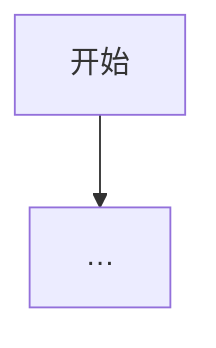

# PRD 模板（导出时按此结构填写）

> 范围：`<scope>`  
> 版本：v1  
> 导出日期：YYYY-MM-DD  
> 代码依据：`<paths or commit>`  
> 关联 SPEC：`./SPEC.md`  
> 关联 DIFF：`./DIFF.md`  
> 关联设计文档：（如有）

## 变更记录

| 日期 | 说明 |
|------|------|
| YYYY-MM-DD | 首次导出 |

---

## 1. 文档元信息

（范围说明、包含/排除的文件或页面）

## 2. 背景与目标

- **问题**：…（缺则「待产品补充」）
- **目标**：…

## 3. 角色与权限边界

| 角色 | 视角 | 可见/可操作 |
|------|------|-------------|
| … | 集团/品牌/门店 | … |

## 4. 范围边界

- **In**：…
- **Out**：…

## 5. 核心业务场景

主流程（Mermaid）+ 关键分支说明。

## 6. 功能需求清单

| 编号 | 需求类型 | 需求描述 | 关联编号 |
|------|----------|----------|----------|
| PREFIX-01 | 筛选/展示/操作/校验/空状态/… | … | → PREFIX-02 |

类型示例：筛选、展示、交互、操作、逻辑、校验、空状态、导出、初始化、联动、权限。

## 7. 用户故事与验收标准

### PREFIX-01 …

**用户故事**：作为…，我希望…，以便…

**验收（Given / When / Then）**：

- Given … When … Then …

## 8. 页面/入口清单

| 入口 | 路径/注册点 | 依赖 |
|------|-------------|------|
| … | … | … |

## 9. 非功能与约束

多语言、权限、保存/下发、产线差异等（无则写 N/A + 原因）。

## 10. 开放问题

| ID | 问题 | 建议选项 |
|----|------|----------|
| Q1 | … | … |
