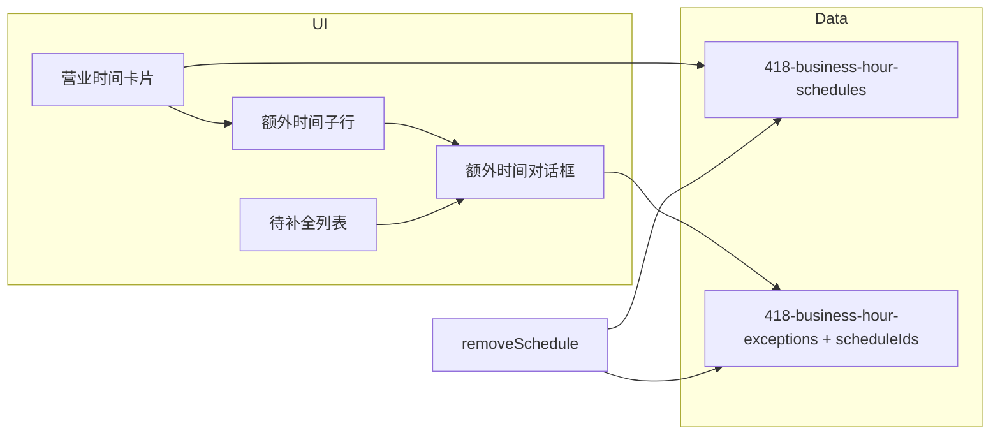

# 额外时间关联营业时间 — 实现计划

> **For agentic workers:** REQUIRED SUB-SKILL: Use executing-plans (or implement task-by-task with checkboxes). Steps use checkbox (`- [ ]`) syntax for tracking.  
> **Spec:** `docs/superpowers/specs/2026-07-28-extra-time-schedule-binding-design.md`  
> **主文件：** `src/config/module-settings-store-business-hours-ui.ts`  
> **范围：** 原型配置/UI only；不写营业解析引擎

## Goal

让「额外时间」必选关联 ≥1 条营业时间；UI 改为挂在营业时间卡片下；删除规则时摘引用并支持孤儿待补全。

## Architecture

单文件改造：扩展 `StoreBusinessHourException.scheduleIds` → 调整 normalize/读写 → 卡片内嵌子列表 + 顶栏孤儿区 → 对话框多选 + 校验 → `removeSchedule` 同步写 exceptions。



---

## Task 1：数据模型与 normalize

**Files:** `src/config/module-settings-store-business-hours-ui.ts`

- [ ] 在 `StoreBusinessHourException` 增加 `scheduleIds: string[]`
- [ ] 扩展 `normalizeException`：
  - 从 `raw.scheduleIds`（数组）或遗留 `raw.scheduleId`（单数）归一化为 `string[]`
  - 去空、去重；非法则 `[]`
  - **不要**因空数组返回 `null`（孤儿需保留）
- [ ] 新增 helper（建议放在 normalize 附近）：

```ts
function sanitizeExceptionScheduleIds(
  scheduleIds: string[],
  validIds: Set<string>,
): string[] {
  return [...new Set(scheduleIds.filter((id) => validIds.has(id)))];
}

function isOrphanException(exception: StoreBusinessHourException): boolean {
  return exception.scheduleIds.length === 0;
}
```

- [ ] 新增 `readBusinessHourExceptionsSanitized()`（或在 `refreshPanelBody` 内）：用当前 schedules 的 id 集清洗每条 `scheduleIds`；**不在此处单独 write**（按 spec §5.2）
- [ ] 确认 `writeBusinessHourExceptions` 仍整数组落盘

**Verify:** 临时在控制台/`readBusinessHourExceptions` 读入缺字段 JSON 应得 `scheduleIds: []`；带 `scheduleId: "bh-x"` 应得 `["bh-x"]`。

---

## Task 2：对话框 — 作用于营业时间多选

**Files:** 同上，`renderExceptionDialog` / `openExceptionDialog` / `resetExceptionDialog` / `saveExceptionDialog`

- [ ] 在 `renderExceptionDialog` 增加区块（建议放在星期选择之后、error 之前）：
  - 标题：`作用于营业时间 *`
  - 容器：`data-business-hour-exception-schedule-list`（保存时动态填入 checkbox，因 schedules 会变）
- [ ] 新增 `renderExceptionScheduleCheckboxes(schedules, selectedIds: Set<string>): string`：每项 `name + open—close`，`data-business-hour-exception-schedule` value=id
- [ ] 更新 mode 文案：
  - include 副文案：`在设定范围内，用此时段覆盖所选营业时间的开闭市`
  - exclude 副文案：`在设定范围内，暂停所选营业时间`
- [ ] 改 `openExceptionDialog(panel, exception?, sourceScheduleId?)`：
  - 新建且有 `sourceScheduleId`：预勾选该 id；open/close 取来源 schedule（找不到则默认 09:00/22:00）
  - 编辑：勾选 `exception.scheduleIds`（再与现有 schedules 求交）
  - 每次打开：用 `readBusinessHourSchedules()` 重绘 checkbox 列表
- [ ] `resetExceptionDialog`：清空 schedule 勾选；列表按当前 schedules 渲染（无预勾选）
- [ ] `saveExceptionDialog`：
  - 收集已勾选 ids；若 `length === 0` → `showExceptionError("请至少选择一条营业时间")` 并 return
  - `normalizeException({ ..., scheduleIds })` 写入
  - 成功写入后 `refreshPanelBody`

**Verify:** 打开对话框可见多选；取消全选点保存出现错误文案且对话框不关。

---

## Task 3：卡片内嵌额外时间 + 移除独立分区

**Files:** 同上，`renderScheduleCard` / `renderSchedulesSection` / `renderPanelBody` / `renderExceptionCard`

- [ ] 删除或停用 `renderExceptionsSection`；`renderPanelBody` 改为：`orphanBanner + schedulesSection`（不再拼接独立额外时间区）
- [ ] 改 `renderScheduleCard(schedule, relatedExceptions)`：
  - 卡片底部增加 `border-t` 子区
  - 子列表：相关 exceptions（`scheduleIds.includes(schedule.id)`）用紧凑行（可复用/精简 `renderExceptionCard` → `renderNestedExceptionRow`）
  - 若 `scheduleIds.length > 1`：显示「同时作用于：xxx」或「另关联 N 条」
  - 底部按钮：`data-business-hour-exception-create` + `data-source-schedule-id="${schedule.id}"` 文案 `+ 添加额外时间`
- [ ] `renderSchedulesSection`：map 时传入该 schedule 的 related exceptions
- [ ] 点击创建：从 `data-source-schedule-id` 调 `openExceptionDialog(panel, undefined, sourceId)`（替换原全局 create）
- [ ] 编辑/删除：保持 `data-business-hour-exception-edit|remove`（可在嵌套行上）

**Verify:** 页面无独立「额外时间」大分区；每张营业时间卡下有子区与添加按钮。

---

## Task 4：孤儿待补全列表

**Files:** 同上

- [ ] 新增 `renderOrphanExceptionsBanner(orphans: StoreBusinessHourException[]): string`
  - `orphans.length === 0` → 返回 `""`
  - 可展开：`有 N 条额外时间未关联营业时间`
  - 展开列表每行：名称 · mode · 日期 · 开闭市 · 编辑 · 删除（同 data 属性）
- [ ] `renderPanelBody` 顶部插入该 banner
- [ ] 编辑孤儿：`openExceptionDialog(panel, exception)`（无 source；勾选为空）
- [ ] 删除孤儿：复用 `openDeleteExceptionDialog`

**Verify:** 手工写入一条 `scheduleIds: []` 的 exception 后刷新，顶栏出现且可编辑/删除。

---

## Task 5：删除营业时间时摘引用

**Files:** 同上，`removeSchedule`

- [ ] 替换实现为：

```ts
function removeSchedule(panel: HTMLElement, scheduleId: string): void {
  writeBusinessHourSchedules(readBusinessHourSchedules().filter((s) => s.id !== scheduleId));
  const next = readBusinessHourExceptions().map((e) => ({
    ...e,
    scheduleIds: e.scheduleIds.filter((id) => id !== scheduleId),
  }));
  writeBusinessHourExceptions(next); // 立即持久化，含变空的孤儿
  refreshPanelBody(panel);
}
```

- [ ] 确认删除确认文案无需大改（可选：若将被摘引用，文案不强制提及）

**Verify:** 额外时间只绑「早上」时删早上 → 该条进待补全；绑早上+中午时删早上 → 仅中午卡下仍显示。

---

## Task 6：事件绑定收尾与空态

**Files:** 同上，`bindBusinessHoursPanel`（或现有 click handler）

- [ ] 创建入口仅来自卡片 `data-business-hour-exception-create`（带 source id）
- [ ] 孤儿区 edit/remove 与卡片嵌套共用选择器时，用 `closest` 取 `data-exception-id`（已有模式可复用）
- [ ] schedules 为空：无卡片则无添加入口；孤儿仍可删；编辑孤儿时 checkbox 列表空 → 无法保存

**Verify:** 设计文档 §8 用例 1–6 手工过一遍。

---

## Task 7（可选）：PRD/SPEC 同步

**Files:**  
`docs/产品PRD/exports/2026-07-28-store-info/PRD.md`  
`docs/产品PRD/exports/2026-07-28-store-info/SPEC.md`

- [ ] SI-14 补充：额外时间必选 `scheduleIds`；UI 挂在营业时间卡片下  
- [ ] SPEC 3.5 增加 `scheduleIds` 字段表行与孤儿/摘引用行为一句

**Verify:** 与设计文档决策表一致即可。

---

## Out of scope（计划中不做）

- 营业「此刻是否开放」计算器 / 预览
- 582、下发字段重命名
- 独立「全部额外时间」总览分区

## Execution notes

- 建议按 Task 1→6 顺序；每 Task 完成后做对应 Verify 再进下一项
- 单测：若仓库暂无该模块单测，以手工 Verify 为准；有测试基建时可补 `normalizeException` / `sanitizeExceptionScheduleIds` 纯函数测
- 提交建议：一个功能 commit，或 `data+dialog` / `ui-nest+orphan` / `removeSchedule` 分 2–3 个 commit
