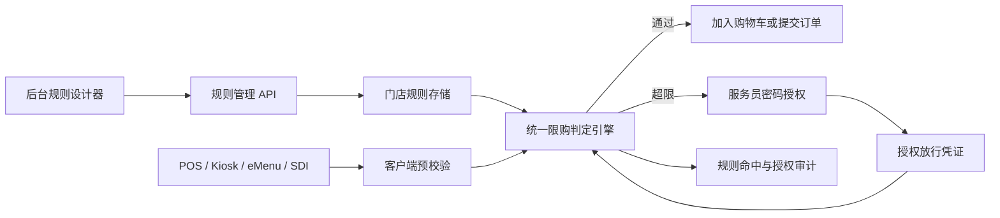

# 菜单下单限制：数量与频次限制完整设计方案

> 状态：已确认  
> 日期：2026-08-06  
> 模块：前厅管理中心 / 菜单下单限制 / 数量与频次限制  
> 方案：统一规则模型、统一判定引擎、服务端最终裁决

## 1. 背景与目标

当前“数量与频次限制”已经具备规则设计器、人数和轮次场景、分类/菜品数量、时间、会员及部分冲突校验能力，但规则只保存在浏览器本地，模拟器与新商品键不一致，也没有接入真实订单判定和门店发布链路。

本方案建立一套由后台、模拟器、POS、Kiosk、eMenu、SDI 和服务端共同遵循的规则语义，完整支持 12 种数量限制组合，并在超限时允许有权限的服务员按“本次操作、当前轮、当前订单”三个范围进行密码授权。

本方案中的“频次”沿用产品 Tab 名称，专指每轮、多轮和与轮次无关三种累计周期，不包含“两次提交至少间隔多少秒”等时间节流规则。订单/菜品提交间隔继续属于“其他设置”，不在本方案范围内。

### 1.1 核心目标

- 统一 12 种场景的配置、计算和提示语义。
- 将“按人限购”明确为“按人数限购”，不追踪具体食客。
- 统一商品、分类、人数、轮次和数量的数据模型。
- 由服务端在订单事务中完成最终判定。
- 支持受控、可审计、可撤销的超限授权。
- 支持门店级规则发布、版本、下发、回滚和历史审计。
- 保证多终端并发时不能突破限额。

### 1.2 非目标

- 不建立独立的远程规则决策微服务；首期规则引擎随订单服务部署。
- 不追踪每份商品属于哪位具体食客。
- 不在首期支持任何离线点单写入或超限授权；参与本能力的终端无法连接订单服务时只能浏览，不能修改购物车或提交订单。
- 数量授权不绕过售罄、停售、年龄、支付等其他业务限制。
- 不自动发布旧 localStorage 规则；旧规则只能导入为草稿。

## 2. 术语

| 术语 | 定义 |
|---|---|
| 按订单限购 | 配置值直接作为整桌/整单限额 |
| 按人数限购 | 配置值为人均限额，实际限额等于配置值乘有效人数 |
| 每轮 | 每次成功提交形成一轮，各轮使用独立数量池 |
| 多轮 | 每轮仍独立统计，但不同轮次区间可配置不同限额 |
| 与轮次无关 | 在订单生命周期内累计全部轮次 |
| 按分类限购 | 分类内全部商品共享同一个数量池 |
| 按菜品限购 | 每个商品分别使用自己的数量池 |
| 有效人数 | 根据订单成人数、儿童数及儿童计数策略计算的人数 |
| 本次操作 | 一次带幂等 operationId 的加购或提交请求 |
| 当前轮授权 | 仅在当前 orderId、roundNo、规则和目标范围内有效 |
| 当前订单授权 | 仅在当前 orderId、规则和目标范围内有效，关单后失效 |

## 3. 总体架构



### 3.1 架构原则

- 后台、模拟器、客户端和服务端共用同一套规则 DTO 与计算语义。
- 客户端预校验负责及时提示、禁用和展示剩余额度。
- 服务端在写订单的事务中执行最终校验，客户端结果不能替代服务端。
- 规则版本不可变；编辑和回滚均生成新版本。
- 所有终端对同一订单共享同一数量池。
- 多条规则采用 AND 语义；任何一条未满足且未获授权都应拒绝操作。

## 4. 统一计算模型

定义：

- `N`：有效就餐人数。
- `L`：当前人数区间、轮次区间、分类或菜品配置的数量。
- `Committed`：服务端订单中对应统计范围内已提交、已占用且未释放的数量。
- `CandidateCart`：服务端将本次购物车变更应用到最新共享购物车后得到的候选数量。

实际限额：

```text
按订单：EffectiveLimit = L
按人数：EffectiveLimit = L × N
```

允许增加条件：

```text
Committed + CandidateCart <= EffectiveLimit
```

客户端只提交购物车变更，不提交可信统计结果。服务端读取最新订单和共享购物车，将本次变更应用到内存中的候选购物车，再执行上述公式。本次操作导致超过限额时，必须先拒绝写入，再进入授权流程；不能先接受超限数量再阻止后续操作。

加入购物车时，`CandidateCart` 是应用本次增删后的完整服务端购物车；提交订单时，同一购物车从待提交状态原子转为已提交状态，不能同时出现在 `Committed` 和 `CandidateCart` 中。这样避免提交阶段重复计数。多个终端必须操作同一个服务端共享购物车或共享额度预留，不能各自维护互不感知的本地购物车额度。

### 4.1 数量三态

| 配置状态 | 含义 |
|---|---|
| 留空 / 未配置 | 规则不覆盖该对象 |
| `0` | 明确禁止下单，但可以按授权策略放行 |
| 正整数 | 对应统计范围内允许的最大份数 |

人数或轮次区间未命中时，默认规则不适用。只有显式配置 `0` 才表示禁止。

## 5. 十二种场景

| 场景 | 实际限额 | 统计范围 |
|---|---:|---|
| 按订单＋每轮＋按分类 | `L` | 当前订单、当前轮、当前分类总数 |
| 按订单＋每轮＋按菜品 | `L` | 当前订单、当前轮、当前菜品总数 |
| 按订单＋多轮＋按分类 | 当前轮次区间的 `L` | 当前订单、当前轮、当前分类总数 |
| 按订单＋多轮＋按菜品 | 当前轮次区间的 `L` | 当前订单、当前轮、当前菜品总数 |
| 按订单＋与轮次无关＋按分类 | `L` | 当前订单全部轮次、当前分类总数 |
| 按订单＋与轮次无关＋按菜品 | `L` | 当前订单全部轮次、当前菜品总数 |
| 按人数＋每轮＋按分类 | `L × N` | 当前订单、当前轮、当前分类总数 |
| 按人数＋每轮＋按菜品 | `L × N` | 当前订单、当前轮、当前菜品总数 |
| 按人数＋多轮＋按分类 | 当前轮次区间的 `L × N` | 当前订单、当前轮、当前分类总数 |
| 按人数＋多轮＋按菜品 | 当前轮次区间的 `L × N` | 当前订单、当前轮、当前菜品总数 |
| 按人数＋与轮次无关＋按分类 | `L × N` | 当前订单全部轮次、当前分类总数 |
| 按人数＋与轮次无关＋按菜品 | `L × N` | 当前订单全部轮次、当前菜品总数 |

### 5.1 分类规则示例

分类 A 包含 a、b、c。按人数每轮配置 `L = 2`，有效人数 `N = 4`：

```text
分类 A 当前轮实际限额 = 2 × 4 = 8 份
```

允许 `a×8`、`a×3+b×3+c×2` 等任意组合。达到 8 份后只限制分类 A，其他分类不受影响。

### 5.2 菜品规则示例

四人订单按人数每轮配置：

```text
a：1份/人 → 最多4份
b：2份/人 → 最多8份
c：3份/人 → 最多12份
```

a 达到上限后只限制 a，不连带限制 b、c。

### 5.3 多轮规则示例

分类 A 按订单多轮配置：

```text
第1轮：3份
第2轮：2份
第3轮：1份
第4轮及以后：0份
```

各轮使用独立数量池。第四轮的 `0` 表示分类 A 从第四轮开始禁止下单，但可按授权策略临时放行。

## 6. 多规则叠加和重复校验

不同维度规则允许叠加并共同校验：

- 分类总量和单品数量可以同时存在。
- 按订单和按人数可以同时存在。
- 每轮、多轮和与轮次无关可以同时存在。

例如同一商品可以同时受到“每轮最多 2 份”和“整个订单最多 5 份”限制。两条规则同时满足才能下单。

只禁止以下重复配置：

- 三个核心维度完全相同。
- 目标商品集合存在交集。
- 门店、产线、菜单、订单类型、时间和会员范围均有交集。
- 同一生效域内存在两条无法区分优先级的同型规则。

本方案取代 `2026-07-29-menu-order-limit-rule-conflicts-design.md` 中“同一商品的三种轮次模式全互斥”规则。新规则允许不同统计周期共同生效，并统一采用 AND 语义。

## 7. 后台配置流程

后台使用七步向导。

### 7.1 第一步：规则类型

- 限购主体：按订单、按人数。
- 统计周期：每轮、多轮、与轮次无关。
- 限购对象：按分类、按菜品。
- 实时展示规则解释和计算公式。

### 7.2 第二步：基础信息与商品范围

- 规则名称和描述。
- 适用门店、产线、菜单和订单类型。
- 分类或菜品目标。
- 商品使用统一业务 ID，不以界面树形路径作为唯一身份。

### 7.3 第三步：人数与轮次场景

所有规则都可按人数区间差异配置：

- 按订单规则：人数区间对应不同的订单绝对上限。
- 按人数规则：人数区间对应不同的人均上限，再乘有效人数。
- 多轮规则增加轮次区间。
- 区间不得重叠，但允许不连续。

场景定义：

```text
非多轮：人数区间
多轮：人数区间 × 轮次区间
```

### 7.4 第四步：限购数量

沿用“场景条＋产线 Tab”：

- 选择人数/轮次场景。
- 选择产线。
- 按分类或菜品填写三态数量。
- 支持批量设置、复制到其他场景和完成度提示。

移除现有四个重复附加字段：每轮最大总份数、最大生效轮次、每人每轮上限、单次下单上限。

最大生效轮次可由多轮后续区间配置 `0` 表达；每人每轮上限与“按人数＋每轮”重复；单次提交上限属于独立批次/频率规则；总份数限制应由全商品目标或独立订单总量规则表达。

### 7.5 第五步：生效范围

- 全天或指定营业时段。
- 全部或指定会员等级。
- 生效日期和星期。
- 适用订单类型。
- 儿童是否计入有效人数，默认继承门店全局配置。

### 7.6 第六步：超限授权

- 是否允许服务员授权。
- 允许范围：本次操作、当前轮、当前订单。
- 默认授权范围。
- 每个授权范围要求的权限；不同范围可以绑定不同角色权限。
- 是否必须填写授权原因。

关闭授权时，超限后硬性拒绝。

### 7.7 第七步：确认与发布

展示规则公式、目标范围、人数/轮次数量矩阵、生效条件、授权策略、叠加效果、影响门店和终端。保存先形成草稿，用户确认“保存并下发”后才生成正式版本。

### 7.8 生命周期

```text
草稿 → 待发布 → 已启用 → 已停用 → 已归档
```

复制规则只生成草稿。启用、编辑发布和历史回滚都必须重新执行发布校验。

## 8. 规则数据模型

```ts
type OrderLimitRule = {
  id: string;
  version: number;
  status: "draft" | "pending" | "active" | "inactive" | "archived";
  name: string;
  description?: string;
  subject: "order" | "party_size";
  period: "per_round" | "multi_round" | "order_lifetime";
  targetType: "category" | "dish";
  storeIds: string[];
  productLines: string[];
  menuIds: string[];
  orderTypes: string[];
  scenes: Array<{
    partySizeRange: { min: number; max: number | null };
    roundRange?: { min: number; max: number | null };
    limits: Array<{ targetId: string; value: number }>;
  }>;
  conditions: {
    businessHourIds?: string[];
    memberLevelIds?: string[];
    effectiveFrom?: string;
    effectiveTo?: string;
    daysOfWeek?: Array<"mon" | "tue" | "wed" | "thu" | "fri" | "sat" | "sun">;
    timeZone: string;
    childCountPolicy: "inherit" | "include" | "exclude";
  };
  authorization: {
    enabled: boolean;
    allowedScopes: Array<"operation" | "round" | "order">;
    defaultScope?: "operation" | "round" | "order";
    scopePermissions: Partial<Record<"operation" | "round" | "order", string>>;
    reasonRequired: boolean;
  };
  createdBy: string;
  createdAt: string;
  updatedBy: string;
  updatedAt: string;
};
```

稳定目标 ID：

```text
分类：category:{categoryId}
菜品：dish:{dishId}
```

门店、菜单和产线属于适用范围，不拼入商品 ID。跨终端操作同一订单时仍累计同一额度。

区间端点均为闭区间；`max = null` 表示无上限，例如 `{ min: 4, max: null }` 表示第四轮及以后。`roundRange` 仅允许且必须出现在 `multi_round` 规则中；授权关闭时 `defaultScope` 和 `scopePermissions` 可以为空，授权开启时默认范围必须包含在允许范围内，且每个允许范围必须配置对应权限。

## 9. 判定接口

### 9.1 公共请求与服务端内部上下文

客户端不能提交当前轮次、人数、会员、时间、已下单明细或购物车汇总作为可信事实。公开写请求只包含：

```ts
type OrderLimitWriteRequest = {
  orderId: string;
  operationId: string;
  orderVersion: number;
  menuId: string;
  mutation: CartMutation;
  authorizationTokens: string[];
};
```

服务端根据 `orderId` 和认证会话校验门店及菜单，读取订单、会员、当前轮、共享购物车和服务器时间，再构造内部上下文：

```ts
type OrderLimitContext = {
  merchantId: string;
  storeId: string;
  orderId: string;
  menuId: string;
  orderType: string;
  sourceProductLine: string;
  currentRound: number;
  partySize: { adultCount: number; childCount: number };
  memberLevelId?: string;
  occurredAt: string; // 服务器时间
  submittedItems: OrderItem[];
  pendingItems: OrderItem[];
  requestedItems: OrderItem[];
  authorizationTokens: string[];
};
```

`submittedItems`、`pendingItems`、人数、会员和轮次只能来自服务端数据源。客户端传入的同名字段必须忽略或拒绝。预览接口可接收模拟参数，但必须使用独立的非写入端点，且结果不能用于订单准入。

### 9.2 输出

```ts
type OrderLimitDecision = {
  allowed: boolean;
  violations: Array<{
    ruleId: string;
    ruleVersion: number;
    targetId: string;
    targetName: string;
    configuredLimit: number;
    effectiveLimit: number;
    submittedQuantity: number;
    pendingQuantity: number;
    requestedQuantity: number;
    exceededQuantity: number;
    allowedAuthorizationScopes: Array<"operation" | "round" | "order">;
    message: string;
  }>;
};
```

### 9.3 判定顺序

1. 加载门店当前正式规则版本。
2. 按门店、产线、菜单和订单类型过滤。
3. 按日期、营业时段和会员等级过滤。
4. 计算有效人数。
5. 匹配人数区间。
6. 多轮规则匹配当前轮次区间。
7. 展开分类目标到实际菜品。
8. 统计已下单、购物车和本次请求数量。
9. 计算实际限额。
10. 校验授权凭证。
11. 返回全部违反项。
12. 无违反项或全部违反项均获有效授权时放行。

## 10. 轮次与数量占用

### 10.1 轮次边界

- 新订单从第一轮开始。
- 当前购物车属于当前轮。
- 当前轮至少一个商品成功提交后完成该轮。
- 下一次开始点单时进入下一轮。
- 提交失败、授权取消或网络失败不增加轮次。
- 同一提交请求重试保持原轮次和幂等请求号。

### 10.2 释放限额

| 操作 | 是否释放 |
|---|---|
| 未提交购物车删除 | 释放 |
| 提交前整单取消 | 释放 |
| 提交后、未送厨前撤销 | 释放 |
| 已送厨或已制作后退菜 | 不释放 |
| 已履约商品退款 | 不释放 |
| 提交失败 | 不占用 |
| 重复请求 | 通过幂等键避免重复占用 |

订单明细保存下单时商品、分类和轮次快照。后续商品改分类或菜单调整不影响历史额度。一条明细可能同时命中多条 AND 叠加规则，因此占用记录必须按规则和目标逐条保存，不能只记录单个规则版本。

```ts
type OrderItemLimitSnapshot = {
  dishId: string;
  categoryIdsAtOrder: string[];
  roundNo: number;
  submittedAt?: string;
  kitchenSentAt?: string;
  limitReleasedAt?: string;
  occupancies: Array<{
    ruleId: string;
    ruleVersion: number;
    targetKey: string;
    periodBucket: string;
    quantity: number;
    authorizationId?: string;
    releasedAt?: string;
  }>;
};
```

当前正式规则发生版本切换时，后续操作使用新版本，并根据所有历史订单明细的 `dishId`、`categoryIdsAtOrder` 和 `roundNo` 重新计算新规则下的已用数量；旧占用记录保留用于审计，不作为新版本唯一计数来源。新规则可能使订单立即处于已超限状态，此时不追溯删除历史商品，但继续增加必须获得新版本授权。

一个商品属于多个分类时，会分别进入每条命中分类规则的数量池；同一规则中的多个分类目标也分别计算，不把多分类成员静默归入任意一个分类。

## 11. 人数变化

有效人数：

```text
包含儿童：adultCount + childCount
排除儿童：adultCount
```

- 人数增加后使用新的更高限额。
- 人数减少后重新计算限额。
- 已用数量超过新限额时不追溯删除，但禁止继续增加。
- 人数变更必须记录修改人、修改前后人数和原因。
- 人数不得小于 1；异常为 0 时阻止自助点单。

## 12. 服务员密码授权

### 12.1 三种范围

| 范围 | 生效方式 | 失效条件 |
|---|---|---|
| 本次操作 | 仅允许当前加购或提交请求 | 操作成功后消费 |
| 当前轮 | 当前轮内，对获授权规则和目标不再重复验证密码 | 当前轮完成、关单或撤销 |
| 当前订单 | 当前订单内，对获授权规则和目标不再重复验证密码 | 关单、规则版本变化或撤销 |

授权不能默认放行所有菜单限制。例如分类 A 超限授权只覆盖当前订单、命中规则、分类 A 和选定授权范围。

### 12.2 授权流程

1. 点单操作触发一条或多条超限结果。
2. 客户端拒绝写入并展示完整计算明细。
3. 服务员选择权限允许的授权范围。
4. 服务员输入密码，必要时填写原因。
5. 服务端校验员工、门店、角色和权限。
6. 服务端签发放行凭证。
7. 客户端携带凭证重试原操作。
8. 服务端重新判定并在订单事务内写入。
9. 记录命中、授权和最终结果。

### 12.3 凭证绑定与状态

```ts
type OrderLimitAuthorization = {
  authorizationId: string; // 唯一 jti / nonce
  merchantId: string;
  storeId: string;
  orderId: string;
  ruleRefs: Array<{
    ruleId: string;
    ruleVersion: number;
    targetKeys: string[];
  }>;
  scope: "operation" | "round" | "order";
  roundNo?: number;
  operationId?: string;
  requestDigest?: string;
  authorizedBy: string;
  authorizedAt: string;
  expiresAt: string;
  status: "active" | "consumed" | "revoked" | "expired";
};
```

- 密码只提交服务端验证，不存入客户端或订单明文。
- 凭证由服务端签名。
- 本次操作绑定 operationId 和标准化请求摘要 requestDigest。
- 当前轮绑定 roundNo。
- 规则版本变化后旧凭证失效。
- 授权只绕过数量限制。
- 服务端必须在订单写事务内检查撤销状态并原子消费“本次操作”凭证。
- 同一个 operationId 和相同 requestDigest 的网络重试返回第一次操作结果，不再次写订单，也不视为非法重放；相同 operationId 搭配不同摘要必须拒绝。
- 当前轮和当前订单凭证不按次消费，但每次使用都检查有效期、撤销状态、规则版本、目标、轮次和订单绑定。
- 批量违反项只有在所选授权范围对每条违反项都可用、且授权员工拥有该范围权限时才能一次签发；否则必须选择更小范围或由更高权限员工授权。

### 12.4 权限建议

- `order_limit.authorize.once`
- `order_limit.authorize.round`
- `order_limit.authorize.order`

普通员工可只拥有本次操作权限，值班经理可拥有当前轮权限，店长可拥有当前订单权限。

## 13. 客户端交互

### 13.1 正常状态

客户端展示剩余额度，例如：

```text
分类A：本轮还可点2份
商品a：整个订单还可点1份
```

达到上限后商品仍可浏览。顾客端点击提示联系服务员；员工端点击可直接进入授权流程。

### 13.2 超限弹窗

弹窗展示规则、目标、有效人数、配置上限、实际限额、已下单数量、购物车数量、本次增加数量、超出数量和可用授权范围。

### 13.3 多规则和批量操作

- 同一操作的全部超限结果在一个弹窗中分组展示。
- 一次身份验证可授权弹窗中明确选中的全部违反项。
- 未授权规则仍然阻止操作。
- 批量加购、套餐选择和整单提交采用原子处理；任意项不通过时整体不写入。
- 套餐按实际子商品展开后参与分类和菜品规则。

### 13.4 错误文案

文案必须说明受限对象、原因和下一步，例如：

```text
海鲜类本轮最多可点8份，当前已有8份。
如需继续添加，请联系有权限的服务员授权。
```

## 14. 并发、幂等和版本

两个终端同时操作同一订单时：

1. 请求携带 orderVersion 和 operationId。
2. 服务端锁定订单或使用乐观锁。
3. 读取最新数量并重新判定。
4. 通过后原子写入订单、额度和审计。
5. 版本冲突时客户端刷新订单并重试。

客户端显示的剩余额度只用于提示。

每次发布生成不可变规则版本。旧商品不因新版本追溯撤销；新操作按当前正式版本判断。规则版本变化后旧授权失效。

## 15. 接口设计

```http
GET    /stores/{storeId}/order-limit-rules
POST   /stores/{storeId}/order-limit-rules
PUT    /stores/{storeId}/order-limit-rules/{ruleId}
POST   /stores/{storeId}/order-limit-rules/{ruleId}/publish
POST   /stores/{storeId}/order-limit-rules/{ruleId}/disable
POST   /stores/{storeId}/order-limit-rules/{ruleId}/archive
GET    /stores/{storeId}/order-limit-rules/{ruleId}/versions
POST   /stores/{storeId}/order-limit-rules/{ruleId}/rollback
POST   /orders/{orderId}/limit-evaluate
POST   /orders/{orderId}/limit-authorizations
DELETE /orders/{orderId}/limit-authorizations/{authorizationId}
GET    /orders/{orderId}/limit-authorizations
GET    /stores/{storeId}/order-limit-audits
POST   /stores/{storeId}/order-limit-rules/simulate
```

订单级 `limit-evaluate` 只接受第 9.1 节的受限请求，并由服务端读取真实订单上下文，可供客户端预校验。规则设计器使用独立的 `simulate` 端点接收明确标记的模拟上下文，模拟结果不能用于订单准入。真实订单写入必须在订单事务中再次调用同一引擎。

## 16. 存储

- `order_limit_rules`：规则逻辑身份和状态。
- `order_limit_rule_versions`：不可变版本 JSON。
- `order_limit_rule_scopes`：门店、菜单、产线和订单类型。
- `order_limit_authorizations`：有效和历史授权。
- `order_limit_audit_logs`：规则和授权审计。
- `order_limit_operation_idempotency`：操作幂等。

订单明细保存商品、分类快照、轮次、额度占用、释放状态和授权 ID。

## 17. 发布与终端下发

```text
保存草稿
→ 字段和区间校验
→ 展开分类商品
→ 检查重复与叠加
→ 生成变更预览
→ 用户确认发布
→ 生成不可变版本
→ 更新门店当前版本
→ 推送终端
→ 汇总接收结果
```

发布校验：

- 人数和轮次区间不得重叠。
- 数量只能留空、为 0 或正整数。
- 至少配置一个目标。
- 时间、会员和授权配置完整。
- 默认授权范围包含在允许范围内。
- 授权角色真实存在。
- 同型规则重叠时拒绝发布。
- 不同维度叠加时展示组合影响。

终端保存服务端签名的规则快照用于展示和预校验。规则版本变化后服务端主动失效缓存并推送终端。客户端版本落后时，服务端仍按最新版本判定并要求刷新。

首期离线策略采用严格失败关闭：参与数量与频次限制能力的终端无法证明与订单服务保持在线时，只能浏览菜单和订单，不能新增、减少或提交购物车，也不能使用或签发本次操作、当前轮、当前订单授权。终端不得根据本地快照判断“该商品未被规则覆盖”后继续离线点单，因为快照可能落后于刚发布的新规则。

该约束以牺牲离线可用性换取“多终端不能突破限额”的硬性保证。未来若要恢复离线点单，必须另行设计带有效期的签名规则租约、延迟激活窗口、中心额度预留和冲突结算协议；在该协议落地前不能放宽失败关闭策略。

## 18. 旧数据迁移

现有 `localStorage.restaurantRules` 仅作为旧演示数据来源：

1. 检测旧数据。
2. 提供“导入为草稿”。
3. 转换旧商品、分类和轮次结构。
4. 无法映射的目标标记异常。
5. 不自动发布导入数据。
6. 保留旧数据一个版本周期供回退。

## 19. 异常处理

| 异常 | 处理 |
|---|---|
| 规则非法 | 拒绝发布 |
| 客户端版本落后 | 服务端按最新版本判定并要求刷新 |
| 服务端不可用 | 终端只读，禁止全部购物车和提交写操作，所有数量授权停用 |
| 密码错误 | 提示错误并限制连续重试 |
| 员工无权限 | 提示需要更高权限角色 |
| 凭证过期 | 重新授权 |
| 订单版本冲突 | 刷新并重新计算 |
| 商品停售或售罄 | 数量授权也不能放行 |
| 发布部分失败 | 保持上一完整版本，不混用新旧规则 |

## 20. 权限与审计

后台权限：查看规则、创建和编辑草稿、发布规则、停用或归档规则、回滚版本、查看和导出授权审计、撤销当前轮或当前订单授权。

每条授权审计至少记录原限额、实际数量、超限数量、员工、终端、范围、原因、授权时间、规则版本和最终操作结果。

## 21. 验收标准

1. 分类限购统计分类内全部商品总数。
2. 一个分类达到上限不影响其他分类。
3. 菜品达到上限只限制对应菜品。
4. 每轮规则换轮后重新获得额度。
5. 多轮规则按当前轮次区间读取不同上限。
6. 与轮次无关规则累计订单全部轮次。
7. 按人数限额等于人均限额乘有效人数。
8. 按人数限购不要求绑定具体食客。
9. 儿童策略正确影响有效人数。
10. 人数减少不追溯删除历史商品，但阻止继续超限添加。
11. 留空和显式 0 含义不同。
12. 分类和菜品规则可以共同生效。
13. 每轮和整单规则可以共同生效。
14. 多规则采用 AND 语义。
15. 客户端预校验与服务端最终判定一致。
16. 多终端并发不能突破限额。
17. 未送厨撤销正确释放额度。
18. 已送厨退菜不释放额度。
19. 授权只覆盖指定规则、目标、订单和范围。
20. 本次操作授权不能重复消费。
21. 当前轮授权换轮后失效。
22. 当前订单授权关单后失效。
23. 新规则版本发布后旧授权失效。
24. 时间、会员、订单类型和门店范围正确过滤。
25. 发布失败时终端继续使用上一完整版本。
26. 全部规则命中和授权行为都有审计。
27. 客户端伪造人数、轮次、会员、服务器时间或已用数量不能影响服务端结果。
28. 加购和提交使用互斥状态，购物车数量不会在提交阶段重复计数。
29. 两个终端对同一共享购物车并发加购时不能共同突破限额。
30. 授权凭证不能跨订单、轮次、规则、目标或版本重放。
31. 授权撤销与订单写入并发时只有一个确定结果，不产生半授权写入。
32. 相同 operationId 和相同请求摘要重试返回原结果，不重复写入；摘要不同则拒绝。
33. 一次批量操作命中不同权限要求的规则时，只能选择所有违反项共同允许的授权范围。
34. 开放上限区间、闭区间边界、区间间隙均按定义匹配。
35. 多分类商品分别进入每条命中分类规则的数量池。
36. 订单中途切换规则版本后，历史明细按新规则重新计数，旧授权失效。
37. 离线状态下终端只读，所有购物车、提交和数量授权均失败关闭。
38. 终端缓存 vN 后、服务端 vN+1 新增商品限制且终端未收到推送即断网时，该商品及其他商品都不能离线写入。

每种场景还必须验证小于上限、正好达到、超出、0、留空以及三个授权范围。

## 22. 非功能指标

- 纯判定引擎 P95 小于 50ms。
- 包含网络的判定 API P95 小于 150ms。
- 授权验证 P95 小于 500ms。
- 订单写入与最终判定处于同一事务边界。
- 幂等重试不产生重复商品或重复额度。
- 正式版本可追溯、可回滚。
- 授权和规则审计覆盖率 100%。
- 判定能力可用性不低于订单服务。

## 23. 成功指标

- 客户端与服务端判定不一致率为 0。
- 并发突破限额事件为 0。
- 无审计授权事件为 0。
- 规则发布失败率低于 0.5%。
- 持续观察超限次数、授权率、三种范围使用占比、平均授权耗时、顾客放弃率和授权撤销率。

## 24. 风险与缓解

| 风险 | 缓解措施 |
|---|---|
| 旧商品键无法映射 | 只导入草稿，异常目标人工处理 |
| 多规则难以理解 | 发布前展示组合后的最小有效额度 |
| 修改人数绕过规则 | 人数权限、审计和服务端重算 |
| 多终端并发突破 | 订单事务和版本锁 |
| 授权范围过大 | 凭证绑定规则、目标、订单、轮次和版本 |
| 判定故障影响点单 | 签名快照、上一版本回退和监控告警 |
| 分类调整影响历史 | 保存下单时分类快照 |
| 一次命中大量规则 | 聚合弹窗，一次验证处理明确命中项 |

## 25. 实施阶段与资源

1. 规则 DTO、公式和测试基线：1 周。
2. 纯规则引擎及参数化测试：2–3 周。
3. 服务端存储、版本、发布和授权：2–3 周。
4. 后台七步向导和发布预览：2–3 周。
5. POS、Kiosk、eMenu、SDI 接入：3–4 周。
6. 联调、并发、离线和安全测试：2 周。
7. 单门店灰度：1–2 周。
8. 分批扩大范围：1–2 周。

部分工作并行后，首个可灰度版本预计 10–14 周。

建议资源：产品经理 1 人、交互/UI 设计 1 人、后端工程师 2 人、后台前端工程师 1 人、终端工程师 2 人、测试工程师 1–2 人、安全或权限评审支持 0.5 人。

## 26. 完成定义

- 12 种场景全部遵循统一 DTO 和判定引擎。
- 按人数计算、轮次统计、分类/菜品统计和数量三态符合本方案。
- 三种授权范围均完成权限、凭证、撤销和审计闭环。
- 后台、模拟器和真实订单共享计算语义。
- 服务端事务校验和并发测试通过。
- 38 条验收标准全部通过。
- 旧 localStorage 不再作为正式数据源。
- 门店规则发布、下发、版本和回滚闭环可用。
