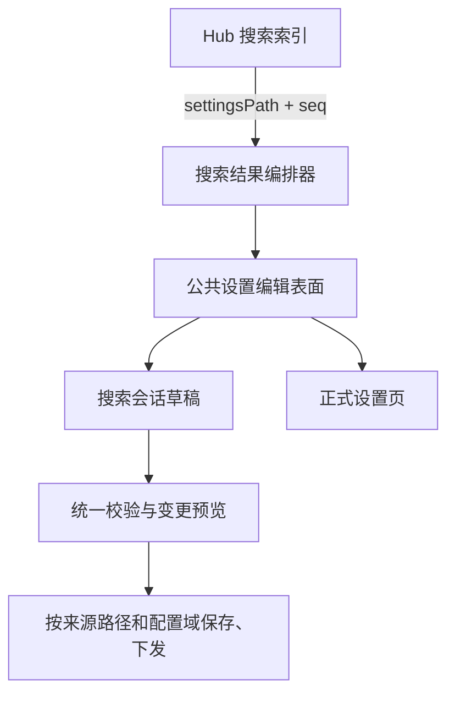

# 滑层搜索结果直接编辑完整设置设计

> 日期：2026-08-10
> 状态：已确认
> 范围：所有已启用 Hub 搜索的 `sheet` 滑层
> 关联现状：`docs/项目文档/滑层Hub搜索设计方案.md` v1.2

## 1. 背景

当前滑层搜索已经覆盖 Hub 内的功能入口、设置项和说明文案。搜索态采用“左侧过滤导航 + 右侧结果列表”，但设置结果仍是只读卡片；点击后会退出搜索态、跳转到正式设置页并定位目标设置。

本次将设置结果升级为可直接编辑的完整设置卡。用户不离开搜索结果即可完成设置，并在当前滑层搜索会话内统一保存。

## 2. 已确认决策

1. 设置结果全部完整展开，不使用折叠卡或右侧编辑抽屉。
2. 每个设置结果复用正式设置页的完整控件，包括主开关、单选、多选、数值、文本、复杂矩阵和适用产线。
3. 修改先进入当前滑层搜索会话草稿，不立即持久化或下发。
4. 同一搜索会话内跨分组、跨设置页的修改统一预览、统一保存。
5. 存在未保存修改时，任何会替换结果或离开当前搜索上下文的操作都必须询问是否保存。
6. 离开确认提供“保存并继续 / 放弃修改 / 取消”。
7. 保存成功后保留当前关键词和结果页面，仅刷新状态并显示成功反馈。

## 3. 目标与非目标

### 3.1 目标

- 搜索结果中可直接完成与正式设置页等价的编辑。
- 功能设置和适用产线使用同一状态、校验、草稿和变更记录体系。
- 一个搜索会话可安全收集多个来源设置页的改动并统一保存。
- 搜索词变化、导航、关闭滑层和切换 Hub 时不丢失未保存修改。
- 不破坏现有搜索、设置页批量保存、部署预览、权限和平台预设逻辑。

### 3.2 非目标

- 不扩展为跨 Hub 或全站命令面板。
- 不新建第二套设置控件或第二套产线存储。
- 不改变现有搜索匹配算法、权重和作用域。
- 不把导航类结果改造成业务页面的内嵌编辑器。
- 不在首期实现跨刷新恢复搜索会话草稿。

## 4. 页面与交互设计

### 4.1 搜索结果类型

右侧结果保留两类行为：

- **功能入口**：继续展示导航结果，点击进入对应页面。
- **功能设置**：按规范主设置去重后，每个命中项完整展开并可直接编辑。

设置卡按以下顺序展示：

1. 设置名称、seq 和所属路径。
2. 功能说明、当前状态及版本或权限提示。
3. 完整功能设置。
4. 该设置支持产线时，展示完整“适用产线”；不支持时不渲染空区域。
5. 校验错误或草稿修改标识。

所有命中设置默认完整展开。相同设置因多个字段或多个文案命中时，只渲染一张卡。

### 4.2 统一保存栏

主区底部使用固定保存栏：

- 无修改时不显示。
- 有修改时显示“已修改 N 项”“放弃修改”“保存全部”。
- 修改数量按规范变更项去重，而不是按 DOM 事件次数累计。
- 点击修改数量可复用现有变更预览能力。
- 保存成功后清空已提交草稿，保留关键词、结果和滚动上下文。

### 4.3 离开保护

以下操作在会话有草稿时必须触发统一确认：

- 修改或清空搜索词。
- 点击功能入口或左侧导航。
- 关闭滑层。
- 切换管理中心。
- 站内其他会替换当前搜索结果的操作。

对话框行为：

| 操作 | 结果 |
|---|---|
| 保存并继续 | 校验并保存；成功后执行原操作 |
| 放弃修改 | 清空会话草稿并执行原操作 |
| 取消 | 保留关键词、草稿、滚动位置和当前结果 |

搜索词变化先保存为待执行操作，不立即替换正式关键词。取消后输入框恢复原关键词。对话框打开期间暂停搜索防抖、导航和重复离开事件。

浏览器刷新或关闭标签页使用系统离开提示；站内操作使用产品对话框。

## 5. 架构



核心原则是“索引只负责找到设置，公共编辑表面负责展示和编辑，会话草稿负责隔离未保存状态，保存协调器负责跨来源提交”。

### 5.1 `SettingEditContext`

设置控件不得再只通过当前 URL 推断草稿归属。公共渲染与绑定入口显式接收编辑上下文：

```ts
type SettingEditContext = {
  mode: "page" | "search";
  scopeKey: string;
  settingsPath: string;
  seq?: number;
  lineId?: string;
};
```

- 正式设置页继续使用规范页面保存键。
- 搜索态使用 `hub-search:<hubId>:<sessionId>` 作为会话作用域。
- `settingsPath` 始终保留真实来源，用于校验、变更预览、配置域解析和下发。

### 5.2 `ModuleSettingSurface`

从 `src/main.ts` 中抽离完整设置项渲染和绑定能力，形成正式设置页与搜索结果共享的编辑表面。它负责：

- 按 seq 选择规范渲染器。
- 渲染标题、说明、主控件、子配置和适用产线。
- 绑定控件事件并把变更写入传入的编辑上下文。
- 执行依赖显隐、禁用规则和单项校验。
- 暴露批量校验和定位首个错误的接口。

不得为搜索结果复制一套开关、表单或产线渲染器。新增设置类型进入公共注册表后，应同时可用于正式设置页和搜索结果。

### 5.3 `SearchEditSession`

每次打开一个 Hub 的搜索编辑态时创建会话：

```ts
type SearchEditSession = {
  id: string;
  hubId: string;
  acceptedQuery: string;
  pendingAction: PendingSearchAction | null;
  drafts: Map<string, SearchDraftEntry>;
};
```

草稿键至少包含真实来源和控件身份：

- `settingsPath + seq + toggle`
- `settingsPath + seq + fieldId`
- `settingsPath + seq + lineId`

同一设置在关键词变化前后再次出现时读取同一份会话草稿。会话草稿保存在内存中，不跨页面刷新恢复。

### 5.4 `SearchSaveCoordinator`

保存协调器在一个逻辑操作中完成：

1. 收集并去重当前会话所有草稿。
2. 运行全部设置校验；任一失败则不进入提交阶段。
3. 生成一次变更预览，并按来源设置页展示归属路径。
4. 按 `settingsPath` 和配置域拆分内部执行批次。
5. 调用现有持久化、变更记录和下发能力。
6. 返回逐来源结果，供保存栏刷新和失败重试。

统一保存表示一次用户确认和一次编排流程，不虚构跨配置域的底层原子事务。若下发器返回部分失败，成功来源标记为已保存，失败来源保留草稿并显示可重试原因。

## 6. 数据流

1. `hub-sheet-search` 返回命中的 `settingsPath + seq`。
2. 结果编排器先按规范主设置去重，再过滤不可见、已退役和被合并承载的条目。
3. 每个设置卡以搜索编辑上下文调用公共设置编辑表面。
4. 读取顺序为“当前搜索会话草稿 → 持久层值 → 规范默认值”。
5. 用户修改控件时只更新会话草稿和变更缓冲，不写持久层。
6. 父项变化后，以草稿态重新计算依赖项显隐、禁用和产线联动。
7. 保存前统一校验；确认后才写入持久层并触发部署。
8. 保存成功后结果卡重新读取持久层，搜索关键词与滚动上下文保持不变。

## 7. 产线设置规则

- 是否展示适用产线由现有产线注册表和 scope 数据决定，不根据标题或字段名猜测。
- 默认全选、显式全部关闭、未配置和镜像开关继续沿用现有编码与存储语义。
- 功能主开关和产线勾选读取同一草稿，不允许两套状态互相覆盖。
- 按产线子配置、特殊矩阵和只适用于部分终端的设置继续使用现有专用渲染器。
- 没有产线能力的设置不展示“适用产线”空壳。

## 8. 校验、错误与权限

### 8.1 校验

- 保存前执行所有已修改设置的同步和异步校验。
- 任一设置失败时不持久化任何草稿。
- 自动滚动并聚焦第一个错误控件，同时在对应结果卡显示错误摘要。
- 未修改但因依赖关系变为非法的设置也必须进入校验结果。

### 8.2 保存失败

- 持久化或下发失败时保留失败项草稿、关键词和结果页面。
- 错误信息按来源设置页或配置域展示。
- 用户可直接重试，无需重新输入。
- 已成功来源不重复提交；失败来源继续计入待保存数量。

### 8.3 权限与可见性

- 搜索索引与正式设置页使用相同的 RBAC、平台预设和产品版本过滤。
- 无查看权限的设置不进入结果。
- 允许查看但无编辑权限的设置完整展示为只读，并说明禁用原因。
- 只读设置的交互不得写入草稿或进入保存队列。

## 9. 全量展开下的性能策略

结果不截断、不分页、不改为折叠态，但采用渐进挂载：

1. 先完成检索和去重并显示总命中数。
2. 优先挂载首屏完整设置卡。
3. 后续设置卡分批挂载，避免长任务阻塞输入和滚动。
4. 未进入视口的复杂矩阵可延迟初始化；进入视口后完整展示。
5. 已编辑卡不得卸载，草稿状态也不得依赖 DOM 存活。
6. 使用结果根节点事件委托，避免每张卡重复注册全局监听。

性能目标：

- 输入后 300ms 内出现结果骨架或首批内容。
- 首批可操作设置在 1 秒内完成。
- 后续挂载不明显阻塞输入与滚动。

## 10. 建议代码边界

| 文件 | 责任 |
|---|---|
| `src/config/hub-sheet-search.ts` | 索引、查询、命中描述与设置结果去重；不承载表单状态 |
| `src/config/module-setting-surface.ts`（新增） | 公共完整设置项渲染、绑定和校验入口 |
| `src/config/module-setting-edit-context.ts`（新增） | 页面与搜索两种编辑上下文 |
| `src/config/hub-search-edit-session.ts`（新增） | 搜索会话草稿、脏状态和待执行操作 |
| `src/config/hub-search-save-coordinator.ts`（新增） | 跨来源校验、预览、提交与失败重试 |
| `src/config/page-settings-draft.ts` | 支持显式 `scopeKey` 和真实 `settingsPath`，保留页面模式兼容入口 |
| `src/config/page-save-registry.ts` | 接受搜索会话级校验与脏状态探测 |
| `src/config/page-save-guard.ts` | 统一拦截搜索词、导航、关闭滑层和切换 Hub |
| `src/config/page-save-confirm-dialog.ts` | 提供三选项离开确认 |
| `src/config/page-save-bar-ui.ts` | 复用保存栏视觉，并支持搜索会话文案和动作 |
| `src/main.ts` | 仅保留页面编排、路由和挂载接线 |
| `src/i18n.ts` | 新增搜索编辑、离开保护、错误与进度文案 |

实施时应以小步抽取公共渲染器为先，不在一次修改中无关重构整个 `main.ts`。

## 11. 测试方案

### 11.1 纯逻辑测试

- 命中设置去重和规范主项选择。
- 搜索会话草稿读写与修改数量。
- 保存、放弃、取消及待执行操作状态转换。
- 跨关键词重新命中时草稿复用。

### 11.2 控件契约测试

代表性覆盖：

- 主开关。
- 单选、多选、数字、文本和颜色。
- 复杂矩阵和专用设置控件。
- 适用产线、全部关闭和按产线子配置。

同一设置在正式设置页和搜索结果中必须读取相同值、执行相同校验并生成等价变更记录。

### 11.3 集成测试

- 跨分组和跨设置页修改后统一预览与保存。
- 更换搜索词、清空、导航、关闭滑层和切换 Hub 的离开保护。
- 取消后恢复关键词、草稿与滚动位置。
- 校验失败时整批不提交并定位错误。
- 部分下发失败后只保留失败来源草稿并可重试。
- 保存成功后保留关键词和结果页面。

### 11.4 回归测试

- 原有搜索点击导航和设置定位行为。
- 正式设置页批量保存与部署预览。
- 前厅按场景和按产线视图。
- 平台预设、权限、版本过滤及隐藏/合并设置。
- 关闭滑层和 Hub 切换状态。

## 12. 验收标准

1. 搜索“菜单”后，所有命中设置卡完整展开。
2. “搜索菜单”等支持产线的功能同时展示完整功能设置和适用产线。
3. 修改多个结果时，保存栏显示去重后的修改数量。
4. 不同设置分组或来源页的修改可一次预览并统一保存。
5. 有草稿时更换搜索词，出现“保存并继续 / 放弃修改 / 取消”。
6. 选择取消后，关键词、控件值、滚动位置和草稿均不变化。
7. 任一控件校验失败时不提交，并定位首个错误。
8. 保存或下发失败后草稿不丢失，可直接重试。
9. 无编辑权限的设置完整但只读，不进入保存队列。
10. 宽泛搜索下全部结果仍可操作，首屏和滚动无明显卡顿。

## 13. 发布策略

能力按通用组件实现，最终覆盖所有已经启用 Hub 搜索的滑层。发布顺序建议：

1. 先在前厅管理中心开启，覆盖产线和复杂设置的最高风险组合。
2. 验证草稿、保存、离开保护和性能指标。
3. 扩展到其余通用及专用 `sheet` 滑层。
4. 移除临时灰度白名单，保持统一行为。

灰度仅用于控制风险，不缩小最终产品范围。

## 14. 主要风险与控制

| 风险 | 控制措施 |
|---|---|
| 搜索页与正式设置页行为漂移 | 强制共用 `ModuleSettingSurface`，增加控件契约测试 |
| 当前 URL 导致草稿写入错误页面 | 所有公共读写入口显式传递 `SettingEditContext` |
| 多来源保存被误当作底层原子事务 | 统一用户确认，内部按来源执行并明确部分失败语义 |
| 全量展开造成长任务 | 首屏优先、分批挂载、复杂控件延迟初始化、事件委托 |
| 同一设置重复出现或重复保存 | 以 `settingsPath + canonical seq` 去重 |
| 产线空数组被误判为未配置 | 继续复用现有产线 codec、registry 和镜像语义 |
| 离开动作竞态导致草稿丢失 | 单一 `pendingAction`，对话框期间冻结搜索和导航 |

## 15. 完成定义

- 上述验收场景全部通过。
- 正式设置页与搜索结果的代表性控件契约测试通过。
- 所有搜索滑层均使用同一套设置编辑表面。
- 旧的“设置结果只跳转定位”行为仅作为无编辑权限或不可内嵌条目的受控降级，不作为默认路径。
- 设计范围内不存在另一套重复的设置或产线存储实现。
