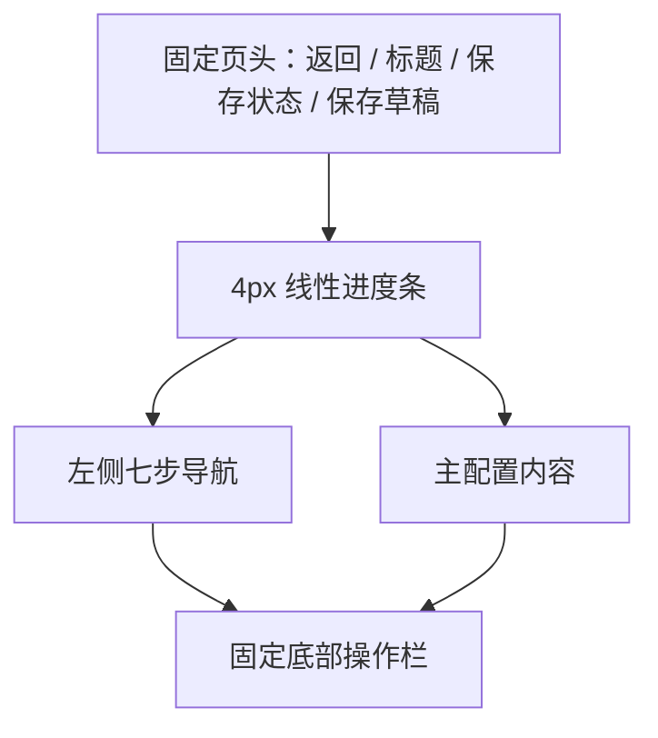

# 菜单下单限制「新增数量与频次规则」全屏页面设计

## 1. 背景

前厅管理中心的「菜单下单限制 → 数量与频次」目前在规则列表上通过大弹窗完成新增和编辑。现有弹窗包含 6 个步骤，能够承载基础原型，但随着规则扩展到人数、轮次、分类或菜品、门店范围以及超限授权，弹窗出现以下问题：

- 内容密度高，复杂数量矩阵和商品选择空间不足。
- 弹窗内继续打开区间编辑、复制场景等嵌套弹窗，层级较深。
- 用户难以感知草稿、发布和门店下发之间的状态边界。
- 关闭、取消、返回、保存的语义不统一，长流程容易丢失配置。
- 页面形态与营销中心屏保的新增、编辑和下发流程不一致。

本方案将「新增规则」改为页面级全屏流程，复用屏保的承载方式和视觉语言，同时为数量与频次规则建立适合复杂配置的七步向导。

本方案是 `2026-08-06-menu-order-quantity-frequency-limit-design.md` 的后台页面与交互补充，不改变其中已经确认的统一计算模型、十二种规则组合、按人数口径和三种服务员授权范围。

唯一明确覆盖旧方案的口径是区间连续性：本轮页面方案已经确认人数和轮次区间不得断档，因此本方案取代旧稿 §7.3 中「允许不连续」的描述。需要表达某段人数或轮次不限制时，仍建立连续区间，并显式执行「设为不限制」，而不是省略区间。

## 2. 目标

- 点击「新增规则」后进入完整、稳定、可恢复的全屏配置流程。
- 与屏保保持一致的页面级进入和退出方式、页头、进度反馈和视觉基线。
- 清晰承载规则类型、人数与轮次场景、数量矩阵、生效范围和授权配置。
- 支持自动保存、手动保存草稿、继续编辑、保存并下发和发布失败恢复。
- 让未配置、`0`、显式不限制、按人数乘数和多轮区间等容易误解的规则语义在页面上可见。
- 保证编辑正式规则时不会在发布前影响门店正在使用的版本。

## 3. 非目标

- 不改变数量与频次的服务端判定公式和规则冲突口径。
- 不将规则配置拆成七个独立浏览器页面。
- 不在本方案中重新设计规则列表、终端超限弹窗或服务员输密页面。
- 不把「频次」扩展为两次提交之间的秒级间隔限制。
- 不允许草稿保存等同于门店生效。

## 4. 已确认的产品口径

### 4.1 按人数限购

「按人数限购」表示按照订单有效用餐人数放大限额，不识别、绑定或追踪具体食客：

```text
实际限额 = 配置的人均上限 × 当前订单有效人数
```

页面统一使用文案「按人数限购」，并在选择项和数量配置页持续显示「人均上限 × 当前订单有效人数，不区分具体食客」。

### 4.2 数量编辑四态

| 编辑状态 | 语义 | 页面表现 |
| --- | --- | --- |
| 未配置 | 用户尚未确认该单元格 | 显示「未配置」，计入未完成并阻止发布 |
| 正整数 | 对应场景的有效配置上限 | 展示计算后的实际限额 |
| `0` | 明确禁止下单，但可按授权策略放行 | 输入框附近展示「禁止下单」 |
| 显式不限制 | 用户主动选择当前场景不限制 | 输入框附近展示「不限制」 |

### 4.3 服务员授权

超限后可按规则配置使用服务员密码临时放行，支持：

- 本次操作；
- 当前轮；
- 当前订单。

授权只覆盖当前规则、目标、订单及所选授权范围，不绕过售罄、停售、年龄、支付等其他限制。

## 5. 方案比较与结论

### 5.1 方案 A：全屏分步向导

列表保持内嵌；点击新增或编辑后，当前 iframe 提升为覆盖整个工作区的全屏流程。页面使用固定页头、线性进度、左侧七步导航、主配置区和固定底部操作栏。

优点：复杂内容空间充足，步骤和状态边界清晰，最符合屏保流程。缺点：需要新增页面级路由和全屏生命周期控制。

### 5.2 方案 B：全屏长表单

所有配置在同一页面纵向展开，左侧只提供锚点导航。

优点：自由浏览。缺点：前后依赖不明显，校验分散，容易漏填或误改下游配置。

### 5.3 方案 C：继续使用大弹窗

保留当前实现，仅放大弹窗并调整布局。

优点：实现改动少。缺点：嵌套弹窗和空间限制仍存在，也无法与屏保形成一致的页面级体验。

### 5.4 结论

采用方案 A。它保留屏保「列表内嵌、流程全屏、返回列表退出全屏」的承载逻辑，同时为七步复杂配置提供稳定空间。

## 6. 页面承载与路由

### 6.1 页面级流程


### 6.2 全屏生命周期

- 规则列表继续显示在前厅管理中心主内容区，侧边栏和顶部栏可见。
- 规则列表使用稳定路径 `order-limit.html`；新增和编辑使用独立路径 `order-limit-rule-editor.html?draftId=...`，不在列表页内部只切换 DOM 状态。
- 门店选择和发布确认分别使用 `order-limit-store-select.html?draftId=...` 与 `order-limit-publish-confirm.html?draftId=...`。
- `order-limit-rule-editor.html`、`order-limit-store-select.html` 和 `order-limit-publish-confirm.html` 共同组成明确的全屏路径集合；iframe 加载其中任一路径时，父应用都将同源 iframe 提升到整个浏览器视口上方。
- 选择门店和发布确认继续沿用同一个全屏状态；即使直接刷新或深链接进入这两个页面，也会主动恢复全屏。
- 只有 iframe 重新加载 `order-limit.html` 时才退出全屏。
- 地址读取失败时保持当前全屏状态，避免流程中途错误退出。
- 重复进入或退出必须幂等，不累积样式或监听器。

父应用沿用屏保的 pathname 驱动方式：监听同源 iframe 的 `load`，把上述三个全屏路径都识别为「进入全屏」，把 `order-limit.html` 识别为「退出全屏」，只有未来新增且尚未识别的中间路径才保持当前状态。刷新编辑器或中间发布页时，iframe `load` 后可根据当前 pathname 恢复全屏；浏览器前进、后退同样由新页面加载重新计算。父应用不读取 `draftId` 或规则业务数据。

如果正式应用改为单页路由且导航不触发 iframe `load`，则由 iframe 在每次路由提交后向同源父页发送等价事件；编辑器、门店选择和发布确认页面初始化时都发送 `enter-fullscreen`：

```ts
type OrderLimitFullscreenMessage = {
  source: "order-limit";
  type: "enter-fullscreen" | "exit-fullscreen";
  pathname: string;
};
```

父页只接受来自当前菜单下单限制 iframe、同源且 `source === "order-limit"` 的消息。pathname 和消息两种机制只选一种作为正式实现主路径，静态原型优先使用 pathname 和 `load` 监听。

### 6.3 编辑器形态

七个配置步骤在同一个规则编辑器页面中通过状态机切换，不为每一步重新加载页面。这样可保留表单状态、滚动位置、错误定位和自动保存上下文。

新增和编辑复用同一编辑器：

- 新增：首次进入立即创建草稿 ID。
- 编辑草稿：继续更新原草稿。
- 编辑正式规则：基于当前正式版本创建新草稿版本；发布前门店仍使用旧正式版本。

## 7. 页面结构



### 7.1 页头

- 左侧为 48px 返回按钮和页面标题「新增数量与频次规则」或「编辑数量与频次规则」。
- 标题下方或右侧显示「保存中」「草稿已保存 · 刚刚」「保存失败」等状态。
- 第 1–6 步右侧固定显示「保存草稿」。
- 第 7 步将保存操作集中到底部，页头不重复显示保存按钮。
- 页头下方显示 4px 蓝色线性进度条，宽度为当前步骤数除以七。

### 7.2 步骤导航

桌面端在内容区左侧展示七步垂直导航：

1. 规则类型；
2. 商品范围；
3. 场景配置；
4. 限购数量；
5. 生效范围；
6. 超限授权；
7. 确认发布。

当前步骤使用蓝色浅底和实心蓝色序号；已完成步骤显示完成状态并可点击返回；未解锁步骤不可点击。存在错误的步骤显示红色错误标记，点击后定位到该步骤首个错误字段。

### 7.3 主内容区

- 桌面端最大整体宽度约 1180px。
- 左侧导航约 216px，主配置区自适应。
- 主配置区只保留一个主要白色内容面，不使用卡片层层嵌套。
- 分组主要通过 24–32px 留白、标题和细分隔线区分。
- 进入新步骤后，页面滚动到配置区顶部并将焦点移到步骤标题。

### 7.4 底部操作栏

- 始终固定在编辑器底部，并与当前 iframe 全屏边界一致。
- 第一步隐藏「上一步」，仅显示「下一步」。
- 第 2–6 步显示「上一步 / 下一步」。
- 第 7 步显示「上一步 / 保存草稿并返回 / 保存并下发」。
- 不设置独立「取消」按钮；退出统一通过左上角返回。

## 8. 七步配置设计

### 8.1 第一步：规则类型

页面用三个互相独立的选项组确定规则的三维组合。

#### 限购主体

- 按订单限购：整桌共享配置上限。
- 按人数限购：人均上限乘当前订单有效人数，不区分具体食客。

#### 统计周期

- 每轮：每轮使用相同上限并重新累计。
- 多轮：不同轮次区间可以配置不同上限，每轮仍独立累计。
- 与轮次无关：订单全部轮次累计。

#### 限购对象

- 按分类限购：分类内全部菜品共享数量池。
- 按菜品限购：每个指定菜品独立累计。

选择完成后在页面底部实时展示规则预览，例如「按人数 × 多轮 × 按分类限购」。

修改任一维度时，如果会使后续商品范围、场景或数量配置失效，必须先展示受影响内容，确认后才重置。

### 8.2 第二步：基础信息与商品范围

#### 基础信息

- 规则名称：必填，用于列表和审计识别。
- 规则说明：选填，仅后台可见。

#### 商品范围

- 本步骤严格沿用原有商品配置结构，不增加适用门店、产线勾选、适用菜单、订单类型或其他业务范围字段。
- 商品选择器直接嵌入页面，复用既有 `BrandMenuStructurePicker` 和 `structureByLine` 数据，不使用新增抽屉或另一套商品数据源。
- 产线沿用既有 `Kiosk / eMenu / SDI`，由商品树第一列切换，不额外显示产线多选字段。
- 「按分类」时展示「产线 → 组 → 类」，叶子节点停在分类。
- 「按菜品」时展示「产线 → 组 → 类 → 菜」，叶子节点停在菜品。
- 各产线已选择的分类或菜品直接推导后续数量配置中的产线 Tab 和目标项；切换产线只切换当前查看范围，不清空其他产线选择。
- 第二步只校验规则名称和至少一个有效商品目标；规则说明选填。

### 8.3 第三步：人数与轮次场景

所有规则均允许按人数区间设置不同配置：

- 按订单规则：人数区间决定整桌上限。
- 按人数规则：人数区间决定人均上限，之后再乘有效人数。

只有「多轮」规则额外展示轮次区间；「每轮」和「与轮次无关」不展示轮次区间编辑。

场景结构：

```text
每轮或与轮次无关：人数区间
多轮：人数区间 × 轮次区间
```

区间端点均为闭区间，必须从第一个有效值连续覆盖到「及以上」。页面实时检查区间重叠、断档和倒置。需要表达某个区间不限制时，保留该区间并显式执行「设为不限制」。

### 8.4 第四步：限购数量

本步骤沿用「场景条＋产线 Tab」结构：先选择当前人数和轮次场景，再选择产线，最后按分类或菜品展示数量表格。

- 分类规则每个分类填写一个数量，同分类全部菜品共享。
- 菜品规则每个菜品填写独立数量。
- 支持对当前产线批量设置数量。
- 可将当前场景配置复制到其他场景，但复制前展示目标场景和覆盖影响。
- 场景条和产线 Tab 均展示已配置数量与完成度，未完成项可直接定位。
- `0` 显示「禁止下单」；显式点击「设为不限制」后显示「不限制」；普通空输入显示「未配置」。
- 按人数规则实时展示示例人数对应的实际限额。
- 页面示例必须强调分类内相同或不同菜品都占用同一个数量池。

删除人数或轮次场景时，如果已有数量配置，先展示将删除的配置数量并要求确认。

#### 配置状态与完成度

每个数量单元格同时保存值与是否已确认的状态，避免把「尚未填写」和「明确不限制」都解释为空值：

| 单元格状态 | 存储语义 | 是否计入已完成 |
| --- | --- | --- |
| 未触达 | 尚未配置 | 否 |
| 已确认正整数 | 配置上限 | 是 |
| 已确认 `0` | 明确禁止 | 是 |
| 已确认「不限制」 | 当前场景不限制 | 是 |

页面提供显式「设为不限制」操作。用户清空数字输入时先恢复为「未触达」，不能自动视为已确认不限制。批量设置同样支持正整数、`0` 和「不限制」。

场景条和产线 Tab 的完成度分母为当前范围内全部目标单元格，分子为已确认的正整数、`0` 或「不限制」单元格。全 `0` 的禁售场景和全「不限制」场景都可以达到 100%。发布时不要求至少一个值大于 `0`，但要求所有目标单元格都已明确确认，不能存在未触达状态。

#### 按产线存储

「产线 Tab」代表真实的产线差异配置，而不只是前端筛选视图。本方案补充既有 DTO：每个数量项必须带 `productLineId`，唯一键为「场景 × 产线 × 目标」。

```ts
type OrderLimitSceneLimit = {
  productLineId: string;
  targetId: string;
  value: number | null;
  configured: boolean;
};
```

- `value > 0` 表示配置上限。
- `value === 0` 表示明确禁止。
- `value === null && configured === true` 表示已确认不限制。
- `configured === false` 只用于草稿的未触达状态，正式版本不得包含。

`productLineId` 必须属于第二步 `structureByLine` 中实际选中商品的产线集合，该集合由商品结构自动推导，不单独维护 `productLines` 表单字段。服务端判定时先匹配当前产线，再读取同一 `targetId` 的数量；冲突检测增加产线交集维度。旧数据迁移时，如果旧规则只有一条数量值，则为该规则每个已有商品结构产线复制一条相同值并导入为草稿，用户复核后才能发布。

### 8.5 第五步：生效范围

配置以下条件：

- 全天或指定营业时段；
- 会员范围。
- 生效日期区间和星期。
- 儿童是否计入有效人数，默认继承门店全局配置。

商品适用产线由第二步商品结构选择结果推导。实际发布门店仅在最后的下发流程选择，不在商品配置步骤重复维护。

### 8.6 第六步：超限授权

首先设置是否允许服务员密码授权。

关闭时：

- 超限后硬性拒绝；
- 隐藏授权范围、默认范围、权限和原因字段。

开启时：

- 分别启用「本次操作」「当前轮」「当前订单」。
- 每种范围配置所需角色或权限。
- 选择一个已启用范围作为默认授权范围。
- 配置授权原因是否必填。

三个范围必须持续展示简短有效期说明：

| 范围 | 页面说明 |
| --- | --- |
| 本次操作 | 仅放行当前这一次数量变更 |
| 当前轮 | 当前轮内相同规则和目标无需重复输密 |
| 当前订单 | 关单前相同规则和目标持续放行 |

### 8.7 第七步：确认与发布

汇总展示：

- 规则名称和计算方式；
- 分类或菜品目标；
- 人数与轮次数量矩阵；
- 商品结构推导出的产线，以及日期、星期、时段、会员范围和儿童计数策略；
- 超限授权范围、默认范围、权限和原因要求；
- 商品结构推导出的影响产线；实际影响门店只在后续发布确认页汇总；
- 与其他规则叠加后的最小有效额度提示。

进入本步骤时执行发布前预校验，点击「保存并下发」时执行服务端完整校验。通过后保存草稿并进入门店选择；失败时留在当前页，并可点击错误跳回对应步骤。

## 9. 按钮和导航交互

### 9.1 下一步

- 默认可点击，点击后才触发当前步骤校验。
- 校验失败时不切换步骤，滚动并聚焦首个错误字段。
- 请求处理中显示加载状态并禁止重复点击。

不长期禁用「下一步」，避免用户无法判断当前缺少什么。

### 9.2 上一步

- 返回前一步但不跳过自动保存。
- 已填写内容和当前选择保持不变。
- 第一步不显示该按钮，不保留空白占位。

### 9.3 保存草稿

- 手动保存会立即提交当前可序列化内容，即使当前步骤尚未通过发布校验。
- 保存成功显示时间；保存失败显示常驻错误和「重试保存」。
- 保存草稿不下发、不生成正式版本、不影响门店。
- 第 1–6 步页头按钮文案为「保存草稿」，保存成功后停留在当前步骤。
- 第 7 步次要按钮文案为「保存草稿并返回」，保存成功后返回规则列表。

### 9.4 保存并下发

- 仅在第七步展示为唯一高强调主按钮。
- 点击后执行完整校验并保存草稿快照。
- 校验通过后进入门店选择和发布确认。
- 发布确认成功后生成不可变正式版本，并返回规则列表。

### 9.5 返回和浏览器历史

左上角返回与浏览器返回键使用相同逻辑：

- 当前内容已保存：提示「当前内容已保存为草稿」，提供「继续编辑 / 保存并返回」。
- 存在未保存内容：先尝试保存；成功后允许返回。
- 保存失败：禁止退出，提供「重试保存」，避免误认为内容已保存。

`Esc` 只关闭当前确认弹窗，不退出整个新增流程。

## 10. 草稿与版本状态

### 10.1 自动保存

- 首次进入新建页立即创建草稿 ID。
- 字段变更停止约 800–1000ms 后自动保存。
- 步骤切换、打开下发和点击返回前立即尝试保存。
- 自动保存只保存草稿，不执行发布级冲突校验。

### 10.2 恢复

- 刷新或异常关闭后再次进入同一草稿时恢复最近一次服务端保存内容。
- 浏览器内未同步内容可用于故障恢复，但必须标记为「待同步」，不能显示「已保存」。
- 规则列表对未完成草稿显示「继续编辑」。

### 10.3 并发编辑

草稿保存使用版本号或 ETag。发现其他账号或窗口已更新草稿时停止覆盖，并提供：

- 加载最新版本；
- 查看差异并将本地修改合并到最新版本。

同一正式规则只允许一个进行中的草稿。冲突处理始终更新同一草稿实体，不提供另存为第二个活动草稿，也不提供无提示强制覆盖。

## 11. 校验与异常处理

### 11.1 分步校验

- 错误显示在字段下方，并同步到左侧步骤导航。
- 当前步骤校验失败不影响草稿保存。
- 修复后实时清除对应错误标记。

### 11.2 发布前校验

至少检查：

- 三个规则类型维度完整。
- 规则名称和商品目标有效。
- 人数和轮次区间连续覆盖到「及以上」、无重叠、无倒置。
- 每个「场景 × 产线 × 目标」单元格均已明确配置为正整数、`0` 或「不限制」，不存在未触达状态。
- 商品结构、时间、星期、会员和儿童计数策略完整。
- 授权默认范围属于已启用范围。
- 每个已启用授权范围存在有效权限。
- 商品、分类和角色仍然存在。
- 同型规则不存在禁止发布的范围冲突。

### 11.3 依赖项失效

- 商品或分类被删除、停售或移出菜单时，在确认页标记异常目标并阻止发布。
- 授权角色被删除时阻止发布并定位第六步。
- 门店不可用时从可发布门店中移除，并要求用户重新确认。

### 11.4 发布失败

- 发布必须保持版本原子性。
- 部分门店失败时不形成新旧混合版本。
- 所有门店继续使用上一完整版本。
- 页面保留当前草稿、错误门店和失败原因，允许重试下发。

### 11.5 页面级失败与空状态

| 场景 | 页面处理 |
| --- | --- |
| 首次创建草稿失败 | 不进入可编辑状态，展示重试和返回列表；不得仅在浏览器生成伪草稿 ID |
| 草稿加载失败 | 保留全屏错误页，提供重新加载和返回列表 |
| 草稿不存在或已归档 | 说明当前草稿不可继续编辑，并返回规则列表 |
| 无查看或编辑权限 | 展示无权限状态，不渲染规则内容，不允许读取本地恢复副本 |
| 网络中断 | 保留当前输入作为待同步恢复副本，页头显示离线，不能标记为已保存、不能进入下发 |
| 无可选商品或分类 | 商品选择器显示空状态和菜单维护入口 |
| 无可用门店 | 门店选择区域显示空状态和门店维护入口，阻止下一步或下发 |
| 无可用授权角色 | 第六步显示空状态和角色权限维护入口；开启授权时阻止下一步 |

页面从离线恢复后先比较草稿版本，再决定自动同步或进入并发差异处理，不能直接覆盖服务端新版本。

## 12. 视觉规范

### 12.1 颜色与表面

- 页面背景：`#F5F6F7`。
- 主要表面：白色。
- 主色：`#1677FF`。
- 主文字：`rgba(0,0,0,0.88)`。
- 次要文字：`rgba(0,0,0,0.65)`。
- 弱提示：`rgba(0,0,0,0.45)`。
- 常规边框：`#F0F0F0`。
- 输入边框：`#D9D9D9`。

错误、警告、成功颜色仅用于对应状态，不用于装饰。

### 12.2 尺寸

- 页头约 80px 高，左右内边距 24px。
- 页头和表单主要按钮高 48px、圆角 12px。
- 内容主表面圆角 16px。
- 字段组间距 24–32px。

### 12.3 字体层级

- 页面和步骤标题：20px。
- 分组标题：16px。
- 字段标签和正文：14px。
- 辅助说明：12–14px。

### 12.4 选项和表格

- 选项使用白底细边框；选中状态使用蓝色边框、浅蓝底和勾选状态。
- 不使用表情符号作为规则类型图标。
- 数量矩阵使用浅灰表头和横向分隔线，避免密集竖线。
- 页面不使用大面积渐变、重阴影或多层卡片嵌套。

### 12.5 动效

- 步骤切换和保存状态使用 150–200ms 过渡。
- 不使用循环动画或大幅位移动画。
- 尊重系统减少动态效果设置。

## 13. 响应式与可访问性

- 宽屏保持左侧导航和右侧内容布局。
- 小于约 1024px 时缩小导航宽度和内容边距。
- 小屏时步骤导航切换为顶部七个数字节点，当前步骤标题在内容区完整展示。
- 双列字段改为单列，表格必要时在自身容器内横向滚动。
- 底部操作栏保持固定，按钮不能被系统底部区域遮挡。
- 所有控件具有可见标签、键盘焦点和错误关联。
- 步骤切换后焦点进入步骤标题。
- 颜色不作为唯一状态表达，完成、错误和选中状态同时使用文字或图形标记。

## 14. 与屏保流程的对齐和差异

| 维度 | 屏保 | 数量与频次规则 |
| --- | --- | --- |
| 列表 | 主内容区内嵌 | 主内容区内嵌 |
| 新增或编辑 | 进入全屏 | 进入全屏 |
| 全屏结束 | 返回屏保列表 | 返回规则列表 |
| 页头 | 返回、标题、主操作、进度线 | 返回、标题、保存状态、保存草稿、进度线 |
| 表单宽度 | 居中单内容区 | 左侧步骤导航＋主内容区 |
| 配置步骤 | 创建后进入下发三步 | 七步配置后进入门店选择和发布确认 |
| 草稿 | 保存主题草稿 | 自动保存和手动保存规则草稿 |

本方案复用屏保的页面承载和视觉语言，不机械复制其单页表单布局。

## 15. 建议实现边界

原型和正式实现均建议保持以下职责：

- 规则列表负责展示、筛选、新增入口、继续编辑和状态操作。
- 规则编辑器负责七步表单、草稿、分步校验和发布前预览。
- 商品选择器负责产线、组、分类和菜品的原位选择；每次勾选即时更新 `structureByLine`，不增加临时选择层或二次确认。
- 下发流程负责选择实际门店、完整发布校验和正式版本创建。
- 父应用只负责 iframe 全屏生命周期，不读取或修改规则业务数据。

静态原型可以新增独立规则编辑页并复用现有商品结构选择组件；正式应用应使用稳定路由和服务端草稿 ID，不以 localStorage 作为真实规则存储。

## 16. 验收标准

1. 规则列表保持前厅管理中心内嵌布局。
2. 点击「新增规则」后页面覆盖整个视口，侧边栏和顶部栏被遮盖。
3. 七步配置、门店选择和发布确认期间持续全屏。
4. 返回规则列表后恢复普通内嵌布局。
5. 新建页进入后立即生成草稿，字段修改可自动保存。
6. 左上角返回能够保存草稿并确认后返回列表。
7. 刷新后可以恢复最近一次已保存草稿。
8. 已完成步骤可返回，未完成步骤不可跳转。
9. 修改前置配置时能够明确提示并重置受影响的下游内容。
10. 七个步骤的条件展示符合本方案；第二步只包含基础信息和原有商品结构选择器，第四步包含场景条、由商品结构推导的产线 Tab、批量设置、复制和完成度提示。
11. 按人数限购始终表达为人数乘数，不出现具体食客选择。
12. 未配置、`0` 和显式「不限制」在数量配置中具有不同且可见的语义。
13. 第六步支持本次操作、当前轮和当前订单三种授权范围。
14. 第七步同时支持「保存草稿并返回」和「保存并下发」。
15. 保存草稿不会影响门店正式规则。
16. 编辑正式规则时，发布前门店继续使用旧版本。
17. 发布冲突和依赖项失效能够定位到对应步骤。
18. 部分门店发布失败时不形成混合版本。
19. 页面视觉与屏保新增页在页头、背景、控件和进度反馈上保持一致。
20. 桌面和小屏布局均无内容遮挡，键盘可完成核心流程。
21. 人数和轮次区间连续覆盖到「及以上」，不限制区间通过显式「设为不限制」表达。
22. 首次创建或加载草稿失败、无权限、离线及商品、门店、角色空状态均符合本方案。
23. 全屏流程使用稳定独立路径或等价的受校验同源事件，刷新、前进和后退均能恢复正确状态。
24. 不同产线的数量配置可独立持久化、判定和冲突检查。
25. 正整数、`0` 和显式「不限制」均计入完成度，未触达单元格不能发布。

## 17. 后续工作

本设计确认后，实施计划需覆盖：

1. 将现有新增和编辑弹窗迁移为独立规则编辑页面。
2. 为菜单下单限制 iframe 增加与屏保一致的全屏生命周期控制。
3. 将现有六步原型调整为本方案七步状态机。
4. 接入服务端草稿、版本、冲突和发布接口。
5. 原样复用既有 `BrandMenuStructurePicker`，仅调整其页面承载位置；门店选择继续沿用下发流程。
6. 补充单元测试、集成测试、浏览器流程测试和响应式视觉回归。
