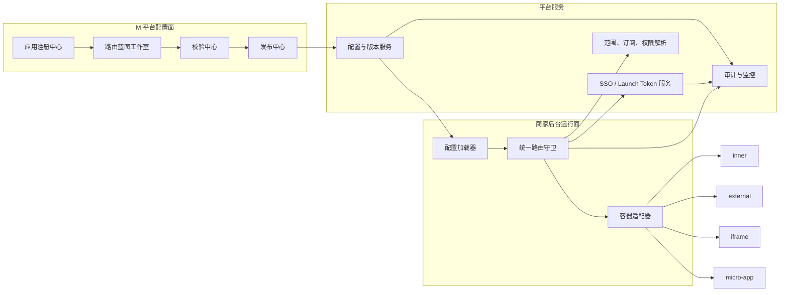

# 可视化路由配置平台设计

> 状态：已确认  
> 日期：2026-08-14  
> 配置端：M 平台  
> 消费端：商家后台  
> 方案：应用注册中心 + 路由蓝图工作室 + 版本化发布运行时

## 1. 背景

其他项目新增功能页面后，目前需要通过代码修改或手工维护菜单 JSON，才能在商家后台中打开。用户提供的样例文件表达了现有菜单结构及四类页面接入方式：

- `inner`：商家后台内建页面；
- `external`：外部链接；
- `iframe`：iframe 嵌入页面；
- `micro-app`：微前端页面，包含应用地址、路由模式和默认页面等配置。

样例同时包含多语言、图标、三级树、服务订阅和功能权限等字段。按字段扫描，样例约有 91 个菜单节点、25 个显式类型字段和 15 个访问控制块；其中 `micro-app` 20 个、`inner` 2 个、`external` 2 个、`iframe` 1 个。

样例不能作为新系统的直接存储模型，原因包括：

- 文本存在乱码和缺失引号，无法通过严格 JSON 解析；
- 存在 5 组重复 `id`、3 组重复 `key` 和多组重复 `path`；
- 子节点经常省略 `type` 和 `microAppConfig`，依赖隐式继承；
- 应用级地址、鉴权、可信来源与菜单级展示字段混在同一棵树中；
- 修改一处应用接入信息时，可能需要同步修改多个菜单节点；
- 缺少草稿、校验、发布版本、灰度、回滚和运行监控语义。

新系统仅参考样例的业务结构，不负责导入或迁移该旧 JSON。

## 2. 已确认的产品决策

1. 支持 `inner`、`external`、`iframe`、`micro-app` 四种类型。
2. M 平台统一配置，并按业态、产品线或商家范围发布到商家后台。
3. 页面打开时提供无感单点登录，并传递商家、品牌、门店和语言上下文。
4. 路由可见和可访问条件由“发布范围、服务订阅、功能权限”三道门共同决定。
5. `inner` 只能选择商家后台代码中已注册的本地页面，不支持动态上传前端代码。
6. `micro-app` 同时支持 iframe 隔离容器和非隔离微前端容器。
7. 新系统采用新版强类型模型，不兼容旧文件导入。
8. 使用“应用注册中心 + 路由蓝图工作室”两阶段模型，而不是在每个菜单节点重复填写项目地址与鉴权配置。

## 3. 目标

- 让其他项目先注册应用和页面，再由 M 平台在可视化菜单树中引用。
- 让非开发人员完成菜单层级、名称、图标、路径、权限、范围和排序配置。
- 在发布前发现路径冲突、页面不可达、SSO 失败、iframe 拒绝嵌入和微前端契约不兼容。
- 让商家后台只消费经过校验的不可变发布快照。
- 对菜单可见和直接 URL 访问使用同一套路由守卫。
- 支持指定商家验证、分阶段灰度、停止扩量和快速回滚。
- 页面或配置服务故障时保持商家后台 Shell 可用。
- 完整记录应用、菜单、权限、发布、回滚和运行异常审计。

## 4. 非目标

- 不允许在 M 平台上传任意前端构建产物并作为 `inner` 页面执行。
- 不在第一版建设第三方开发者市场、插件计费或外部团队自助审核门户。
- 不允许商家自行修改 M 平台下发的菜单结构和页面接入协议。
- 不将页面业务权限完全交给菜单隐藏；目标应用仍需执行自身服务端授权。
- 不将长期访问令牌、客户端密钥或商家敏感上下文保存到路由 JSON。
- 不迁移或自动发布用户提供的旧 JSON。
- 不把非隔离微前端当作第三方代码的安全沙箱。

## 5. 总体架构



### 5.1 配置面

- **应用注册中心**负责“接入哪个项目”，维护环境、公共地址、SSO、可信域名、健康检查、容器能力和负责人。
- **路由蓝图工作室**负责“菜单放在哪里”，维护 L1～L3 菜单树、页面引用、商家路径、图标、排序和访问条件。
- **校验中心**执行结构、路径、权限、网络、安全和容器契约预检。
- **发布中心**生成不可变版本快照，并控制范围、灰度、暂停和回滚。

### 5.2 运行面

- **配置加载器**按商家身份获取活动快照，并保留最近一次成功版本缓存。
- **统一路由守卫**同时应用发布范围、服务订阅和功能权限。
- **SSO 服务**在访问发生时签发短时、限定受众、单次使用的启动凭证。
- **容器适配器**根据已解析页面类型选择本地页面、新窗口、iframe 或微前端容器。

### 5.3 核心边界

- 菜单节点只引用 `applicationId + pageId`，不重复保存项目根地址、客户端密钥和可信域名。
- 应用和页面修改先形成新的应用修订版；已发布路由快照不会被后续编辑原地改变。
- 商家后台不读取草稿，只读取已发布且带完整解析目标的快照。
- 配置系统决定“是否展示、用什么方式打开”；目标应用后端决定“用户能否执行具体业务操作”。

## 6. 核心数据模型

### 6.1 应用与环境

```ts
type EnvironmentName = "development" | "staging" | "production";
type RoutePageType = "inner" | "external" | "iframe" | "micro-app";
type MicroContainerMode = "iframe" | "native";
type RouteMode = "history" | "hash";

interface ApplicationDefinition {
  id: string;
  slug: string;
  name: string;
  ownerTeam: string;
  ownerContact: string;
  status: "draft" | "active" | "suspended";
  trustLevel: "built-in" | "first-party" | "partner";
  supportedContainers: Array<"external" | "iframe" | "micro-iframe" | "micro-native">;
  contextProtocol: "menusifu-context/v1";
  ssoProfileId: string;
  environments: Record<EnvironmentName, ApplicationEnvironment>;
  revision: number;
}

interface SsoProfile {
  id: string;
  revision: number;
  status: "active" | "suspended";
  protocol: "launch-code-v1";
  audience: string;
  exchangeEndpoint: string;
  clientAuthSecretRef: string;
  signingKeyRef: string;
  codeTtlSeconds: number;
  contextClaims: Array<"subjectId" | "merchantId" | "brandId" | "storeId" | "locale">;
}

interface ApplicationEnvironment {
  baseUrl?: string;
  manifestUrl?: string;
  healthCheckUrl?: string;
  allowedOrigins: string[];
  frameAncestorsExpectation?: string[];
}
```

约束：

- `slug` 在企业配置域内唯一。
- 正式环境远程地址必须为 HTTPS。
- `micro-native` 只允许 `built-in` 或通过安全评审的 `first-party` 应用。
- 密钥、私钥和长期令牌只存放在服务端密钥系统，不能出现在该模型中。
- 编辑活动应用时生成新 `revision`，已发布快照继续引用原修订版。

### 6.2 应用页面

```ts
interface AppPageDefinition {
  id: string;
  applicationId: string;
  key: string;
  type: RoutePageType;
  title: LocalizedText;
  status: "draft" | "active" | "suspended";
  revision: number;

  innerRegistryKey?: string;
  relativePath?: string;
  externalOpenMode?: "current" | "new";
  routeMode?: RouteMode;
  defaultPage?: string;

  defaultContainerMode?: MicroContainerMode;
  supportedContainerModes?: MicroContainerMode[];
  defaultSandboxProfileId?: string;
  allowedSandboxProfileIds?: string[];
  microFrontendContractId?: string;
  fallback?: "none" | "external" | "iframe";
}

interface LocalizedText {
  "zh-CN": string;
  "zh-HK"?: string;
  "en-US": string;
}
```

页面定义表达项目内的可挂载页面。远程页面只保存相对路径，根地址来自对应环境的应用修订版。编辑活动页面时生成新 `revision`；`suspended` 页面不能进入新发布，但已发布快照仍保留其历史解析信息，紧急吊销由运行时应用状态门控处理。

### 6.3 路由节点

```ts
interface RouteNode {
  id: string;
  key: string;
  parentId: string | null;
  level: 1 | 2 | 3;
  sortOrder: number;

  title: LocalizedText;
  icon: RouteIcon;
  merchantPath: string;
  enabled: boolean;

  pageRef?: {
    applicationId: string;
    pageId: string;
    containerMode?: MicroContainerMode;
    externalOpenMode?: "current" | "new";
    sandboxProfileId?: string;
  };
  defaultChildId?: string;
  accessPolicy: RouteAccessPolicy;
}

type RouteIcon =
  | { kind: "builtin"; name: string }
  | { kind: "asset"; assetId: string };

interface RouteAccessPolicy {
  serviceSubscriptions: {
    rule: "all" | "any";
    values: string[];
  };
  functionalPermissions: {
    rule: "all" | "any";
    values: string[];
  };
}
```

约束：

- `id` 由系统生成且永不复用。
- `key` 在企业发布域内唯一；`merchantPath` 在同一发布快照内唯一。
- 树最多三层，禁止循环父子关系。
- 纯分组节点可以没有 `pageRef`，点击时只展开；如设置 `defaultChildId`，进入分组根路径时重定向到该子节点。
- 所有可点击页面节点必须有明确的 `pageRef`。
- `enabled=false` 表示节点被停用：菜单、搜索、面包屑和直接 URL 均不可访问。新模型不保留旧文件中“只隐藏菜单但仍可直达”的模糊 `display` 语义。
- `pageRef.externalOpenMode` 和 `pageRef.sandboxProfileId` 是节点级覆盖；未填写时分别使用页面默认值。覆盖值必须属于页面允许集合。
- 不再支持子节点隐式继承父节点的 `type` 或 `microAppConfig`。

### 6.4 发布快照

```ts
interface RouteReleaseSnapshot {
  id: string;
  blueprintId: string;
  version: number;
  schemaVersion: number;
  environment: EnvironmentName;
  createdAt: string;
  createdBy: string;
  checksum: string;
  nodes: ResolvedRouteNode[];
}

interface ResolvedRouteNode extends RouteNode {
  resolvedTarget?: {
    applicationRevision: number;
    pageRevision: number;
    ssoProfileId?: string;
    ssoProfileRevision?: number;
    pageType: RoutePageType;
    url?: string;
    innerRegistryKey?: string;
    externalOpenMode?: "current" | "new";
    routeMode?: RouteMode;
    defaultPage?: string;
    containerMode?: MicroContainerMode;
    allowedOrigins: string[];
    sandboxProfileId?: string;
    microFrontendContractId?: string;
    fallback: "none" | "external" | "iframe";
  };
}

interface ReleaseEligibilityScope {
  businessTypeIds: string[];
  productLineIds: string[];
  merchantAllowlist: string[];
  merchantDenylist: string[];
}

interface RouteReleaseAssignment {
  id: string;
  blueprintId: string;
  snapshotId: string;
  fallbackSnapshotId: string;
  priority: number;
  status: "scheduled" | "active" | "paused" | "completed" | "rolled-back";
  eligibility: ReleaseEligibilityScope;
  rolloutPercent: number;
  bucketSalt: string;
  activatedAt?: string;
}
```

快照不可变，且固定 `applicationRevision`、`pageRevision` 和远程页面使用的 `ssoProfileRevision`。运行时使用 `resolvedTarget`，不在页面打开时重新拼接可变草稿数据。发布范围和灰度百分比不写入快照，而由可审计、可更新的 `RouteReleaseAssignment` 管理；扩大灰度只更新 assignment，不生成或修改快照。首次发布没有上一业务快照时，`fallbackSnapshotId` 指向随商家后台发布的最小内建导航快照。

### 6.5 四类型字段矩阵

| 字段 | inner | external | iframe | micro-app |
|---|---|---|---|---|
| `innerRegistryKey` | 必填 | 禁止 | 禁止 | 禁止 |
| `relativePath` | 禁止 | 必填 | 必填 | 必填 |
| `externalOpenMode` | 禁止 | 必填 | 禁止 | 禁止 |
| `routeMode` / `defaultPage` | 禁止 | 禁止 | 禁止 | 必填 / 可选 |
| `supportedContainerModes` / `defaultContainerMode` | 禁止 | 禁止 | 禁止 | 必填 |
| `allowedSandboxProfileIds` | 禁止 | 禁止 | 至少一个 | 含 iframe 模式时至少一个 |
| `microFrontendContractId` | 禁止 | 禁止 | 禁止 | 含 native 模式时必填 |
| `fallback` | `none` | `none` | `none/external` | `none/external/iframe` |

发布 schema 对“禁止”字段执行拒绝而不是忽略，防止 UI、存储和运行时对同一数据产生不同解释。

## 7. 四种路由类型

### 7.1 `inner`

- 从只读本地页面注册表选择 `innerRegistryKey`。
- 注册表由商家后台构建产生，至少包含页面键、支持的 Shell 版本、标题和路由能力。
- 发布预检验证所选商家后台版本是否包含该页面。
- 不提供上传脚本、动态模块地址或任意组件名输入。

### 7.2 `external`

- 打开应用注册中心中的可信 HTTPS 页面。
- 支持当前窗口或新窗口，默认新窗口。
- 新窗口使用 `noopener`；是否发送 `referrer` 由应用安全策略确定，默认不发送敏感来源信息。
- 商家上下文不拼接为明文查询参数。平台先创建单次启动会话，再将不透明、短时、单次使用的 launch code 交给目标系统交换。
- 非可信域名不能发布；域名发生变化时必须产生应用新修订版并重新发布。

### 7.3 `iframe`

- 在商家后台工作区中使用受控 iframe 容器挂载。
- 应用级配置维护允许来源、CSP 预期、健康检查和默认 sandbox 策略。
- 页面级配置维护相对路径和必要能力；菜单节点只选择已审批的 sandbox profile。
- 父页等待子页发送 `ready`，校验 `event.source` 与精确 `origin` 后，再通过 `menusifu-context/v1` 发送短时启动会话和上下文。
- 允许事件限制为协议白名单，例如 `ready`、`navigate`、`resize`、`auth-expired`、`error`。
- `allow-scripts` 与 `allow-same-origin` 的组合只对经过评审的可信来源开放；合作方默认使用更严格隔离配置。

### 7.4 `micro-app`

`micro-app` 是同一业务类型下的两种容器适配方式。

#### iframe 隔离容器

- 复用 iframe 的安全、SSO 和通信协议。
- 额外支持 `history/hash`、应用基路径、默认页面和父子路由同步。
- 商家路径与子应用路径的映射由容器处理，子应用不能直接接管商家 Shell 的根路由。

#### 非隔离微前端容器

- 只允许内建或通过安全评审的一方应用。
- 应用提供签名入口清单和 `bootstrap`、`mount`、`updateContext`、`unmount` 生命周期。
- 容器校验入口清单签名、应用修订版和共享依赖契约。
- 使用 Shadow DOM、样式前缀或等价方案减少样式污染；该机制不是安全边界。
- 使用 Error Boundary 隔离渲染异常，卸载时必须清理事件、定时器、路由监听和全局副作用。
- 可为关键页面配置 iframe 备用容器；降级必须指向同一应用页面的已审批入口。

## 8. SSO 与上下文协议

### 8.1 上下文

启动上下文至少包括：

```ts
interface MerchantLaunchContext {
  subjectId: string;
  merchantId: string;
  brandId?: string;
  storeId?: string;
  locale: "zh-CN" | "zh-HK" | "en-US";
  routeNodeId: string;
  releaseVersion: number;
}
```

可选字段只在目标页面声明需要且当前用户有权访问时提供。不得为了方便把完整用户对象、全部门店列表或全部权限列表发送给每个应用。

### 8.2 启动流程

1. 用户点击菜单或直接访问商家路径。
2. 统一路由守卫基于当前活动快照执行范围、订阅和权限检查。
3. 商家后台向 BFF 请求目标页面的启动会话。
4. BFF 再次校验快照版本、节点、用户和上下文范围。
5. BFF 按应用的 `SsoProfile` 创建服务端 launch grant。grant 保存 `aud`、`sub`、租户上下文、`routeNodeId`、`releaseVersion`、短有效期、单次 `jti` 和未消费状态。
6. BFF 向商家前端只返回随机、不透明、短时且单次使用的 launch code；它不是 JWT，不包含可由浏览器解码的商家上下文。
7. 容器按页面类型传递凭证：
   - external：通过平台 launch endpoint 跳转，目标服务交换单次 code；
   - iframe：完成来源握手后通过 `postMessage` 发送单次 code；
   - micro-native：通过受控生命周期参数提供 token provider，而不是写全局变量；
   - inner：复用商家后台现有会话，不另发远程凭证。
8. 目标应用后端使用 `SsoProfile.clientAuthSecretRef` 对应的服务端身份调用交换端点。交换操作原子消费 code，校验 audience、有效期、目标应用和未消费状态，再返回限定受众的签名断言或建立目标应用的安全会话。
9. 目标应用继续执行自己的业务授权。浏览器端不能直接访问客户端密钥，也不能重复交换同一 code。

### 8.3 失败与刷新

- launch code 或目标应用会话过期时静默创建一次新的启动会话；再次失败进入统一重新认证流程。
- 禁止自动无限刷新。
- 目标应用返回 `auth-expired` 时，父页只对已注册来源响应。
- 凭证不能保存在 localStorage、路由配置或长期 URL 中。
- code 消费、过期、错误 audience、跨商家重放和重复交换均记入安全审计。

## 9. 权限与发布范围

节点的最终可见性和可访问性为：

```text
allowed = inReleaseTarget
       AND nodeEnabled
       AND serviceSubscriptionMatched
       AND functionalPermissionMatched
       AND applicationActive
       AND pageActive
```

规则：

- 三类门控之间始终使用 AND。
- `nodeEnabled` 来自发布快照中的 `RouteNode.enabled`；为 false 时菜单和直接 URL 都被拒绝。
- 服务列表和功能权限列表内部使用各自配置的 `all/any`；空列表表示该类别不增加限制。
- 菜单渲染、面包屑、搜索结果和直接路径访问共享同一决策函数。
- 前端隐藏只改善体验，BFF 和目标应用后端必须再次授权。
- 父节点在所有子节点都不可见且自身无可访问页面时自动隐藏。
- 用户无权限直接访问已知路径时返回统一 403 页面，不泄露远程应用地址和内部权限细节。
- `applicationActive` 和 `pageActive` 读取应用、页面稳定身份的当前紧急状态；配置内容仍来自快照固定的修订版。应用或页面被紧急暂停后立即阻止新的远程启动会话，但不会改写历史快照。

### 9.1 发布范围解析规则

`inReleaseTarget` 由活动 `RouteReleaseAssignment` 决定，规则固定如下：

1. 只考虑 `status=active` 且 `blueprintId` 匹配的 assignment。
2. `merchantDenylist` 优先级最高；命中后该 assignment 不匹配。
3. `merchantAllowlist` 非空时，商家必须在列表中；空数组表示不限制具体商家。
4. `businessTypeIds` 非空时必须匹配当前商家业态；空数组表示全部业态。
5. `productLineIds` 非空时必须与商家已开通产品线至少有一个交集；空数组表示全部产品线。
6. 商家、业态和产品线三个维度之间使用 AND。
7. 多个 assignment 同时匹配时选择 `priority` 最大者；校验中心禁止相同 `priority` 的匹配范围重叠。若仍出现非法并列，运行时拒绝新配置并使用最近一次成功解析结果。
8. 灰度桶固定为 `hash(merchantId + assignmentId + bucketSalt) mod 10000`。结果小于 `rolloutPercent * 100` 时使用 `snapshotId`，否则使用 `fallbackSnapshotId`。
9. 同一 assignment 扩大或缩小百分比时 `bucketSalt` 不变，保证已进入小比例批次的商家继续留在后续更大批次中。
10. 回滚把 assignment 的活动 `snapshotId` 切换为目标旧快照，并将操作写入审计；不得修改任一快照内容。

## 10. M 平台信息架构

```text
M 平台
└── 菜单路由配置
    ├── 应用注册中心
    ├── 路由蓝图工作室
    └── 发布与变更记录
```

### 10.1 应用注册中心

列表展示：应用名称、标识、环境、页面数、支持容器、负责人、健康状态、活动修订版和最近变更。

应用编辑页分为：

1. 基础信息；
2. 环境与可信域名；
3. SSO 与上下文协议；
4. 页面清单；
5. iframe sandbox profile；
6. 非隔离微前端契约；
7. 健康检查与审计。

### 10.2 路由蓝图工作室

桌面端采用三栏布局：

- **左栏：菜单结构**。展示 L1～L3 树、页面类型、拖拽排序、搜索和新增节点。
- **中栏：节点配置**。展示公共字段、应用/页面引用、类型动态字段和三类访问条件。
- **右栏：实时商家预览**。展示商家侧边栏、面包屑、页面容器和预检结果。

顶栏提供蓝图名称、草稿状态、变更记录、商家预览、保存草稿和发布。窄屏下三栏改为顺序步骤，不保留横向挤压布局。

### 10.3 节点编辑

- 新增节点时先选层级和“分组/页面”。
- 页面节点必须从应用页面选择器中选择，选择后自动确定四种页面类型。
- 只有 `micro-app` 页面显示容器模式选择；选择非隔离模式时立即展示信任等级与契约检查结果。
- 修改 `merchantPath` 时实时检查冲突和保留前缀。
- 删除父节点前展示将受影响的子树和商家范围，不允许静默级联删除。
- 拖拽只允许同级排序；跨父节点移动使用明确的“移动到”操作并再次校验路径和默认子节点。

### 10.4 预览

预览可以选择业态、产品线和测试商家。预览使用草稿数据，但必须明显标识“不会影响线上”，并分别展示：

- 当前节点是否被发布范围覆盖；
- 测试商家是否开通服务；
- 测试用户是否具有功能权限；
- 页面容器和目标地址解析结果；
- 应用健康与 SSO 握手结果。

## 11. 校验与发布

### 11.1 静态校验

- schema 版本受支持；
- `id`、`key`、`merchantPath` 满足唯一性规则；
- 路径格式合法且不使用保留前缀；
- 层级不超过 L3、无循环、默认子节点属于直接子级；
- 页面节点引用存在且状态允许发布；
- `innerRegistryKey` 存在于目标商家后台版本；
- 服务订阅键和功能权限键可以被权限系统解析；
- 图标属于内建列表或经过审核的资源。

### 11.2 远程与安全校验

- 正式环境使用 HTTPS 和允许域名；
- 健康检查可达；
- external launch code 可以完成一次交换；
- iframe 未被 CSP `frame-ancestors` 或等价响应策略拒绝；
- iframe ready / context 握手成功且来源准确；
- micro-iframe 路由基路径和 `history/hash` 策略有效；
- micro-native 入口清单签名、修订版、生命周期和共享依赖契约有效；
- 配置的 fallback 目标已通过相同安全检查。

### 11.3 发布

1. 保存草稿。
2. 执行完整预检。
3. 展示结构、页面、权限和范围变更差异。
4. 选择发布范围和发布策略。
5. 生成不可变快照及 checksum。
6. 创建 `RouteReleaseAssignment`，其中 `snapshotId` 指向新快照，`fallbackSnapshotId` 指向当前稳定快照。
7. 先用商家白名单或小比例 `rolloutPercent` 激活 assignment。
8. 观察运行指标，人工或自动更新 assignment 的百分比；快照保持不变。
9. 达到全量条件后将目标范围扩至 100%。

默认灰度阶梯为“指定测试商家 → 小比例 → 中比例 → 全量”；具体比例和观察时长由发布中心配置，不写死在路由数据模型中。

### 11.4 回滚

- 回滚不修改旧快照，也不把旧 JSON 覆盖到新版本。
- 回滚只切换目标范围对应 assignment 的活动 `snapshotId`，或将其切到预先记录的 `fallbackSnapshotId`。
- 支持全部范围回滚和当前灰度批次回滚。
- 必须记录操作人、原因、前后版本、影响商家数和时间。
- 发布部分失败时保持上一完整版本，不允许商家读取混合版本。

## 12. 商家后台运行时

### 12.1 配置加载

1. Shell 登录完成后请求当前商家的活动路由快照。
2. 请求携带上次版本或 ETag；未变化时复用本地内存缓存。
3. 成功快照经过 checksum 或签名校验后成为“最近一次成功版本”。
4. 配置服务暂时不可用时使用最近一次成功版本，并上报缓存降级事件。
5. 从未成功获取快照时使用随商家后台构建发布的最小内建导航，不渲染未知远程页面。

### 12.2 路由解析

- 先对快照应用范围、订阅和功能权限过滤，再生成导航和路径索引。
- 路径匹配采用最长合法前缀，避免相似根路径互相吞并。
- 进入分组根路径时按 `defaultChildId` 规范化。
- 页面挂载前再次调用统一路由守卫，防止从地址栏绕过菜单过滤。
- 切换页面时先卸载上一个容器，再挂载新容器；卸载失败不能阻断 Shell 导航。

## 13. 异常与降级

| 类型或环节 | 异常 | 处理 |
|---|---|---|
| 配置加载 | 配置服务不可用 | 使用最近一次成功版本；无缓存时使用最小内建导航 |
| 快照 | checksum、签名或 schema 不合法 | 拒绝新快照，继续使用上一版本并告警 |
| 权限 | 直接访问不满足三道门 | 返回统一 403，不挂载目标页面 |
| `inner` | 页面注册项在当前 Shell 版本不存在 | 隐藏节点或展示“当前版本暂不支持”，不让 Shell 崩溃 |
| `external` | 域名不可信或 launch code 失败 | 阻止跳转，留在原页面并允许重试 |
| `iframe` | 拒绝嵌入、超时、握手失败 | 展示统一错误页，可重试；有审批的 external fallback 时允许安全打开 |
| `micro-app/iframe` | 子路由同步失败 | 保留容器，停止错误同步并展示刷新动作 |
| `micro-app/native` | manifest、mount 或依赖失败 | Error Boundary 卸载；有审批的 iframe fallback 时切换 |
| SSO | 凭证过期 | 静默刷新一次，仍失败则重新认证 |
| 发布 | 部分写入或扩量失败 | 不移动活动版本指针，继续使用上一完整版本 |

所有远程错误只显示用户可执行的操作，不向商家暴露内部 URL、令牌、堆栈、权限键或服务拓扑。

## 14. 接口边界

以下是逻辑接口，不规定最终网关前缀：

```http
GET    /route-applications
POST   /route-applications
GET    /route-applications/{applicationId}
PUT    /route-applications/{applicationId}
POST   /route-applications/{applicationId}/validate
POST   /route-applications/{applicationId}/revisions

GET    /route-blueprints/{blueprintId}/draft
PUT    /route-blueprints/{blueprintId}/draft
POST   /route-blueprints/{blueprintId}/validate
POST   /route-blueprints/{blueprintId}/preview
POST   /route-blueprints/{blueprintId}/releases
GET    /route-blueprints/{blueprintId}/releases
POST   /route-blueprints/{blueprintId}/releases/{version}/rollout
POST   /route-blueprints/{blueprintId}/releases/{version}/rollback

GET    /merchant-route-snapshots/current
POST   /route-launch-sessions
POST   /route-launch-sessions/exchange
GET    /route-audits
GET    /route-runtime-metrics
```

要求：

- 草稿更新使用版本号或 ETag 防止多人覆盖。
- 发布接口具备幂等键，重复请求不能生成多个相同版本。
- 商家快照接口只返回当前身份有权获得的目标版本，不接受客户端任意指定 merchantId。
- 启动会话接口只接受已发布快照中的节点，不能用任意 URL 请求签发凭证。
- 启动会话交换接口只允许已登记目标应用的服务端身份调用，并在同一事务中原子消费 launch code。
- rollout 更新使用 assignment 版本号或 ETag；并发扩量、暂停和回滚不能互相覆盖。
- 回滚和发布需要独立权限和强审计。

## 15. 存储建议

生产环境至少需要以下逻辑实体：

- `route_applications`：应用稳定身份和状态；
- `route_application_revisions`：不可变应用环境、SSO 与容器修订版；
- `route_app_pages`：应用页面身份；
- `route_app_page_revisions`：不可变页面配置；
- `route_blueprints`：蓝图稳定身份；
- `route_blueprint_drafts`：可编辑草稿与并发版本；
- `route_release_snapshots`：不可变已解析快照；
- `route_release_assignments`：可变但强审计的范围、优先级、活动快照、fallback、灰度百分比和稳定分桶盐；
- `route_audit_logs`：配置、发布、回滚和安全操作；
- `route_runtime_events`：加载、握手、mount、403 和降级事件。

快照应保存为服务端可查询的结构化记录加规范化 JSON；checksum 基于稳定字段顺序计算。

## 16. 安全要求

- 正式远程地址只允许 HTTPS。
- 应用可信域名必须精确匹配，不接受宽泛的公共后缀通配。
- iframe 使用最小 sandbox 权限和精确 `postMessage` origin。
- `message` 处理同时验证 `origin`、`source`、协议版本、消息类型和 request id。
- external 使用单次 launch code，不把长期 JWT 和商家上下文放入 URL。
- non-isolated micro-app 仅限高信任应用，并校验签名入口清单。
- 页面脚本不能读取其他应用密钥；SSO 密钥只在服务端。
- 配置编辑、应用激活、发布、停止扩量和回滚分别授权。
- 审计日志不能记录令牌、密钥和完整个人敏感数据。
- 应用被暂停时阻止新发布；紧急吊销可让运行守卫拒绝新的启动会话。

## 17. 可观测性

按应用、页面、版本、容器模式和发布批次观察：

- 快照获取成功率、缓存降级率和版本分布；
- 菜单守卫允许/拒绝数量及拒绝类别；
- launch session 创建和交换成功率；
- iframe ready 时间、握手成功率和加载超时率；
- micro-app manifest、mount、unmount 成功率；
- fallback 使用率；
- 路由页面可用率和前端异常数；
- 灰度批次相对基线的异常变化。

自动暂停扩量阈值由发布中心策略维护。系统不能仅因远程应用业务接口错误就自动回滚菜单版本，必须区分“路由配置错误”和“目标应用自身业务故障”。

## 18. 测试策略

### 18.1 模型和校验

- schema、唯一性、路径、层级、循环和默认子节点测试；
- 四种页面类型必填/禁用字段矩阵；
- 应用修订版和发布快照不可变测试；
- 权限 `all/any`、空条件和三道门 AND 组合测试；
- 发布目标范围和灰度分桶稳定性测试。

### 18.2 协议和安全

- launch code 单次使用、过期、受众和跨商家重放测试；
- iframe 错误 origin、错误 source、未知消息和超时测试；
- CSP、frame-ancestors、sandbox profile 和 external 域名测试；
- micro-native manifest 签名、依赖不兼容、mount/unmount 清理测试；
- 直接 URL 访问和菜单隐藏结果一致性测试。

### 18.3 端到端

每种类型至少覆盖：配置、预览、发布、商家显示、正常打开、无权限、SSO 过期、目标不可用、回滚后恢复。

还需覆盖：

- 中英繁三语；
- L1～L3 展开、排序和默认子节点；
- 指定商家、小比例灰度和全量；
- 配置服务断网后的最近成功快照；
- 浏览器刷新、前进、后退和深链访问；
- 桌面端和窄屏配置工作台。

## 19. 与当前仓库的衔接

当前仓库已经具备菜单路由配置原型，可复用以下基础：

- `src/config/nav-blueprint-store.ts`：已有草稿、发布快照、系统/自定义树和变更记录概念；
- `src/config/nav-blueprint-ui.ts`：已有菜单路由配置工作台入口；
- `src/config/nav-route-registry.ts`：可作为 `inner` 页面注册表的起点；
- 现有平台预设与导航蓝图同步链路：可继续承担业态、产品线和商家可见范围下发。

生产化时应扩展现有模型而不是再建一套平行菜单编辑器：

1. 将当前仅描述导航节点的自定义模型扩展为“应用页面引用 + 访问策略”。
2. 在菜单路由配置中增加应用注册中心，并让节点编辑器只选择已注册页面。
3. 将当前浏览器本地存储替换为服务端草稿、修订版和发布快照。
4. 保留当前系统页面注册表作为 `inner` 的只读数据源。
5. 在商家 Shell 增加配置加载器、统一路由守卫和四类容器适配器。
6. 平台预设继续控制“展示给谁”，路由蓝图控制“菜单结构与页面接入”。

该部分只说明衔接方向，具体文件拆分和任务顺序由后续实施计划确定。

## 20. 分阶段交付边界

### 阶段一：治理和基础运行时

- 应用注册中心、应用修订版和页面清单；
- 路由蓝图引用页面、强校验和服务端草稿；
- `inner`、`external`、普通 `iframe`；
- 三道门守卫、SSO launch session；
- 不可变快照、指定商家发布和回滚。

阶段一完成条件：

- `inner`、`external`、普通 `iframe` 分别通过配置、预览、指定商家发布、无感 SSO、无权限拒绝、异常降级和回滚端到端测试；
- 页面和应用修订版被固定到不可变快照；
- 范围解析、稳定分桶、三道门和 `enabled` 的模型测试全部通过；
- 配置服务断网时最近成功快照可用；
- 发布、回滚和 launch code 交换具备完整审计。

### 阶段二：微前端与灰度

- `micro-app/iframe` 路由同步；
- `micro-app/native` 签名清单、生命周期和依赖契约；
- iframe fallback；
- 分阶段灰度、自动暂停、运行指标和发布对比。

阶段二完成条件：

- micro-iframe 的 `history/hash`、默认页面和双向路由同步通过端到端测试；
- micro-native 的清单签名、生命周期、依赖不兼容、异常卸载和 iframe fallback 通过测试；
- 灰度扩大只更新 assignment，不改变快照 checksum；
- 小比例到全量的稳定分桶、自动暂停和批次回滚可验证；
- 运行指标能够按应用、页面、快照、assignment 和容器模式定位问题。

### 阶段三：规模化治理（独立后续项目）

- 应用接入审批流；
- 更完善的跨团队契约测试；
- 开发者自助提交入口。

阶段三不属于阶段一、阶段二的实施计划和完成门槛，需要重新确认需求并形成独立规格。它不等同于插件市场；插件市场、计费和第三方生态仍不在本设计范围内。

## 21. 验收标准

1. M 平台可以创建应用、环境和页面，并完成健康、域名和 SSO 校验。
2. 路由蓝图可以配置最多三级菜单，节点 ID、Key 和商家路径不会重复。
3. 四种页面类型只显示各自适用的配置字段。
4. `inner` 只能选择商家后台已注册页面。
5. `external` 只打开可信 HTTPS 地址，并能无感完成单次 SSO 启动。
6. `iframe` 能完成精确来源握手、上下文传递、超时和统一错误处理。
7. `micro-app` 可选择 iframe 与非隔离容器，非隔离容器能执行完整生命周期并隔离异常。
8. 商家、品牌、门店、语言和用户身份按最小必要原则传递。
9. 发布范围、服务订阅和功能权限任一不满足时，菜单不可见且直接 URL 访问被拒绝。
10. 工作台可以实时预览指定业态、产品线和测试商家的最终菜单效果。
11. 发布前会阻止结构冲突、无效页面、不可嵌入 iframe、SSO 失败和不兼容微前端。
12. 每次发布生成不可变版本，商家后台不读取草稿。
13. 可以先发布给指定商家，再分阶段灰度到全量。
14. 配置服务不可用时，已有商家继续使用最近一次成功快照。
15. 任一远程页面失败都不会导致商家后台 Shell 崩溃或其他菜单不可用。
16. 回滚只切换活动版本指针，能恢复上一完整版本且不丢失历史。
17. 应用、菜单、权限、发布、扩量、暂停和回滚均有审计记录。
18. 用户提供的旧 JSON 不会被自动导入或发布。

## 22. 完成定义

- 应用注册、页面注册、路由编排、预览、校验、发布、灰度、运行和回滚形成闭环。
- 商家后台对四种页面类型使用统一快照、统一守卫、统一 SSO 和独立容器适配器。
- 已发布版本可追溯、可观测、可回滚。
- 旧文件中的重复键、隐式继承、地址散落和权限绕过问题不再进入新模型。
- 设计中的 18 条验收标准全部通过。
