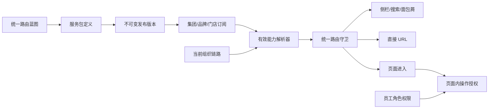

# 订阅服务包与商家菜单能力设计

> 状态：已确认  
> 日期：2026-08-26  
> 配置端：M 平台  
> 消费端：商家后台  
> 方案：服务包引用统一路由节点，按集团、品牌、门店继承并合并菜单能力

## 1. 背景

不同商家可能购买不同价格与能力范围的后台服务。例如 99 元/月服务与 199 元/月服务包含不同的商家后台菜单。运营人员需要在独立页面维护可售卖服务包，并给集团、品牌或门店开通一个或多个服务包。商家登录后，只能看到并访问当前有效订阅包含的菜单功能。

现有项目已经具备以下基础：

- `src/config/navigation.ts` 维护商家后台统一导航树；
- `src/config/platform-preset-nav-filter.ts` 已实现导航展示与直接路由访问的统一过滤入口；
- 平台已有“业态 × 产品线”的预设能力，但该能力用于推荐和初始化，不等同于商业订阅；
- 已确认的可视化路由平台设计以稳定 `routeNodeId`、不可变发布快照和统一路由守卫为核心；
- 页面内按钮、数据范围和操作权限由现有角色权限体系负责。

本设计在统一路由蓝图之上增加“服务包定义”和“商家订阅实例”两层，不复制菜单树，也不建立第二套路由系统。

## 2. 已确认的产品决策

1. 同一商家主体可以同时购买多个独立服务包。
2. 服务包不绑定业态。业态只用于商家筛选和运营判断，不限制可选择的服务包。
3. 第一期不处理在线支付、退款、发票或自动续费；价格仅用于产品定义与展示，由运营人员手动开通、续期和停用。
4. 服务包第一期只配置菜单路由，不配置页面内按钮或操作权限。
5. 服务包新版本发布后，所有有效订阅自动使用最新生效版本。
6. 服务包可按集团、品牌或门店开通。
7. 集团订阅自动向品牌和门店继承，品牌订阅自动向门店继承；下级只能增配，不能移除上级能力。
8. 多个有效服务包包含的菜单节点取并集并去重。
9. 服务包引用统一路由蓝图中的稳定 `routeNodeId`，不保存菜单结构副本。

## 3. 目标

- 提供独立的订阅服务管理入口。
- 支持创建服务包，定义名称、编码、说明、展示价格、币种、计费周期及菜单范围。
- 支持服务包草稿、校验、发布、历史版本和回滚。
- 支持给集团、品牌、门店开通一个或多个服务包，并设置生效和到期时间。
- 让商家后台基于当前组织视角解析有效订阅，并生成最终可见、可访问的菜单。
- 让侧栏、搜索、面包屑和直接 URL 访问使用同一个授权结果。
- 提供能力来源解释、变更影响提示和完整审计。

## 4. 非目标

- 不建设服务包在线下单、支付、退款、发票、账单和自动续费。
- 不允许商家自行购买或修改服务包。
- 不用服务包替代员工角色、按钮权限或数据范围权限。
- 不为每个服务包复制一份菜单树或页面接入配置。
- 第一期不支持下级主体屏蔽上级已经购买的能力。
- 第一期不允许对单个商家锁定旧服务包版本。
- 不把业态作为服务包硬性可选范围。

## 5. 信息架构与页面

推荐入口为：`M 平台 / 权限管理中心 / 订阅服务`，包含两个一级页签。

### 5.1 服务包管理

列表展示：

- 名称、唯一编码；
- 展示价格、币种、计费周期；
- 当前版本、菜单数量、订阅主体数量；
- 草稿、已发布或已停用状态；
- 最近发布人和发布时间。

支持搜索、状态筛选、创建、复制、编辑、查看版本、发布、回滚和停用。

### 5.2 服务包编辑

编辑页包含：

1. 基础信息：名称、编码、说明、价格、币种、计费周期；
2. 菜单路由树：从统一路由蓝图选择稳定节点；
3. 最终菜单预览：展示父子层级、自动补齐的父级目录和实际可点击节点；
4. 变更对比：新增菜单、移除菜单、失效节点；
5. 发布影响：受影响的集团、品牌和门店数量。

保存草稿不会影响商家。只有发布成功才会切换当前生效版本。

### 5.3 商家订阅

商家订阅页支持按商家名称、业态、组织层级、服务包、状态和到期时间筛选。

开通时选择：

- 主体类型：集团、品牌或门店；
- 主体；
- 一个服务包；
- 生效时间与到期时间；
- 操作备注。

同一主体可以多次开通不同服务包。详情页区分“当前主体直接开通”和“从上级继承”，并展示最终菜单数量、能力来源和最近到期时间。

## 6. 总体架构



### 6.1 配置面

- 路由蓝图负责菜单结构和页面接入。
- 服务包负责把一组路由节点定义成可售卖产品。
- 服务包发布生成不可变版本，并原子切换 `activeReleaseId`。
- 商家订阅负责哪个主体在什么时间拥有哪个服务包。

### 6.2 运行面

- 组织上下文解析当前集团、品牌和门店链路。
- 订阅解析器读取链路上所有生效订阅。
- 能力解析器读取各服务包当前生效版本，并对 `routeNodeId` 取并集。
- 统一路由守卫叠加路由发布状态与订阅菜单能力，决定页面是否可见、可访问。
- 用户进入页面后，现有员工角色权限体系继续决定按钮、操作和数据范围；员工角色不重复限制服务包已经授予的页面路由。

### 6.3 统一判定

```text
routeAllowed = routePublishedAndEnabled
            AND routeIncludedByAnyEffectiveSubscription

actionAllowed = routeAllowed
             AND employeeActionPermissionMatched
```

菜单渲染、搜索、面包屑和直接 URL 必须复用同一个 `routeAllowed` 判定函数。页面内按钮和业务接口使用现有角色权限判定；服务包不自动授予具体业务操作。前端隐藏仅用于体验，服务端接口仍需执行自身授权。

## 7. 数据模型

### 7.1 服务包稳定身份

```ts
type ServicePackageStatus = "unpublished" | "published" | "disabled";
type BillingInterval = "month" | "quarter" | "year" | "one-time";

interface ServicePackage {
  id: string;
  code: string;
  name: string;
  description?: string;
  priceMinor: number;
  currency: string;
  billingInterval: BillingInterval;
  status: ServicePackageStatus;
  activeReleaseId?: string;
  createdAt: string;
  createdBy: string;
  updatedAt: string;
  updatedBy: string;
}
```

约束：

- `code` 在企业域内唯一，创建后不可修改；
- 金额使用最小货币单位保存，禁止浮点数；
- `published` 必须存在有效的 `activeReleaseId`；
- 已有有效订阅的服务包不能物理删除，只能停用。

`ServicePackage` 中的名称、说明与价格字段是当前生效版本的查询投影，便于列表检索；编辑动作只写入工作草稿。发布或回滚时，在切换 `activeReleaseId` 的同一事务内用目标版本刷新这些投影字段。

### 7.2 服务包工作草稿

```ts
interface ServicePackageDraft {
  packageId: string;
  baseReleaseId?: string;
  revision: number;
  name: string;
  description?: string;
  priceMinor: number;
  currency: string;
  billingInterval: BillingInterval;
  routeNodeIds: string[];
  validationResult?: ServicePackageValidationResult;
  updatedAt: string;
  updatedBy: string;
}
```

每个服务包最多保留一个当前工作草稿。草稿承载尚未发布的基础信息和路由选择，保存时递增 `revision`，不修改 `activeReleaseId`。`baseReleaseId` 表示草稿基于哪个已发布版本创建；发布时必须同时校验草稿 `revision`、`baseReleaseId` 和路由蓝图版本，任一发生变化都拒绝覆盖并要求重新比较。首次发布时 `baseReleaseId` 为空。

发布成功后，以草稿内容生成不可变发布版本，并将草稿重置为新版本的工作副本。发布失败时草稿保留，当前商家能力不变化。

### 7.3 服务包发布版本

```ts
interface ServicePackageRelease {
  id: string;
  packageId: string;
  version: number;
  name: string;
  description?: string;
  priceMinor: number;
  currency: string;
  billingInterval: BillingInterval;
  routeNodeIds: string[];
  changeSummary: string;
  validationResult: ServicePackageValidationResult;
  publishedAt: string;
  publishedBy: string;
}

interface ServicePackageValidationResult {
  valid: boolean;
  invalidRouteNodeIds: string[];
  selectedLeafCount: number;
  effectiveNodeCount: number;
  affectedGroupCount: number;
  affectedBrandCount: number;
  affectedStoreCount: number;
}
```

发布版本不可变。订阅引用稳定的 `packageId`，运行时解析 `activeReleaseId`，因此新版本发布后全部有效订阅自动更新。回滚通过原子切换 `activeReleaseId` 完成，不修改历史版本。

### 7.4 商家订阅实例

```ts
type SubscriptionSubjectType = "group" | "brand" | "store";
type SubscriptionStatus = "scheduled" | "active" | "expired" | "disabled" | "package-disabled";

interface MerchantSubscription {
  id: string;
  subjectType: SubscriptionSubjectType;
  subjectId: string;
  packageId: string;
  startAt: string;
  endAt?: string;
  disabledAt?: string;
  disabledBy?: string;
  disableReason?: string;
  createdAt: string;
  createdBy: string;
  note?: string;
}
```

`status` 应根据时间和停用信息统一计算，不允许由多个调用方各自维护不同状态。有效条件为：

```text
startAt <= now
AND (endAt is null OR now < endAt)
AND disabledAt is null
AND servicePackage.status = published
```

时间区间采用左闭右开 `[startAt, endAt)`，避免续期交界时出现重复生效。

同一 `subjectType + subjectId + packageId` 不允许存在有效期重叠记录。续期优先延长当前记录的 `endAt`；未来预约记录可以编辑或取消，但必须重新执行重叠校验。

当服务包整体停用时，未被人工停用的订阅记录保留并解析为 `package-disabled`，不提供菜单能力。服务包重新发布时，仍处于自身有效期内的订阅自动恢复为 `active`，尚未到生效时间的订阅恢复为 `scheduled`；重新发布前必须展示将恢复的主体数量并要求确认。

### 7.5 有效能力结果

```ts
interface EffectiveRouteEntitlement {
  routeNodeId: string;
  sources: Array<{
    subscriptionId: string;
    packageId: string;
    releaseId: string;
    subjectType: SubscriptionSubjectType;
    subjectId: string;
    inherited: boolean;
  }>;
}

interface EffectiveEntitlementSnapshot {
  contextKey: string;
  generatedAt: string;
  expiresAt: string;
  routes: EffectiveRouteEntitlement[];
}
```

有效能力是运行时派生结果，不作为运营人员直接编辑的数据。`sources` 用于解释某个菜单为何可见，并支持审计和排障。

## 8. 继承与合并规则

### 8.1 组织链路

- 集团视角：只读取集团直接订阅；
- 品牌视角：读取集团订阅与当前品牌直接订阅；
- 门店视角：读取集团、所属品牌和当前门店直接订阅。

不存在“负向订阅”或排除记录，因此下级无法移除上级能力。

### 8.2 多包并集

所有有效订阅对应的当前发布版本按 `routeNodeId` 取并集。相同节点由多个服务包提供时只展示一次，但保留所有来源。

如果选中叶子页面而其父目录未显式选中，运行时可为导航展示自动补齐必要父目录；自动补齐的纯目录不代表其其他子页面也获得授权。

### 8.3 父子节点

- 选中父目录不自动授权全部后代，除非编辑器明确执行“选择全部子节点”；
- 叶子页面必须显式出现在服务包版本中；
- 父目录自身有可访问页面时，必须作为独立路由节点授权；
- 所有子节点均不可见且父节点自身不可访问时，父节点自动隐藏。

## 9. 核心流程

### 9.1 创建与发布服务包

1. 运营人员创建服务包并填写基础信息。
2. 从当前已发布路由蓝图选择菜单节点。
3. 保存草稿，商家能力不变化。
4. 点击发布，系统执行结构、状态和依赖校验。
5. 系统计算相对当前版本的新增/移除菜单及受影响主体数量。
6. 运营人员确认影响。
7. 系统在事务内创建不可变版本并切换 `activeReleaseId`。
8. 系统失效相关有效能力缓存并记录审计日志。

### 9.2 开通服务包

1. 运营人员先定位集团、品牌或门店；页面展示其业态作为决策信息。
2. 选择一个服务包与生效、到期时间。
3. 系统校验主体存在、服务包已发布、时间合法且无重叠订阅。
4. 创建订阅实例并失效该主体及所有受影响下级主体的能力缓存。
5. 详情页展示直接开通、上级继承和最终菜单能力。

### 9.3 商家登录与路由访问

1. 建立当前集团、品牌和门店上下文。
2. 读取组织链路中的有效订阅。
3. 读取服务包当前生效版本并合并路由节点。
4. 叠加路由发布状态，得到页面级可见与可访问范围。
5. 使用同一结果过滤侧栏、搜索与面包屑。
6. 直接访问 URL 时再次通过统一守卫检查；无权访问时进入统一 403。

进入页面后，按钮、业务操作和数据范围继续由现有员工角色权限体系独立校验。

### 9.4 续期、到期与停用

- 续期更新当前订阅的 `endAt`，并写入审计；
- 到达 `endAt` 后订阅立即退出有效能力集合；
- 手动停用要求填写原因，立即失效并清理缓存；
- 用户停留在已经失效的页面时，下一次路由或接口校验必须拒绝访问；
- 服务包整体停用后，其所有订阅均不再提供能力，但订阅历史保留。
- 服务包停用时，预约和有效订阅显示为“服务包已停用”；重新发布后，仍在各自有效期内的订阅自动恢复，无需重新开通。

## 10. 发布校验与影响分析

发布必须满足：

- 服务包名称和编码有效，价格非负，币种和周期有效；
- 至少选择一个可点击页面节点；
- 每个 `routeNodeId` 存在于目标路由蓝图且处于可发布状态；
- 不包含孤立、循环或无法解析目标页面的节点；
- 自动补齐父目录后可形成合法菜单树；
- 不包含重复节点；
- 若移除菜单，必须展示当前订阅主体数量及受影响组织层级。

以下情况阻止发布：

- 节点已经删除、停用或未发布；
- 服务包最终不包含任何可访问页面；
- 路由蓝图版本在校验与提交之间变化；
- 当前草稿基于过期服务包版本且未完成冲突处理。

发布使用乐观锁或等价版本检查，避免并发编辑覆盖。

## 11. 缓存、一致性与降级

- 有效菜单能力结果可以按组织上下文缓存，但必须设置短有效期；页面内员工角色权限沿用现有独立缓存与失效机制；
- 服务包发布、回滚、停用，或订阅创建、续期、停用时，主动失效受影响缓存；
- 发布版本切换与审计记录必须处于同一事务或具备等价原子性；
- 配置服务暂时不可用时，可使用最近一次成功的短期有效能力快照；
- 超过安全缓存窗口后采用最小权限策略，不得默认开放全部菜单；
- 已发布版本中的某个节点后来被紧急停用时，运行时立即跳过该节点并告警；
- 路由守卫不得向无权用户返回远程地址、内部权限编码或服务包内部信息。

## 12. 回滚

管理员可选择同一服务包的历史发布版本并执行回滚。回滚前展示菜单差异和受影响主体数量；确认后原子切换 `activeReleaseId` 并清理缓存。

回滚影响所有有效订阅该服务包的主体，不提供单商家锁定旧版本。回滚本身生成独立审计事件，但不修改历史发布版本内容。

## 13. 审计

以下动作必须记录操作者、时间、对象、前后差异和原因：

- 创建、复制和编辑服务包；
- 发布、回滚和停用服务包；
- 创建、续期、修改未来预约和停用订阅；
- 因路由紧急停用而跳过已授权节点；
- 发布失败、并发冲突和批量缓存失效失败。

审计数据不得依赖前端提交的展示文本，应由服务端根据持久化前后状态生成。

## 14. 错误处理

- 表单错误：字段旁显示可操作的修正提示，不提交无效草稿或发布请求；
- 重叠订阅：指出冲突记录和时间范围，并提供“延长当前订阅”的入口；
- 无效路由：阻止发布并定位到路由树中的具体节点；
- 并发编辑：拒绝旧版本提交，展示最新差异后要求重新确认；
- 发布失败：保持原 `activeReleaseId` 不变，不让商家进入半发布状态；
- 缓存清理失败：发布事实保持一致，通过重试队列继续清理，并缩短受影响缓存有效期；
- 无权访问：统一 403，提供返回首个可访问页面的入口；
- 服务到期：提示联系管理员续期，不提供直接购买入口。

## 15. 验收标准

1. 可创建服务包，必填名称、唯一编码、展示价格、币种和计费周期。
2. 可从统一路由蓝图选择菜单节点，并预览商家最终菜单结构。
3. 草稿修改不影响商家；发布后所有有效订阅自动使用新版本。
4. 发布前展示新增、移除菜单及受影响的集团、品牌和门店数量。
5. 一个主体可同时订阅多个不同服务包，菜单能力去重合并。
6. 同一主体的同一服务包不允许存在有效期重叠记录。
7. 集团服务包自动向品牌和门店继承，品牌向门店继承；下级只能增配。
8. 未到生效时间、已到期或已停用的订阅不参与能力计算。
9. 服务包决定页面可见和可访问；员工角色继续决定页面内操作权限。
10. 侧栏、搜索、面包屑和直接 URL 的判定结果一致。
11. 已知但无权访问的路由返回统一 403，不暴露目标页面内部信息。
12. 服务包可回滚到历史版本，并让所有有效订阅统一恢复。
13. 创建、编辑、发布、回滚、开通、续期和停用均有审计记录。

## 16. 测试范围

### 16.1 单元测试

- 订阅状态的生效时间、到期时间和左闭右开边界；
- 同主体、同服务包的有效期重叠检查；
- 集团、品牌、门店继承链路；
- 多服务包路由并集、去重和来源保留；
- 父目录补齐与空父目录隐藏；
- 服务包停用与路由停用的页面访问组合判定；
- 已获得页面路由能力时，员工角色只影响页面内按钮、操作和数据范围。

### 16.2 集成测试

- 服务包发布与 `activeReleaseId` 原子切换；
- 发布、回滚、订阅变更后的缓存失效；
- 侧栏、搜索、面包屑和直接 URL 共享判定结果；
- 配置服务异常时的短期缓存与最小权限降级；
- 并发编辑和路由蓝图版本变化时拒绝错误发布。

### 16.3 端到端测试

- 创建 99 元与 199 元服务包并分别配置菜单；
- 给集团、品牌和门店开通不同服务包；
- 验证门店最终菜单为三个层级有效服务包的并集；
- 发布新版本后验证所有订阅主体统一更新；
- 到期、停用和回滚后验证菜单与直接 URL 同步变化；
- 验证服务包包含页面时员工可以进入页面；缺少角色权限时页面内受控按钮和业务操作不可用。

## 17. 与现有项目的集成边界

- 统一路由节点来自现有可视化路由蓝图，不直接复制 `NAV_MODULES` 文本结构；原型阶段可由 `src/config/navigation.ts` 生成稳定节点目录。
- 运行时能力过滤应接入 `src/config/platform-preset-nav-filter.ts` 所在的统一导航过滤链路，避免为订阅服务新增一套只过滤侧栏的逻辑。
- 业态预设仍负责推荐或初始功能范围；商业订阅负责已购买的页面能力。页面路由允许范围为“路由蓝图发布范围 ∩ 有效订阅菜单”；进入页面后的操作范围再由员工角色权限控制。
- 现有菜单节点的服务订阅字段可作为迁移或兼容输入，但新服务包应以稳定 `routeNodeId` 集合作为唯一权威来源。

## 18. 后续阶段

以下能力不进入第一期，但数据模型应避免阻塞：

- 在线购买、支付、退款、发票和自动续费；
- 优惠价、阶梯价和按门店数量计价；
- 试用期、宽限期和欠费冻结；
- 业态推荐服务包；
- 商家自助升级或增购；
- 单商家版本锁定与灰度发布；
- 页面内细粒度功能配额或用量限制。
