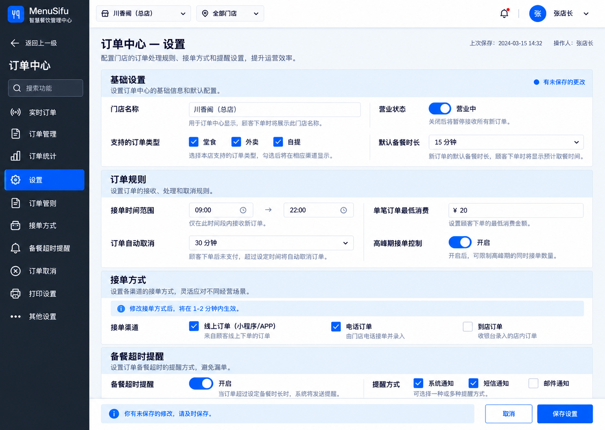

# 主后台统一设计系统方案

> 状态：视觉方向与交互契约已确认，等待实现计划
>
> 范围：仅 `src` 主后台；不包含 `TipOut`、`vendor/emenu-new` 及其他嵌入应用
>
> 公司组件标准：[CC FE Kit](https://cc-fe-kit-doc.menusifudev.com/components/button)

## 1. 背景与目标

当前主后台页面由多个阶段、多个功能域持续扩展，视觉样式、页面骨架、表单组织和交互反馈存在漂移。新功能如果只依赖通用生成提示，会继续产生不同的圆角、间距、颜色、按钮层级和导航方式。

本方案建立一个可被设计、开发和 AI 共同执行的单一标准，目标是：

- 新页面默认具有一致的视觉语言、页面骨架和交互反馈。
- 同类能力优先复用公司组件库，避免重复实现控件。
- 保留项目已确认的一级/二级导航模型，不因页面改版改变用户心智。
- 设计标准可通过 `DESIGN.md`、Design Tokens、页面模板、项目 Skill 和检查清单持续执行。
- 允许渐进迁移，不要求一次性重写全部既有页面。

## 2. 已确认的设计决策

### 2.0 范围矩阵

| 区域 | 是否纳入第一阶段 | 说明 |
|---|---:|---|
| 主后台 shell、顶栏、一级/二级导航 | 是 | 建立统一壳层与覆盖式二级导航契约 |
| `src/config`、`src/team`、`src/permissions`、`src/log-management` 等原生主后台内容页 | 是 | 新页面强制执行，旧页面渐进迁移 |
| 登录页与首次登录引导 | 否 | 后续单独建立认证体验规范 |
| `src/pit` | 否 | 独立工具，不纳入商家主后台视觉迁移 |
| M Platform 专用页面 | 否 | 只保证共享 shell 不回归，内容规范另立项目 |
| `src/emenu-local` | 否 | 属于嵌入式产品工作流，不迁移其内部 UI |
| TipOut/eMenu iframe 外层容器 | 部分 | 只统一主后台提供的容器和入口，不修改 iframe 内部 |
| `TipOut`、`vendor/emenu-new`、嵌入应用资源和发布产物 | 否 | 严格非目标 |
| 根目录 `DESIGN.md`、项目 Skill、规范与验收资产 | 是 | 属于设计治理交付物，不属于运行时代码 |

### 2.1 视觉基准

最终视觉基准如下：



采用方案 3 的蓝色视觉系统：

- 深墨蓝/石板色用于导航与高对比结构层。
- 清晰的钴蓝色用于主操作、选中、焦点、开关和复选状态。
- 浅蓝灰用于页面背景、分组表头和弱提示面。
- 成功、警告、危险色只表达语义，不作为品牌装饰色。
- 不使用渐变、玻璃拟态、无意义插画、重阴影和大面积装饰性色块。

视觉稿用于定义设计意图和层级，不替代公司组件库的真实尺寸、属性及状态。组件最终表现以 CC FE Kit 当前版本为准。

### 2.2 导航交互

一级导航和二级导航只占用同一个侧栏区域，不能并排常驻：

1. 默认显示一级导航。
2. 点击具有二级入口的一级模块后，二级导航从侧边滑入，并完全覆盖一级导航菜单区域。
3. 主内容区不位移、不缩放、不变暗。
4. 二级导航提供“返回上一级”或语义等价的关闭入口。
5. 返回后恢复一级导航原滚动位置和选中状态。
6. 二级滑层不是模态框：主内容不变暗、不设 focus trap，主内容仍可通过鼠标和键盘访问；被覆盖的一级导航容器必须 `inert` 且不参与 Tab 顺序。
7. 打开后，焦点进入二级滑层的标题/返回入口；关闭后准确恢复到触发该滑层的一级导航项。

确定性的状态转换如下：

| 事件 | 结果 |
|---|---|
| 点击具有二级入口的一级项 | 打开该模块二级滑层并聚焦返回入口；记录一级导航滚动位置 |
| 再次触发当前一级项 | 保持二级滑层打开，不重复动画 |
| 点击二级叶子 | 完成路由切换，当前模块二级滑层保持打开，更新选中项 |
| 同模块内路由变化/浏览器前进后退 | 二级滑层保持打开并同步选中项 |
| 跨模块路由 | 关闭原滑层；若目标路由属于另一有二级导航的模块，则打开目标模块滑层并同步选中项；否则显示一级导航 |
| 直接深链或刷新到二级路由 | 根据路由归属直接恢复对应模块二级滑层和选中项，不播放入场动画 |
| 返回上一级/关闭 | 关闭二级滑层，恢复一级导航滚动位置，并聚焦原一级项 |
| `Escape` | 按“当前弹窗 → 三级导航 → 已输入的滑层搜索 → 二级滑层”依次处理；每次只处理最高优先级一层 |
| 页面存在未保存变更时触发路由 | 先进入统一离开确认；取消则所有导航状态不变，确认后再执行目标状态转换 |
| 权限变化导致当前项不可见 | 跳转到该模块首个有权限叶子；若模块无可见叶子则关闭滑层并回到首页 |

### 2.3 设置配置页作为首个标准模板

第一版以设置配置页为样板，因为它能覆盖主后台最常见的复杂度：多级导航、范围筛选、分组、表单控件、帮助说明、变更状态与保存反馈。

唯一首个样板为：

- 页面：订单中心设置
- 路由：`/orders/settings`
- 纳入：主后台 shell、顶栏范围筛选、覆盖式二级导航、设置内容骨架、字段控件、页面内分区、未保存提示与保存栏。
- 不纳入：订单设置的信息架构重分组、后端协议变化、其他模块迁移、深色主题重设计。
- 固定数据：使用项目演示账号下确定性的订单设置 fixture；截图前重置为同一 fixture，不依赖当前日期或随机数据。
- 必测语言：中文为视觉基线；英文做布局溢出 smoke test。
- 必测视口：`1440×1024` 视觉基线与 `1280×720` 最小桌面视口。
- 主题：light 为第一阶段冻结基线；现有 dark mode 只要求功能不崩溃和文本可读，不作为本阶段视觉验收基线。

标准骨架：

```text
全局顶栏：集团/品牌/门店范围 + 全局工具 + 用户
├─ 左侧导航：一级导航，或覆盖其上的当前模块二级导航
└─ 主内容
   ├─ 页面标题、说明、最近保存信息
   ├─ 页面内分组索引（内容较长时）
   ├─ 设置分区
   │  └─ 标签 + 控件 + 帮助文本 + 状态/错误
   └─ 固定保存栏：变更提示 + 取消 + 主保存操作
```

## 3. 设计系统规则

### 3.1 Design Tokens

实现时建立语义 Token，禁止页面直接把视觉稿颜色复制成散落的十六进制值。第一阶段 light 主题冻结如下；CC FE Kit 接入验证时只能做等价映射，若库的主题机制无法表达，需登记差距，不得由页面覆盖：

| Token | 用途 |
|---|---|
| `--color-primary` | `#146EF5`；主按钮、选中、开关开启 |
| `--color-primary-hover` | `#0E5ED7` |
| `--color-primary-active` | `#0A4FB8` |
| `--color-primary-subtle` | `#EAF3FF`；选中背景、弱提示背景 |
| `--color-primary-foreground` | `#FFFFFF` |
| `--color-focus-ring` | `#3B73D1` |
| `--color-nav-bg` | `#142235` |
| `--color-nav-foreground` | `#F7FAFF` |
| `--color-page-bg` | `#F5F8FC` |
| `--color-surface` | `#FFFFFF` |
| `--color-border` | `#D9E2EF`；仅用于装饰性分隔线 |
| `--color-control-border` | `#66758A`；输入框等必要控件边界 |
| `--color-text` | `#142033` |
| `--color-text-secondary` | `#607089` |
| `--color-success` | `#16845B` |
| `--color-warning` | `#8A4B00`；普通字号警告文字 |
| `--color-warning-bg` | `#FFF4E5` |
| `--color-warning-border` | `#B85C00` |
| `--color-danger` | `#D92D20` |
| `--control-height-sm` | `32px` |
| `--control-height-md` | `36px` |
| `--control-height-lg` | `40px` |
| `--sidebar-width` | `220px` |
| `--save-bar-height` | `72px` |
| `--radius-control` | `6px` |
| `--radius-surface` | `8px` |
| `--radius-overlay` | `12px` |
| `--motion-fast` | `120ms` |
| `--motion-base` | `180ms` |
| `--motion-ease-standard` | `cubic-bezier(0.2, 0, 0, 1)` |
| `--z-header` | `30` |
| `--z-nav-overlay` | `40` |
| `--z-save-bar` | `50` |
| `--z-modal` | `100` |

现有 `app.css` 的 `primary/background/card/border/foreground/muted` 等变量需在实现阶段映射到上表；CC FE Kit Theme Token 若命名不同，由一层主题适配器映射，页面不得同时维护第二套值。

关键 light 主题对比度基线（相对白色 `#FFFFFF`）：

| Token | 对比度 | 允许用途 |
|---|---:|---|
| `--color-primary` `#146EF5` | `4.59:1` | 普通文本、图标、主控件填充 |
| `--color-focus-ring` `#3B73D1` | `4.61:1` | 焦点边界和非文本 UI |
| `--color-control-border` `#66758A` | `4.69:1` | 必要控件边界 |
| `--color-text-secondary` `#607089` | `5.03:1` | 普通字号辅助文本 |
| `--color-warning` `#8A4B00` | `6.80:1` | 普通字号警告文字 |

`--color-border` 是装饰性分隔线，不承担识别控件、状态或焦点的唯一职责；需要识别的边界必须使用 `--color-control-border` 或对应语义色。实现阶段的自动对比度检查以本表为最低基线。

空间采用受控刻度，优先使用 `4 / 8 / 12 / 16 / 24 / 32`。默认圆角控制在 `6–8px`，只有浮层或特殊大容器可使用更高层级圆角。阴影仅用于真正具有层级关系的浮层。

### 3.2 排版与信息密度

- 正文与控件文本以 `14px` 为主，辅助文字不低于 `12px`。
- 页面标题、分区标题、字段标签、帮助文本建立固定层级，不允许页面自行发明字号。
- 设置页采用中高信息密度；通过对齐、留白和分隔线提高扫描效率，不依赖大量卡片。
- 中文、英文和数字混排时保持一致行高；金额、数量、时间等可比较数据使用等宽数字。

### 3.3 页面容器与分组

- 一个页面只保留一个主要内容表面，避免“卡片套卡片”。
- 设置分区优先使用标题行、浅色表头和分隔线。
- 只有可独立移动、关闭或拥有独立生命周期的对象才使用卡片。
- 长设置页必须提供页面内定位、滚动记忆或目录索引中的至少一种。
- 固定保存栏出现时不得遮挡最后一项内容，内容区需要保留等量底部空间。

## 4. CC FE Kit 组件治理

### 4.1 优先级

组件来源优先级：

1. CC FE Kit 已提供且满足需求的组件。
2. 项目基于 CC FE Kit 封装的业务组件。
3. 项目已有、经过统一规范审计的共享组件。
4. 仅当以上均不能满足且有明确业务差异时，才允许新建基础组件。

禁止在页面内部重新手写 Button、Input、Select、Checkbox、Radio、Switch、DatePicker、Modal、Alert、Message、Empty、Tooltip 等已有基础控件。

### 4.2 已确认可映射能力

根据公司组件文档导航，首批映射如下：

| 页面需求 | CC FE Kit |
|---|---|
| 主/次/危险操作 | Button |
| 文本与数值输入 | Input / InputNumber / Textarea |
| 单选、多选、开关 | Radio / Checkbox / Switch |
| 普通选择、筛选选择 | Select / SelectFilter |
| 搜索 | SearchInput / AutoComplete |
| 日期与时间相关选择 | DatePicker |
| 确认、弹层和提示 | Confirm / Modal / Alert / Message |
| 空数据和解释 | Empty / Tooltip / Text |
| 布局 | Flex / Splitter |

### 4.3 API 核对门禁

公司组件库文档版本当前显示为 `v0.0.5`。设计规范不臆造组件属性：每次实现前必须打开对应组件页面，核对当前版本的导入方式、属性、事件、尺寸、禁用态、加载态和错误态。若文档不可用或组件不满足需求，必须记录差距后再决定业务封装，不能静默改用自制控件。

### 4.4 CC FE Kit 接入决策与先行验证

当前仓库是 Vite + TypeScript + 原生 DOM/HTML 字符串架构，`package.json` 尚未声明 CC FE Kit、React 或 Ant Design；因此“直接引入组件库”尚未被证明可行。实施计划的第一个任务必须是只读调研加最小技术验证，不能直接开始全页迁移。

验证必须确认并记录：

- 正式 npm 包名、允许安装的版本、内部 registry 与授权方式。
- 组件是否要求 React，以及 React/Ant Design 等 peer dependencies。
- 原生主后台采用整体迁移、局部 React island 还是适配器封装；默认优先最小影响的局部验证，不预先承诺全量迁移。
- CSS reset、主题样式和现有 Tailwind/app.css 的加载顺序。
- Button、Input、Select、Switch、Modal 五个代表组件能否在 `/orders/settings` 的隔离验证容器中正常渲染、响应键盘、切换主题 Token 且不污染现有页面。

通过标准：构建成功、无重复 React/runtime、无全局样式破坏、五类组件交互及焦点正常、主题可映射、bundle 影响已记录。验证未通过时暂停组件迁移，并在 `docs/design-system/cc-fe-kit-gap-matrix.md` 登记：需求、目标组件、阻断原因、临时 fallback、影响页面、负责人、批准人和复查日期。临时 fallback 只能复用当前项目共享组件，不得在业务页面新造基础控件。技术负责人批准后方可使用。

## 5. 交互标准

### 5.1 操作层级

- 每个视图只有一个视觉主操作。
- 取消、返回、重置为次操作；删除、停用等不可逆或高风险操作使用危险语义。
- 操作名称使用“动词 + 对象”，例如“保存设置”“新增时段”，避免含糊的“确定”。
- 高风险操作必须通过 Confirm/Modal 明确对象和后果。

### 5.2 表单反馈

- 校验错误贴近字段展示，并保留用户已输入内容。
- 依赖条件导致字段不可用时优先禁用并说明原因，不直接隐藏关键规则。
- 保存中禁用重复提交并显示加载态。
- 保存成功使用 Message 或等价轻反馈；失败保留未保存状态并给出可执行的重试信息。
- 离开存在未保存变更的页面时使用项目统一离开确认。

### 5.3 页面状态

每个页面或业务组件必须覆盖：

- 默认/有数据
- 加载
- 空状态
- 错误与重试
- 无权限/只读
- 控件禁用
- 保存中、保存成功、保存失败
- 部分数据或部分失败（适用时）

设置页状态闭环：

| 状态 | 用户可见结果 | 可用操作与恢复 |
|---|---|---|
| pristine | 不显示未保存提示；保存按钮禁用 | 可编辑字段 |
| dirty | 显示未保存提示；保存栏出现或进入强调态 | 保存、取消、继续编辑 |
| validation-error | 字段就近错误 + 首个错误摘要 | 保留全部输入；修正后重试 |
| saving | 保存按钮 loading，相关提交入口禁用 | 不清空输入，不允许重复提交 |
| saved | Message 成功提示；最近保存信息更新；回到 pristine | 继续编辑 |
| save-error | 明确错误与重试；保持 dirty | 重试、取消、复制必要信息 |
| cancel | 恢复到最近一次成功保存值 | 回到 pristine |
| stale/conflict | Alert 说明数据已更新 | 重新加载最新值或进入明确的覆盖确认；禁止静默覆盖 |
| readonly | 显示只读原因；控件呈只读而非伪禁用 | 可复制/查看，无保存入口 |
| no-permission | 不展示敏感配置内容 | 提供返回或申请权限指引 |
| partial-failure | 仅批量/分区独立保存场景适用，逐项标明成功与失败 | 保留失败项输入并提供重试 |

“最近保存信息”初始取最近一次成功保存记录；保存失败时不更新。保存栏在 pristine 状态下保留布局位置但按钮禁用，避免页面跳动。

## 6. 可访问性与响应式

- 所有控件必须有可访问名称，不能只依赖图标表达含义。
- 键盘可到达所有可操作元素；焦点样式使用蓝色焦点环且不可被移除。
- 二级导航滑层打开后管理焦点范围；关闭后恢复到触发项。
- 文本与背景满足 WCAG 2.2 AA：普通文本至少 `4.5:1`，大文本和非文本 UI 至少 `3:1`；状态不能只依赖颜色区分。
- `1280×720` 为第一阶段最小桌面视口；在 `200%` 浏览器缩放下核心操作仍可到达且文本不截断。
- 只有明确标记的表格/宽内容容器允许内部横向滚动；页面根容器禁止同时出现横向和纵向双轴滚动。
- Tab 顺序遵循顶栏 → 当前可见导航 → 主内容 → 保存栏；焦点环不得被移除。
- 二级滑层使用 `180ms` 标准曲线；`prefers-reduced-motion: reduce` 时取消位移动画，只做即时状态切换。

## 7. 三种方案取舍记录

本轮比较了三种方向：

1. 青绿企业型：与当前品牌连续性最好，但改变幅度较小。
2. 暖色运营型：亲和、区分度强，但橙色在高频设置页中容易与警告语义竞争。
3. 蓝色结构型：状态清晰、可扩展性好，适合高密度后台，最终被选中。

最终方案使用方向 3 的蓝色主题，并沿用项目既有的“二级导航覆盖一级导航菜单区域”交互。

## 8. 工程化落地

第一阶段只建立标准和样板，不一次性重构全部页面：

1. 盘点 `src/styles/app.css`、`src/ui` 和现有共享模式。
2. 建立语义 Tokens 与 CC FE Kit 主题映射。
3. 建立统一页面壳、标题区、设置分区、字段行和保存栏。
4. 把现有导航滑层固化为共享交互契约，保持覆盖式行为。
5. 选择一个真实设置配置页完成样板迁移，并覆盖完整状态。
6. 形成 `DESIGN.md` 与项目专属 `admin-web-design-system` Skill。
7. 新页面强制使用页面模板、组件映射和验收清单；旧页面按业务改动逐步迁移。

强制规则的交付证据：

- `docs/design-system/cc-fe-kit-gap-matrix.md`：组件能力与例外登记。
- `docs/design-system/page-review-checklist.md`：页面结构、状态、键盘和响应式 review 清单。
- 对新增基础控件 class/原生标签的静态扫描规则；允许项必须指向 gap matrix 编号。
- `/orders/settings` 的状态测试、导航状态机测试和键盘焦点测试。
- `1440×1024`、`1280×720` 中文截图基线，以及英文溢出 smoke 截图。
- 视觉回归采用关键区域基线对比；像素阈值在技术验证中根据字体渲染噪声确定并写入测试配置，任何超阈值差异必须人工批准。

## 9. 验收标准

- 新设置页与视觉基准在布局、层级、密度和蓝色语义上保持一致。
- 二级导航只覆盖一级导航区域，主内容区打开前后位置和宽度不变。
- 深链、刷新、前进后退、跨模块、返回、Escape 优先级和未保存拦截逐项通过导航状态机测试。
- 页面中的基础控件均能映射到 CC FE Kit 或有记录完整的例外理由。
- 不出现页面级自定义主色、随机圆角、重复 Button/Input/Switch 实现。
- 键盘导航、焦点恢复、错误提示和未保存离开保护可验证。
- 加载、空、错误、只读、保存成功/失败状态均有明确表现。
- 视觉回归覆盖 `1440×1024` 和 `1280×720`；中文基线通过，英文无截断或不可达操作。
- WCAG AA 对比度、键盘顺序、焦点恢复、200% 缩放和 reduced-motion 行为通过检查。

## 10. 非目标

- 本阶段不改造 `TipOut`。
- 本阶段不改造 `vendor/emenu-new` 或其发布产物。
- 本阶段不统一嵌入应用内部的技术栈。
- 本阶段不一次性替换所有历史页面。
- 本阶段不以视觉稿替代 CC FE Kit 的 API 文档。
