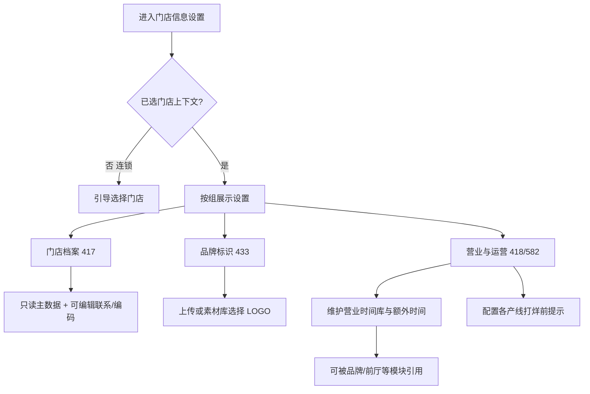

# 门店信息 · 产品需求文档（PRD）

> 范围：门店信息（`store-mgmt` / `/stores/settings`）  
> 版本：v1.1  
> 导出日期：2026-07-28  
> 代码依据：commit `1455f50` + 裁决后落地（`store.profile` 域、旧 `/store/*` 重定向）  
> 关联 SPEC：`./SPEC.md`  
> 关联 DIFF：`./DIFF.md`  
> 关联设计文档：  
> - `docs/项目文档/门店管理-设置二级导航重设计方案.md`（历史分组参考；**正式范围以现网 4 项为准**）  
> - `docs/项目文档/云端下发本地-配置同步与下发记录设计方案.md`  
> - `docs/项目文档/新商家后台-PRD.md`（FR-5.2 / Wave 1）

## 变更记录

| 日期 | 说明 |
|------|------|
| 2026-07-28 | 首次从原型导出（v1） |
| 2026-07-28 | v1.1：DIFF 裁决 — 范围锁定 4 项；纳入 `store.profile` 下发域；废弃 `/store/*` 并重定向；582 不加 POS |

---

## 1. 文档元信息

| 项 | 内容 |
|----|------|
| 模块 | 商家后台 · 门店信息 |
| 入口 | 侧栏一级「门店信息」→ 滑层「设置」→ `/stores/settings` |
| 包含 | seq 417 基本信息、433 餐厅 LOGO、418 营业时段、583 额外时间、582 营业结束前提示 |
| 排除 | 商品中心「门店管理」；集团/品牌「门店列表」；设计稿其余 seq（173/170/77/419/420/547/530）不纳入本模块交付；582 不含 POS 产线 |

---

## 2. 背景与目标

- **问题**：门店档案、营业规则、对客 LOGO 与打烊提示曾分散在本地 POS / 多后台；连锁场景下需在 Web 按门店配置并可下发。  
- **目标**：在统一商家后台提供「本店档案 + 品牌标识 + 营业与运营」配置闭环，支撑新店交付与日常改营业时间（对应新商家后台 PRD Wave 1 / FR-5.2 中门店档案与营业规则部分）。  
- 缺商业 KPI：**待产品补充**。

---

## 3. 角色与权限边界

| 角色 | 视角 | 可见/可操作 |
|------|------|-------------|
| 店长 / 门店管理员 | 门店单店 | 查看平台同步档案；编辑联系展示、内部编码、LOGO、营业时间、打烊提示 |
| 品牌/连锁运营 | 品牌多门店 | 先选门店再改设置；导航受平台预设与 RBAC 过滤 |
| 平台 / 实施 | 企业商户主数据 | 餐馆名、地址、商户编号等由平台主数据驱动，店侧只读 |

细粒度权限码：**待产品/研发补充**（DIFF）。

---

## 4. 范围边界

- **In**：本 hub 四设置项的展示、编辑、校验、空态；门店上下文切换后档案只读区刷新；营业时间作为可被其他模块引用的时间库；打烊提示按 Kiosk/eMenu/SDI 配置；门店档案与营业时间纳入下发域（`store.profile` / `store.hours`）。  
- **Out**：门店 CRUD 列表/开店关店；品牌↔菜单绑定；外送地址库；173/170/77 等未挂本 hub 的历史项；582 的 POS 产线行；真实点餐端提示渲染（仅配置侧）。  
- **废弃**：旧三级路由 `/store/basic`、`/store/logo`、`/store/business-hours` 及任意 `/store/*`，一律重定向至 `/stores/settings` 对应分组。

---

## 5. 核心业务场景

---

## 6. 功能需求清单

| 编号 | 需求类型 | 需求描述 | 关联编号 |
|------|----------|----------|----------|
| SI-01 | 入口 | 侧栏一级「门店信息」，滑层默认进入 `/stores/settings` | → SI-02 |
| SI-02 | 展示 | 设置页按「门店档案 → 品牌标识素材 → 营业与运营」分组展示 | → SI-03 |
| SI-03 | 展示 | 本 hub 含设置：417 / 433 / 418 / 583 / 582 | → SI-02 |
| SI-04 | 逻辑 | 各 seq 使用专用行渲染（非通用纯文本） | → SI-06, SI-11, SI-15, SI-18 |
| SI-05 | 逻辑 | 417 只读区从当前门店企业主数据解析；无门店则演示兜底 | → SI-06, SI-22 |
| SI-06 | 展示 | 417 只读：餐馆名、商户编号、电话、地址、州省、邮编、地区、经销商、版本证书 | — |
| SI-07 | 操作 | 417 可编辑：传真、网站、邮箱、门店编号、商家组编号、商家代号、ADP CO CODE | → SI-08 |
| SI-08 | 逻辑 | ADP CO CODE 供薪资/Payroll 导出使用（字段预留） | → SI-07 |
| SI-09 | 展示 | 417 分区标题：「联系与展示」「内部编码」 | → SI-07 |
| SI-10 | 初始化 | 进入 418 时若无日程数据，写入默认预设营业时间并持久化 | → SI-11 |
| SI-11 | 展示 | 418 列表展示营业时间规则（名称、时段、日期、星期） | → SI-12 |
| SI-12 | 操作 | 新建/编辑营业时间：名称、开闭市、生效日期、至少一天星期；校验失败提示 | → SI-11 |
| SI-13 | 操作 | 删除营业时间需确认；删除后不可恢复 | → SI-11 |
| SI-14 | 操作 | 额外时间：独立设置项 seq 583（与营业时段同组同级）；亦可在 418 营业时间卡片下添加；include/exclude；必选 scheduleIds；删规则摘引用，空关联进待补全 | → SI-11 |
| SI-15 | 操作 | 433 上传 LOGO：本地文件，JPG/JPEG/PNG/GIF，≤1MB；可选同时进素材库 | → SI-16 |
| SI-16 | 操作 | 433 可从图片素材库选择；无素材时引导素材中心 | → SI-15 |
| SI-17 | 操作 | 433 可清除 LOGO；有图时按钮为「更换 LOGO」 | → SI-15 |
| SI-18 | 操作 | 582 主开关控制是否启用「营业时间即将结束提示」 | → SI-19 |
| SI-19 | 操作 | 582 按 Kiosk / eMenu / SDI 分别启用与「结束前 N 分钟」 | → SI-18, SI-20 |
| SI-20 | 校验 | 分钟数限制 1～180，默认 15；非法值回落默认 | → SI-19 |
| SI-21 | 逻辑 | 营业时间配置归属下发域 `store.hours`（门店级） | → SI-11 |
| SI-29 | 逻辑 | 门店档案（417）与品牌标识（433）归属下发域 `store.profile`（门店级；策略 manual-only） | → SI-06, SI-15 |
| SI-22 | 联动 | 切换当前门店后，417 只读主数据随门店刷新 | → SI-05 |
| SI-23 | 空状态 | 433 未设置时展示「暂未设置 LOGO」 | → SI-15 |
| SI-24 | 空状态 | 418 无规则时展示引导空态（首次会被预设填满） | → SI-10 |
| SI-25 | 逻辑 | 582 支持从旧「统一分钟+产线勾选」迁移到按产线配置 | → SI-19 |
| SI-26 | 权限 | 平台同步字段不可在店侧编辑 | → SI-06 |
| SI-27 | 依赖 | 其他模块可引用营业时间规则 id（品牌管理、前厅分类等） | → SI-13 |
| SI-28 | 展示 | 设置项分组深链：`/stores/settings/{groupSlug}` | → SI-02 |
| SI-30 | 入口 | 旧路由 `/store/basic`→档案组；`/store/logo`→品牌标识组；`/store/business-hours`→营业与运营组；其余 `/store/*`→`/stores/settings` | → SI-01 |
| SI-31 | 约束 | 582 产线仅 Kiosk / eMenu / SDI，**不**提供 POS 行 | → SI-19 |

---

## 7. 用户故事与验收标准

### SI-05 / SI-06 / SI-26

**用户故事**：作为店长，我希望看到平台同步的本店档案且不能误改关键标识，以便资料与企业主数据一致。

- Given 当前已锚定某门店 When 打开基本信息 Then 餐馆名/商户编号/地址等为只读且与主数据一致  
- Given 无可用门店 When 打开基本信息 Then 展示兜底演示数据且仍只读  

### SI-07

**用户故事**：作为店长，我希望维护对外联系方式与内部编码，以便收据/对接使用。

- Given 在可编辑区修改邮箱 When 保存设置（页级保存/即时写） Then 再次进入仍显示新值  
- Given 字段为只读主数据 When 尝试输入 Then 无法修改  

### SI-12

**用户故事**：作为店长，我希望配置按日期与星期生效的营业时段。

- Given 名称未填 When 点保存 Then 提示「请填写名称」且不关闭对话框  
- Given 未选任何星期 When 点保存 Then 提示「请至少选择一天」  
- Given 结束时间不晚于开始 When 点保存 Then 提示「结束时间应晚于开始时间」  
- Given 合法表单 When 保存 Then 列表出现/更新该规则  

### SI-15 / SI-16

- Given 上传 2MB 图片 When 选择文件 Then 提示不超过 1MB  
- Given 上传非允许格式 When 选择文件 Then 提示仅支持 JPG/JPEG/PNG/GIF  
- Given 素材库某分类为空 When 打开选择 Then 展示空态并链到素材中心  

### SI-18 / SI-19 / SI-20 / SI-31

- Given 主开关关闭 When 查看面板 Then 产线表隐藏或不可用  
- Given 主开关打开且某产线未勾选 When 查看该行 Then 分钟输入禁用  
- Given 输入 0 或 999 When 失焦/持久化 Then 分钟被限制在 1～180（非法回落 15）  
- Given 打开 582 配置 When 查看产线列表 Then **仅**出现 Kiosk、eMenu、SDI，无 POS  

### SI-29 / SI-30

- Given 工程下发域注册表 When 查询门店信息相关域 Then 同时存在 `store.profile` 与 `store.hours`  
- Given 用户打开旧书签 `#/store/basic` When 进入应用 Then 落到 `#/stores/settings/store-profile`  

### SI-22

- Given 连锁视角切换门店 When 再看 417 Then 只读区变为新店主数据  

---

## 8. 页面/入口清单

| 入口 | 路径/注册点 | 依赖 |
|------|-------------|------|
| 一级导航 门店信息 | `store-mgmt` → `/stores` | 平台预设 / RBAC |
| 设置 | `/stores/settings` | 默认子路径 |
| 分组深链 | `/stores/settings/store-profile` 等 | catalog `groupOrder` |
| 旧书签（废弃） | `/store/basic` → `/stores/settings/store-profile`；`/store/logo` → `…/brand-identity-assets`；`/store/business-hours` → `…/store-hours-operation`；其余 `/store/*` → `/stores/settings` | `main.ts` 重定向 |

---

## 9. 非功能与约束

| 项 | 说明 |
|----|------|
| 多语言 | 导航有 titleEn；表单标签以中文为主，部分选项英文（Dining 等） |
| 保存/下发 | 原型即时写 localStorage；`store.hours` 与 **`store.profile` 均登记为门店级下发域**（档案策略对齐设计 manual-only） |
| 产线差异 | 582 **仅** Kiosk/eMenu/SDI，明确不加 POS |
| 性能 | LOGO 以 DataURL 存原型侧，工程应改对象存储 URL |

---

## 10. 开放问题

| ID | 问题 | 状态 |
|----|------|------|
| Q1 | 设计 10 项 vs 现网 4 项 | **已裁决：现网 4 项** |
| Q2 | `store.profile` 是否纳入下发域 | **已裁决：纳入** |
| Q3 | 营业时间是否允许跨午夜 | 仍开放（实现保持现状字符串比较） |
| Q4 | 旧 `/store/*` 是否废弃 | **已裁决：废弃并重定向**（已落地） |
| Q5 | 582 是否加 POS | **已裁决：不加** |

剩余开放：Q3；以及细粒度 RBAC 码（见 DIFF D9）。
