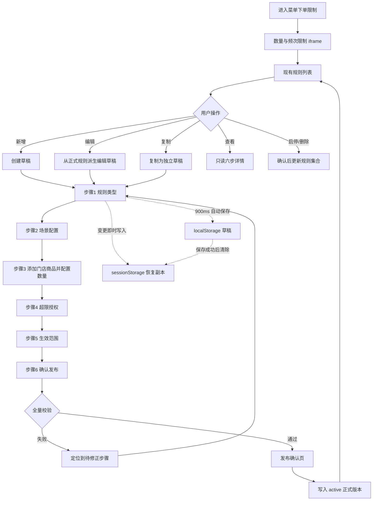

# 菜单下单限制产品需求文档

> 范围：完整菜单下单限制功能域（应用入口、规则列表及六步规则编辑与发布）  
> 版本：v1  
> 导出日期：2026-08-19  
> 代码依据：`origin/main@c1592715aa9c77540b9d29ca3c5dbc8be486f07f`；`src/main.ts`、`src/config/navigation.ts`、`src/config/foh-menu-order-limits-ui.ts`、`dist/Configuration center/order-limit.html`、`dist/Configuration center/order-limit-rule-editor.html`、`dist/Configuration center/order-limit-store-select.html`、`dist/Configuration center/order-limit-publish-confirm.html`、`dist/Configuration center/assets/order-limit-flow.js`  
> 关联 SPEC：[`./SPEC.md`](./SPEC.md)

## 变更记录

| 日期 | 说明 |
|------|------|
| 2026-08-19 | 首次导出 |
| 2026-08-19 | 按当前代码重写：删除未实现与已移除逻辑，仅保留现有字段、业务逻辑与设计 |

---

## 1. 文档元信息

本 PRD 从当前代码反向整理，只描述代码中真实存在且用户可达的行为。需求编号统一使用 `MOL` 前缀并在整个范围内连续编号。

包含：

- 应用 Hash 路由、三页签容器及“数量与频次限制”同源 iframe。
- 现有规则列表、组合筛选、字段设置及规则全生命周期操作。
- 新增、编辑、复制、只读查看所共用的六步编辑器。
- 按门店添加分类/菜品、按产线配置数量、场景区间、超限授权、生效范围与发布确认。
- 编辑草稿写入 `localStorage`；编辑变更同时写入 `sessionStorage` 恢复副本，并在草稿保存成功或发布完成时清除该副本（当前代码不读取该副本）。
- 旧规则、旧步骤、旧门店字段和“无限制”数量单元格的兼容归一化。

不包含：

- “每轮菜品互斥/组合”及“其他设置”页签内部业务的详细需求；本范围只记录其应用入口与页签承载关系。
- `order-limit.html` 中隐藏的“点菜模拟验证”。

数据事实：`order-limit-flow.js` 使用 `localStorage` 的 `restaurantRules` 保存规则集合，列表字段偏好同样保存在 `localStorage`；编辑中的恢复副本使用 `sessionStorage`。页面中的门店、商品、会员等级、授权角色均为页面内静态数据。

## 2. 背景与目标

- **问题**：需要用一个集中入口维护菜单数量与频次限制，并把规则类型、场景、门店商品、数量矩阵、授权与生效条件组织成可校验、可发布的配置流程。
- **目标**：
  1. 让配置人员从现有规则快速定位、查看和维护规则。
  2. 通过六步向导约束配置顺序，阻止不完整规则发布。
  3. 支持不同门店、产线、商品和人数/轮次场景配置差异化数量。
  4. 编辑过程自动保存草稿，减少配置中断带来的重填成本。
  5. 发布前提供完整汇总与二次确认，避免不完整规则进入规则列表。

## 3. 角色与权限边界

| 角色 | 视角 | 可见/可操作 |
|------|------|-------------|
| 后台配置人员 | 集团/品牌后台菜单限制页 | 进入列表，新增、编辑、复制、查看、启停、删除及发布规则 |
| 规则查看人员 | 同一后台页面 | 通过规则名称进入 `view=1` 只读编辑器；不可修改、保存或继续下一步 |
| 授权执行角色 | 规则数据中的“所需权限” | 值班经理、主管、店长、区域经理为页面静态下拉值，按授权范围逐项选择 |

权限边界：

- 导航、列表操作与发布按钮在当前实现中对所有进入页面的用户可用，不做按钮级权限区分。
- 规则中的“所需权限”是被配置的规则数据，描述超限时由谁执行授权，不影响后台页面本身的可操作范围。

## 4. 范围边界

- **In**：应用入口/iframe、现有规则列表、筛选、字段设置、新增、编辑、复制、查看、启停、删除、六步编辑器、添加商品、数量规则列表、场景区间、授权、生效范围、草稿自动保存、发布确认、兼容迁移。
- **Out**：其他两个页签的内部业务规则、隐藏的点菜模拟验证。

## 5. 核心业务场景

关键分支：

- 编辑正式规则时先产生带 `sourceRuleId` 的草稿；发布后用正式规则原 ID 替换源规则，并移除临时草稿。
- 复制规则产生独立草稿，不保留为源规则更新关系。
- 只读查看复用六步详情，但禁止变更、自动保存和下一步操作。
- 只有已添加商品的门店可选为生效门店；发布时仅本次选择的生效门店计入规则的运行快照。

## 6. 功能需求清单

| 编号 | 需求类型 | 需求描述 | 关联编号 |
|------|----------|----------|----------|
| MOL-01 | 入口 | 在“前厅管理中心/叫号”导航提供“菜单下单限制”入口，并兼容旧 Hash 路由重定向 | → MOL-02 |
| MOL-02 | 展示 | 页面提供数量与频次限制、每轮菜品互斥/组合、其他设置三个可键盘切换的页签 | → MOL-03 |
| MOL-03 | 交互 | 数量页签以同源 iframe 展示列表；编辑、门店选择、发布确认页面进入全窗 iframe | → MOL-04 |
| MOL-04 | 展示 | 规则列表展示筛选条、可配置列、总数/筛选数、规则状态和操作 | → MOL-05～MOL-12 |
| MOL-05 | 筛选 | 支持门店、状态、人数、轮次、时间五项组合精确筛选并可重置 | → MOL-04 |
| MOL-06 | 设置 | 支持按分组显示/隐藏列表字段、恢复默认，并固定规则名称、状态、操作列 | → MOL-04 |
| MOL-07 | 操作 | 新增规则时创建独立草稿并进入六步编辑器 | → MOL-13 |
| MOL-08 | 操作 | 编辑规则时保留源规则，发布后以源 ID 替换；编辑草稿则继续原草稿 | → MOL-13, MOL-29 |
| MOL-09 | 操作 | 复制规则时创建独立草稿，避免覆盖源规则 | → MOL-13 |
| MOL-10 | 展示 | 点击规则名称以只读模式查看六步配置 | → MOL-13 |
| MOL-11 | 操作 | 非草稿规则可启用/禁用；草稿不显示启停操作 | → MOL-04 |
| MOL-12 | 操作 | 删除规则须经自定义确认对话框，取消不删除，确认后更新列表 | → MOL-04 |
| MOL-13 | 流程 | 编辑器由规则类型、场景配置、限购数量、超限授权、生效范围、确认发布六步组成 | → MOL-14～MOL-29 |
| MOL-14 | 配置 | 步骤 1 配置限购主体、统计周期、限购对象、规则名称、描述及儿童人数口径 | → MOL-15 |
| MOL-15 | 校验 | 步骤 1 必须选择主体/周期/对象并填写非空规则名称 | → MOL-16 |
| MOL-16 | 配置 | 步骤 2 维护人数区间；多轮规则同时维护轮次区间 | → MOL-17 |
| MOL-17 | 校验 | 区间必须从 1 连续覆盖、无重叠断档，且只有最后一区间可为“及以上” | → MOL-18 |
| MOL-18 | 操作 | 步骤 3 可打开“添加商品”，按门店和产线搜索、选择分类或菜品并加入规则 | → MOL-19 |
| MOL-19 | 逻辑 | 每家门店维护独立商品结构、产线与数量配置，未添加目标的门店不算参与门店 | → MOL-20 |
| MOL-20 | 展示 | 数量规则列表支持门店、产线、人数、轮次、状态筛选及分页 | → MOL-21 |
| MOL-21 | 操作 | 数量规则支持逐项填写、勾选后批量填写、跨场景复制和跨产线复制 | → MOL-22 |
| MOL-22 | 校验 | 每个参与门店×场景×产线×目标均须配置数量，0 为有效配置，空值不是“无限制” | → MOL-23 |
| MOL-23 | 展示 | 提供已选商品预览和已配置数量预览，并支持检索/筛选 | → MOL-24 |
| MOL-24 | 配置 | 步骤 4 可关闭授权形成硬性拒绝，或配置本次操作/当前轮/当前订单授权范围、默认范围、所需权限与原因必填 | → MOL-25 |
| MOL-25 | 校验 | 开启授权时至少选一个范围、默认范围须属于已选范围、每个范围须选择所需权限 | → MOL-26 |
| MOL-26 | 配置 | 步骤 5 配置有效日期、活动周期、营业时段、会员范围和生效门店 | → MOL-27 |
| MOL-27 | 校验 | 生效范围须有门店及周期明细；结束日不得早于开始日，未添加商品的门店不可生效 | → MOL-28 |
| MOL-28 | 展示 | 步骤 6 汇总规则、计算方式、商品/产线、场景、数量完成度、授权及生效条件并可返回修正 | → MOL-29 |
| MOL-29 | 发布 | 发布确认再次全量校验；成功生成 active 规则并写回规则集合，失败保留草稿可重试 | → MOL-04 |
| MOL-30 | 草稿 | 编辑变更立即写入 sessionStorage 恢复副本，900ms 后自动保存至 localStorage 草稿并清除副本 | → MOL-13 |
| MOL-31 | 兼容 | 加载时迁移旧规则字段、旧七步进度、门店配置/部署选择及无数量“无限制”单元格 | → MOL-04 |

## 7. 用户故事与验收标准

### MOL-01 应用入口与旧路由

**用户故事**：作为后台配置人员，我希望从统一入口进入菜单下单限制，以便集中维护规则。

**验收（Given / When / Then）**：

- Given 用户打开 `/operations/queue-call/menu-order-limits` When 页面挂载 Then 展示菜单下单限制业务页。
- Given 用户访问旧 `/permissions/order-limit` 或旧设置组书签 When 路由归一化 Then 重定向到新入口或对应页签。

### MOL-02 三页签容器

**用户故事**：作为配置人员，我希望按限制类型切换工作区，以便区分数量规则与其他限制。

**验收（Given / When / Then）**：

- Given 已进入页面 When 查看顶部 Then 显示三个页签且默认选中“数量与频次限制”。
- Given 焦点位于页签 When 按左右方向键 Then 在相邻页签间切换，边界不循环。

### MOL-03 iframe 与全屏流程

**用户故事**：作为配置人员，我希望编辑流程拥有完整可用空间，同时返回列表时恢复嵌入布局。

**验收（Given / When / Then）**：

- Given 数量页签激活 When 加载 Then 以 `order-limit.html` 同源 iframe 展示列表。
- Given iframe 导航到编辑器、门店选择或发布确认页 When load 触发 Then iframe 覆盖应用全窗并锁定外层滚动；返回列表后恢复。

### MOL-04 现有规则列表

**用户故事**：作为配置人员，我希望浏览规则及关键摘要，以便判断维护对象。

**验收（Given / When / Then）**：

- Given 存在规则 When 列表渲染 Then 显示当前列、状态、操作，并显示“筛选 N / 共 M 条”。
- Given 没有规则或筛选无结果 When 渲染 Then 分别显示“暂无规则”或“暂无匹配规则”。

### MOL-05 组合筛选

**用户故事**：作为配置人员，我希望按多个维度精确筛选，以便快速找到规则。

**验收（Given / When / Then）**：

- Given 选择任意门店、状态、人数、轮次、时间组合 When 筛选变化 Then 仅保留同时满足全部条件的规则。
- Given 已设置筛选 When 点击“重置筛选” Then 所有条件清空并恢复全量列表。

### MOL-06 字段设置

**用户故事**：作为配置人员，我希望定制列表字段，以便聚焦当前审查内容。

**验收（Given / When / Then）**：

- Given 打开字段设置 When 勾选或取消可选字段 Then 列表立即按定义顺序更新并持久化偏好。
- Given 操作固定字段 When 查看设置 Then 规则名称、状态、操作始终勾选且不可取消；恢复默认后回到默认列集合。

### MOL-07 新增规则

**用户故事**：作为配置人员，我希望创建新规则，以便定义新的菜单限制。

**验收（Given / When / Then）**：

- Given 位于列表 When 点击“新增规则” Then 生成唯一 ID、状态为 `draft` 的默认草稿并进入步骤 1。

### MOL-08 编辑规则

**用户故事**：作为配置人员，我希望安全编辑正式规则，以便发布前不影响现行版本。

**验收（Given / When / Then）**：

- Given 选择 active/inactive 规则 When 点击编辑 Then 创建关联源规则的编辑草稿，源规则在发布前保持不变。
- Given 选择 draft 规则 When 点击编辑 Then 继续该草稿的已保存步骤与内容。

### MOL-09 复制规则

**用户故事**：作为配置人员，我希望复制现有规则，以便复用配置创建新规则。

**验收（Given / When / Then）**：

- Given 任意规则 When 点击复制 Then 创建内容副本、独立 ID 和 draft 状态，后续发布不覆盖源规则。

### MOL-10 只读查看

**用户故事**：作为查看人员，我希望按编辑结构审阅规则，以便理解完整配置。

**验收（Given / When / Then）**：

- Given 点击规则名称 When 进入详情 Then 以 `view=1` 展示六步配置。
- Given 处于只读模式 When 尝试编辑或继续 Then 控件不产生数据变更，不执行自动保存，下一步不可用。

### MOL-11 启用与禁用

**用户故事**：作为配置人员，我希望切换正式规则状态，以便控制规则是否启用。

**验收（Given / When / Then）**：

- Given active 规则 When 点击禁用 Then 状态变为 inactive；反向操作恢复 active。
- Given draft 规则 When 查看操作 Then 不显示启用/禁用按钮。

### MOL-12 删除规则

**用户故事**：作为配置人员，我希望在确认后删除规则，以避免误删。

**验收（Given / When / Then）**：

- Given 点击删除 When 自定义确认框打开 Then 标题、说明及“确认删除”动作清晰，取消不变更数据。
- Given 用户确认删除 When 操作完成 Then 规则从规则集合和列表中移除。

### MOL-13 六步编辑器

**用户故事**：作为配置人员，我希望按顺序完成六步配置，以便降低遗漏。

**验收（Given / When / Then）**：

- Given 新草稿 When 初次进入 Then 仅步骤 1 可访问；完成校验后逐步解锁后续步骤。
- Given 已解锁某一步 When 点击步骤导航 Then 可返回该步；未解锁步骤保持禁用。

### MOL-14 规则类型

**用户故事**：作为配置人员，我希望定义计算口径，以便系统知道限制对象与周期。

**验收（Given / When / Then）**：

- Given 位于步骤 1 When 配置 Then 可选择限购主体、统计周期、分类/菜品对象并填写名称和描述。
- Given 主体为按人数 When 展示条件 Then 可选择儿童人数继承门店、计入或不计入。

### MOL-15 类型校验

**用户故事**：作为配置人员，我希望基础信息缺失时被阻止，以免生成不可计算规则。

**验收（Given / When / Then）**：

- Given 主体、周期、对象任一未选或名称为空 When 点击下一步 Then 下一步禁用并提示对应校验原因。

### MOL-16 场景区间

**用户故事**：作为配置人员，我希望定义人数与轮次场景，以便每种场景配置不同数量。

**验收（Given / When / Then）**：

- Given 位于步骤 2 When 编辑 Then 至少保留一个人数区间，并可增删区间。
- Given 周期为多轮 When 编辑 Then 同时显示轮次区间；非多轮不要求轮次区间。

### MOL-17 区间连续性

**用户故事**：作为配置人员，我希望系统检查区间覆盖，以免订单落入空档或重复命中。

**验收（Given / When / Then）**：

- Given 区间未从 1 开始、重叠、断档、结束小于开始或非正整数 When 继续 Then 阻止并显示原因。
- Given 最后一区间未设为“及以上”或中间区间设为“及以上” When 继续 Then 阻止。

### MOL-18 添加商品

**用户故事**：作为配置人员，我希望按门店添加商品，以便配置门店差异。

**验收（Given / When / Then）**：

- Given 位于步骤 3 When 打开“添加商品” Then 可选门店、产线，并搜索/选择与规则对象类型一致的分类或菜品。
- Given 完成选择 When 确认 Then 对应门店的商品结构加入草稿并出现在数量列表。

### MOL-19 门店独立配置

**用户故事**：作为配置人员，我希望各门店拥有独立商品与数量，以便适配不同菜单。

**验收（Given / When / Then）**：

- Given 两家门店选择不同目标 When 保存 Then 各自的产线、目标和数量互不覆盖。
- Given 某门店没有任何目标 When 计算参与门店 Then 不将其计入，也不可作为生效门店。

### MOL-20 数量规则列表

**用户故事**：作为配置人员，我希望筛选数量单元格，以便处理大型矩阵。

**验收（Given / When / Then）**：

- Given 已添加商品 When 查看列表 Then 每行关联门店、产线、人数场景、轮次场景、目标与配置状态。
- Given 设置筛选或分页 When 列表更新 Then 只影响当前展示，不删除或重写未显示配置。

### MOL-21 数量批量与复制

**用户故事**：作为配置人员，我希望批量填写和复制，以便减少重复录入。

**验收（Given / When / Then）**：

- Given 勾选若干规则行 When 输入批量数量并应用 Then 所有已勾选单元格写入同一数值。
- Given 选择源场景或源产线 When 确认复制并覆盖 Then 只向存在匹配目标的目的单元格复制，并反馈复制结果。

### MOL-22 数量完整性

**用户故事**：作为配置人员，我希望所有数量都有明确值，以便规则可确定执行。

**验收（Given / When / Then）**：

- Given 任一应配单元格为空 When 继续或发布 Then 阻止并提示未配置数量。
- Given 单元格填写 0 When 校验 Then 视为有效配置；Given 旧数据为 `configured=true,value=null` When 加载 Then 归一化为未配置。

### MOL-23 配置预览

**用户故事**：作为配置人员，我希望预览已选目标和已配数量，以便复核复杂规则。

**验收（Given / When / Then）**：

- Given 已选择商品 When 打开已选预览 Then 可查看并搜索目标；分类规则可继续查看分类下菜品。
- Given 已配置数量 When 打开配置预览 Then 可按门店、人数、轮次、产线、状态检索或筛选。

### MOL-24 超限授权

**用户故事**：作为配置人员，我希望定义超限后的处理，以便在拒绝与人工放行之间选择。

**验收（Given / When / Then）**：

- Given 关闭授权 When 规则超限语义被汇总 Then 显示“不允许授权”的硬性拒绝口径。
- Given 开启授权 When 配置 Then 可勾选本次操作、当前轮、当前订单三种范围，为每个已启用范围选择所需权限（值班经理/主管/店长/区域经理），并设置默认授权范围与“授权原因必须填写”。
- Given 取消勾选某范围 When 该范围恰为默认范围 Then 默认范围自动切换为剩余已启用范围的首项，且该范围的权限下拉禁用。

### MOL-25 授权校验

**用户故事**：作为配置人员，我希望授权配置完整，以免出现无权限主体的放行路径。

**验收（Given / When / Then）**：

- Given 开启授权但未选范围、默认范围不在已选集合或任一范围未选所需权限 When 继续 Then 阻止并提示修正。

### MOL-26 生效范围

**用户故事**：作为配置人员，我希望定义规则何时、对谁、在哪些门店生效。

**验收（Given / When / Then）**：

- Given 位于步骤 5 When 配置 Then 可设置开始/结束日期、每天/每周/每月周期、营业时段、全部顾客/指定会员等级及生效门店。
- Given 结束日期留空 When 汇总 Then 表示长期生效；每月不存在的日期按页面说明跳过。

### MOL-27 生效范围校验

**用户故事**：作为配置人员，我希望阻止无效生效条件，以免发布不可执行规则。

**验收（Given / When / Then）**：

- Given 未选生效门店、每周未选星期、每月未选日期、指定会员未选等级或结束早于开始 When 继续 Then 阻止。
- Given 门店未添加商品 When 选择生效门店 Then 复选框禁用，发布校验亦拒绝。

### MOL-28 发布前汇总

**用户故事**：作为配置人员，我希望发布前一次性复核，以便发现错误并快速修正。

**验收（Given / When / Then）**：

- Given 进入步骤 6 When 校验通过 Then 展示规则、计算方式、门店商品、产线、场景、数量完成度、生效条件与授权摘要。
- Given 任一校验失败 When 查看汇总 Then 显示失败原因和“前往修正”，点击返回对应步骤。

### MOL-29 发布确认

**用户故事**：作为配置人员，我希望二次确认后发布，以免误下发。

**验收（Given / When / Then）**：

- Given 全量校验通过 When 点击保存并下发 Then 进入独立发布确认页，再次展示规则名称、计算方式、商品范围、数量矩阵完成度与生效门店摘要。
- Given 点击确认发布 When 写入成功 Then 草稿转为 active 并返回列表；When 写入失败 Then 草稿保留且可重试。
- Given 编辑正式规则发布成功 When 更新集合 Then 新版本沿用源规则 ID 并删除临时编辑草稿。

### MOL-30 草稿自动保存与恢复副本

**用户故事**：作为配置人员，我希望编辑内容自动保存，以降低意外中断风险。

**验收（Given / When / Then）**：

- Given 编辑字段产生变更 When 立即发生 Then 写入 `sessionStorage` 恢复副本并显示未保存状态。
- Given 变更后约 900ms 无新变更 When 自动保存触发 Then 草稿写入 `localStorage` 并清除该恢复副本。
- Given 自动保存失败 When 用户立即离开 Then 提示当前不能安全离开。
- Given 发布完成 When 清理草稿 Then 同时删除该草稿对应的 `sessionStorage` 恢复副本。

### MOL-31 兼容迁移

**用户故事**：作为已有数据使用者，我希望旧规则能继续打开，以便不因结构升级丢失配置。

**验收（Given / When / Then）**：

- Given 旧规则只有 legacy 类型、周期、对象、数量和门店字段 When 加载 Then 映射到当前 draft，并保留兼容输出字段。
- Given 草稿来自旧七步或旧六步顺序 When 加载 Then 按版本映射到当前六步进度。
- Given 旧数据没有门店独立配置或部署选择版本 When 加载 Then 从兼容字段生成 `storeConfigs`、参与/生效门店；无效门店被排除。

## 8. 页面/入口清单

| 入口 | 路径/注册点 | 依赖 |
|------|-------------|------|
| 主导航 | `src/config/navigation.ts` → `/operations/queue-call/menu-order-limits` | `src/main.ts` 路由挂载 |
| 数量与频次限制页签 | `src/config/foh-menu-order-limits-ui.ts` → `renderQuantityPanel` | iframe `dist/Configuration center/order-limit.html` |
| 每轮菜品互斥/组合页签 | `/operations/queue-call/menu-order-limits/dish-round` | `module-settings-dish-rules-ui.ts`；详细业务不在本 PRD |
| 其他设置页签 | `/operations/queue-call/menu-order-limits/other` | 多个 module setting 面板；详细业务不在本 PRD |
| 规则列表 | `dist/Configuration center/order-limit.html` | `localStorage.restaurantRules` |
| 六步编辑器 | `dist/Configuration center/order-limit-rule-editor.html?draftId=<id>` | `assets/order-limit-flow.js` |
| 只读详情 | `order-limit-rule-editor.html?ruleId=<id>&view=1` | 同一六步编辑器 |
| 门店选择兼容页 | `dist/Configuration center/order-limit-store-select.html` | 当前流程会归一化并返回编辑器步骤 5 |
| 发布确认 | `dist/Configuration center/order-limit-publish-confirm.html?draftId=<id>` | 全量校验、规则集合写入 |
| 旧入口兼容 | `/permissions/order-limit`、`/permissions/settings/guest-order-limits`、旧设置组路径 | `src/main.ts` 重定向 |

## 9. 非功能与约束

- **持久化**：规则、列表字段偏好保存在同源 `localStorage`，恢复副本保存在 `sessionStorage`；清除站点数据或更换浏览器/设备会丢失。
- **性能**：数量规则列表在前端做筛选与分页，全部数据在内存中展开。
- **可访问性**：页签使用 `role=tab/tablist/tabpanel` 并支持左右键；确认弹窗满足焦点进入、Esc/遮罩取消、焦点归还及 iframe 顶层挂载规范。
- **可恢复性**：自动保存延迟为 900ms；`sessionStorage` 恢复副本只在同一会话内写入与清除。
- **兼容性**：加载时容忍损坏 JSON（回退空集合），并兼容旧步骤与旧字段结构。
- **语言**：页面文案为简体中文。
- **浏览器环境**：依赖同源 iframe、`localStorage`、`sessionStorage` 和 URL 查询参数。
- **对话框规范**：所有二次确认使用页面内自定义对话框，不使用浏览器原生 `alert/confirm/prompt`。
