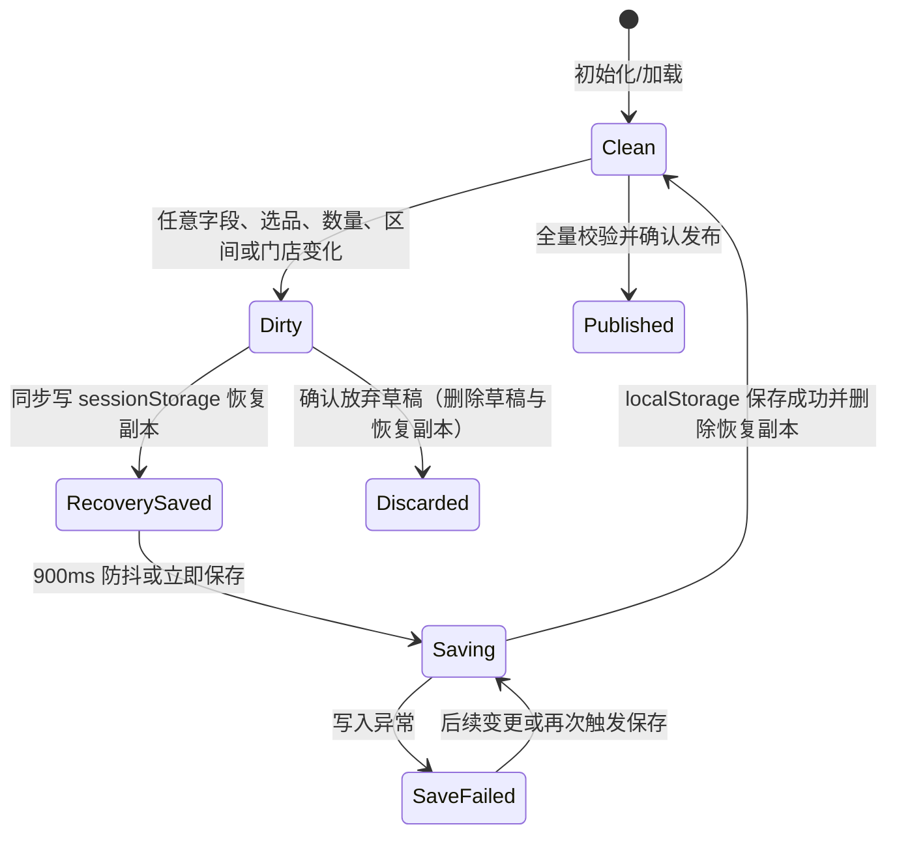
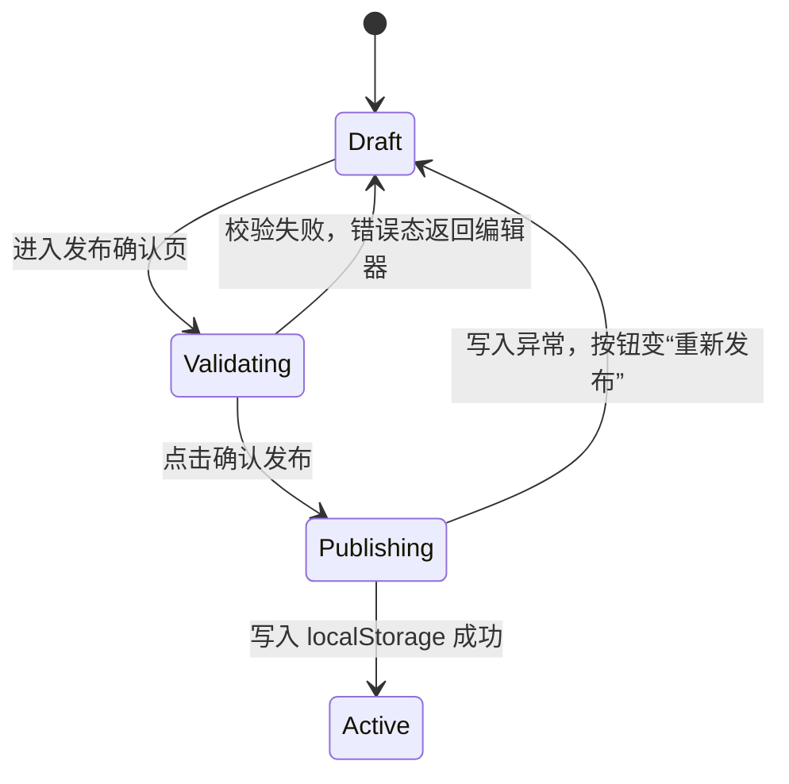

# 菜单下单限制 SPEC（研发主用）

> 范围：前厅管理中心 / 菜单下单限制 / 数量与频次限制（规则列表、六步规则编辑、发布确认）  
> 版本：v1  
> 导出日期：2026-08-19  
> 代码依据：`dist/Configuration center/order-limit.html`、`dist/Configuration center/order-limit-rule-editor.html`、`dist/Configuration center/order-limit-publish-confirm.html`、`dist/Configuration center/order-limit-store-select.html`、`dist/Configuration center/assets/order-limit-flow.js`、`dist/Configuration center/assets/embedded-mode.js`、`dist/Configuration center/assets/app-dialogs.js`、`src/main.ts`、`src/config/navigation.ts`、`src/config/foh-menu-order-limits-ui.ts`  
> 关联 PRD：[`./PRD.md`](./PRD.md)  
> 本文口径：只描述当前代码已实现的字段、状态、校验、交互与存储行为。

## 变更记录

| 日期 | 说明 |
|------|------|
| 2026-08-19 | 首次导出 |
| 2026-08-19 | 按当前代码重写：删除未实现与已移除内容，仅保留现有字段、状态机、校验、交互与存储行为 |

---

## 1. 规格元信息

### 1.1 需求域与 MOL 编号

| 需求域 | 编号 | 本 SPEC 落点 |
|---|---|---|
| 应用入口、三页签与 iframe 全屏 | MOL-01～MOL-03 | 5.1、6.1、7.3～7.4 |
| 规则列表、筛选与字段设置 | MOL-04～MOL-06 | 3.8、5.2、6.2 |
| 新增、编辑、复制、只读、启停与删除 | MOL-07～MOL-12 | 4.1、5.3、5.11、6.2 |
| 六步编辑器与规则类型 | MOL-13～MOL-15 | 5.4、6.3 |
| 场景区间与连续校验 | MOL-16～MOL-17 | 5.5、6.3 |
| 添加商品、门店隔离、数量列表/操作/完整性/预览 | MOL-18～MOL-23 | 5.6～5.8、6.4～6.5 |
| 超限授权配置与校验 | MOL-24～MOL-25 | 5.10、6.3 |
| 生效范围配置与校验 | MOL-26～MOL-27 | 5.9、5.12、6.3 |
| 发布前汇总与发布确认 | MOL-28～MOL-29 | 4.3、5.12、6.3 |
| 草稿自动保存与恢复副本 | MOL-30 | 4.2、7.2 |
| 兼容迁移 | MOL-31 | 7.5 |

### 1.2 证据优先级

1. `dist/Configuration center/assets/order-limit-flow.js`（编辑器、数量列表、发布逻辑的唯一实现）。
2. `dist/Configuration center/order-limit.html`（规则列表、列偏好、静态原型数据）。
3. `src/main.ts`、`src/config/navigation.ts`、`src/config/foh-menu-order-limits-ui.ts`、`assets/embedded-mode.js`（入口、页签、iframe 与嵌入参数）。

### 1.3 实现形态

- 应用容器为 TypeScript + Vite；限购列表、编辑器、发布确认页为 `dist/Configuration center` 下的原生 HTML/JavaScript 页面，由同源 iframe 承载。
- 规则数据与列偏好保存在 `localStorage`；编辑中的恢复副本写入 `sessionStorage`。
- 门店、菜单结构、分类、菜品、会员等级、授权“所需权限”候选值均为页面内静态数据。

## 2. 术语与枚举

### 2.1 规则维度

| 枚举 | 值 | 含义 |
|---|---|---|
| `subject` | `order` | 按桌/订单限购；整桌共享配置上限 |
| `subject` | `party_size` | 按人数限购；人均上限乘有效人数，不绑定具体食客 |
| `period` | `per_round` | 每轮使用同一上限并独立累计 |
| `period` | `multi_round` | 不同轮次区间可配置不同上限 |
| `period` | `order_lifetime` | 订单全部轮次累计 |
| `targetType` | `category` | 分类内商品共享数量池 |
| `targetType` | `dish` | 每个指定菜品独立累计 |

证据：`order-limit-flow.js` / `renderStepOne`、`mapLegacyType`、`mapLegacyPeriod`、`mapLegacyTarget`

### 2.2 规则状态

| 值 | 含义 | 列表可用操作 |
|---|---|---|
| `draft` | 草稿 | 编辑、复制、删除 |
| `active` | 启用/已发布 | 查看、编辑（派生草稿，发布后覆盖源规则）、复制、禁用、删除 |
| `inactive` | 禁用 | 查看、编辑、复制、启用、删除 |

状态枚举只有以上三个值。

证据：`order-limit.html` / `ruleStatusHtml`、`ruleActionsHtml`；`order-limit-flow.js` / `initializeDraftRule`、`publishDraft`

### 2.3 数量单元格三态

| `configured` | `value` | 语义 |
|---|---:|---|
| `false` 或单元格不存在 | `null`/缺失 | 未配置；不能通过第 3 步完整性校验 |
| `true` | `0` | 明确禁止；属于已配置 |
| `true` | 非负整数 | 有效限购数量 |

旧数据 `{ configured: true, value: null }` 归一化为 `{ configured: false, value: null }`，不表达“无限制”。

证据：`order-limit-flow.js` / `normalizeUnlimitedLimitCells`、`validateStep`、`renderLimitRuleList`

### 2.4 条件与授权枚举

| 字段 | 值 |
|---|---|
| `activityCycle` | `daily` / `weekly` / `monthly` |
| `memberMode` | `all` / `specified` |
| `childCountPolicy` | `inherit` / `include` / `exclude` |
| `businessHourSetupMode` | `all_full` / `per_slot` |
| 营业时段 `mode` | `full` / `custom` |
| 授权范围 | `operation` / `round` / `order` |
| 星期 | `mon` / `tue` / `wed` / `thu` / `fri` / `sat` / `sun` |
| 产线 | `kiosk` / `emenu` / `sdi` |

证据：`order-limit-flow.js` / `defaultDraft`、`normalizeBusinessHourTimeConditions`、`normalizeActivityCycleConditions`

### 2.5 门店术语

- **参与门店**：`participatingStoreIds`；归一化后只保留具有至少一个有效目标的可用门店。
- **已添加门店**：`addedStoreIds(draft)` 返回的门店；必须存在于门店目录且 `storeConfigs[storeId].targetIds.length > 0`。
- **生效门店**：`deployStoreIds`；发布时只有这些门店进入正式快照。
- **主动排除门店**：`deployExcludedStoreIds`；记忆用户取消的生效选择，防止归一化自动重新选中。

证据：`order-limit-flow.js` / `addedStoreIds`、`normalizeDeploymentSelection`、`buildPublishedDraft`

## 3. 数据模型

### 3.1 本地规则包装对象 `StoredRule`

| 字段名 | 类型 | 必填 | 默认值 | 说明 | 约束/校验 |
|---|---|---:|---|---|---|
| `id` | number/string | 是 | 当前数组最大数字 ID + 1 | 本地规则 ID | 以字符串等值方式查找 |
| `sourceRuleId` | number/string/null | 草稿可选 | `null` | 编辑正式规则时指向源规则；复制时为空 | 发布时替换源规则并删除临时草稿 |
| `status` | `draft\|active\|inactive` | 是 | `draft` | 规则状态 | 列表按状态渲染操作 |
| `created` | `YYYY-MM-DD` | 是 | 当日 | 创建日期 | 发布覆盖源规则时保留源日期 |
| `publishedAt` | ISO datetime | 正式规则 | 发布时生成 | 本地发布时间 | 仅记录，不参与筛选与校验 |
| `editorDraft` | `EditorDraft` | 是 | `defaultDraft()` | 草稿或正式运行快照 | 正式规则中已裁剪到生效门店 |
| `authoringDraft` | `EditorDraft` | 正式规则 | 发布时保存 | 发布前的完整作者草稿 | 编辑正式规则时优先读取它 |
| 兼容顶层字段 | 多种 | 是 | 构建时派生 | 供旧列表与页内模拟消费 | 由 `storeConfigs` 投影而来 |

证据：`order-limit-flow.js` / `initializeDraftRule`、`nextRuleId`、`buildCompatibilityRule`、`publishDraft`

### 3.2 `EditorDraft`

| 字段名 | 类型 | 必填 | 默认值 | 说明 | 约束/校验 |
|---|---|---:|---|---|---|
| `currentStep` | number | 是 | `1` | 当前步骤 | 范围 1～6 |
| `highestStep` | number | 是 | `1` | 已到达最高步骤 | 用于导航可达性 |
| `subject` | enum/null | 是 | `null` | 限购主体 | 第 1 步必填 |
| `period` | enum/null | 是 | `null` | 统计周期 | 第 1 步必填 |
| `targetType` | enum/null | 是 | `null` | 限购对象 | 第 1 步必填；切换会清空已选商品 |
| `name` | string | 是 | `""` | 规则名称 | 必填，UI `maxlength=60` |
| `description` | string | 否 | `""` | 规则描述 | UI `maxlength=200` |
| `partyRanges` | `Range[]` | 是 | `[{min:1,max:null}]` | 人数区间 | 连续、从 1 开始、末段开放 |
| `roundRanges` | `Range[]` | 是 | 同上 | 轮次区间 | 仅 `multi_round` 校验与展开 |
| `conditions` | `Conditions` | 是 | 见 3.5 | 生效条件 | 第 1、5 步分别使用 |
| `authorization` | `Authorization` | 是 | 见 3.6 | 超限授权 | 第 4 步校验 |
| `participatingStoreIds` | string[] | 是 | `[]` | 参与门店 | 归一化后只保留已添加门店 |
| `activeStoreId` | string | 是 | `""` | 编辑时的活动门店 | 编辑态字段 |
| `storeConfigs` | `Record<string,StoreConfig>` | 是 | `{}` | 按门店的商品与数量权威数据 | 门店间深拷贝隔离 |
| `deployStoreIds` | string[] | 是 | `[]` | 本次生效门店 | 必须是已添加门店且至少 1 家 |
| `deployExcludedStoreIds` | string[] | 是 | `[]` | 主动排除记录 | 只保留可用且有配置的门店 |
| `deploymentSelectionVersion` | number | 是 | `1` | 生效门店选择迁移版本 | 缺失时执行一次迁移 |
| `productQuantityMergedVersion` | number | 迁移后是 | `2` | 步骤结构迁移版本 | 依次执行 v1、v2 映射 |
| `legacyCompatibilityFallback` | `StoreConfig` | 是 | 空配置 | 无门店记录时的旧顶层配置留存 | 不参与发布校验 |
| 顶层 `structureByLine/productLines/targetIds/limits` | 兼容字段 | 是 | 空 | 从一个兼容门店投影 | 业务编辑以 `storeConfigs` 为准 |

证据：`order-limit-flow.js` / `defaultDraft`、`normalizeStoreDraft`、`normalizeMergedProductQuantitySteps`

### 3.3 `StoreConfig`

| 字段名 | 类型 | 必填 | 默认值 | 说明 | 约束/校验 |
|---|---|---:|---|---|---|
| `structureByLine` | object | 是 | `{kiosk:[],emenu:[],sdi:[]}` | 产线→组→类→菜选品结构 | 经 `MenuPicker.normalizeByLine` 归一化 |
| `productLines` | string[] | 是 | `[]` | 当前门店实际有目标的产线 | 从结构派生 |
| `targetIds` | string[] | 是 | `[]` | 当前限购对象目标 ID | 从结构派生 |
| `limits` | `Record<LimitKey,LimitCell>` | 是 | `{}` | 数量矩阵 | 删除目标或产线时剪枝失效键 |

证据：`order-limit-flow.js` / `createEmptyStoreConfig`、`cloneStoreConfig`、`syncStoreTargetsFromStructure`

### 3.4 `Range`、`LimitKey`、`LimitCell`

| 模型/字段 | 类型 | 必填 | 默认值 | 说明 | 约束 |
|---|---|---:|---|---|---|
| `Range.min` | integer | 是 | `1` | 闭区间起点 | 大于 0 |
| `Range.max` | integer/null | 是 | `null` | 闭区间终点；`null` 为“及以上” | 不小于 `min` |
| `LimitKey` | string | 是 | 派生 | `partyIndex\|roundIndex\|productLineId\|targetId` | `targetId` 可含 `\|`，解析时取第 4 段起拼回 |
| `LimitCell.configured` | boolean | 是 | `false` | 是否已显式配置 | `0` 仍为已配置 |
| `LimitCell.value` | 非负整数/null | 是 | `null` | 数量 | UI `min=0`；发布前不得为未配置 |

证据：`order-limit-flow.js` / `limitKey`、`eachLimitCell`、`validateContinuousRanges`、`renderLimitRuleList`

### 3.5 `Conditions`

| 字段名 | 类型 | 必填 | 默认值 | 说明 | 约束/校验 |
|---|---|---:|---|---|---|
| `effectiveFrom` | date string | 是 | 当日 | 开始日期 | 不晚于结束日期 |
| `effectiveTo` | date string | 否 | `""` | 结束日期；空为长期 | 同上 |
| `activityCycle` | enum | 是 | `weekly` | 活动周期 | 周/月模式须至少选 1 项 |
| `daysOfWeek` | weekday[] | 条件必填 | 全周 | 周模式生效日 | 周模式非空 |
| `daysOfMonth` | integer[] | 条件必填 | `[]` | 月模式生效日 | 归一化为 1～31 去重升序 |
| `businessHourSlots` | slot[] | 是 | 晚市整段 | 生效营业时段 | 自定义模式校验起止时间 |
| `businessHourSetupMode` | enum | 是 | `all_full` | 全时段/逐时段 | 非法值按已有 slot 推导 |
| `businessHour` 等 4 个旧字段 | string | 兼容 | 晚市/整段/空 | 单时段旧消费者兼容 | 由新 slots 同步 |
| `memberMode` | enum | 是 | `all` | 全部顾客/指定会员 | 指定时 `memberLevelIds` 非空 |
| `memberLevelIds` | string[] | 条件必填 | `[]` | 会员等级 | 指定模式非空 |
| `childCountPolicy` | enum | 是 | `inherit` | 儿童人数口径 | 仅按人数规则展示 |

证据：`order-limit-flow.js` / `defaultDraft`、`normalizeBusinessHourTimeConditions`、`normalizeActivityCycleConditions`、`validateStep`

### 3.6 `Authorization`

| 字段名 | 类型 | 必填 | 默认值 | 说明 | 约束/校验 |
|---|---|---:|---|---|---|
| `enabled` | boolean | 是 | `true` | 是否允许超限授权 | 关闭时汇总为硬性拒绝 |
| `allowedScopes` | scope[] | 条件必填 | 三种全开 | 可授权范围 | 开启时至少 1 个 |
| `defaultScope` | scope/`""` | 条件必填 | `round` | 默认范围 | 必须属于允许范围 |
| `scopePermissions` | `Record<scope,string>` | 条件必填 | 值班经理/主管/店长 | 每范围“所需权限”，取值为页面静态角色候选（值班经理/主管/店长/区域经理） | 每个启用范围必须非空 |
| `reasonRequired` | boolean | 是 | `true` | 是否要求填写授权原因 | 配置项 |

证据：`order-limit-flow.js` / `defaultDraft`、`renderScopeRow`、`validateStep`

### 3.7 数量列表临时状态 `limitRuleList`

| 字段 | 类型/默认 | 说明 |
|---|---|---|
| `storeId` | string/`""` | 门店筛选 |
| `partyKey` | string/`""` | 人数区间筛选 |
| `roundKey` | string/`""` | 轮次筛选 |
| `lineId` | string/`""` | 产线筛选 |
| `status` | `""\|configured\|unconfigured` | 配置状态筛选 |
| `query` | string/`""` | 菜品/分类搜索 |
| `page` | integer/`1` | 当前页 |
| `pageSize` | `10\|20\|50\|100`，默认 `20` | 每页条数 |
| `selectedRowIds` | string[]/`[]` | 跨分页保留的规则行勾选 |

该状态不写入发布数据。筛选变化重置页码和勾选；数据变化后清理已失效行 ID。

证据：`order-limit-flow.js` / `normalizeLimitRuleListState`、`renderLimitRuleList`、相关 `data-limit-rule-*` 事件

### 3.8 列表列偏好

存储值：`{ version: 1, visible: string[] }`。

- 默认列：`name,strategy,persons,productScope,effectiveStores,effectiveTime,authorization,status,actions`。
- 固定列：`name,status,actions`，即使偏好缺失也强制补回。
- 可选列按六步分组，包括描述、主体、周期、对象、儿童口径、人数/轮次区间、参与门店、产线、目标数、完成度、授权范围/默认值/权限/原因、日期/周期/营业时段/会员。
- 未知列删除、重复列去重，最终按定义顺序渲染。

证据：`order-limit.html` / `RULE_COLUMN_PREFS_KEY`、`RULE_DEFAULT_COLUMNS`、`RULE_FIXED_COLUMNS`、`ruleColumnDefinitions`、`normalizedVisibleRuleColumns`

## 4. 状态机

### 4.1 规则状态机（MOL-07～MOL-12、MOL-29）

**状态列表**：`draft`、`active`、`inactive`。

**流转**：

- 新建 → `draft`（创建并立即写入 `restaurantRules`）。
- 复制任意规则 → 新 `draft`，名称追加“(副本)”，不保留 `sourceRuleId`。
- 编辑正式规则 → 新 `draft`，`sourceRuleId=正式规则.id`。
- `draft` → `active`（触发：发布确认页点击确认；执行全量与生效门店完整性校验）。
- 编辑来源草稿发布：替换源规则，删除临时草稿，保留源 `id/created`。
- `active` ↔ `inactive`（触发：列表启用/禁用）。
- 任意规则 → 删除（触发：自定义确认后从本地规则数组移除）。

**被阻止的流转**：

- 草稿缺失、来源规则缺失、任一步骤校验未通过、无生效门店或生效门店数量未填满时不得发布。

证据：`order-limit-flow.js` / `initializeDraftRule`、`validateAll`、`validateDeployStores`、`publishDraft`；`order-limit.html` / `ruleActionsHtml`

### 4.2 编辑草稿保存状态机（MOL-30）



- `view=1` 时不进入 Dirty、不写恢复副本、不自动保存。
- 保存状态文案：变更时“有未保存的更改”，成功后“草稿已保存 · 刚刚”。
- 立即离开动作若保存失败，阻止离开并 Toast。
- 恢复副本仅在 dirty 时写入，并在保存成功、发布、放弃草稿时删除。

证据：`order-limit-flow.js` / `markEditorDirty`、`saveEditorDraft`、`setSaveState`、`discardEditorDraftAndLeave`

### 4.3 发布状态机（MOL-28～MOL-29）



- 发布确认按钮点击后先置为“发布中…”，500ms 后执行写入；成功文案“发布成功”、Toast“规则已发布”，再 500ms 返回列表。
- 发布通过一次 `localStorage.setItem('restaurantRules', …)` 覆盖整个规则数组。
- 失败时按钮恢复可用并显示“重新发布”，Toast“发布失败，门店继续使用上一完整版本”，草稿保留。

证据：`order-limit-flow.js` / `mountPublish`、`publishDraft`、`buildPublishedDraft`、`saveRules`

## 5. 核心业务逻辑

### 5.1 应用入口、三页签与 iframe 全屏（MOL-01～MOL-03）

**入口与旧路由**：

- 主入口为 `/operations/queue-call/menu-order-limits`。
- 旧 `/permissions/order-limit`、`/permissions/settings/guest-order-limits` 及旧设置组路径归一化到新入口或对应页签。

**三页签**：

- `quantity`：数量与频次限制，默认页签。
- `dish-round`：每轮菜品互斥/组合。
- `other`：其他设置。
- 页签使用 `tablist/tab/tabpanel` 语义；左右方向键切换相邻页签，边界不循环。

**iframe 与全屏**：

1. 数量页签以同源 iframe 打开 `order-limit.html`。
2. iframe 导航到规则编辑、门店选择兼容页或发布确认页时，外层容器进入全窗模式并锁定外层滚动。
3. 回到 `order-limit.html` 后恢复嵌入布局。

证据：`src/config/navigation.ts`；`src/main.ts` 路由归一化；`src/config/foh-menu-order-limits-ui.ts` / `TAB_ITEMS`、`renderQuantityPanel`、`bindFohMenuOrderLimitsUi`、`bindOrderLimitFullscreenFlow`

### 5.2 规则列表（MOL-04～MOL-06）

**输入**：`localStorage.restaurantRules`。

**输出**：按门店、状态、人数、轮次、时间组合筛选后的表格；用户列偏好决定列集合。

**处理步骤**：

1. 读取规则数组；无数据、空数组或 JSON 解析失败时写入/返回页面内置演示规则。
2. 对旧“无限制”单元格执行归一化。
3. 生成筛选选项；失效筛选值自动清空。
4. 所有非空筛选条件按 AND 组合。
5. 读取并归一化列偏好，固定列强制显示。
6. 无规则显示“暂无规则”，有规则但无匹配显示“暂无匹配规则”。

**异常场景**：

- 列偏好 JSON 损坏 → 使用默认列。
- 规则字段缺失 → 列渲染使用兼容字段或 `—`。

证据：`order-limit.html` / `loadRules`、`initialRules`、`filteredRules`、`ruleColumnDefinitions`、`renderRuleTable`

### 5.3 草稿初始化、复制、编辑与 URL（MOL-07～MOL-10）

**输入**：

- `mode=create`
- `draftId=<id>`
- `ruleId=<id>`
- `copy=1`
- `view=1`
- `embedded=1|true`

**处理步骤**：

1. 有 `draftId` 且命中草稿：归一化并继续编辑。
2. 有 `ruleId`：从 `authoringDraft || editorDraft` 深复制。
3. `copy=1`：名称追加“(副本)”，不关联源规则。
4. 普通编辑：记录 `sourceRuleId`，发布时替换源规则。
5. 建立草稿后将 URL 规范化为 `order-limit-rule-editor.html?draftId=<id>`，嵌入态保留 `embedded=1`。
6. `view=1` 使用 `ruleId` 加载只读规则，不创建草稿。
7. 草稿 ID 取当前规则数组中最大数字 ID + 1。

证据：`order-limit-flow.js` / `getParams`、`initializeDraftRule`、`nextRuleId`、`initializeViewRule`、`go`

### 5.4 六步渲染及校验映射（MOL-13～MOL-29）

| 步骤 | 渲染函数 | 内容 | 离开校验 | PRD |
|---|---|---|---|---|
| 1 规则类型 | `renderStepOne` | 名称、描述、主体、周期、对象、儿童口径 | 三维必选、名称非空 | MOL-14、MOL-15 |
| 2 场景配置 | `renderStepThree` | 人数区间；多轮时轮次区间 | 连续、从 1 开始、末段“及以上” | MOL-16、MOL-17 |
| 3 限购数量 | `renderStepFour` | 添加商品、筛选、完整规则行、逐行/批量数量、复制、预览、分页、删除 | 至少一个目标；全部派生单元格已配置 | MOL-18～MOL-23 |
| 4 超限授权 | `renderStepSix` | 开关、授权范围、所需权限、默认范围、原因必填 | 开启时范围非空、默认值属于范围、每范围所需权限非空 | MOL-24、MOL-25 |
| 5 生效范围 | `renderStepFive` | 日期、周期、营业时段、会员、生效门店 | 至少一店且已添加商品；周期/会员/日期/时段有效 | MOL-26、MOL-27 |
| 6 确认发布 | `renderStepSeven` + 独立确认页 | 汇总规则、范围、数量、授权并发布 | 重新执行步骤 1～5；再次校验生效门店数量完整 | MOL-28、MOL-29 |

导航按钮状态由 `syncNextButtonState` 实时更新，点击处理仍再次校验。步骤内容分派见 `renderEditorContent`。

证据：`order-limit-flow.js` / 上述符号、`validateStep`、`validateAll`、`validateDeployStores`

### 5.5 区间连续与自动补全（MOL-16～MOL-17）

**连续规则**：

1. 至少一个区间。
2. `min` 为大于 0 的整数。
3. `max` 为 `null` 或不小于 `min` 的整数。
4. 第一段从 1 开始。
5. 下一段 `min = 上一段.max + 1`，不得重叠或断档。
6. 仅最后一段可开放，最后一段必须开放。

**自动补全**：

- 当最后一段开放区间的结束值被填写为合法整数并失焦，新增 `{ min: max+1, max: null }`。
- 非法结束值不补全，交由步骤校验提示。
- 区间维度变化调用 `clearAllStoreLimits` 清空所有门店数量矩阵，避免索引错位；执行前弹自定义确认。

证据：`order-limit-flow.js` / `validateContinuousRanges`、区间 `blur/change` 事件、`clearAllStoreLimits`、`deleteRange`

### 5.6 添加商品差异提交与门店隔离（MOL-18～MOL-19）

**临时态**：`productAddDialog = {open,storeId,structureByLine,dirty,query,searchComposing}`。

**处理步骤**：

1. 打开时默认当前有效门店，否则第一家门店；从该店已提交结构深复制到临时结构。
2. 搜索和勾选只修改临时 `structureByLine`。
3. 切门店、关闭、取消、Esc、点击遮罩时，若 `dirty` 则弹自定义确认。
4. 提交前用 shadow draft 应用下一结构，对比当前与下一选品行。
5. 新增商品生成目标及其派生数量行，数量单元格保持不存在/未配置。
6. 保留商品的原 `limits` 不变。
7. 取消商品由 `syncStoreTargetsFromStructure(..., true)` 剪枝其所有数量键。
8. 取消项均未配置数量：直接提交。
9. 任一取消项已配置：只弹一次汇总确认，展示移除数及已配置数。
10. 应用失败保留弹层临时态并 Toast；成功后更新权威 `storeConfigs`、关闭弹层、Toast。

证据：`order-limit-flow.js` / `openProductAddDialog`、`removedRowsForProductDialog`、`rowHasConfiguredLimits`、`submitProductAddDialog`、`commitProductAddDialog`、`applyStoreStructure`

### 5.7 数量完整列表、筛选、分页、批量编辑与删除（MOL-20～MOL-22）

**展开规则**：

```text
每个已添加门店
× 每个人数区间
×（multi_round ? 每个轮次区间 : 1 个周期标签）
× 每条有目标的产线
× 该产线每个目标
= 一行商品规则
```

每行字段：选择、配置门店、人数场景、轮次、产线、菜单、限购数量、操作。行 ID 包含足够维度以唯一定位单元格；商品删除 ID 按门店+产线+商品唯一。

**筛选与分页**：

- 门店、人数、轮次（仅多轮）、产线、配置状态、菜单搜索组合 AND。
- 搜索匹配菜品或分类名称；配置状态取 `cell.configured`。
- 默认 20 条/页，可选 10/20/50/100。
- 筛选、搜索、页大小变化回到第 1 页并清空批量勾选；翻页不清空，选择可跨页保留。
- 重置筛选清空全部条件、页码及勾选，不修改数量。

**逐行/批量数量**：

- 输入只接受非负整数；空值表示未配置。
- 批量应用作用于全部 `selectedRowIds`，不局限当前页。
- 不提供“选择本页/全选”，用户逐行勾选。

**删除**：

- 单行“移除”删除该商品在该门店+产线下的全部人数/轮次规则。
- 批量删除先按 `productRowId` 去重，再删除商品的全部场景数量。
- 全部未配置时直接删除；任一已配置时弹一次汇总危险确认。
- 删除在 shadow draft 上执行并验证目标确实消失，再整体替换权威 draft；失败不部分提交。
- 删除最后商品后，`normalizeStoreDraft` 清理参与门店，并由部署归一化同步移出生效门店。

证据：`order-limit-flow.js` / `limitRuleListRows`、`normalizeLimitRuleListState`、`renderLimitRuleList`、`applySelectedPreviewDeletion`、`requestMergedProductRemoval`、`requestLimitRuleBatchDeletion`

**跨场景与跨产线复制（MOL-21）**：

- 场景复制以源人数/轮次场景为输入，可覆盖目标场景中存在匹配产线和目标的数量单元格。
- 产线复制以源产线为输入，只向目标产线中存在相同目标的单元格复制；不创建目标商品。
- 产线复制入口要求至少两条产线且当前产线已配置数量，否则 Toast 提示。
- 复制前使用自定义确认；完成后反馈成功、跳过或无匹配项结果。

证据：`order-limit-flow.js` / `renderSceneComboNav`、场景复制事件、`canOpenLineLimitCopy`、`renderLineLimitCopyDialog`、`applyLineLimitCopy`

### 5.8 已选商品与已配数量预览（MOL-23）

- 已选商品预览支持按门店、产线、搜索词筛选并分页；分类规则可继续查看分类下菜品。
- 已配置数量预览支持按门店、人数、轮次、产线、配置状态和搜索词筛选并分页。
- 预览中的删除仍按权威商品行操作；已配置商品删除必须自定义确认。
- 预览筛选和分页是临时状态，不写入发布数据。

证据：`order-limit-flow.js` / `renderSelectedPreviewDialog`、`openSelectedCategoryDishes`、`renderConfiguredLimitPreviewDialog`、`normalizeSelectedPreviewState`、`normalizeConfiguredLimitPreviewState`

### 5.9 参与门店与生效门店（MOL-19、MOL-26～MOL-29）

**参与门店**：

- 添加商品弹层可浏览全部可用门店。
- 仅有有效 `targetIds` 的门店被计为参与/已添加门店。
- 门店商品数据完全隔离在 `storeConfigs[storeId]`。

**生效门店**：

- 第 5 步展示全部门店；已添加门店可选，未添加门店禁用。
- 新增有效商品且未被主动排除的门店默认加入 `deployStoreIds`。
- 用户取消生效时加入 `deployExcludedStoreIds`；重新勾选时移除排除记录。
- 发布至少选 1 家；每家必须仍有商品且所有数量单元格完整。
- 正式快照只保留 `deployStoreIds` 的 `storeConfigs`，并令 `participatingStoreIds=deployStoreIds`、清空排除列表。

证据：`order-limit-flow.js` / `normalizeDeploymentSelection`、`renderStepFive`、`validateDeployStores`、`buildPublishedDraft`

### 5.10 超限授权配置（MOL-24～MOL-25）

**输入**：授权开关、允许范围、默认范围、每范围所需权限、原因必填。

**输出**：保存至规则 `authorization`，并在第 6 步汇总、发布确认页和列表授权列展示。

**限制**：

- 关闭：汇总语义为硬性拒绝。
- 开启：至少一个范围（“请至少启用一种授权范围”）；默认范围必须属于已启用范围（“默认授权范围必须属于已启用范围”）；每个启用范围必须选择所需权限（“请为每种授权范围选择所需权限”）。
- 取消某范围后其所需权限下拉禁用；若默认范围失效，自动切为首个剩余范围或空。

证据：`order-limit-flow.js` / `renderStepSix`、`renderScopeRow`、`validateStep`、授权 change 事件

### 5.11 只读模式（MOL-10）

- URL `view=1` 开启只读。
- 不标记 dirty，不写恢复副本，不自动保存。
- 内容区所有 `input/select/textarea` 禁用，但门店查看类下拉例外：`data-limit-store-select`、`data-config-store-select`、`data-limit-store-filter`。
- 返回直接回列表，不触发草稿离开确认。
- 只读详情由列表规则名称点击打开 `ruleId=<id>&view=1`。

异常：规则不存在或被删除时显示错误态并提供返回列表。

证据：`order-limit-flow.js` / `viewMode`、`applyViewMode`、`markEditorDirty`、编辑器返回事件；`order-limit.html` / `data-rule-view`

### 5.12 生效范围、确认汇总与发布（MOL-26～MOL-29）

**生效范围配置与校验（MOL-26、MOL-27）**：

- 配置开始/结束日期、每天/每周/每月活动周期、营业时段、全部/指定会员和生效门店。
- 结束日期空表示长期；结束日不得早于开始日。
- 周模式至少选择一个星期；月模式至少选择一个日期；指定会员至少选择一个等级。
- 至少选择一家生效门店；未添加商品的门店复选框禁用，发布校验再次拒绝。

**确认汇总（MOL-28）**：

- 步骤 6 汇总规则名称、计算方式、商品范围、适用产线、人数/轮次场景、数量完成度、生效条件、超限授权和生效门店，每行提供“编辑”按钮跳回对应步骤。
- 任一步骤校验失败时展示原因及“前往修正”，返回对应步骤。

**发布确认（MOL-29）**：

- “保存并下发”先执行全量校验，再进入独立发布确认页 `order-limit-publish-confirm.html?draftId=<id>`。
- 确认页进入时再次执行 `validateAll`、生效门店非空校验；不通过展示错误态并返回编辑器。
- 确认发布再次执行 `validateDeployStores` 后写入本地规则集合，生成 `active` 规则并返回列表；编辑正式规则时沿用源 ID 并删除临时草稿。
- 写入失败保留草稿，按钮恢复为“重新发布”，Toast 提示门店继续使用上一完整版本。

证据：`order-limit-flow.js` / `renderStepFive`、`renderStepSeven`、`validateStep`、`validateAll`、`validateDeployStores`、`mountPublish`、`publishDraft`

## 6. 交互与 UI 契约

### 6.1 应用容器（MOL-01～MOL-03）

| 控件/区域 | 行为 | 禁用/显隐 | 空态 | 文案 | PRD |
|---|---|---|---|---|---|
| 导航入口 | 进入菜单下单限制；旧路由归一化 | 始终可见 | N/A | 菜单下单限制 | MOL-01 |
| 三页签 | 点击或左右键切换相邻页签 | 边界键不循环 | N/A | 数量与频次限制/每轮菜品互斥或组合/其他设置 | MOL-02 |
| 数量 iframe | 列表嵌入；编辑/门店/发布页全窗 | 仅数量页签显示 | 容器错误态 | N/A | MOL-03 |

### 6.2 规则列表（MOL-04～MOL-12）

| 控件/区域 | 行为 | 禁用/显隐 | 空态 | 文案 | PRD |
|---|---|---|---|---|---|
| 列表主体 | 展示当前列、状态、操作及筛选/总数 | 始终显示 | 暂无规则/暂无匹配规则 | 筛选 N / 共 M 条 | MOL-04 |
| 筛选栏 | 门店/状态/人数/轮次/时间 AND 筛选 | 始终显示 | N/A | 重置筛选 | MOL-05 |
| 字段设置 | 分组选择列；恢复默认 | 固定列勾选禁用 | 偏好损坏回默认 | 列表字段/恢复默认 | MOL-06 |
| 新增规则 | 创建独立草稿并进入步骤 1 | N/A | N/A | 新增规则 | MOL-07 |
| 编辑 | 正式规则派生草稿；草稿继续编辑 | 规则存在时可用 | N/A | 编辑 | MOL-08 |
| 复制 | 创建独立草稿，不覆盖源规则 | 规则存在时可用 | N/A | 复制 | MOL-09 |
| 规则名称 | 打开 `view=1` 只读详情 | 规则存在时可用 | N/A | 规则名 | MOL-10 |
| 启用/禁用 | 正式规则状态互切 | 草稿不显示 | N/A | 启用/禁用 | MOL-11 |
| 删除 | 自定义确认后移除规则 | 取消不变更 | N/A | 确认删除 | MOL-12 |

### 6.3 六步导航与步骤联动（MOL-13～MOL-29）

- 顶部横向步骤条，当前、已完成和未到达状态可区分。
- 当前步骤内容标题可聚焦；切步后聚焦标题。
- “下一步/保存并下发”按当前或全量校验禁用，并通过 `title` 暴露首个错误。
- 第 6 步“保存并下发”跳转独立发布确认页，确认页重新执行全量校验。

| 步骤/区域 | 关键显隐/联动 | PRD |
|---|---|---|
| 六步导航 | 完成当前校验后逐步解锁；已解锁步骤可返回，未解锁禁用 | MOL-13 |
| 规则类型 | `party_size` 才显示儿童口径；切对象/周期且已有数据时确认清理 | MOL-14、MOL-15 |
| 场景配置 | 非 `multi_round` 不展示轮次区间；区间变化会清空全部数量 | MOL-16、MOL-17 |
| 超限授权 | 关闭时范围配置不可用；范围变化联动默认值和所需权限控件 | MOL-24、MOL-25 |
| 生效范围 | 周/月显示对应日期选择；未添加商品门店禁用 | MOL-26、MOL-27 |
| 确认发布 | 汇总项“编辑”返回对应步骤；确认页显示关键摘要与“仅生效门店进入运行快照”说明 | MOL-28、MOL-29 |

### 6.4 步骤 3 数量列表（MOL-18～MOL-23）

- 页面顶部只有一个全局“添加商品”入口。
- 无已添加门店时不渲染空表，显示“暂未添加商品”空态。
- 有数据时显示筛选、批量工具栏、完整规则表和分页。
- 非多轮仍显示轮次列，文案为“每轮”或“与轮次无关”，不使用无语义 `—`。
- 空数量输入 placeholder 为“未配置”；`0` 必须可见且不被当空。
- 筛选无结果显示“暂无商品规则”，并提示调整筛选。

### 6.5 商品弹层（MOL-18～MOL-19）

- `role=dialog`、`aria-modal=true`、标题关联。
- 打开聚焦标题；关闭/确认后恢复合理焦点。
- 未选门店显示引导空态并禁用提交。
- dirty 关闭、切门店、Esc、遮罩点击均需自定义放弃确认。

### 6.6 列表与编辑器反馈

- 成功/失败使用页面内 Toast（约 2.6s 后移除）。
- 规则/草稿不存在使用页面内错误态和返回按钮。
- 保存失败时立即离开被阻止。
- 发布失败恢复按钮可用，文案“重新发布”，保留草稿。

### 6.7 自定义弹窗（MOL-12、MOL-18～MOL-23）

- 禁止 `window.alert/confirm/prompt`。
- 编辑器内使用 `openDialog/closeDialog/cancelDialog`；危险删除使用危险按钮。
- 通用原型页使用 `AppDialogs.confirm/showToast/prompt`。
- 取消在左、确认在右；按钮写具体动作。
- `Esc` 和遮罩空白等价取消；关闭后焦点归还触发元素。
- iframe 同源时挂载 `window.top.document`，跨域退回当前文档；同时监听顶层/当前文档 Esc；`pagehide` 清理顶层遮罩。

证据：`order-limit-flow.js` / `openDialog`、`closeDialog`、`cancelDialog`；`assets/app-dialogs.js` / `hostDocument`、`confirm`、`prompt`

### 6.8 只读交互（MOL-10）

- 只读页允许通过门店筛选/切换查看不同门店内容，业务字段控件被禁用。
- `markEditorDirty` 在只读下直接返回，控件与事件层都不产生数据变更或自动保存。
- 返回按钮直接回到列表。

证据：`order-limit-flow.js` / `applyViewMode`、`markEditorDirty`

## 7. 存储与参数契约

### 7.1 localStorage

| 存储键 | 方法 | 写入 | 读取 |
|---|---|---|---|
| `restaurantRules` | JSON 数组整体覆盖 | 所有规则、草稿、兼容字段、发布快照 | 列表、编辑器、发布确认页 |
| `order-limit:rule-list-columns:v1` | JSON 对象覆盖 | `{version:1,visible:string[]}` | 规则列表列设置 |

行为约束：

- `restaurantRules` 解析失败：编辑器与发布页按空数组处理；列表页返回页面内置演示规则，无数据时还会写回该演示数据。
- 保存使用整数组覆盖，无版本号或跨标签页合并；草稿 ID 由当前数组最大数字 ID + 1 生成。
- 列偏好未知列剔除、重复去重、固定列补回；解析失败使用默认列。
- 归一化旧“无限制”单元格后若发生变化，会立即写回 `restaurantRules`。

证据：`order-limit-flow.js` / `RULES_KEY`、`loadRules`、`saveRules`、`nextRuleId`；`order-limit.html` / `STORAGE_KEY`、`loadRules`、`RULE_COLUMN_PREFS_KEY`

### 7.2 sessionStorage

| 存储键 | 方法 | 写入 | 读取 | 生命周期 |
|---|---|---|---|---|
| `restaurantRuleRecovery:<ruleId>` | JSON 覆盖/删除 | dirty 时写入当前 `editorDraft` | 无读取方 | 当前标签页会话 |

- 写入使用 try/catch，失败静默忽略，不影响编辑。
- 草稿保存成功、发布成功、放弃草稿时删除对应键。

证据：`order-limit-flow.js` / `RECOVERY_PREFIX`、`markEditorDirty`、`saveEditorDraft`、`discardEditorDraftAndLeave`

### 7.3 URL/query 契约

| 页面 | 参数 | 含义 |
|---|---|---|
| `order-limit-rule-editor.html` | `mode=create` | 新建草稿 |
| 同上 | `draftId` | 继续编辑指定草稿 |
| 同上 | `ruleId` | 从指定规则创建编辑草稿；`view=1` 时直接只读 |
| 同上 | `copy=1` | 从 `ruleId` 复制新草稿 |
| 同上 | `view=1` | 只读模式 |
| 所有限购子页 | `embedded=1\|true` | iframe 嵌入模式 |
| `order-limit-publish-confirm.html` | `draftId` | 加载待发布草稿 |
| `order-limit-store-select.html` | `draftId` | 兼容中转页；当前会回到编辑器第 5 步 |

无效/缺失 ID：编辑器与发布页显示错误态并提供返回列表或返回编辑；发布页仍执行全量校验。

证据：`order-limit-flow.js` / `getParams`、`initializeDraftRule`、`initializeViewRule`、`getDraftFromParams`、`mountPublish`

### 7.4 embedded 契约

- `embedded=1|true` 或检测到 `window.self !== window.top` 时给根节点加 `embedded-mode`。
- 站内链接通过 `appendMenusifuEmbeddedParam` 保留 `embedded=1`。
- 数量规则 iframe 地址由 `foh-menu-order-limits-ui.ts` 提供；进入规则编辑/门店选择/发布确认页时容器切换全窗布局。
- 自定义弹窗在同源 iframe 中挂顶层文档，避免只覆盖 iframe 区域。

证据：`assets/embedded-mode.js`；`order-limit.html` 内嵌脚本；`src/config/foh-menu-order-limits-ui.ts` / `bindOrderLimitFullscreenFlow`

### 7.5 兼容迁移（MOL-31）

**旧无限制迁移**：

- `{configured:true,value:null}` → `{configured:false,value:null}`。

**旧规则枚举迁移**：

- 文案含“按人” → `party_size`，否则 `order`。
- 文案含“多轮” → `multi_round`；含“无关” → `order_lifetime`；否则 `per_round`。
- 文案含“菜品” → `dish`；否则 `category`。
- 旧区间 `max>=99` → `max:null`；反向兼容输出时 `max:null` → `99`。

**门店数据迁移**：

1. 已有有效 `storeConfigs`：逐店归一化，不重复复制。
2. 无 `storeConfigs` 且有旧 `deployStoreIds`：把顶层兼容配置深复制到每个旧发布门店。
3. 无门店记录：保存到 `legacyCompatibilityFallback`，不自动创建参与门店。
4. 不同门店必须深复制。
5. 兼容顶层字段投影自一个兼容门店，业务校验以 `storeConfigs` 为准。

**步骤迁移**：

- 缺 `productQuantityMergedVersion`：旧 7 步按映射迁移到合并商品数量后的步骤并置 1。
- 版本 `<2`：把授权与生效范围顺序交换到当前六步并置 2。
- 迁移必须幂等。

证据：`order-limit-flow.js` / `normalizeUnlimitedLimitCells`、`draftFromRule`、`buildCompatibilityRuleLegacy`、`normalizeStoreDraft`、`normalizeMergedProductQuantitySteps`

## 8. 作用域与只读边界

| 判定点 | 当前实现 | 证据 |
|---|---|---|
| 页面查看 | `view=1` 进入只读编辑器 | `applyViewMode` |
| 门店商品作用域 | 数据隔离在 `storeConfigs[storeId]` | `storeConfigFor`、`cloneStoreConfig` |
| 参与门店 | 门店目录内且 `targetIds` 非空 | `addedStoreIds` |
| 生效门店 | 必须为参与门店，可由用户主动排除 | `normalizeDeploymentSelection`、`validateDeployStores` |
| 正式快照范围 | 只保留生效门店的 `storeConfigs` | `buildPublishedDraft` |
| 授权所需权限 | 保存并展示每范围所选静态角色值 | `scopePermissions`、`renderScopeRow` |
| 嵌入弹窗宿主 | 同源挂顶层文档，跨域回退当前文档 | `AppDialogs.hostDocument` |

## 9. 异常与边界

| 场景 | 当前处理 |
|---|---|
| `restaurantRules` JSON 损坏 | 编辑器/发布页按空数组处理；列表页回退页面内置演示规则 |
| 规则/草稿不存在 | 错误态 + 返回列表或返回编辑，不创建幽灵规则 |
| 来源规则在发布时缺失 | 抛错进入发布失败分支，草稿保留 |
| localStorage 写失败 | 显示保存失败；立即离开被阻止 |
| sessionStorage 写失败 | 静默忽略，不影响编辑 |
| 商品结构应用失败 | 保留弹层临时态并 Toast |
| 商品在旧状态下已失效 | 删除时跳过失效项并汇总；无有效项时提示 |
| 区间非法 | 阻止下一步；不自动补全非法值 |
| 区间/周期/对象破坏性变化 | 自定义确认；确认后清空受影响数量 |
| 数量空值 | 视为未配置，阻止离开第 3 步 |
| 数量 `0` | 已配置，表示禁止 |
| 无已添加商品 | 数量页空态；无法进入发布 |
| 无生效门店 | 第 5 步与发布确认页双重阻止 |
| 产线复制条件不足 | Toast“需至少两条产线，且当前产线已配置数量” |
| 发布写入失败 | 保留草稿，按钮变“重新发布”，Toast 提示 |
| 只读规则被删除 | 错误态返回列表 |
| iframe 卸载 | 顶层通用弹窗在 `pagehide` 时清理 |

## 10. 实现检查清单

- [ ] MOL-01 注册“菜单下单限制”入口，并验证旧 Hash 路由归一化。
- [ ] MOL-02 渲染数量与频次、每轮互斥/组合、其他设置三页签，并支持左右键相邻切换。
- [ ] MOL-03 数量页签以同源 iframe 展示列表；编辑、门店兼容页、发布确认进入全窗，返回列表恢复。
- [ ] MOL-04 列表展示当前列、状态、操作和“筛选 N / 共 M 条”，区分无规则与无匹配空态。
- [ ] MOL-05 门店、状态、人数、轮次、时间按 AND 精确筛选，重置恢复全量。
- [ ] MOL-06 字段按步骤分组显示/隐藏并持久化；名称、状态、操作固定；恢复默认有效。
- [ ] MOL-07 新增规则生成唯一 ID、`draft` 默认草稿并进入步骤 1。
- [ ] MOL-08 正式规则编辑先派生关联草稿；草稿编辑继续原进度；发布后沿用源 ID 与创建日期。
- [ ] MOL-09 复制任意规则生成独立 ID 和 `draft`，后续发布不覆盖源规则。
- [ ] MOL-10 规则名称进入 `view=1` 六步只读详情；控件禁用且不写入、不自动保存。
- [ ] MOL-11 `active` 与 `inactive` 可互切，草稿不显示启停操作。
- [ ] MOL-12 删除使用自定义确认；取消不变，确认后从规则集合和列表移除。
- [ ] MOL-13 六步按规则类型→场景→数量→授权→生效范围→确认发布组成，并按校验逐步解锁。
- [ ] MOL-14 步骤 1 支持主体、周期、对象、名称、描述和按人数时儿童口径。
- [ ] MOL-15 主体/周期/对象任一缺失或名称为空时阻止下一步并显示原因。
- [ ] MOL-16 步骤 2 至少维护一个人数区间；仅多轮规则维护轮次区间。
- [ ] MOL-17 人数/轮次区间从 1 连续覆盖、无重叠断档，且仅末段为“及以上”；合法失焦自动补全末段。
- [ ] MOL-18 添加商品弹层支持门店、产线、搜索和对象类型一致的分类/菜品选择，差异提交后进入数量列表。
- [ ] MOL-19 各门店 `storeConfigs` 深隔离；无目标门店不计参与门店且不可生效。
- [ ] MOL-20 数量列表按门店×人数×轮次×产线×目标展开，并支持门店/产线/人数/轮次/状态筛选、搜索及分页。
- [ ] MOL-21 支持逐项填写、跨页勾选批量填写、跨场景复制和跨产线复制；只复制存在匹配目标的单元格。
- [ ] MOL-22 所有已添加门店×场景×产线×目标必须配置；`0` 有效，空值及旧 null“无限制”均为未配置。
- [ ] MOL-23 已选商品预览支持检索/筛选及分类菜品下钻；已配数量预览支持多维检索/筛选。
- [ ] MOL-24 授权关闭汇总为硬性拒绝；开启可配置三种范围、默认范围、所需权限和原因必填。
- [ ] MOL-25 开启授权时范围非空、默认范围属于已启用范围、每个范围所需权限非空。
- [ ] MOL-26 步骤 5 支持日期、日/周/月周期、营业时段、会员范围和生效门店；结束日空表示长期。
- [ ] MOL-27 未选门店/周期明细/指定会员、结束早于开始或选择未添加商品门店时阻止继续和发布。
- [ ] MOL-28 步骤 6 汇总规则、计算、商品/产线、场景、完成度、生效条件、授权和生效门店，并可跳回对应步骤修正。
- [ ] MOL-29 独立发布确认页再次全量校验；成功生成 `active`、裁剪到生效门店并正确替换源规则，失败保留草稿且可重试。
- [ ] MOL-30 变更立即写 session 恢复副本，约 900ms 自动保存到 localStorage 并在成功后清除；保存失败阻止立即离开。
- [ ] MOL-31 幂等迁移旧枚举、数量单元格、七/六步进度、门店配置、部署选择及 null“无限制”，并保留兼容输出字段。
