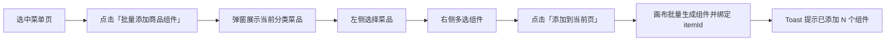

# eMenu Pro · 商品组件批量绑定设计方案

> **模块**：前厅管理中心 → eMenu Pro 菜单设计器  
> **版本**：v1.1  
> **日期**：2026-07-09  
> **状态**：已实现（嵌入态 Phase 1 · 弹窗方案）  
> **关联**：[eMenu-Pro-商品组件默认绑定设计方案](./eMenu-Pro-商品组件默认绑定设计方案.md)（方案 B · 侧栏默认绑定，待实现）

---

## 一、背景与问题

### 1.1 业务场景

在 eMenu Pro 菜单设计器中，运营需要为每个菜品配置多个**商品组件**（如加购、售罄、菜品名称、销售价、会员价等），使菜品在高级菜单设计稿中正确展示与交互。

### 1.2 当前流程（组件驱动）

```
选组件 → 拖到画布 → 打开绑定弹窗 → 选商品 → 保存
         ↑ 每个组件重复一遍（加购、售罄、名称、销售价、会员价…）
```

### 1.3 痛点分析

| 问题 | 影响 |
|------|------|
| 绑定动作与组件类型 1:1 | 5 个组件 = 选 5 次同一商品 |
| 商品与组件关系不可见 | 无法一眼看出某商品已绑了哪些组件 |
| 心智模型倒置 | 设计菜单时先想「这个菜要展示什么」，而非「这个组件绑哪个菜」 |

### 1.4 涉及的商品组件

以下组件需要绑定具体菜品（saleItem），属于本方案范围：

| 组件 | 类型 key | 说明 |
|------|----------|------|
| 加购 | `AddToCartImageBtn` | 点击加购 |
| 售罄 | `SoldOutImage` | 售罄状态展示 |
| 菜品名称 | `DishName` | 名称文本 |
| 销售价 | `SalePrice` | 售价 |
| 会员价 | `MemberPrice` | 会员价 |

**全局组件**（首页、购物车、语言切换等）不参与本方案。

---

## 二、设计目标

1. **一次选商品，多选组件，一次完成绑定**
2. **作用域与「删除菜单」「保存」一致**，基于当前菜单页操作
3. **兼容现有组件驱动流程**（右侧组件库拖拽、单组件精调不破坏）
4. **批量添加时有合理默认布局**，减少后续拖拽成本

---

## 三、方案演进

### 3.1 v1.0 草案：右侧面板「商品绑定」Tab（已废弃）

在右侧组件库旁新增 Tab，左侧商品树选中菜品后在右侧多选组件。

- **优点**：与三栏布局贴近
- **缺点**：右侧信息密度高；左侧分组树原本不含菜品层级，需额外注入菜品列表；与「页面级操作」心智不一致

### 3.2 v1.1 定稿：底栏入口 + 批量绑定弹窗（当前实现）

在画布底部 **「删除菜单」左侧** 新增 **「批量添加商品组件」** 按钮，点击后弹出左右分栏的批量绑定弹窗。

- **优点**：
  - 与「删除菜单」「保存」同属**菜单页维度**操作，作用域清晰
  - 弹窗内左菜品 / 右组件，专注批量绑定，不挤占右侧组件库
  - 不影响原有组件拖拽与属性编辑流程
- **缺点**：需额外打开弹窗（可接受，属低频批量配置场景）

**定稿方案：v1.1 底栏入口 + 弹窗**

---

## 四、推荐方案详细设计

### 4.1 入口与作用域

「删除菜单」「保存」均基于**当前选中的菜单页**操作。批量绑定遵循同一作用域：

| 元素 | 说明 |
|------|------|
| 入口按钮 | `批量添加商品组件`，位于 `operationFooter` 内、「删除菜单」左侧 |
| 作用域 | 当前 `currentPageData`（须已选中有效菜单页） |
| 菜品范围 | 当前页所属分类下的全部 `saleItem`（`groupId` + `categoryId`） |
| 禁用规则 | 与「删除菜单」一致：未选中页面时禁用；模板已发布（`isPublish`）时禁用 |

底栏按钮排列：

```
┌─────────────────────────────────────────────────────────────┐
│  … 画布区域 …                                                │
├─────────────────────────────────────────────────────────────┤
│  [批量添加商品组件]  [删除菜单]  [保存]                        │
└─────────────────────────────────────────────────────────────┘
```

### 4.2 弹窗整体布局

```
┌─ 批量添加商品组件 ──────────────────────────────────────────┐
│ 烧烤 › 招牌烧烤（当前菜单页）                          [×]   │
├──────────────────┬──────────────────────────────────────────┤
│ 菜品              │ 蜜汁鸡翅（选中菜品名称）                  │
│                  │ [全选] [仅选未添加]                       │
│  · 炭烤羊排       │ ☑ 加购        已在画布                   │
│  · 蜜汁鸡翅  ✓   │ ☑ 菜品名称    未添加                     │
│  · 孜然牛肉串     │ ☑ 销售价      未添加                     │
│                  │ ☐ 会员价      未添加                     │
│                  │ ☐ 售罄        未添加                     │
│                  │ 布局：● 智能堆叠  ○ 横向排列              │
├──────────────────┴──────────────────────────────────────────┤
│                    [取消]  [从当前页移除]  [添加到当前页 (3)]   │
└─────────────────────────────────────────────────────────────┘
```

| 区域 | 宽度 / 行为 |
|------|-------------|
| 左侧「菜品」 | 约 240px，展示当前分类下菜品列表，单选 |
| 右侧「组件」 | 自适应，展示 5 种商品组件多选 + 布局选项 |
| 底部操作栏 | 取消关闭弹窗；移除 / 添加作用于当前菜单页 |

### 4.3 组件绑定状态

| 状态 | 含义 | 展示 |
|------|------|------|
| 未添加 | 当前页无该类型组件实例 | 灰色「未添加」 |
| 已在画布 | 当前页已有该组件，且 `itemId` 为当前菜品 | 绿色「已在画布」 |
| 已绑其他商品 | 当前页有同类型组件但绑了别的菜 | 橙色「已绑：蜜汁鸡翅」 |
| 待绑定 | 实例存在但未绑菜品 | 蓝色「待绑定」 |

**冲突处理（Phase 1）：** 添加时若同类型组件已绑其他菜品，自动移除旧实例并创建新绑定（静默替换）；Phase 2 可改为二次确认弹窗。

### 4.4 核心交互流程

#### 流程 1：批量添加（主场景）



#### 流程 2：连续配置多个菜品

弹窗添加成功后**不自动关闭**，运营可继续选择左侧其他菜品、勾选组件并添加，适合同一分类下多个菜品依次配置。

#### 流程 3：批量移除

选中菜品 → 勾选已绑定的组件 → 点击「从当前页移除」→ 二次确认 → 从当前页删除对应画布实例。

#### 智能布局（默认「智能堆叠」）

以画布视口中心为基准纵向排列（顺序：菜品名称 → 销售价 → 会员价 → 加购；售罄为右上角 overlay）：

```
┌─────────────────┐
│  [菜品名称]      │  y: base
│  [销售价]        │  y: base + gap
│  [会员价]        │
│  [加购按钮]      │
│  [售罄角标]      │  右上角 overlay
└─────────────────┘
```

组件使用各类型**默认尺寸**（与 emenuPro 注册块一致），用户之后可在画布单独拖拽调整。

### 4.5 与现有流程的关系

| 操作 | 处理方式 |
|------|----------|
| 右侧组件库拖拽单个组件 | **保留**，不改动 |
| 选中画布组件编辑属性 / 绑定菜品 | **保留**，属性面板 `bindDish` 仍为精调入口 |
| 批量绑定 | **新增**，通过底栏按钮 + 弹窗，与组件库并行 |

右侧组件库不再增加 Tab，避免与弹窗能力重复。

---

## 五、数据模型

### 5.1 组件实例结构（emenuPro 现有）

绑定字段为 `props.itemId`（字符串类型的 saleItem ID）：

```typescript
interface ProductComponentInstance {
  id: string;
  component: "DishName" | "SalePrice" | "MemberPrice" | "AddToCartImageBtn" | "SoldOutImage";
  props: {
    itemId: string;          // 绑定菜品 ID
    // ... 各组件特有 props
  };
  style: {
    position: "absolute";
    top: number;
    left: number;
    width: number;
    height: number;
    zIndex?: number;
    // ...
  };
  children?: ProductComponentInstance[];  // MemberPrice 含子组件
}
```

### 5.2 嵌入态实现（当前）

不新增后端 API，通过 Redux `paletteSlice` 直接更新 `currentPageData.children`：

| 动作 | Redux type |
|------|------------|
| 写入组件 | `paletteSlice/setCurrentPageData` |
| 同步到 globalData | `paletteSlice/syncPageDataToGroup` |
| 清除选中块 | `paletteSlice/setCurrentBlock` |

### 5.3 后端 API（正式接入时参考）

```typescript
// POST /emenu-pro/page/{pageId}/components/batch-bind
interface BatchBindRequest {
  itemId: number;
  componentTypes: ProductComponentType[];
  layout: "stack" | "horizontal";
}

interface BatchBindResponse {
  created: ProductComponentInstance[];
  skipped: { type: ProductComponentType; reason: "already_bound" | "conflict" }[];
}
```

---

## 六、边界与规则

| 场景 | 处理 |
|------|------|
| 未选中菜单页 | 「批量添加商品组件」按钮禁用 |
| 模板已发布 | 与「删除菜单」「保存」一同禁用 |
| 当前分类无菜品 | 弹窗左侧显示「当前分类暂无菜品」 |
| 未选左侧菜品 | 右侧显示占位提示，添加按钮禁用 |
| 同类型组件已绑其他菜品 | Phase 1：添加时静默替换；Phase 2：确认弹窗 |
| 所选组件均已绑定当前菜品 | Toast「所选组件均已在当前页绑定」 |
| 切换菜单页（弹窗打开中） | 弹窗内菜品列表与绑定状态按新页面 `groupId/categoryId` 刷新 |
| 删除商品（菜单侧） | 画布上相关组件由 emenuPro 原有逻辑处理 |

---

## 七、效率对比

| 操作 | 原流程 | 新流程（v1.1） |
|------|--------|----------------|
| 1 个商品绑 5 个组件 | 5 次选商品 + 5 次拖/配 | 开弹窗 → 选 1 个菜 → 多选 5 组件 → 1 次添加 |
| 查看某商品已绑哪些组件 | 逐个点击画布组件 | 弹窗选菜品即见右侧状态清单 |
| 同分类 10 个菜品相同布局 | 50 次操作 | 弹窗内连续选菜添加，约 10 次 |

---

## 八、实施分期

### Phase 1（MVP）— 已完成

- [x] 底栏「批量添加商品组件」按钮（「删除菜单」左侧）
- [x] 批量绑定弹窗（左菜品 / 右组件）
- [x] 当前页所属分类菜品列表
- [x] 5 种商品组件多选 + 状态回显
- [x] 「添加到当前页」批量创建 + 智能堆叠 / 横向排列
- [x] 「从当前页移除」批量删除（含确认）
- [x] 冲突时静默替换同类型组件

### Phase 2（增强）

- [ ] 冲突替换二次确认弹窗
- [ ] 跨商品「复制组件配置到…」
- [ ] 布局模板（菜品卡片 / 横向价签 / 自定义）
- [ ] 弹窗内实时预览缩略图

### Phase 3（可选）

- [ ] 多商品 × 多组件矩阵批量（运营批量铺页）
- [ ] 绑定关系总览页（按分类查看覆盖度）
- [ ] 正式 API 替代嵌入态 Redux 直连

---

## 九、实现说明（嵌入态）

当前以 **admin-web 嵌入扩展脚本** 实现，不修改 emenuPro React 源码，与 `embedded-mock-api.js` 等同层扩展。

| 文件 | 职责 |
|------|------|
| `dist/emenu-pro/embedded-product-binding.js` | 底栏按钮、弹窗 UI、Redux 批量读写 |
| `dist/emenu-pro/embedded-shell.css` | 弹窗与底栏按钮样式 |
| `dist/emenu-pro/index.html` | 引入 `embedded-product-binding.js` |
| `scripts/sync-emenu-pro-from-dist.mjs` | 同步上游 dist 时保留嵌入脚本 |

**关键实现点：**

1. 通过 React Fiber 遍历获取 Redux `store`（`paletteSlice` / `menuSlice`）
2. 从 `currentPageData.groupId` + `categoryId` 解析当前分类，读取 `menuSlice.menus` 下对应 `saleItems`
3. 按 emenuPro 块注册表默认 `style` / `props` 创建组件实例，写入 `props.itemId`
4. `sync-emenu-pro` 同步上游包后，嵌入脚本自动保留

**访问路径：** 前厅管理中心 → eMenu Pro → `/operations/queue-call/emenu-pro`

---

## 十、原型示意（批量绑定弹窗）

```
╔══════════════════════════════════════════════════════════╗
║  批量添加商品组件                                    [×] ║
║  烧烤 › 招牌烧烤（当前菜单页）                             ║
╠════════════════════╦═════════════════════════════════════╣
║  菜品               ║  蜜汁鸡翅                           ║
║                    ║  全选   仅选未添加                    ║
║  ┌──────────────┐  ║  ☑ 🛒 加购          已在画布        ║
║  │ 炭烤羊排      │  ║  ☑ 📝 菜品名称      未添加          ║
║  └──────────────┘  ║  ☑ 💰 销售价        未添加          ║
║  ┌──────────────┐  ║  ☐ 👑 会员价        未添加          ║
║  │ 蜜汁鸡翅  ✓  │  ║  ☐ 🚫 售罄          未添加          ║
║  └──────────────┘  ║  布局：● 智能堆叠  ○ 横向排列        ║
║  ┌──────────────┐  ║                                     ║
║  │ 孜然牛肉串    │  ║                                     ║
║  └──────────────┘  ║                                     ║
╠════════════════════╩═════════════════════════════════════╣
║              [取消]  [从当前页移除]  [添加到当前页 (3)]     ║
╚══════════════════════════════════════════════════════════╝
```

---

## 十一、总结

核心变更是把操作主语从**「组件」**换成**「商品」**，并把入口收敛到**菜单页级底栏**：

1. **选中菜单页** → 点击「批量添加商品组件」
2. **弹窗左选菜品、右多选组件** → 一次添加到当前页并自动绑定
3. **保留原有组件库拖拽流程**，批量绑定为独立增强能力

---

## 附录：相关文档

- [eMenu-Pro-商品组件默认绑定设计方案](./eMenu-Pro-商品组件默认绑定设计方案.md)（方案 B · 侧栏商品下拉 + 拖拽自动绑定）
- [前厅管理中心-设置二级导航重设计方案](./前厅管理中心-设置二级导航重设计方案.md)
- [新商家后台-PRD](./新商家后台-PRD.md)
- eMenu Pro 嵌入路径：`/operations/queue-call/emenu-pro`
