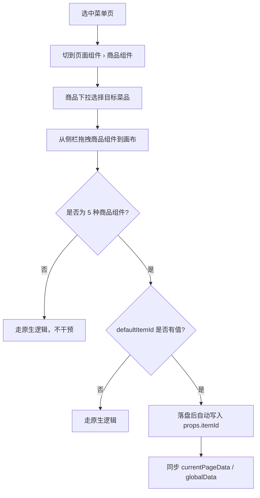

# eMenu Pro · 商品组件默认绑定设计方案（方案 B）

> **模块**：前厅管理中心 → eMenu Pro 菜单设计器  
> **版本**：v1.2 草案  
> **日期**：2026-07-10  
> **状态**：已实现（嵌入态 Phase 1）  
> **关联**：[eMenu-Pro-商品组件批量绑定设计方案](./eMenu-Pro-商品组件批量绑定设计方案.md)（方案 A · 底栏弹窗批量添加）

---

## 一、背景与定位

### 1.1 双方案并存

当前已实现 **方案 A：批量添加商品组件**（底栏弹窗，左选菜品 + 右多选组件，一次批量落盘）。该方案适合「同一菜品一次性铺齐 5 个组件」的批量场景。

运营在精细排版时，更常见的心智是：

```
先确定「当前在配哪个菜」→ 从右侧逐个拖组件到画布 → 每个组件自动带上绑定
```

本方案 **方案 B：默认商品绑定** 补齐上述**拖拽驱动**路径，与方案 A **并行可用、互不影响**。

| 维度 | 方案 A（已有） | 方案 B（本方案） |
|------|----------------|------------------|
| 入口 | 底栏「批量添加商品组件」 | 右侧「页面组件 › 商品组件」商品下拉 |
| 主操作 | 多选组件 → 一次添加到画布 | 选默认商品 → 逐个拖拽组件 |
| 适用场景 | 同菜快速铺全组件 | 精细排版、按需添加部分组件 |
| 绑定时机 | 点击「添加到当前页」 | 组件落盘瞬间自动写入 `itemId` |
| 状态隔离 | 弹窗内 `selectedDish` | 侧栏 `defaultItemId`（独立状态） |

### 1.2 设计原则

1. **不改动方案 A**：底栏按钮、弹窗交互、批量布局逻辑保持原样。
2. **不改动营销组件 / 全局组件**：仅作用于 5 种商品组件。
3. **精调入口保留**：属性面板 `bindDish` 仍可覆盖单个组件绑定。
4. **嵌入态实现**：延续 `embedded-*.js` 扩展方式，不修改 emenuPro React 源码。

---

## 二、设计目标

1. 在「页面组件 › 商品组件」区域提供**商品下拉选择**，作为拖拽期的默认绑定上下文。
2. 选中商品后，从侧栏拖入画布的 5 种商品组件**自动绑定该商品**（写入 `props.itemId`）。
3. 未选默认商品时，行为与 emenuPro **原生一致**（可能为空绑定或走原有 `bindDish` 流程）。
4. 方案 A、方案 B 可同时配置：运营可先用下拉精排部分组件，再开弹窗批量补齐剩余组件。

---

## 三、界面设计

### 3.1 入口位置

在右侧组件面板，**「页面组件」Tab →「商品组件」子 Tab** 内，组件列表**上方**插入默认商品选择区（与 `embedded-page-component-groups.js` 子 Tab 同层）。

```
┌─ 可用组件 ─────────────────────────┐
│ [页面组件] [全局组件]               │
├────────────────────────────────────┤
│ [商品组件] [营销组件]    ← 已有子Tab │
├────────────────────────────────────┤
│ 默认绑定商品                        │  ← 新增
│ ┌──────────────────────────────┐   │
│ │ 请选择商品            ▼     │   │
│ └──────────────────────────────┘   │
│ 烧烤 › 招牌烧烤 · 当前页分类        │  ← 辅助说明
├────────────────────────────────────┤
│ 🛒 加购                            │
│ 🚫 售罄                            │
│ 📝 菜品名称                        │
│ 💰 销售价                          │
│ 👑 会员价                          │
└────────────────────────────────────┘
```

切换到 **「营销组件」** 或 **「全局组件」** 时，隐藏默认商品选择区。

### 3.2 下拉选项规则

| 规则 | 说明 |
|------|------|
| 数据源 | 与方案 A 一致：当前菜单页 `groupId` + `categoryId` 对应分类下的 `saleItems` |
| 首项 | `不设置默认绑定`（value 为空），选中后拖拽走原生行为 |
| 展示格式 | `菜品名称`（如「蜜汁鸡翅」） |
| 禁用 | 未选中有效菜单页、模板已发布（`isPublish`）时整区禁用 |
| 空分类 | 下拉仅保留「不设置默认绑定」，下方提示「当前分类暂无菜品」 |

### 3.3 视觉反馈

- 已选商品：下拉右侧或下方展示轻量标签 `已选：蜜汁鸡翅`
- 拖拽落盘后（可选 Phase 2）：Toast `已为「加购」绑定蜜汁鸡翅`（防抖，避免连续拖 5 个弹 5 次）

---

## 四、核心交互

### 4.1 主流程（拖拽 + 默认绑定）



### 4.2 与方案 A 并行示例

同一菜单页、同一菜品「蜜汁鸡翅」：

1. **方案 B**：下拉选「蜜汁鸡翅」→ 拖入「菜品名称」「销售价」到画布左侧排版。
2. **方案 A**：点击底栏「批量添加商品组件」→ 弹窗左选「蜜汁鸡翅」→ 勾选「加购」「会员价」「售罄」→ 添加到当前页。

结果：5 个组件均已绑定，且两种入口互不覆盖对方已选状态。

### 4.3 绑定覆盖规则

| 场景 | 行为 |
|------|------|
| 拖入新组件，`defaultItemId` 有值 | 强制写入 `props.itemId = defaultItemId`（覆盖空值；若原生已填其他值，以默认绑定为准） |
| 拖入后用户在属性面板改绑 | **允许**，以属性面板最终值为准 |
| 方案 A 批量添加同类型且已绑定当前菜 | 跳过（方案 A 既有逻辑） |
| 方案 A 批量添加同类型但绑了其他菜 | Phase 1 静默替换（方案 A 既有逻辑） |
| 方案 B 拖入 + 方案 A 再添加同类型 | 方案 A 按自身冲突规则处理，**不读取**方案 B 下拉值 |

---

## 五、状态模型

### 5.1 方案 B 独立状态

```typescript
/** 嵌入脚本内存态，与方案 A 弹窗 state 隔离 */
interface DefaultProductBindingState {
  /** 当前页分类键，格式 `${groupId}-${categoryId}` */
  categoryKey: string | null;
  /** 默认绑定菜品 ID，null 表示不设置 */
  defaultItemId: string | null;
  /** 是否已选中有效菜单页 */
  pageReady: boolean;
}

/** 按分类记忆上次选择（可选，Phase 1 建议开启） */
type DefaultBindingMemory = Record<string, string | null>;
// key: categoryKey, value: itemId
```

### 5.2 与方案 A 状态对照

| 状态 | 方案 A 存储位置 | 方案 B 存储位置 |
|------|-----------------|----------------|
| 选中菜品 | `embedded-product-binding.js` → `state.selectedDish` | `embedded-default-product-binding.js` → `defaultItemId` |
| 生命周期 | 弹窗打开期间有效；关闭不清空便于连续添加 | 侧栏常驻；切换分类可恢复记忆 |
| 是否影响对方 | 否 | 否 |

### 5.3 组件数据结构（沿用）

绑定字段仍为 `props.itemId`（字符串）：

```typescript
type ProductComponentType =
  | "AddToCartImageBtn"
  | "SoldOutImage"
  | "DishName"
  | "SalePrice"
  | "MemberPrice";
```

---

## 六、技术实现要点

### 6.1 文件规划

| 文件 | 职责 |
|------|------|
| `embedded-default-product-binding.js` | 商品下拉 UI、默认绑定状态、Redux 订阅与自动写 `itemId` |
| `embedded-shell.css` | 下拉区与子 Tab 间距样式 |
| `embedded-page-component-groups.js` | 仅负责子 Tab，**不耦合**默认绑定逻辑 |
| `embedded-product-binding.js` | 方案 A，**不修改**其核心状态与弹窗流程 |
| `index.html` / `sync-emenu-pro-from-dist.mjs` | 引入并保留新脚本 |

**共享能力（建议抽取到 `embedded-product-binding-shared.js`，Phase 1 可先复制）：**

- `findReduxStore()`
- `getCurrentCategoryInfo()`
- `getSaleItemsForCategory()`
- `PRODUCT_COMPONENT_TYPES` 常量

### 6.2 自动绑定触发机制（推荐）

emenuPro 拖入组件后会更新 `paletteSlice.currentBlock`。嵌入脚本订阅 Redux：

```
store.subscribe(() => {
  1. 读取 paletteSlice.currentBlock
  2. 若 component ∉ PRODUCT_COMPONENT_TYPES → return
  3. 若 defaultItemId 为空 → return
  4. 若 currentBlock.props.itemId === defaultItemId → return（已绑定）
  5. patch currentBlock.props.itemId = defaultItemId
  6. dispatch syncBlockDataToPage / setCurrentBlock
});
```

**防抖**：同一 `block.id` 仅处理一次，避免 subscribe 重复触发。

**时序**：若原生在落盘后异步弹出 `bindDish` 弹窗，Phase 1 在已选默认商品时自动关闭该弹窗（写入 `itemId` 后 dismiss）；未选默认商品时仍走原生弹窗。

### 6.3 UI 挂载点

在 `embedded-page-component-groups.js` 渲染的 `.emenu-page-component-tabs` **下方**、`#block_list` **上方**插入：

```html
<div class="emenu-default-product-binding" data-emenu-default-binding>
  <label class="emenu-default-product-binding-label">默认绑定商品</label>
  <select class="emenu-default-product-binding-select" data-default-product-select>
    <option value="">不设置默认绑定</option>
    <!-- saleItems -->
  </select>
  <p class="emenu-default-product-binding-hint" data-default-product-hint></p>
</div>
```

显示条件：

- `页面组件` Tab 激活
- `商品组件` 子 Tab 激活（`data-emenu-active-group="product"`）
- 非 `全局组件` 列表

### 6.4 页面 / 分类切换

| 事件 | 处理 |
|------|------|
| 切换菜单页（同分类） | 保留下拉选择（同一 `categoryKey`） |
| 切换菜单页（不同分类） | 刷新下拉选项；从 `DefaultBindingMemory` 恢复该分类上次选择 |
| 切换「全局组件」Tab | 隐藏默认绑定区，停止自动绑定监听 |
| 模板发布 | 下拉禁用 |

---

## 七、边界与规则

| 场景 | 处理 |
|------|------|
| 未选中菜单页 | 下拉禁用，placeholder「请先选择菜单页」 |
| 当前分类无菜品 | 仅「不设置默认绑定」，提示「当前分类暂无菜品」 |
| 未选默认商品 | 拖拽行为与原生一致 |
| 拖拽非商品组件（视频、轮播图） | 不干预 |
| 属性面板手动改绑 | 允许，以手动值为准 |
| 方案 A 弹窗打开中 | 方案 B 下拉仍可用；互不改对方状态 |
| 删除画布组件后再拖入 | 新实例重新应用 `defaultItemId` |
| 嵌入 Mock 环境 | 菜品列表来源与方案 A 相同（`menuSlice.menus`） |

---

## 八、与方案 A 的协作关系

```
                    ┌─────────────────────────┐
                    │     当前菜单页 scope      │
                    └───────────┬─────────────┘
                                │
           ┌────────────────────┼────────────────────┐
           ▼                    ▼                    ▼
   ┌───────────────┐   ┌───────────────┐   ┌───────────────┐
   │ 方案 B 下拉    │   │ 侧栏拖拽落盘   │   │ 方案 A 弹窗    │
   │ defaultItemId │   │ 单组件精排     │   │ 多选批量添加   │
   └───────┬───────┘   └───────┬───────┘   └───────┬───────┘
           │                   │                   │
           └─────────┬─────────┴─────────┬─────────┘
                     ▼                   ▼
              props.itemId         currentPageData.children
                     └─────────┬─────────┘
                               ▼
                        画布展示 & 保存
```

**配置建议（运营向，非强制）：**

- 精细排版：优先方案 B
- 快速铺页：优先方案 A
- 混合使用：先 B 后 A 或先 A 后 B 均可

---

## 九、实施分期

### Phase 1（MVP）

- [x] 「商品组件」子 Tab 下增加商品下拉
- [x] 选项来自当前页分类 `saleItems`
- [x] Redux 订阅：拖入 5 种商品组件后自动写 `itemId`
- [x] 与方案 A 状态隔离验证
- [x] 发布态 / 未选页禁用
- [x] 按 `categoryKey` 记忆上次选择

### Phase 2（增强）

- [ ] 抽取 `embedded-product-binding-shared.js` 公共模块
- [ ] 拖入成功轻量 Toast（可配置开关）
- [ ] 若原生 `bindDish` 弹窗重复弹出，评估关闭或预填
- [ ] 下拉支持搜索（分类菜品较多时）

### Phase 3（可选）

- [ ] 设置项：「拖入时始终覆盖已有绑定」开关
- [ ] 与方案 A 弹窗联动：「将弹窗菜品同步为默认绑定」一键按钮（仍保持两套状态可独立）

---

## 十、验收标准

| # | 用例 | 预期 |
|---|------|------|
| 1 | 商品组件 Tab 下看到商品下拉 | 选项为当前分类菜品 |
| 2 | 选择「蜜汁鸡翅」后拖入「菜品名称」 | 画布组件 `itemId` 为蜜汁鸡翅 ID |
| 3 | 下拉选「不设置默认绑定」后拖入 | 与改造前行为一致 |
| 4 | 拖入「视频」组件 | 不自动写 `itemId` |
| 5 | 方案 A 弹窗批量添加 | 行为与 v1.1 完全一致 |
| 6 | 方案 B 选 A 菜、方案 A 弹窗选 B 菜 | 各自绑定正确，互不影响 |
| 7 | 切换全局组件 Tab | 下拉隐藏，且无报错 |
| 8 | 模板已发布 | 下拉与拖拽均不可改 |

---

## 十一、原型示意

```
┌─ 可用组件 ─────────────────────────────┐
│  页面组件    全局组件                   │
├────────────────────────────────────────┤
│ ┌──────────┐ ┌──────────┐              │
│ │ 商品组件 │ │ 营销组件 │              │
│ └──────────┘ └──────────┘              │
├────────────────────────────────────────┤
│  默认绑定商品                           │
│  ┌────────────────────────────────┐    │
│  │ 蜜汁鸡翅                    ▼  │    │
│  └────────────────────────────────┘    │
│  烧烤 › 招牌烧烤（当前菜单页）          │
├────────────────────────────────────────┤
│  🛒 加购                               │
│  🚫 售罄                               │
│  📝 菜品名称                           │
│  💰 销售价                             │
│  👑 会员价                             │
└────────────────────────────────────────┘

底栏（方案 A，保持不变）：
[批量添加商品组件]  [删除菜单]  [保存]
```

---

## 十二、总结

方案 B 将「当前在配哪个菜」前置到**侧栏商品下拉**，使拖拽商品组件时自动完成绑定，补齐方案 A 未覆盖的**精排、按需添加**场景。两套方案：

- **入口分离**：底栏弹窗 vs 侧栏下拉
- **状态分离**：`selectedDish` vs `defaultItemId`
- **落盘汇合**：均写入 `props.itemId`，保存与运行时行为一致

---

## 附录：相关文档

- [eMenu-Pro-商品组件批量绑定设计方案](./eMenu-Pro-商品组件批量绑定设计方案.md)（方案 A）
- [新商家后台-PRD](./新商家后台-PRD.md)
- 嵌入实现目录：`admin-web/dist/emenu-pro/`
