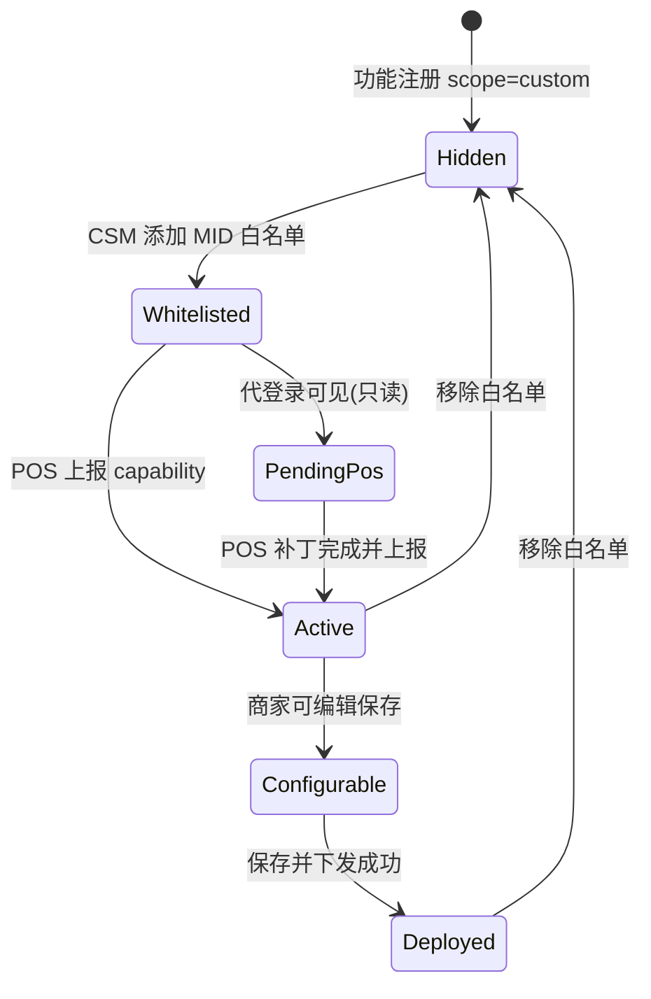

# 定制化功能 · MID 白名单与可见性治理 — 设计方案

> **文档版本**：v1.0  
> **最后更新**：2026-07-16  
> **归属品牌**：MenuSifu  
> **适用范围**：新商家后台（admin-web）、M 平台、POS / Sync Agent  
> **适用对象**：产品、UI 设计、前端研发、后端研发、POS 终端团队、实施/CSM  
> **状态**：待评审  
> **关联文档**：[新商家后台-PRD](./新商家后台-PRD.md) · [平台预设与导航蓝图-四端关系设计](./平台预设与导航蓝图-四端关系设计.md) · [云端下发本地-配置同步与下发记录设计方案](./云端下发本地-配置同步与下发记录设计方案.md) · [M平台-企业级平台预设设计方案](./M平台-企业级平台预设设计方案.md) · [M平台-入驻商户管理中心设计方案](./M平台-入驻商户管理中心设计方案.md)

---

## 目录

1. [背景与问题](#一背景与问题)
2. [核心设计原则](#二核心设计原则)
3. [方案对比与选型](#三方案对比与选型)
4. [概念模型](#四概念模型)
5. [功能注册与标记](#五功能注册与标记)
6. [MID 白名单（开通层）](#六mid-白名单开通层)
7. [POS 能力上报（就绪层）](#七pos-能力上报就绪层)
8. [运行时可见性规则](#八运行时可见性规则)
9. [管理端 UI 设计](#九管理端-ui-设计)
10. [与平台预设的协作](#十与平台预设的协作)
11. [配置保存与下发](#十一配置保存与下发)
12. [关键业务流程](#十二关键业务流程)
13. [代码落点建议](#十三代码落点建议)
14. [分期实施](#十四分期实施)
15. [风险与对策](#十五风险与对策)
16. [修订记录](#十六修订记录)

---

## 一、背景与问题

### 1.1 业务场景

MenuSifu 商家后台为**云端部署**，POS 为**门店本地化部署**。功能分两类：

| 类型 | 说明 | 可见性期望 |
|------|------|------------|
| **标准功能** | 无客户定制，随版本统一发布 | 所有商家后台均可见（受平台预设、RBAC 约束） |
| **定制化功能** | 针对特定客户的 POS 补丁能力 | 仅已打补丁且被开通的客户可见、可配 |

典型问题：

1. 客户 A 的 POS 打了定制补丁（如 TipOut 按个人销售额进池），商家后台出现了对应设置项；客户 B 未打补丁，若同样看到该设置项，配置后下发无效或引发 POS 异常。
2. 实施/CSM 缺少独立的「按客户开通定制能力」入口，只能改代码或手工调整平台预设，易误开通。
3. 云端配置与本地 POS 能力脱节，无法判断「商家后台可见」是否等于「POS 可执行」。

### 1.2 与现有治理链的关系

当前已具备较完整的治理链（见 [平台预设与导航蓝图-四端关系设计](./平台预设与导航蓝图-四端关系设计.md)）：

```
导航蓝图 → 企业级预设 → 商家级预设 → RBAC + 数据视角 → 侧栏/设置可见性
                                    ↓
                              保存并下发 → POS / Kiosk / eMenu
```

**缺口**：缺少 **「POS 能力 × 客户开通」** 的门禁层，无法区分全量标准能力与补丁型定制能力。

### 1.3 建设目标

1. **标准功能**：新功能默认全量商家可见（沿用平台预设体系）。
2. **定制功能**：默认全量不可见；经 MID 白名单开通且 POS 上报能力就绪后，商家后台才展示可编辑设置项。
3. **运营可控**：M 平台提供「定制化白名单」管理入口，仅运营/实施可操作。
4. **下发安全**：定制功能配置按门店作用域保存与下发，未开通门店自动跳过。

### 1.4 初始设想（本方案继承并扩展）

| 设想点 | 本方案处理 |
|--------|------------|
| 定制化功能打标记 | ✅ `scope: custom` 功能注册 |
| MID 白名单 | ✅ 开通意图层 |
| B 平台独立页签「定制化白名单」 | ✅ 首期放 M 平台商户详情，后期迁入 M 平台独立模块 |
| 仅 M 平台代登录可见管理入口 | ✅ 写操作仅 M 平台；商家侧无白名单写入口 |
| 白名单后商家后台可见 | ⚠️ 扩展为 **白名单 AND POS 能力** 双因子 |

---

## 二、核心设计原则

| 原则 | 说明 |
|------|------|
| **标准与定制分流** | `scope: standard` 走现有蓝图/预设；`scope: custom` 走白名单 + POS 能力门禁 |
| **开通 ≠ 就绪** | MID 白名单表达运营「允许开通」；POS 能力上报表达终端「已具备」 |
| **门店粒度** | 白名单以 **MID（门店）** 为最小单位，与 POS 本地化部署对齐 |
| **预设不替代白名单** | 定制功能在平台预设层默认 `enabled: false`，商家不可自行勾选开通 |
| **代登录可预览** | M 平台代登录时，已白名单但 POS 未就绪的功能可只读展示，便于实施联调 |
| **下发可追溯** | 定制功能下发记录标注 `featureKey` 与跳过原因（未开通 / POS 无能力） |
| **M 平台为管理源头** | 白名单写操作仅在 M 平台；商家后台只消费运行时门禁结果 |

---

## 三、方案对比与选型

| 方案 | 优点 | 缺点 | 结论 |
|------|------|------|------|
| **A. 仅 MID 白名单** | 简单，CSM 可控 | 无法感知 POS 是否真具备能力 | 作为开通层保留 |
| **B. 仅 POS 能力上报** | 真实可靠 | 无运营开通流程；无法提前预览 | 作为就绪层保留 |
| **C. 白名单 + POS 能力（推荐）** | 开通可控 + 运行可信 | 实现稍复杂 | **采用** |
| **D. 扩展现有平台预设** | 复用现有 UI | 无法表达「按客户补丁」语义，易误开通 | 不采用 |

**选型结论**：采用 **方案 C — 双因子门禁**。

```
定制功能可见可配 = MID 在白名单内 AND POS 已上报对应 capability
代登录预览     = MID 在白名单内 AND POS 未就绪 → 只读 + 状态提示
```

---

## 四、概念模型

在现有四层模型（导航定义 → 结构同步 → 预设配置 → 运行时）之上，新增 **L1.5 开通层** 与 **L1.6 能力层**：

```
L0 · 功能注册层
  ├─ standard  → 纳入导航蓝图 / 平台预设默认树
  └─ custom    → 独立注册，默认不进全量蓝图同步

L1 · 开通层（新增）
  CustomFeatureWhitelist：featureKey × allowedMids[]

L2 · 能力层（新增）
  PosCapabilityReport：MID × installedPatches / capabilities

L3 · 结构同步层（现有）
  导航蓝图发布 → 同步企业预设（仅 standard 节点）

L4 · 预设配置层（现有）
  企业级 / 商家级平台预设（custom 节点默认 enabled=false）

L5 · 运行时层（现有 + 扩展）
  RBAC → 平台预设 → 【定制功能门禁】→ 侧栏 / 设置页
```

### 4.1 状态机



| 状态 | 商家正常登录 | M 平台代登录 | 可保存下发 |
|------|-------------|-------------|------------|
| Hidden | 不可见 | M 平台白名单页可管理 | ❌ |
| Whitelisted + POS 未就绪 | 不可见 | 可见，只读 + 「等待 POS 补丁」 | ❌ |
| Active | 可见可配 | 可见可配 | ✅ |
| Deployed | 可见，有下发记录 | 同左 | ✅ |

---

## 五、功能注册与标记

### 5.1 注册表扩展

在 `module-settings-catalog` / 功能注册表（或独立 `feature-registry`）扩展元数据：

```typescript
/** 功能作用域 */
type FeatureScope = "standard" | "custom";

interface FeatureRegistryEntry {
  /** 全局唯一，如 "tipout.personal_sales_pool" */
  featureKey: string;
  scope: FeatureScope;
  displayName: string;
  description?: string;
  /** 关联导航节点（L1~L4 seq / permission-registry nodeKey） */
  navNodeKeys: string[];
  /** 最低 POS 补丁版本（semver 或补丁包 ID） */
  minPosPatchVersion?: string;
  /** 影响产线 */
  productLines: ("pos" | "kiosk" | "emenu")[];
  /** 配置域，用于下发打包（见云端下发方案） */
  configDomain?: string;
  /** 定制客户标签（便于 CSM 检索） */
  customerLabel?: string;
  /** 注册时间、责任人 */
  registeredAt: string;
  registeredBy?: string;
}
```

### 5.2 注册规则

| scope | 纳入导航蓝图全量同步 | 平台预设默认 | 商家可自行勾选 |
|-------|---------------------|-------------|---------------|
| `standard` | ✅ | 按业态×产线策略 | ✅（在预设范围内） |
| `custom` | ❌ | `enabled: false` | ❌ |

### 5.3 示例

```json
{
  "featureKey": "tipout.personal_sales_pool",
  "scope": "custom",
  "displayName": "小费池 · 按个人销售额贡献",
  "navNodeKeys": ["team-payroll.tipout.pool.personal_sales"],
  "minPosPatchVersion": "tipout-personal-sales-v2.1",
  "productLines": ["pos"],
  "configDomain": "team.tipout",
  "customerLabel": "XX 连锁定制"
}
```

---

## 六、MID 白名单（开通层）

### 6.1 数据模型

```typescript
interface CustomFeatureWhitelistEntry {
  featureKey: string;
  allowedMids: string[];        // M00000000 格式，见 enterprise-merchant-bid.ts
  enabled: boolean;
  grantedBy: string;            // 操作人邮箱
  grantedAt: string;
  note?: string;                // 如「XX 客户 TipOut 定制 v2.1」
  expiresAt?: string;           // 可选，试点到期自动回收
}

interface CustomFeatureWhitelistStore {
  enterpriseId: string;
  entries: CustomFeatureWhitelistEntry[];
  changelog: WhitelistChangeLogEntry[];
}

interface WhitelistChangeLogEntry {
  id: string;
  featureKey: string;
  action: "grant" | "revoke" | "batch_grant" | "batch_revoke";
  mids: string[];
  operatorEmail: string;
  detail: string;
  at: string;
}
```

**演示期存储键建议**：`menusifu:custom-feature-whitelist-v1`

### 6.2 开通粒度与连锁场景

| 场景 | 行为 |
|------|------|
| 单店开通 | 仅该 MID 在门店视角可见、可配、可下发 |
| 品牌下部分门店开通 | 集团/品牌视角可见入口，标注「仅部分门店生效」 |
| 按品牌批量开通 | 支持选择 BID，批量添加下属全部 MID |
| 配置作用域 | 定制功能配置 **强制 store-scoped**，避免误下发未开通门店 |

### 6.3 校验

- MID 格式：`/^M\d{8}$/`（复用 `MID_PATTERN`）
- MID 须属于当前企业下已入驻门店
- 重复添加幂等；移除不存在的 MID 静默成功

---

## 七、POS 能力上报（就绪层）

### 7.1 数据模型

POS / Sync Agent 在心跳或配置拉取时上报：

```typescript
interface PosCapabilityReport {
  mid: string;
  posVersion: string;
  /** 已安装补丁包 ID 列表 */
  installedPatches: string[];
  /** 与 featureKey 对齐的能力列表 */
  capabilities: string[];
  reportedAt: string;
  deviceId?: string;
}
```

**云端存储**：按 MID 聚合，取各设备上报的 **并集** 作为门店能力（任一 POS 机具备即视为门店具备，具体策略可配置）。

### 7.2 就绪判定

```
POS 具备能力 ⇔ capabilities 包含 featureKey
              OR installedPatches 满足 minPosPatchVersion
```

### 7.3 兜底策略（P2）

| 场景 | 处理 |
|------|------|
| POS 长期离线未上报 | 代登录可只读预览；超期告警 |
| 实施确认补丁已打但尚未上报 | M 平台支持「手工确认就绪」（需审计 + 限时有效） |
| 补丁升级后 capability 变更 | featureKey 版本化；配置迁移策略单独评估 |

---

## 八、运行时可见性规则

### 8.1 过滤链扩展

对齐现有 `nav-access.ts` + `platform-preset-nav-filter.ts`，在预设过滤之后增加：

```
NAV_MODULES
  → filterVisibleNavModules()           // RBAC + 连锁视角
  → filterNavByPlatformPreset()         // 商家级 effective snapshot
  → filterNavByCustomFeatureGate()      // 【新增】定制功能双因子门禁
  → renderSidebar() / 设置页 / 滑层
```

### 8.2 判定逻辑

```typescript
function isCustomFeatureVisible(
  featureKey: string,
  context: {
    mid: string;
    merchantId: string;
    isImpersonating: boolean;
  }
): VisibilityResult {
  const entry = getFeatureRegistry(featureKey);
  if (!entry || entry.scope === "standard") {
    return { visible: true, editable: true };
  }

  const whitelisted = isMidInWhitelist(featureKey, context.mid);
  const posReady = isPosCapabilityReady(featureKey, context.mid);

  if (!whitelisted) {
    return { visible: false, editable: false, reason: "not_whitelisted" };
  }

  if (!posReady) {
    if (context.isImpersonating) {
      return {
        visible: true,
        editable: false,
        reason: "pending_pos_patch",
        badge: "等待 POS 补丁",
      };
    }
    return { visible: false, editable: false, reason: "pos_not_ready" };
  }

  return { visible: true, editable: true };
}
```

### 8.3 与标准功能的对比

| 维度 | 标准功能 | 定制功能 |
|------|----------|----------|
| 默认可见 | 是（受预设约束） | 否 |
| 开通方式 | 平台预设勾选 | MID 白名单 |
| 就绪校验 | 无 | POS capability |
| 商家可自行开通 | 是（预设范围内） | 否 |

---

## 九、管理端 UI 设计

### 9.1 首期：M 平台 · 商户详情页签

在 M 平台商户详情（`enterprise-merchant-ui.ts` 同类位置）新增页签：

**「定制化白名单」**

| 区域 | 内容 |
|------|------|
| 功能列表 | 拉取 `scope=custom` 的全部 `featureKey` |
| 每行信息 | 名称、关联导航路径、最低补丁版本、已开通 MID 数、POS 就绪数 |
| 操作 | 添加/移除 MID、按品牌批量添加、备注、查看变更日志 |
| POS 状态列 | 🟢 已就绪 / 🟡 白名单待补丁 / 🔴 补丁版本不足 |
| 搜索 | 按 MID、门店名、featureKey、客户标签 |

#### 添加 MID 交互

1. 搜索门店（MID / 名称 / 地址）
2. 勾选目标门店
3. 填写备注（可选）
4. 确认 → 写入白名单 + changelog

### 9.2 代登录商家后台

通过 M 平台代登录（`enterprise-merchant-impersonate.ts`）进入后：

| 项 | 行为 |
|----|------|
| 侧栏 | **不**增加「定制化白名单」菜单（避免商家误操作） |
| 顶栏 | 代登录横幅旁增加「查看本商户定制开通」链接 → 跳转 M 平台对应页（只读） |
| 设置页 | 已白名单但 POS 未就绪：灰色只读 + 说明「等待 POS 补丁 vX.X」 |
| 保存按钮 | `editable: false` 时禁用，tooltip 说明原因 |

### 9.3 后期迁移

白名单管理整体迁入 **M 平台独立模块**（与「入驻商户管理中心」同级）：

- 支持跨商户检索定制功能开通情况
- 商家详情页签保留快捷入口
- 商家后台完全不承载写操作

---

## 十、与平台预设的协作

避免与现有预设体系冲突（见 [平台预设与导航蓝图-四端关系设计](./平台预设与导航蓝图-四端关系设计.md)）：

| 项 | 标准功能 | 定制功能 |
|----|----------|----------|
| 蓝图同步 | ✅ 进入默认树 | ❌ 不进入全量同步 |
| 企业预设默认 | 按业态×产线勾选 | `enabled: false` |
| 商家预设覆盖 | 允许 | **禁止**自行开通 |
| 运行时 | 预设 AND RBAC | 预设 AND RBAC **AND** 白名单 AND POS |

### 10.1 custom 节点在预设编辑页的表现

- 在 M 平台 / 商家后台「配置预设」四列页中，custom 节点**可选展示**但标注「需 MID 白名单开通」
- 未开通时 `enabled` 强制 `false`，忽略商家局部覆盖
- `resolvePlatformPresetTreeOptions` 合并注册表 `scope` 元数据

---

## 十一、配置保存与下发

对齐 [云端下发本地-配置同步与下发记录设计方案](./云端下发本地-配置同步与下发记录设计方案.md)：

| 项 | 说明 |
|----|------|
| 配置域 | 定制功能归入独立 `configDomain`（如 `team.tipout`） |
| 作用域 | **store-scoped**，绑定 MID |
| 下发目标 | 仅限「白名单内 AND POS 就绪」的 MID |
| 跳过逻辑 | Batch 自动跳过未开通 / 无能力门店，记录原因 |
| 下发记录 | 标注 `featureKey`、`customization: true` |
| 未就绪拦截 | `editable: false` 时禁止「保存并下发」 |

---

## 十二、关键业务流程

### 12.1 新客户开通定制功能

```
1. 实施在 M 平台「定制化白名单」为 featureKey 添加 MID
2. 现场为对应门店 POS 打补丁
3. POS 重启后 Sync Agent 上报 capability
4. 商家后台（或代登录）出现对应设置项（可编辑）
5. 商家配置 → 保存并下发 → POS ACK
```

### 12.2 新定制功能上线（研发）

```
1. 研发注册 featureKey（scope=custom）+ navNodeKeys + minPosPatchVersion
2. 功能默认对所有商家不可见
3. CSM 按需为指定 MID 开通白名单
4. 不污染全量商家的平台预设树
```

### 12.3 标准新功能上线（对比）

```
1. 注册 scope=standard
2. 纳入导航蓝图 → 同步企业预设
3. 全量商家可见（受业态×产线预设约束）
4. 无需白名单
```

### 12.4 回收定制开通

```
1. CSM 在 M 平台移除 MID 白名单
2. 商家后台立即隐藏对应设置项（运行时过滤）
3. 已保存配置归档，不自动删除（支持审计与回滚）
4. 下发队列中该 MID 的 pending job 取消或标记跳过
```

---

## 十三、代码落点建议

| 模块 | 文件（建议） | 职责 |
|------|-------------|------|
| 功能注册 | `src/config/feature-registry.ts`（新建） | `FeatureRegistryEntry`、按 `navNodeKey` 反查 |
| 白名单存储 | `src/config/custom-feature-whitelist-store.ts`（新建） | CRUD、changelog、MID 校验 |
| POS 能力 | `src/config/pos-capability-store.ts`（新建） | 接收上报、按 MID 聚合 |
| 运行时门禁 | `src/permissions/custom-feature-gate.ts`（新建） | `filterNavByCustomFeatureGate`、`isCustomFeatureVisible` |
| 导航过滤接入 | `src/permissions/nav-access.ts`、`platform-preset-nav-filter.ts` | 在现有链末尾接入 |
| M 平台 UI | `src/config/custom-feature-whitelist-ui.ts`（新建） | 白名单页签 |
| 商户详情集成 | `src/config/enterprise-merchant-ui.ts` | 新增页签入口 |
| 代登录 | `src/config/enterprise-merchant-impersonate.ts` | 传递 `isImpersonating` 上下文 |
| MID 校验 | `src/config/enterprise-merchant-bid.ts` | 复用 `MID_PATTERN` |
| 下发 | `src/config/deployment-*.ts` | 跳过逻辑、记录 `featureKey` |

### 13.1 与 MerchantCapabilitySnapshot 的关系（P2）

现有 `MerchantCapabilitySnapshot`（`enterprise-merchant-types.ts`）面向 **服务订阅 / 业态产线**，与本方案 **补丁型定制** 正交：

- 短期：白名单独立存储，不改动 `capabilities.services`
- 长期：可将定制功能抽象为 `serviceId` + `storeScope: stores` + `scopeIds: mids[]`，与白名单双向同步

---

## 十四、分期实施

| 阶段 | 交付 | 优先级 |
|------|------|--------|
| **P0** | `feature-registry` + `scope` 标记 | 高 |
| **P0** | `custom-feature-gate` 运行时过滤 | 高 |
| **P0** | M 平台「定制化白名单」页签 CRUD | 高 |
| **P1** | POS capability 上报 API + 状态展示 | 高 |
| **P1** | 定制功能 store-scoped 配置保存 | 中 |
| **P1** | 下发 Batch 跳过未开通/无能力门店 | 中 |
| **P2** | 白名单迁入 M 平台独立模块 | 中 |
| **P2** | 手工确认就绪兜底 + 到期自动回收 | 中 |
| **P2** | 与 `MerchantCapabilitySnapshot` 打通 | 低 |

### 14.1 验收标准

- [ ] `scope=custom` 功能对未开通 MID 的商家完全不可见
- [ ] 开通白名单但 POS 未上报时，正常登录不可见，代登录只读可见
- [ ] 白名单 + POS 就绪后，商家可编辑、保存、下发
- [ ] 下发记录可区分跳过原因（未开通 / 无能力）
- [ ] 标准新功能不受影响，仍走平台预设全量逻辑
- [ ] 白名单变更可追溯（changelog）

---

## 十五、风险与对策

| 风险 | 对策 |
|------|------|
| 仅白名单、无 POS 校验 → 配置下发失败 | 双因子 AND；未就绪时只读 |
| 白名单按 MID，配置按品牌 → 误下发 | 定制功能强制 store-scoped |
| 与平台预设「enabled 勾选」冲突 | custom 节点预设层强制 false |
| POS 离线长期未上报 | 代登录预览；超期告警；P2 手工确认 |
| 补丁升级后 capability 变更 | featureKey 版本化；迁移策略单独立项 |
| 商家直接登录看到白名单写入口 | 写操作仅 M 平台 |
| 连锁视角混淆 | 标注「仅部分门店生效」；配置页展示生效 MID 列表 |

---

## 十六、修订记录

| 版本 | 日期 | 说明 |
|------|------|------|
| v1.0 | 2026-07-16 | 初稿：MID 白名单 + POS 能力双因子门禁方案 |
