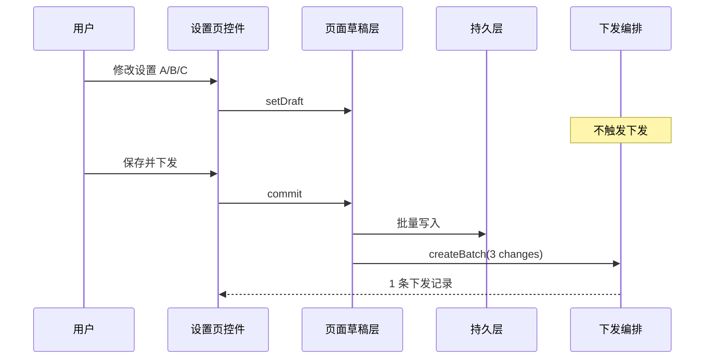

# 设置页 · 按页面批量保存与下发设计方案

> **文档版本**：v1.0  
> **最后更新**：2026-07-16  
> **归属品牌**：MenuSifu  
> **适用范围**：新商家后台（admin-web）模块设置 Hub 及同类配置页  
> **适用对象**：产品、UI 设计、前端研发、后端研发、POS/Kiosk/eMenu 终端团队  
> **关联文档**：[云端下发本地-配置同步与下发记录设计方案](./云端下发本地-配置同步与下发记录设计方案.md) · [模拟下发-演示方案设计](./模拟下发-演示方案设计.md)

---

## 目录

1. [背景与问题](#一背景与问题)
2. [目标与决策](#二目标与决策)
3. [方案选型](#三方案选型)
4. [核心概念](#四核心概念)
5. [架构设计](#五架构设计)
6. [UI 交互](#六ui-交互)
7. [P0 实现清单](#七p0-实现清单)
8. [分期实施](#八分期实施)
9. [附录](#九附录)

---

## 一、背景与问题

### 1.1 现状

设置变更链路为「改一项 → 立即落库 → 立即下发」：

```
用户操作控件
  → writeModuleSetting*（localStorage 即时写入）
  → recordModuleSettingDeploymentChange
  → notifyConfigSaved → consumeNextConfigChange（仅 1 条）
  → createDeploymentFromPath（1 条下发批次）
```

关键落点：`module-settings-form-ui.ts`、`main.ts`（toggle）、`deployment-auto-trigger.ts`、`deployment-change-buffer.ts`。

### 1.2 问题

| 问题 | 影响 |
|------|------|
| 碎片化下发 | 同页改 5 项 → 5 条下发记录 |
| 无法整体回滚 | 部分失败时终端状态不一致 |
| 无编辑缓冲 | 调参过程中终端同步中间态 |
| 与 SSOT 设计不符 | 云端方案定义「保存 ≠ 下发」，演示环境实为「改即下发」 |

---

## 二、目标与决策

| 目标 | 说明 |
|------|------|
| 页面维度聚合 | 同一设置 Hub 内多项变更合并为 **一次** 下发 |
| 显式保存触发 | 页脚「保存并下发」按钮，点击后持久化 + 下发 |
| 脏状态感知 | 未保存提示、离开拦截、按钮禁用/启用 |
| 试点先行 | P0 在 `/orders/settings` 验证；P1 已推广至全部模块 Hub |

**已确认决策**：保存按钮采用 **「保存并下发」合一**，不拆分「仅保存」。

---

## 三、方案选型

| 方案 | 说明 | 结论 |
|------|------|------|
| A · 仅延迟下发 | 仍即时落库，保存时批量下发 | 改动小，但无法「放弃修改」 |
| **B · 页面草稿层** | 编辑写草稿，保存时落库 + 一条下发 | **采用** |
| C · groupKey 粒度 | 按二级分组各自保存 | P2 可选降级 |

---

## 四、核心概念

### 4.1 三层状态

```
Layer 1 · 页面草稿（内存）     — 编辑中，可放弃
Layer 2 · 云端已保存（localStorage/API） — SSOT，终端未感知
Layer 3 · 终端已下发（deployedVersion） — ACK 后生效
```

### 4.2 页面保存域（Page Save Scope）

```typescript
interface PageSaveScope {
  pageKey: string;        // 如 "/orders/settings"
  settingsPath: string;
  domainKeys: string[];
  originNav: DeploymentOriginNav;
}
```

**粒度**：以 `settingsPath`（模块 Hub 路径）为 `pageKey`。同一 Hub 内跨二级分组（`/orders/settings/order-discount`）共享同一草稿桶。

### 4.3 变更聚合

- 同一 `fieldKey` 多次修改 → `before` 取会话首次值，`after` 取最终值。
- 一次保存 → 一条 `DeploymentBatch`，`configChanges` 为数组。

---

## 五、架构设计

### 5.1 模块划分

```
page-settings-draft.ts      草稿读写、脏状态、按 pageKey 分桶
page-save-bar-ui.ts         页脚保存栏渲染与绑定
page-save-guard.ts          路由离开拦截
deployment-page-trigger.ts  提交草稿 + 触发页面级下发
deployment-change-buffer.ts 扩展为 page 分桶（兼容旧 FIFO）
deployment-auto-trigger.ts  批量保存页跳过即时下发
deployment-store.ts         createBatch 携带全部 configChanges
```

### 5.2 数据流

```
编辑 → pageDraft.set → recordPageConfigChange（分桶）
     ✗ 不写 localStorage、不 notify 下发

点击「保存并下发」
  → commitPageDraft（批量写持久层）
  → consumePageConfigChanges（取出本页全部变更）
  → createDeploymentFromPath（1 条批次，N 项 configChanges）
  → clearPageDraft
```

### 5.3 启用范围

```typescript
/** 自动从 module-settings-catalog 注册全部 Hub，排除占位页 */
export const PAGE_BATCH_SAVE_EXCLUDE_PATHS = new Set([
  "/reviews/settings",
  "/brand/settings",
  "/dashboard/settings",
]);

export const PAGE_BATCH_SAVE_PATHS = new Set(
  Object.keys(MODULE_SETTINGS_BY_PATH).filter(
    (path) => !PAGE_BATCH_SAVE_EXCLUDE_PATHS.has(path),
  ),
);
```

| 阶段 | 范围 |
|------|------|
| P0 | `/orders/settings` 试点 |
| **P1（当前）** | 全部模块设置 Hub（约 25 个 settingsPath） |
| 仍即时下发 | 团队考勤嵌入页、平面图、品牌菜单等业务页 |

---

## 六、UI 交互

### 6.1 页脚保存栏

```
┌──────────────────────────────────────────────────────────────┐
│  3 项待保存 · 上次下发 v41（2 小时前）                          │
│                          [放弃修改]  [保存并下发]               │
└──────────────────────────────────────────────────────────────┘
```

| 元素 | 行为 |
|------|------|
| 待保存计数 | `changeCount`，0 时按钮禁用 |
| 放弃修改 | 清空草稿，控件恢复已保存值，重渲染 |
| 保存并下发 | 校验 → 提交 → 下发 → Toast |

`data` 属性：`data-page-save-bar`、`data-page-save-commit`、`data-page-save-discard`。

### 6.2 路由离开守卫

有未保存变更时 `hashchange` 弹窗确认；取消则回退 hash。

---

## 七、P0 实现清单

### 7.1 新增文件

| 文件 | 职责 |
|------|------|
| `src/config/page-settings-draft.ts` | 白名单、草稿 Map、分桶变更、`commitPageDraft` |
| `src/config/page-save-bar-ui.ts` | 保存栏 HTML、`bindPageSaveBar` |
| `src/config/page-save-guard.ts` | `bindPageSaveGuard` |
| `src/config/deployment-page-trigger.ts` | `triggerPageSaveAndDeploy` |

### 7.2 改造文件

| 文件 | 改动要点 |
|------|----------|
| `deployment-change-buffer.ts` | `recordPageConfigChange` / `consumePageConfigChanges` / `isPageDirty` |
| `deployment-auto-trigger.ts` | 白名单页 `notifyConfigSaved` 仅派发 dirty 事件 |
| `deployment-store.ts` | `configChanges` 使用完整数组，不再 `[0]` 截断 |
| `module-settings-form-ui.ts` | 白名单页 defer 落库，读草稿优先 |
| `module-settings-toggle-ui.ts` | `readModuleSettingToggleOn` 读草稿优先 |
| `main.ts` | toggle defer、布局嵌套保存栏、mount 绑定 |

### 7.3 控件改造伪代码

```typescript
// toggle（main.ts applyModuleSettingToggleChange）
if (isPageBatchSavePath(settingsPath)) {
  setPageDraftToggle(pageKey, seq, next);
  recordModuleSettingDeploymentChange({ ... });
  syncModuleSettingToggleToDom(seq, next);
  notifyConfigSaved(settingsPath); // 仅刷新保存栏
  return;
}

// form（module-settings-form-ui.ts write*）
if (isPageBatchSavePath(settingsPath)) {
  setPageDraftField(pageKey, fieldId, value);
  recordModuleSettingDeploymentChange({ ... });
  notifyConfigSaved(settingsPath);
  return;
}

// 保存（deployment-page-trigger.ts）
export function triggerPageSaveAndDeploy(pageKey: string): void {
  const changes = commitPageDraft(pageKey);
  if (changes.length === 0) return;
  createDeploymentFromPath(pageKey, scope.storeIds, ..., changes);
}
```

### 7.4 P0 验收标准

- [ ] `/orders/settings` 连续改 3 项，不产生下发记录
- [ ] 点击「保存并下发」仅产生 **1** 条批次，含 3 项 `configChanges`
- [ ] 未保存离开页面有确认提示
- [ ] 放弃修改后控件恢复已保存值
- [ ] 非白名单设置页行为不变

---

## 八、分期实施

| 阶段 | 范围 | 状态 |
|------|------|------|
| **P0** | 订单中心试点 + 基础设施 | ✅ |
| **P1** | 全量模块 Hub + 前厅按产线草稿 + 保存栏 | ✅ |
| **P2** | 团队嵌入页、平面图、连锁确认弹窗、保存 Toast | ✅ |
| **P3** | 后端 API 对接 | 待做 |

---

## 九、附录

### A · 时序图



### B · 术语

| 术语 | 定义 |
|------|------|
| Page Save Scope | 以 settingsPath 为键的保存/下发聚合单元 |
| Page Draft | 页面会话内未提交的编辑态 |
| 保存并下发 | P0 合一按钮：持久化 + 触发下发 |

### C · 修订记录

| 版本 | 日期 | 说明 |
|------|------|------|
| v1.0 | 2026-07-16 | 初稿；确认「保存并下发」合一；P0 试点订单中心 |
| v1.1 | 2026-07-16 | P1：全量模块 Hub 启用；前厅按产线 toggle 草稿 |
| v1.2 | 2026-07-16 | P2：功能页、连锁确认弹窗、保存 Toast |
