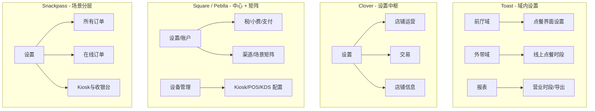

# 美国餐饮 SaaS 竞品后台信息架构深度分析

> **文档目的**：为 BPlant 餐饮管理系统后台重构提供借鉴——统一集成 POS、Kiosk、eMenu、报表、会员、促销、营销、员工管理等产线配置。  
> **分析对象**：Toast、Clover、Square、Peblla、Snackpass（基于项目内中文结构文档）。  
> **分析维度**：一级/二级导航划分、设置项组织、多产线共用能力设计、可复用的重构原则。

---

## 目录

1. [总览：五种架构范式对比](#1-总览五种架构范式对比)
2. [Toast：按业务域纵向切分 + 域内设置](#2-toast按业务域纵向切分--域内设置)
3. [Clover：运营扁平导航 + 巨型设置中枢](#3-clover运营扁平导航--巨型设置中枢)
4. [Square：平台型目录 + 渠道维度贯穿](#4-square平台型目录--渠道维度贯穿)
5. [Peblla：报表驱动 + 集中设置 + 设备分产线](#5-peblla报表驱动--集中设置--设备分产线)
6. [Snackpass：前台/后厨双层设置 + 渠道三分法](#6-snackpass前台后厨双层设置--渠道三分法)
7. [跨竞品：设置项如何划分](#7-跨竞品设置项如何划分)
8. [跨竞品：多产线共用同一功能的设计模式](#8-跨竞品多产线共用同一功能的设计模式)
9. [对 BPlant 统一后台重构的建议](#9-对-bplant-统一后台重构的建议)
10. [附录：各竞品一级导航对照表](#10-附录各竞品一级导航对照表)

---

## 1. 总览：五种架构范式对比

| 维度 | Toast | Clover | Square | Peblla | Snackpass |
|------|-------|--------|--------|--------|-----------|
| **核心隐喻** | 餐饮全栈操作系统 | 收银 + 应用市场 | 商业平台（零售+餐饮） | 华人餐饮垂直 SaaS | 轻量 DTC + 多渠道点餐 |
| **一级导航数量** | 多（分组二约 15+ 业务域） | 少（约 8 项） | 多（10+ 顶级域） | 中（约 10 项） | 极少（5 项） |
| **设置入口** | 分散在各业务域「设置」子项 | 单一「设置」占主导 | 「设置」+ 各产品内嵌设置 | 独立顶级「设置」 | 「设置」按前厅/后厨/账户拆分 |
| **报表位置** | 顶级「报表」+ 各域「相关报表」 | 顶级「报表」 | 顶级「报告」 | 顶级「报表」+「数据分析」 | 顶级「数据」 |
| **多产线表达** | 按场景域（外带/前厅/后厨） | 按交易/店铺运营 | 按渠道 + 设备模式 | 设置页内「适用场景/渠道」 | 「所有订单 / 线上 / Kiosk与收银台」 |
| **设备管理** | 设备中心、发布中心 | 设置→设备与打印机 | 设置→设备管理（模式/Kiosk/KDS） | 顶级「设备」分 POS/Kiosk/打印机 | 设置→设备 + 产品开关 |
| **适合借鉴场景** | 中大型正餐、宴会、人力合规 | 中小店、快速上手 | 多业态、多门店、强集成 | 统一设置中心、渠道矩阵 | 渠道分层设置 UX |

**共性结论（美国餐饮后台）**：

1. **一级导航按「经营动作」而非按「产品线」切**：首页/看板、订单/销售、菜单/商品、顾客/会员、营销、员工/团队、报表、财务/支付、设置/账户。
2. **「设置」永远不会只有一页**：要么按业务域嵌套（Toast），要么按配置类型聚合（Clover/Square），要么按前厅/后厨/账户分层（Snackpass）。
3. **多产线共用能力**普遍采用：**一处主数据 + 渠道/终端覆盖层 + 设备绑定层** 三层模型，而非每个产线复制一套完整配置。

---

## 2. Toast：按业务域纵向切分 + 域内设置

### 2.1 导航分组逻辑

Toast 将后台分为 **四个分组**，体现「日常经营 → 深度运营 → 平台治理 → 内部工具」的层次：

| 分组 | 代表一级项 | 设计意图 |
|------|-----------|----------|
| 分组一 | 首页、报表、探索产品 | 决策入口、数据出口、增购 |
| 分组二 | 员工、菜单、外带与外送、支付、顾客、营销、前厅、后厨… | **按餐饮价值链切业务域** |
| 分组三 | 集成、商店、Toast 账户 | 生态、计费、企业与门店 |
| 分组四 | 内部工具、设备中心 | 实施/运维 |

分组二是一级导航的主体，覆盖美国餐饮核心能力：**人力 → 菜单 → 履约渠道 → 资金 → 顾客关系 → 堂食运营 → 后厨 → 订位等位**。

### 2.2 一级导航与二级结构（要点）

| 一级 | 二级/模块示例 | 功能归类思路 |
|------|--------------|--------------|
| 首页 | 快捷操作、净销售额、人力占比、顾客反馈 | **角色化仪表盘**（老板/经理视角） |
| 报表 | 行业对标、销售、人力、菜单、支付、现金损耗、营销、订位 | **按分析主题横向展开**，与业务域平行 |
| 员工 | 员工管理、权限、薪资、班次回顾、考勤、团队聊天 | 劳动力全生命周期 |
| 菜单 | 菜单管理、批量管理、设置、加购、报表、宴会、食材损耗 | **商品主数据 + 运营策略** |
| 外带与外送 | 在线点餐、时段、可用性、配送、取餐屏、优惠、报表 | **线上履约产品线**整包 |
| 支付 | 交易退款、支付方式、小费、折扣促销、礼品卡 | **资金与结账规则** |
| 顾客 | 名册、分群、洞察、反馈 | CRM，与营销分离 |
| 营销 | 自动化、邮件/短信、优惠、会员、募捐 | **触达与活动**，非交易配置 |
| 前厅 | 桌边/快速点餐界面、餐位图、移动点餐、POS 通知 | **堂食 POS 体验** |
| 后厨 | 打印机/KDS、就餐方式、备餐站、道次、时效 | **出品与路由** |
| 等位与订位 | 日历、设置（分区/规则/短信模板） | 独立产品域，与 Toast 桌边集成 |

### 2.3 设置如何划分

Toast **不把「设置」做成单一顶级菜单**，而是：

1. **域内「设置」**：如外带与外送 → 可用性/线上点餐时段；前厅 → 点餐界面设置/快速点餐/桌边服务；等位与订位 → 常规/预订规则/顾客沟通。
2. **报表旁的「相关 → 设置」**：如报表 → 营业时段/数据导出（分析口径配置）。
3. **账户级**：Toast 账户 → 企业与门店、发布配置、Wi‑Fi、隐私合规。

**设计思路**：设置跟着**谁在用、在什么场景用**走——经理改报表时段进报表；改 POS 桌边流程进前厅；改外送 SLA 进外带与外送。

### 2.4 多产线共用能力（Toast 范例）

| 能力 | 主归属域 | 产线差异如何表达 |
|------|----------|------------------|
| 菜单/税率/价位 | 菜单 → 设置 | 全渠道共用主数据；出餐顺序、条码等偏 POS/打印 |
| 折扣/优惠 | 支付 + 营销 | 支付侧「折扣与促销码」；营销侧「优惠」活动与跟踪 |
| 小费 | 员工（小费池）+ 支付（支付选项） | 政策在人力；刷卡小费扣款在支付 |
| 在线点餐 | 外带与外送 | 时段分「外带与第三方」「自营外送」；与 Grubhub 等集成 |
| 预计出餐时间 | 外带与外送 + 后厨（备餐时间） | 顾客可见 ETA vs 推单到后厨策略 |
| 会员 | 营销 → 会员 | 与顾客名册、POS 开单集成在等位设置 |
| POS 报表 | 员工 → POS 报表配置 | 班次回顾/经理日结**按报表模板**配置，非通用设置 |

**启示**：同一业务概念（如小费）在 Toast 中**允许跨域各管一段**，通过集成点（如订位设置里的「会员计划」「POS 开单」）串联，而非强行一个页面讲完。

### 2.5 可借鉴点与注意点

**借鉴**：

- 业务域导航符合餐饮心智（前厅 / 后厨 / 外带 / 宴会）。
- 每个域挂「相关报表」，减少报表中心与配置脱节。
- 发布中心、设备分组——适合多门店配置下发。

**注意**：

- 域多后查找成本高，需全局搜索与「设置索引」。
- 支付 vs 营销 vs 顾客 边界需内部定义清楚，避免 BPlant 重构时重复建设。

---

## 3. Clover：运营扁平导航 + 巨型设置中枢

### 3.1 一级导航

Clover 一级导航极度扁平，仅约 **8 项**：

```
首页 → 销售活动 → 报表 → 财务 → 商品 → 员工 → 客户 → 设置
```

**设计思路**：左侧是**日常高频**（看数、查单、管货、管人）；右侧「设置」收纳**全部低频配置**。适合 SMB 店员/店主「少学几个菜单」。

### 3.2 二级结构特点

| 一级 | 二级逻辑 |
|------|----------|
| 销售活动 | 按**单据类型**切：订单、交易记录、发票、定期收款 |
| 报表 | 按**分析切片**：销售概览、商品、员工、支付方式… |
| 财务 | 结算、存款、对账单、税费、争议 |
| 商品 | 分类、加料组、打印标签、营收分类（轻量菜单） |
| 设置 | **巨型树**：个人资料、员工、店铺信息、账单、店铺运营、交易、电商 |

### 3.3 设置如何划分（Clover 核心）

`设置` 下按 **配置对象类型** 二级分组：

| 二级 | 内容类型 | 典型项 |
|------|----------|--------|
| 店铺信息 | 法人/展示/账单/银行/结算/PCI | 对外展示 vs 账单信息分离 |
| 店铺运营 | 通知、**线上点餐**、报表偏好、税费、附加费、小费、营业时间、设备、库存、Wi‑Fi | **运营策略集中** |
| 交易 | 订单、订单小票、订单类型、支付、支付小票 | **收银行为与票据** |
| 电商 | 便捷费、Apple Pay、API、风控 | 线上支付合规 |

**线上点餐**嵌在「店铺运营」而非独立一级，说明 Clover 把 OLO 当作**店铺运营开关**而非独立产品前台。

### 3.4 多产线共用能力（Clover 范例）

| 模式 | 示例 |
|------|------|
| **全局默认 + 设备同步** | 签名与小费位置：「修改后全设备同步」 |
| **订单类型驱动** | 订单类型（外卖/堂食）→ 报表维度 + 免税规则 |
| **渠道隐含在集成** | Google/Grubhub/DoorDash 在「线上点餐 → 合作平台」 |
| **小票分单据类型** | 订单小票 vs 支付小票分开配置 |

**启示**：BPlant 若用户偏中小店，可设「设置中枢」子 hub，但需避免单页过深；Clover 的「交易」下 4 个子树（订单/小票/类型/支付）值得复用为**结账域设置分组**。

### 3.5 可借鉴点与注意点

**借鉴**：对外展示信息 vs 账单信息分离；税费/小费/服务费合规提示；订单类型作为跨报表、免税、小票的**枢纽维度**。

**注意**：菜单能力弱于 Toast/Square；餐饮深度功能依赖应用市场，统一后台需预留「应用/插件」位。

---

## 4. Square：平台型目录 + 渠道维度贯穿

### 4.1 一级导航（生态型）

Square 顶级导航体现 **「商品 → 交易 → 线上 → 顾客增长 → 报表 → 人 → 钱 → 设置」** 平台逻辑：

| 一级 | 子域 |
|------|------|
| 首页 | 多门店经营概览、人工成本占比 |
| 商品与菜单 | 商品库、菜单、库存、礼品卡、订阅 |
| 订单和付款 | 交易、订单、发票、虚拟终端、支付链接、纠纷、风险 |
| 线上 | 订购资料、二维码、渠道、网站 |
| 顾客 | 客户名录、合约、营销、忠诚、家庭账户 |
| 报告 | 销售、会计、付款、运营、线上、库存、自定义 |
| 职员 | 团队、排班、时间追踪、工资单、设置 |
| 银行业 | 余额、转账、账单支付 |
| 设置 | 账户、设备管理、餐厅设置、应用集成 |

### 4.2 菜单与渠道（多产线核心）

Square 明确 **菜单 × 渠道** 矩阵：

- **商品库 / 服务库**：主数据。
- **菜单**：描述中写明用于「自助点餐机、外卖应用、线上点餐、餐饮 POS」。
- **渠道上架**、商品默认配置中的 **渠道**、**站点可见性**：控制各终端是否可售。

这是典型的 **「一份 catalog，多 channel 可见性与定价」** 模型。

### 4.3 设置的三层结构

| 层级 | 位置 | 职责 |
|------|------|------|
| **账户级** | 设置 → 账户&设置 | 税、服务费、支付方式、收据品牌、通知、履行方式、定价订阅 |
| **设备/终端级** | 设置 → 设备管理 → 模式 / Kiosk / KDS / 打印机配置文件 | 终端行为差异 |
| **餐饮场景级** | 设置 → 餐厅设置 | 平面图、分区、日结/班次报告、课程、预授权、菜单行为 |

**设备「模式」**（快速服务 / 全方位服务 / 酒吧 / 零售…）说明 Square 用 **配置模板** 区分 POS 业态，而非为每个店建一套独立后台。

### 4.4 履行方式（Fulfillment）按渠道拆分

账户设置 → **履行方式**：

- 收银端履行（外送、堂食、自取、打包…）
- 网上取货及送货
- 运输、非物质

同一概念「就餐/履约类型」在 **POS 与线上分开配置**，与 BPlant 的「订单类型 × 渠道」矩阵一致。

### 4.5 多产线共用能力（Square 范例）

| 能力 | 主数据位置 | 终端/渠道覆盖 |
|------|------------|---------------|
| 税 | 账户 → 税收（含线上减免规则） | 按提货/配送/二维码分别 |
| 小费 | 账户 + Kiosk 设置 + 虚拟终端 + 支付链接 | Kiosk 可单独智能小费、税后/税前 |
| 礼品卡 | 商品与菜单 → 礼品卡 | POS 售卖 / 线上售卖 / Apple Wallet |
| 会员/忠诚 | 顾客 → 忠诚 | 与营销自动化、店内二维码注册联动 |
| 打印机 | 设备管理 → 打印机配置文件 | 收据 / 现场订单票 / 网上订单票 分 job type |
| 自定义支付方式 | 账户 → 支付方式 | 「Uber Eats」等外部渠道记入报表 |

**启示**：Square 最适合 BPlant 学习 **「中心设置 + 设备配置文件 + 渠道矩阵」** 三件套；尤其打印机配置文件（按 job 类型）与 Kiosk 独立设置页。

### 4.6 可借鉴点与注意点

**借鉴**：多门店列表贯穿；风险管理、纠纷、Bill Pay 与餐饮设置解耦；报表「营业时段/自定义时间范围」独立设置页。

**注意**：导航体量大，需 Role-based 裁剪；非餐饮卖家功能多，BPlant 应做餐饮裁剪版 IA。

---

## 5. Peblla：报表驱动 + 集中设置 + 设备分产线

### 5.1 一级导航

```
报表 → 数据分析 → 营销活动 → 菜单 → 订单 → 会员 → 对接 → 管理 → 拼团 → 堂食服务 → 设置 → 设备 → 门店账户
```

**特点**：

- **报表置首**，符合商户「先看数再改配置」习惯。
- **营销活动**独立一级（促销、奖励中心），与会员并列。
- **堂食服务**打包桌位、排队预约、桌边点餐、上菜流程——华人正餐场景。
- **设备**与 **设置** 分离：策略在设置，硬件在设备。

### 5.2 「设置」二级结构（集中式典范）

Peblla 的 `设置` 是 **跨产线策略总线**，二级分组清晰：

| 二级 | 三级示例 | 跨产线设计 |
|------|----------|------------|
| 订单设置 | 序号前缀（**自助机/POS/网页/APP**）、预约单、线上订单状态、堂食座位号、顾客可见备注 | **同一页按渠道分列** |
| 销售设置 | 门店启用、线上渠道状态、第三方渠道、结算时间、营业时间 | 渠道总开关 |
| 税费设置 | 默认税、外卖税 | 履约方式税差 |
| 支付设置 | 服务费（**适用场景：外卖/堂食/取餐/配送/电话**）、小费（快餐/堂食/线上）、现金折扣、双重定价（**仅自助机**） | **矩阵式适用场景** |
| 配送设置 | 自营 / DoorDash | 履约子域 |
| 通知 | 邮件/短信类型多选 | 运营告警 |
| 打印设置 | 小票/厨房/标签分包打印 | 单据类型 |
| 报表设置 | 营业时段、POS 报表字段模块 | 报表 + POS 日结 |
| 线上展示 | 官网/APP/社交链接聚合 | 获客入口 |

### 5.3 设备按产线拆分

`设备` 一级下：

- 打印机（机器人/小票/标签/厨房/KDS/取餐）
- 刷卡器、**柜台 POS**、**POS 设置**（副屏营销）
- **自助点餐机**、**自助机设置**（主题、广告、语音、必填信息、短信）

**设计思路**：**硬件台账与终端体验分离**——打印机列表是运维视角；Kiosk 广告/语音是产品运营视角。

### 5.4 多产线共用（Peblla 范例）

**服务费创建**表单字段：

- 就餐类型：外卖 / 堂食 / 到店取餐 / 配送 / 电话订单  
- 自动应用：「所有渠道」vs「POS 可手动、线上不自动」

**订单序号前缀**：按自助机、柜台 POS、网页、APP 分别配置——**共用规则类型，不同渠道参数**。

**双重定价**：明确标注仅自助机，其他渠道用基础价——**能力开关 + 适用范围声明**。

### 5.5 可借鉴点

Peblla 与 BPlant 同为 **多终端华人餐饮** 场景，**「设置中心 + 渠道适用矩阵」** 最接近统一后台目标；建议作为主参考之一。

---

## 6. Snackpass：前台/后厨双层设置 + 渠道三分法

### 6.1 一级导航（极简）

```
店铺（看板/订单/菜单）→ 营销 → 数据 → 工具 → 设置
```

工具栏含：在线点餐、二维码、网站、团餐、发票、集成——**能力入口外置**，减轻设置树深度。

### 6.2 设置的一级拆分（场景层）

| 设置一级 | 二级 | 设计意图 |
|----------|------|----------|
| 店铺 | 商家信息、营业时间 | 主数据 |
| 团队 | 员工权限 | 人与安全 |
| 设备 | 终端列表 | 运维 |
| **前台** | 品牌、小费、**所有订单**、**在线订单**、**Kiosk与收银台** | **顾客触点 + 渠道** |
| **后厨** | 订单流程、备餐区、桌位、打卡加班 | **出品与劳动力** |
| 账户与税务 | 银行、结算、税率、账单 | 资金合规 |
| 其他 | 产品开关（Kiosk/POS/OLO/KDS…） | **SKU 式开通产品** |

### 6.3 渠道三分法（Snackpass 精髓）

前台设置明确三层：

1. **所有订单** — 声明「影响所有渠道（App、在线、Kiosk、收银台）」  
   - 收据消息、订单备注、包装袋费、外部评价链接  

2. **在线订单** — 仅 App + 在线  
   - 自提/堂食、菜单公告、提前预定、配送  

3. **Kiosk 与收银台** — 店内  
   - 自提/堂食、奖励横幅、热门分类（仅 Kiosk）、第三方单录入（仅收银台）  

**小费**在「前台 → 小费」单独成页，并写明：**规则适用于所有渠道**（部分 UI 能力仅 SnackOS 1.0/2.0）。

### 6.4 多产线共用（Snackpass 范例）

| 模式 | 实现 |
|------|------|
| **默认全局 + 渠道 override** | 所有订单 → 在线 → Kiosk/收银台 继承覆盖 |
| **产品能力开关** | 其他 → 产品：按 Kiosk/POS/OLO 等开通 |
| **设备级特例** | 「仅限 Kiosk」区块；设备 → Kiosk 管理设备特定项 |
| **版本标注** | 「仅 SnackOS 1.0」「2.0 尚不支持」减少支持成本 |

### 6.5 可借鉴点

Snackpass 的 **「所有订单 / 线上 / 店内终端」** 三分法，是统一 BPlant 设置 UX 的**低学习成本模板**；与 Peblla 的「适用场景」矩阵互补（一个按 UI 叙事，一个按表单字段）。

---

## 7. 跨竞品：设置项如何划分

### 7.1 设置分类的六种常见维度

竞品设置项可按以下维度归类（同一设置页常组合多维度）：

| 维度 | 说明 | 代表设置 |
|------|------|----------|
| **A. 主数据/档案** | 门店、品牌、营业时间、法人 | 店铺信息、商家信息、企业与门店 |
| **B. 商品与菜单** | 品项、分类、加料、税率绑定 | 菜单管理、商品、分类 |
| **C. 交易与结账** | 支付、小费、折扣、服务费、钱箱 | 支付选项、小费、附加费 |
| **D. 履约与渠道** | OLO、配送、订单类型、ETA | 外带与外送、履行方式、订单设置 |
| **E. 出品与打印** | KDS、备餐站、小票/厨房单 | 后厨设置、打印设置、打印机配置 |
| **F. 人与合规** | 员工、权限、考勤、加班 | 团队、员工、排班 |
| **G. 增长** | 会员、营销、礼品卡 | 顾客、营销、忠诚 |
| **H. 资金与对账** | 结算、存款、争议、现金平账 | 财务、门店账户 |
| **I. 平台/集成** | API、第三方、发布 | 集成、对接、应用市场 |

### 7.2 三种设置入口策略对比



### 7.3 设置项归属判定规则（提炼）

当 BPlant 归类某一设置项时，建议按顺序判定：

1. **是否仅影响单一终端且与硬件强绑定？** → 硬件/设备中心（打印机 IP、Kiosk 序列号）  
2. **是否仅影响单据样式？** → 打印中心 / 后厨排版（厨房单行合并）  
3. **是否定义「钱怎么收」？** → 支付中心（支付方式、签名顺序、双重定价）  
4. **是否定义「单怎么履约」？** → 订单/外卖中心（订单类型、送厨时机、ETA）  
5. **是否定义「谁可以操作」？** → 权限中心（经理强制登出、开钱箱）  
6. **是否多终端仅参数不同？** → 统一策略页 + **渠道适用表**（Peblla/Snackpass 模式）  
7. **是否分析口径？** → 报表设置（营业日、结算时间）  

---

## 8. 跨竞品：多产线共用同一功能的设计模式

### 8.1 五类设计模式

| 模式 ID | 名称 | 描述 | 竞品示例 | BPlant 建议 |
|---------|------|------|----------|-------------|
| **P1** | 单一事实源（SSOT） | 全渠道共用一套主数据，终端只消费 | Square 商品库、Toast 菜单管理 | 菜单、税种、员工主档 |
| **P2** | 全局默认 + 渠道覆盖 | 先配「所有渠道」，再配线上/店内差异 | Snackpass 所有订单→在线→Kiosk | **设置 UX 首选** |
| **P3** | 场景矩阵 | 同一表单勾选适用：POS/APP/网页/Kiosk | Peblla 服务费、订单号前缀 | 复杂计费/服务费/折扣 |
| **P4** | 域拆分 + 集成点 | 能力拆在不同域，靠集成开关串联 | Toast 小费池 vs 支付选项；订位→会员 | 仅当团队组织已域化 |
| **P5** | 设备配置文件 | 账户级策略 + 终端 Mode/Profile | Square 模式、打印机配置文件 | POS/Kiosk 行为差异大时 |
| **P6** | 产品 SKU 开关 | 先开通产品，再在子模块配置 | Snackpass 其他→产品 | 模块化售卖/增值包 |

### 8.2 典型共用能力映射表

| 功能 | Toast | Clover | Square | Peblla | Snackpass | 推荐统一模型 |
|------|-------|--------|--------|--------|-----------|--------------|
| 小费 | 员工+支付 | 店铺运营→小费 | 账户+Kiosk+VT | 支付设置（分快餐/堂食/线上） | 前台→小费（全渠道） | SSOT 支付中心 + 渠道覆盖小费选项 |
| 税费 | 菜单→税率 | 店铺运营→税费 | 账户→税（分渠道减免） | 税费设置（外卖税） | 账户→税率（按履约方式） | SSOT 税种 + 履约方式矩阵 |
| 订单类型 | 后厨→就餐方式 | 交易→订单类型 | 履行方式（POS/线上分开） | 订单设置+销售启用 | 菜单标注+前台启用 | SSOT 订单类型 + 渠道启用 |
| 折扣/促销 | 支付+营销 | （应用） | 商品折扣+营销优惠券 | 营销活动+POS折扣选项 | 营销→促销活动 | 促销中心战役 + POS 快捷折扣引用 |
| 会员 | 营销→会员 | 客户 | 顾客→忠诚 | 会员 | 奖励（Kiosk/收银台） | 会员中心 + 终端展示开关 |
| 打印/厨房 | 后厨 | 设备与打印机 | 设备→打印机配置+KDS | 打印+设备 | 后厨→备餐区 | 打印中心（版式）+ 硬件中心（绑定） |
| 礼品卡 | 支付→礼品卡 | 支付方式含礼品卡 | 商品与菜单→礼品卡 | 报表含礼品卡交易 | 营销→礼品卡 | 礼品卡中心 |
| 营业时间 | 外带时段 | 店铺运营→营业时间 | 线上/门店多处 | 销售设置→营业时间 | 店铺→营业时间 | 门店档案 SSOT + 渠道特殊时段 override |

### 8.3 反模式（应避免）

1. **按产线复制完整设置树**（POS 一套税、Kiosk 再一套税）→ 配置漂移、支持成本高。  
2. **无「适用范围」说明** → 商户不知道改 Kiosk 是否影响 eMenu。  
3. **同一概念多入口无主次**（Toast 备餐时间在「外带」与「后厨」）→ 需标明 canonical 入口或双向链接。  
4. **设置与报表口径分离无提示**（改结算时间未提示报表影响）→ Peblla 式「请注意」文案值得复制。

---

## 9. 对 BPlant 统一后台重构的建议

### 9.1 推荐一级导航（餐饮统一后台草案）

结合竞品共性及 BPlant 产线（POS、Kiosk、eMenu、报表、会员、促销、营销、员工等），建议采用 **「经营入口 + 领域中心 + 平台治理」** 结构：

| 一级导航 | 包含能力 | 对应产线 |
|----------|----------|----------|
| **首页** | 销售/人力摘要、快捷入口 | 全产线 |
| **订单** | 订单查询、渠道订单、履约状态 | POS、OLO、eMenu、第三方 |
| **菜单** | 品项、加料、菜单发布、渠道可见性 | 全渠道 |
| **顾客与会员** | 名册、会员计划、积分 | 会员、各终端入会 |
| **营销与促销** | 活动、优惠券、短信/邮件 | 营销、促销 |
| **员工与排班** | 员工、权限、考勤、小费池 | POS、Payroll |
| **报表** | 销售、支付、人力、菜单、现金 | 报表 |
| **支付与财务** | 支付方式、结算、对账、争议 | 支付、门店账户 |
| **前厅运营** | 桌位、桌边、POS 界面行为 | POS |
| **后厨与打印** | KDS、送厨、小票/厨房单版式 | POS、KDS、打印机 |
| **外卖与线上** | OLO、eMenu、配送、ETA | eMenu、OO、第三方 |
| **设备** | 终端注册、打印机、Kiosk 展示 | POS、Kiosk、CDS |
| **设置** | 门店档案、通知、集成、系统 | 全产线 |
| **账户** | 订阅、企业/门店、发布下发 | 平台 |

> 一级不宜超过 12～14 项；可将「前厅/后厨」合并为「门店运营」若团队更小。

### 9.2 设置中心内部结构（推荐）

采用 **Snackpass 三分法 + Peblla 矩阵** 组合：

```
设置
├── 门店与品牌（档案、营业时间、通知）
├── 订单与履约（订单类型、送厨规则、ETA、渠道启用）
├── 支付与小费（支付方式、小费、服务费、现金折扣）  ← SSOT
├── 税费（税种、履约方式税差）
├── 顾客可见（备注、售罄展示）                     ← 「所有渠道」
├── 渠道覆盖
│   ├── 全渠道默认
│   ├── 线上（eMenu / APP / OO）
│   ├── 店内（POS / Kiosk / CDS）
│   └── 第三方集成
├── 打印与后厨（版式、触发、路由）                 ← 与设备绑定解耦
├── 报表与营业日（结算时间、营业时段、POS 日结字段）
└── 集成与发布（API、配置下发、版本）
```

### 9.3 多产线配置数据模型（建议）

```text
SettingDefinition（定义）
  ├── code, scope_type: global | channel | device
  ├── category: payment | order | print | ...
  └── ui_group: 设置中心路径

SettingValue（值）
  ├── store_id
  ├── scope_key: e.g. channel=KIOSK | device_id=xxx
  ├── value
  └── effective_priority: device > channel > global
```

**展示层**：每个设置项显示「影响范围」徽章：`全渠道` / `仅 Kiosk` / `仅 eMenu`，并支持「查看被覆盖的终端」。

### 9.4 与现有 BPlant 归类文档衔接

项目内 `设置项功能归类分析-索引.md` 已按 **支付中心、订单中心、后厨管理中心、硬件管理中心** 等一级归属做细项归档。重构时建议：

1. 保持该 **业务归属字典** 作为后端与权限的 canonical 分类；  
2. 前台导航可按 **商户心智**（Snackpass 三分法）重组，通过映射表连接；  
3. 同一能力避免在「Kiosk 设置」与「相关设备/客显屏」双入口——以支付中心/会员中心为准入口，其他仅跳转。

### 9.5 分阶段实施优先级

| 阶段 | 内容 | 参考竞品 |
|------|------|----------|
| P0 | 门店档案、营业时间、税、支付方式、订单类型 SSOT | Clover 店铺信息、Square 履行方式 |
| P1 | 设置中心 + 渠道矩阵（小费、服务费、送厨） | Peblla、Snackpass |
| P2 | 设备中心与打印配置分离 | Square 打印机配置、Peblla 设备 |
| P3 | 报表营业日/结算时间与配置联动提示 | Toast 报表设置、Peblla 报表设置 |
| P4 | 配置发布/多门店下发 | Toast 发布中心 |

---

## 10. 附录：各竞品一级导航对照表

| 能力域 | Toast | Clover | Square | Peblla | Snackpass |
|--------|-------|--------|--------|--------|-----------|
| 首页/看板 | 首页 | 首页 | 首页 | （隐含在报表） | 数据看板 |
| 订单/销售 | 报表内订单 | 销售活动 | 订单和付款 | 订单 | 店铺→订单 |
| 菜单/商品 | 菜单 | 商品 | 商品与菜单 | 菜单 | 店铺→菜单 |
| 报表 | 报表 | 报表 | 报告 | 报表 | 数据 |
| 财务/支付 | 支付、金融产品 | 财务 | 银行业、订单内支付 | 门店账户 | 账户与税务 |
| 顾客 | 顾客 | 客户 | 顾客 | 会员 | （营销/数据内） |
| 营销 | 营销、广告 | — | 营销、忠诚 | 营销活动 | 营销 |
| 员工 | 员工、排班 | 员工 | 职员 | 管理 | 团队 |
| 堂食/桌位 | 前厅、等位与订位 | — | 餐厅设置 | 堂食服务 | 后厨→桌位 |
| 外卖/OLO | 外带与外送 | 设置→线上点餐 | 线上 | 设置内 | 工具→在线点餐 |
| 后厨 | 后厨 | — | KDS/设备 | 设备/打印 | 后厨 |
| 设备 | 设备中心 | 设置→设备 | 设备管理 | 设备 | 设备 |
| 设置/账户 | Toast 账户 | 设置 | 设置 | 设置 | 设置 |
| 集成 | 集成 | API/应用 | 应用程序集成 | 对接 | 工具→集成 |

---

## 文档修订说明

| 项目 | 内容 |
|------|------|
| 版本 | v1.0 |
| 日期 | 2026-05-19 |
| 来源文档 | `Toast/Clover/Square/Peblla/Snackpass商家平台-后台结构-中文.md` |
| 关联 | `设置项功能归类分析-索引.md`、`设置归类-Deepseek.md` |

---

*本文档为竞品 IA 分析，不构成对 BPlant 最终实现的无条件约束；具体菜单命名与权限模型需结合现有产品与商户调研微调。*
