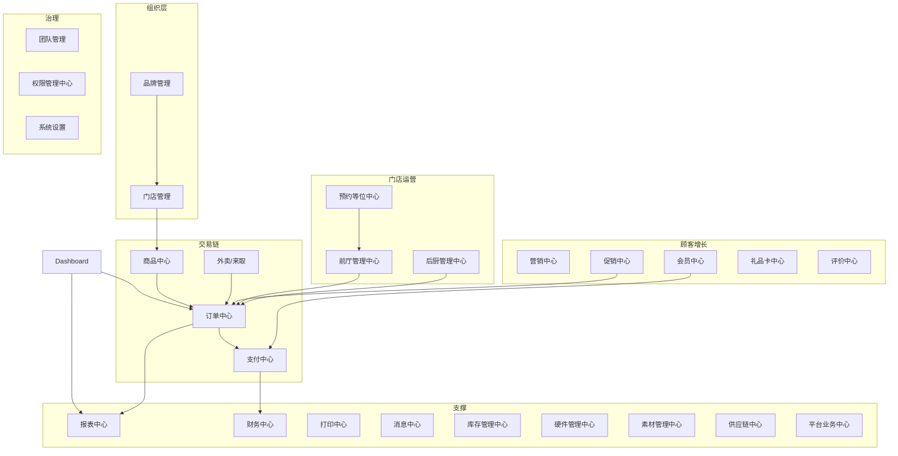

# 餐饮商家后台 — 一级导航定义说明

> 基于 Toast、Clover、Square、Peblla、Snackpass 五家竞品后台结构（中文文档）及项目内《餐饮商家后台-导航与目录结构建议》《配置归类-终版》归纳。  
> 文档目的：为 28 个一级导航提供统一定位、边界与竞品对照，供产品、导航配置与设置项归类使用。

---

## 一、竞品信息架构对照（简要）

| 维度 | Toast | Clover | Square | Peblla | Snackpass |
|------|-------|--------|--------|--------|-----------|
| **首页** | 销售/人力 KPI、快捷入口 | 销售额、待处理订单 | 多店对比、净销售额 | 报表内「销售概览」 | 数据看板 |
| **组织** | 门店信息散落设置/多店报表 | 店铺信息（设置） | 门店列表、品牌推广 | 管理→门店 | 店铺设置 |
| **商品/菜单** | 菜单（品项/加料/税率） | 商品（分类/加料组） | **以 Items & Menus 为核心** | 菜单（分类/套餐/加料） | 菜单/菜品/配料 |
| **订单** | 报表-订单；前厅推单 | 销售活动-订单 | 订单/账单 | 订单 | 订单 |
| **支付/财务** | 支付 + 金融产品 + 报表-支付 | 财务（结算/存款/对账） | 结算、发票 | 报表-支付 | 结算记录 |
| **外卖/在线** | 外带与外送（自营+第三方） | 合作平台/预约点餐 | 在线订购、渠道 | 订单/渠道设置 | 在线订单/Kiosk |
| **营销** | 营销（邮件/SMS/优惠/会员） | 弱（客户列表） | Marketing、忠诚度 | 营销活动/奖励中心 | 营销（促销/短信/礼品卡） |
| **会员/评价** | 顾客（会员/反馈） | 客户 | 客户目录、评价 | 会员+评价 | 顾客数据、外部评价链接 |
| **前厅/后厨** | **前厅**、**后厨** 独立大块 | 桌台弱；设备/打印在设置 | KDS/预约分散 | 堂食服务（桌/排队/预约） | 前台/后厨设置分栏 |
| **团队** | 员工+权限+薪资+考勤 | 员工+角色权限 | Team | 管理-员工/班次/小费 | 团队 |
| **报表** | 报表总览（销售/人力/菜单/支付…） | 报表 | 报表+首页指标 | **报表为主导航** | 数据（销售/人力/菜单…） |
| **库存/供应链** | 食材损耗、xtraCHEF | 库存（套餐内） | 库存管理+供应商 | 弱 | 无独立一级 |
| **设备/打印** | 设备中心（首页快捷） | 设备与打印机 | 硬件、打印 | 弱 | 设备、打印在后厨/设置 |

### 共性规律（对本套一级导航的启示）

1. **经营入口**：五家均有「首页/看板」；多店场景在首页或顶栏做**门店/品牌切换**（Square 门店列表、Toast 分门店报表）。
2. **交易主线**：**商品 → 订单 → 支付/结算 → 报表/财务** 是稳定主轴；Clover/Square 常把「交易流水」与「订单列表」拆开，Toast 更偏报表侧查单。
3. **美国餐饮特色**：**团队（含小费/排班/权限）**、**礼品卡**、**自营在线订餐 + 第三方聚合** 权重高；评价多通过链接/聚合而非独立超大模块（Snackpass 外部评价、Square 客户评价）。
4. **前厅 vs 后厨**：Toast/Peblla 明确分「堂食运营」与「厨房履约」；打印、KDS、路由、备餐时间归后厨或设备，不应全部塞进「设置」。
5. **营销拆分**：竞品常见 **促销/优惠（一次性活动）** 与 **会员/忠诚度（长期关系）** 同组或相邻；礼品卡在美国常独立或与支付/报表联动。
6. **连锁能力**：品牌/区域/门店主数据、品牌商品与门店菜单下发，在通用 SaaS 文档里往往隐含在「设置」或「多店」，本方案用**品牌管理 + 门店管理 + 商品中心**显性化，符合总部—门店模型。

### 参考文档

- `docs/Toast商家平台-后台结构-中文.md`
- `docs/Clover商家平台-后台结构-中文.md`
- `docs/Square商家平台-后台结构-中文.md`
- `docs/Peblla商家平台-后台结构-中文.md`
- `docs/Snackpass商家平台-后台结构-中文.md`
- `docs/餐饮商家后台-导航与目录结构建议.md`
- `docs/配置归类-终版.md`（及 `docs/docs-set/配置归类-分组映射.csv`）

---

## 二、一级导航定义说明（28 项）

说明格式：**定位** → **核心对象与能力** → **边界（不含什么）** → **典型用户** → **竞品参照**

---

### 1. 品牌管理

| 项 | 说明 |
|----|------|
| **定位** | 连锁/多品牌集团的**品牌主数据与品牌级策略**管理入口，服务于「一个集团下多个品牌」的组织模型。 |
| **核心能力** | 品牌档案（名称、LOGO、视觉规范）、品牌级业务规则模板、品牌列表与状态、跨品牌汇总视图（只读概览时可与 Dashboard 互链）。 |
| **边界** | 不管理具体门店营业参数（归**门店管理**）；不维护可售 SKU/菜单结构（归**商品中心**的品牌侧或独立「品牌商品/菜单」子模块）。 |
| **典型用户** | 集团总部、品牌运营。 |
| **竞品参照** | Square「品牌推广」、Snackpass「品牌与外观/公司设置」、Toast 宴会设置中的「品牌」；`admin-web` 路由 `/brand`。 |

---

### 2. 门店管理

| 项 | 说明 |
|----|------|
| **定位** | **物理门店/网点**全生命周期与运营主数据管理（创建、开业、停业、营业时间、地址、联系方式、营业周期等）。 |
| **核心能力** | 门店列表、门店档案、门店状态、区域归属、门店级营业规则（非菜品级）、多店切换上下文的数据范围锚点。 |
| **边界** | 桌台平面图、单店 POS 界面等**前厅运营配置**归**前厅管理中心**；品牌级策略归**品牌管理**；员工账号归**团队管理**。 |
| **典型用户** | 区域经理、店长、实施/运维。 |
| **竞品参照** | Toast/Clover「店铺信息」、Peblla「管理-门店」、Square 门店列表、Snackpass「店铺」。 |

---

### 3. Dashboard（主页）

| 项 | 说明 |
|----|------|
| **定位** | 登录后的**经营工作台**：当日关键指标、待办、异常预警与高频快捷入口，不承担深度配置与明细操作。 |
| **核心能力** | 净销售额/订单量/退款/折扣等 KPI；同比环比；待处理订单、待审核、设备离线等待办；深链到订单/报表/支付等模块。 |
| **边界** | 明细列表、配置项、会计凭证类操作均下沉到对应中心；多店对比的完整分析归**报表中心**（主页可只展示摘要）。 |
| **典型用户** | 老板、店长、值班经理（每日首屏）。 |
| **竞品参照** | 五家「首页/数据看板/销售概览」；Toast 快捷操作 + 净销售额卡片。 |

---

### 4. 团队管理

| 项 | 说明 |
|----|------|
| **定位** | **人的运营**：员工档案、排班考勤、小费分配、工时与绩效，以及与人相关的报表入口（明细类可与报表中心互链）。 |
| **核心能力** | 员工/角色绑定、打卡与工时、休息与加班规则、小费池/分配、排班（含第三方如 7Shifts）、员工报表（小费/绩效/薪资汇总）。 |
| **边界** | **权限模板与系统级鉴权策略**归**权限管理中心**；薪资发放/Payroll 对接可在此发起，**工资打款与税务**归**财务中心**；账号登录邮箱/2FA 可归系统设置或权限。 |
| **典型用户** | 店长、HR、排班主管。 |
| **竞品参照** | Toast「员工」（含薪资/考勤/小费池）、Clover「员工」、Peblla「管理-员工/班次/小费」、Snackpass「团队」。 |

---

### 5. 商品中心

| 项 | 说明 |
|----|------|
| **定位** | **可售商品与菜单结构**的统一主数据与经营配置中心（含规格、加料、套餐、配方、分类、价格、渠道可见性、税种关联等）。 |
| **核心能力** | 商品库、菜单/分组、规格与加料、套餐、配方与原料、图片、标签、门店菜单与品牌菜单的下发关系、售罄/可售状态。 |
| **边界** | **订单内改价/退菜**归订单中心；**支付费率**归支付中心；**厨房打印样式**归后厨/打印中心；**库存数量与采购**归库存/供应链。 |
| **典型用户** | 总部商品部、店长、厨师长（配方）。 |
| **竞品参照** | Toast「菜单」、Square「商品与菜单」（核心）、Peblla「菜单」、Clover「商品」、Snackpass「菜单」。 |

---

### 6. 订单中心

| 项 | 说明 |
|----|------|
| **定位** | **全渠道订单**的运营处理中枢：查询、筛选、状态流转、退单/作废/调整、与履约相关的操作视图。 |
| **核心能力** | 全部订单列表（堂食/POS/在线/第三方）、订单详情、退单与部分退款入口、订单历史、敏感操作审计入口（可与权限联动）。 |
| **边界** | 支付清算、对账、打款归**支付中心/财务中心**；送厨路由、KDS 展示归**后厨管理中心**；渠道开关与预估取餐时间归**外卖/来取**。 |
| **典型用户** | 店长、收银主管、客服。 |
| **竞品参照** | Clover「销售活动-订单」、Peblla/Snackpass「订单」、Toast 报表侧订单 + 前厅推单场景。 |

---

### 7. 支付中心

| 项 | 说明 |
|----|------|
| **定位** | **收单与结账侧**的配置与运营：支付方式、小费流程、附加费、客显/终端支付交互、交易查询与退款操作入口。 |
| **核心能力** | 支付方式启用、小费规则（比例/顺序/客显）、服务费/附加费、交易查询、关联退款、拒付入口（与财务联动）、礼品卡支付相关设置（售卡归礼品卡中心）。 |
| **边界** | **批次结算、存款、月结、会计导出**归**财务中心**；**订单业务状态**归订单中心；**硬件读卡器参数**归硬件管理中心；客显 **小费页/小票**（463、465）与本 hub 结账交互同组，客显封面/Logo/语言归**前厅管理中心**。 |
| **典型用户** | 店长、财务、收银主管。 |
| **竞品参照** | Toast「支付」、Clover 支付记录 + 财务结算、Square 支付与结账、Peblla「支付设置」。 |

---

### 8. 外卖/来取

| 项 | 说明 |
|----|------|
| **定位** | **非堂食履约渠道**的产品与规则配置：自营在线订餐、到店取餐、外送、第三方平台接单及渠道差异化规则。 |
| **核心能力** | 渠道开关、营业时间（外带/外送时段）、预估备餐/配送时间、最低消费、预约单规则、第三方聚合对接、官网/扫码点餐入口配置、订单类型（外带/配送/自取）。 |
| **边界** | 订单列表处理归**订单中心**；菜单可见性归**商品中心**；配送费/服务费的**计价规则**若全局生效可部分在支付或商品；**桌边堂食扫码**可归此前厅或本模块（需在实施规范中二选一）。 |
| **典型用户** | 运营、外卖负责人、店长。 |
| **竞品参照** | Toast「外带与外送」、Peblla「订单/销售设置-渠道」、Snackpass「在线订单/Kiosk/配送」、Square 在线订购与渠道。 |

---

### 9. 营销中心

| 项 | 说明 |
|----|------|
| **定位** | **获客与触达**：面向顾客的沟通、品牌曝光、活动运营与效果分析（偏「做市场」而非单笔折扣规则）。 |
| **核心能力** | 邮件/SMS/推送、营销活动编排、受众分群、广告/社媒（含 AI 素材类能力）、活动效果与 ROI、与会员/促销的联动入口。 |
| **边界** | **单笔折扣/优惠券规则引擎**可归**促销中心**（避免重复）；会员等级与积分规则归**会员中心**；销售结果报表归**报表中心**。 |
| **典型用户** | 市场、运营、品牌经理。 |
| **竞品参照** | Toast「营销/广告/邮件/短信」、Square Marketing、Peblla「营销活动」、Snackpass「短信营销/消息」。 |

---

### 10. 促销中心

| 项 | 说明 |
|----|------|
| **定位** | **交易促动**：折扣、优惠券、满减、限时价、促销码等**可直接作用于订单/购物车**的规则与活动管理。 |
| **核心能力** | 创建/启停促销、优惠码、渠道与时段限制、叠加规则、活动列表与表现（摘要；深度分析在报表）。 |
| **边界** | 会员积分/等级权益归**会员中心**；礼品卡发售与充值促销归**礼品卡中心**；广告投放归**营销中心**。 |
| **典型用户** | 运营、店长（门店活动）。 |
| **竞品参照** | Toast「优惠」、Square「促销活动」、Peblla「促销活动」、Snackpass「促销活动」。 |

---

### 11. 会员中心

| 项 | 说明 |
|----|------|
| **定位** | **顾客关系与忠诚度**：会员账户、积分/储值、等级权益、会员运营与洞察。 |
| **核心能力** | 会员计划设置、积分/余额规则、会员列表与分组、权益、精准触达（或与营销中心分工：本中心管「会员资产」，营销管「群发执行」）、会员 360/洞察。 |
| **边界** | 礼品卡**储值工具**归礼品卡中心；评价内容归评价中心；支付时「是否展示入会」可归会员或支付（见配置归类）。 |
| **典型用户** | 运营、店长、CRM 专员。 |
| **竞品参照** | Toast「顾客-会员」、Square 忠诚度、Peblla「会员」、Clover「客户」（偏档案）。 |

---

### 12. 礼品卡中心

| 项 | 说明 |
|----|------|
| **定位** | **预付储值工具**全生命周期：卡面、模板、售卖渠道、充值/核销、余额与负债管理。 |
| **核心能力** | 电子/实体卡、面额与售价、有效期、卡面设计、门店参与范围、导入、促销联动；与报表的礼品卡负债/交易互链。 |
| **边界** | 卡支付走**支付中心**；会员积分与礼品卡促销在**促销中心**配置；结算资金路径在**财务中心**。 |
| **典型用户** | 运营、财务、店长。 |
| **竞品参照** | Toast/Square/Snackpass 均设独立礼品卡块；报表侧均有礼品卡专项。 |

---

### 13. 评价中心

| 项 | 说明 |
|----|------|
| **定位** | **口碑与反馈**运营：评价聚合、回复、统计与改进任务（尤其对接 Google 等外部评价或平台评价）。 |
| **核心能力** | 评价列表/统计、差评预警、回复模板、评价设置（展示规则、外链）、与营销/会员的联动（挽回券等）。 |
| **边界** | 不做订单履约；不替代社交平台原生后台的全部能力；顾客档案主数据可与会员中心共享。 |
| **典型用户** | 店长、运营、客服。 |
| **竞品参照** | Toast「顾客反馈」、Peblla「评价」、Snackpass「外部评价链接」、Square「客户评价」。 |

---

### 14. 前厅管理中心

| 项 | 说明 |
|----|------|
| **定位** | **堂食前场运营**：桌台、服务区、点餐界面行为、服务员工作流、客显/叫号（若归前场）等与「在店内服务」相关的配置与监控。 |
| **核心能力** | 桌台/平面图、服务区、POS 点餐界面选项、按位点餐/道次、桌边扫码点餐、服务提醒、取餐屏（若业务归前场）、移动点餐方案。 |
| **边界** | KDS、厨打、备餐站归**后厨管理中心**；预约/等位队列归**预约等位中心**；设备注册归**硬件管理中心**；客显 **封面/Logo/场景启用**（461/462/466）归本 hub「客显屏」；**C 端界面语言**（652/653）归「食客端·界面语言」；Kiosk/eMenu **封面·Logo 素材**归**素材中心**；客显 **小费页/小票**（463、465）归**支付中心**。 |
| **典型用户** | 店长、前厅经理、楼面主管。 |
| **竞品参照** | Toast「前厅」（桌边、餐位图、快速点餐）、Peblla「堂食服务」、Square 桌台/预约部分能力。 |

---

### 15. 后厨管理中心

| 项 | 说明 |
|----|------|
| **定位** | **厨房履约**：出餐节奏、KDS、厨打路由、备餐时间、品项路由到档口/打印机。 |
| **核心能力** | 备餐站/工位、KDS 显示规则、送厨策略（未付送厨等）、厨单排版与打印触发（样式可与打印中心协同）、出菜节奏/道次、后厨报表入口。 |
| **边界** | **打印机设备注册与驱动**归硬件/打印；**订单状态**在订单中心；**包装单份数**等若跨前厅后厨，建议在打印中心统一模板、后厨中心只管「是否打印」。 |
| **典型用户** | 厨师长、店长、后厨主管。 |
| **竞品参照** | Toast「后厨」、Chowbus KDS 心智、Peblla 上菜流程/KDS 相关设置、Snackpass「后厨-订单流程」。 |

---

### 16. 预约等位中心

| 项 | 说明 |
|----|------|
| **定位** | **预订与排队等位**一体化：控制到店前/到店时的客流与桌位匹配。 |
| **核心能力** | 在线/电话预订、等位队列、桌型与人数、等位小票/叫号屏联动、预订日历、取消费规则、与 POS 开台联动。 |
| **边界** | 桌台主数据可归前厅；叫号屏硬件参数若在「相关设备」中，业务规则仍在本中心；宴会/外烩大单可归订单或独立场景（Toast 宴会模块）。 |
| **典型用户** | 迎宾、店长、前厅。 |
| **竞品参照** | Toast「等位与订位/Toast 桌边」、Peblla「排队与预约」、Clover 预约排班（注意与**员工排班**区分）。 |

---

### 17. 报表中心

| 项 | 说明 |
|----|------|
| **定位** | **只读分析**：经营、商品、人工、营销、支付、多店对比等**历史与聚合数据**，支持导出与订阅。 |
| **核心能力** | 经营概览、销售与渠道、菜单结构、人工汇总、营销效果、支付/钱箱摘要、多店排行、自定义报表；与 Dashboard 区别在本模块重「钻取与导出」。 |
| **边界** | **打款、对账、月结、税务**的深度操作归**财务中心**；员工工时明细归**团队管理**；不在此改配置。 |
| **典型用户** | 老板、财务、运营、区域经理。 |
| **竞品参照** | 五家均以报表为重要模块；Toast 报表树最全；Peblla 以报表为第一导航。 |

---

### 18. 财务中心

| 项 | 说明 |
|----|------|
| **定位** | **资金与账务侧**：结算、对账、现金管理、费用、发票、税务相关导出，面向「钱是否对得上、何时到账」。 |
| **核心能力** | 结算批次/存款、对账单、钱箱与现金平账、月结、手续费、争议、发票、营业周期相关的财务关账、资金周转类产品入口（若有）。 |
| **边界** | 单笔退款操作入口可在**支付/订单**；礼品卡负债报表可读链接报表中心；会计科目对接可归系统设置或本中心。 |
| **典型用户** | 财务、老板、店长（日结/钱箱）。 |
| **竞品参照** | Toast 报表-支付/现金/账务 + 金融产品、Clover「财务」、Peblla 支付类报表、Snackpass 结算记录。 |

---

### 19. 打印中心

| 项 | 说明 |
|----|------|
| **定位** | **票据与打印行为**的统一治理：模板、份数、路由目标、语言、触发时机（与前厅/后厨/订单协同）。 |
| **核心能力** | 前台小票、厨房单、打包单、等位小票、标签、打印路由（哪台打印机打什么）、打印偏好（作废是否打印等）。 |
| **边界** | **打印机硬件绑定**归硬件管理；**厨单内容字段**（是否打价格等）业务规则可在后厨中心配置、模板在打印中心；不处理订单业务逻辑。 |
| **典型用户** | 店长、实施工程师。 |
| **竞品参照** | Clover「设备与打印机/打印偏好」、Toast 后厨「打印机与单据」、配置归类中厨房单/打包单相关项。 |

---

### 20. 消息中心

| 项 | 说明 |
|----|------|
| **定位** | **对顾客与对内的消息触达通道**管理：模板、发送记录、订阅偏好、系统通知类消息（非完整营销自动化）。 |
| **核心能力** | 短信/邮件/推送模板、订单状态通知（取餐就绪等）、营销消息发送记录、员工通知（可与团队协作）、合规退订。 |
| **边界** | 大型营销活动编排归**营销中心**；会员分群定义归**会员中心**；设备推送通道若走第三方在**平台业务中心**配置。 |
| **典型用户** | 运营、客服、店长。 |
| **竞品参照** | Toast 短信/邮件、Snackpass「消息对话/短信营销」、Square「直接消息」。 |

---

### 21. 库存管理中心

| 项 | 说明 |
|----|------|
| **定位** | **门店物料与可售库存**：数量、盘点、调整原因、预警、与销售的扣减关系（偏门店运营库存，非完整 ERP）。 |
| **核心能力** | 库存数量、盘点与调整、不足是否允许下单、预估剩余展示、自动补货/购货单（若启用）、库存变更记录。 |
| **边界** | **供应商、采购合同、中央厨房配送**归**供应链中心**；**配方 BOM** 归商品中心；成本毛利深度分析在报表。 |
| **典型用户** | 店长、库管、连锁供应链专员。 |
| **竞品参照** | Square「库存管理」、Clover 库存追踪、Toast 损耗/食材、国内天财/蜜雪「订货盘点」。 |

---

### 22. 硬件管理中心

| 项 | 说明 |
|----|------|
| **定位** | **物理设备资产**：POS、打印机、KDS 屏、客显、读卡器、钱箱、扫码枪等的注册、状态、参数与门店绑定。 |
| **核心能力** | 设备列表、序列号、在线状态、门店分配、钱箱开关、网络/证书类高级参数、固件或应用版本（若有）。 |
| **边界** | 打印**内容与模板**归打印中心；支付**业务规则**归支付中心；叫号屏**业务展示规则**归预约等位中心（与配置归类一致）。 |
| **典型用户** | 店长、IT、实施。 |
| **竞品参照** | Toast 设备中心、Clover「设备与打印机」、Snackpass「设备」、Square 终端管理。 |

---

### 23. 素材管理中心

| 项 | 说明 |
|----|------|
| **定位** | **数字品牌资产库**：图片、视频、海报、卡面、Kiosk/线上用素材的统一上传、版本与复用。 |
| **核心能力** | 图片库、视频/启动屏、营销海报、礼品卡面、多语言素材、权限范围内的共享与下发到各渠道。 |
| **边界** | 具体渠道如何引用素材，由各渠道模块（外卖/来取、营销、礼品卡）配置；不等同于「品牌推广颜色」全文案（可在品牌/系统设置）。 |
| **典型用户** | 市场、设计、运营。 |
| **竞品参照** | Snackpass Kiosk 视频/封面、Square 图片库、Toast 品牌中心部分能力。 |

---

### 24. 供应链中心

| 项 | 说明 |
|----|------|
| **定位** | **采购与供给链**：供应商、采购单、到货、配送、（连锁）总部向门店补货，偏 B2B 供给而非前台售卖。 |
| **核心能力** | 供应商档案、采购/要货单、到货验收、配送单、总部—门店调拨、与库存的入库联动。 |
| **边界** | 门店**当日盘点与扣减**归库存管理；**可售商品主数据**归商品中心；**应付账款深度**可归财务中心。 |
| **典型用户** | 总部供应链、加盟商订货员、区域督导。 |
| **竞品参照** | Toast xtraCHEF/供应商向、Square 供应商与订货指引、肯德基/蜜雪类「智能订货」。 |

---

### 25. 平台业务中心

| 项 | 说明 |
|----|------|
| **定位** | **第三方生态与平台型业务**：外卖平台、支付机构、排班/会计/BI、配送、政府或聚合平台等**对接与平台规则**。 |
| **核心能力** | 第三方平台绑定、菜单/订单同步、Webhook/API 密钥、应用市场、平台佣金与对账视图、团餐/发票等平台化能力（按产品裁剪）。 |
| **边界** | 自营官网订餐配置归**外卖/来取**；收单本身归**支付中心**；不在此重复订单列表（只提供聚合配置与异常）。 |
| **典型用户** | 运营、IT、外卖负责人。 |
| **竞品参照** | Peblla「对接-第三方」、Toast 第三方接单、Snackpass「集成/第三方」、Clover「合作平台」。 |

---

### 26. 权限管理中心

| 项 | 说明 |
|----|------|
| **定位** | **授权与安全策略**：谁能做什么、在什么范围（品牌/区域/门店）、以什么方式登录。 |
| **核心能力** | 角色与权限矩阵、数据范围（组织树）、敏感操作审批、密码/会话/自动登出、经理授权（强制登出、改价、退款等）、审计策略。 |
| **边界** | 员工**人事信息**归团队管理；**业务功能默认值**归各业务中心或系统设置；账号账单归系统设置。 |
| **典型用户** | 总部 IT、店长（门店角色分配）、合规。 |
| **竞品参照** | Toast「权限管理」、Clover「员工角色/权限」、各竞品 Settings 下的 Security。 |

---

### 27. 系统设置

| 项 | 说明 |
|----|------|
| **定位** | **全局与跨模块的基础配置**兜底：不专属于某一业务域、但被多模块引用的系统级参数。 |
| **核心能力** | 租户/公司信息、国际化、时区、订单序号全局规则、税务辖区默认值、集成总开关、操作日志、部分「设置中分类」的入口聚合、与实施相关的环境项。 |
| **边界** | 有明确业务域的配置应**下沉到对应中心**（避免「万能设置」）；组织主数据不归此处（品牌/门店已独立）。 |
| **典型用户** | 管理员、实施、总部运维。 |
| **竞品参照** | 五家均有 Settings；Toast/Clover 店铺信息、Peblla 大块「设置」需按域拆分落地。 |

---

## 三、模块关系简图

---

## 四、一级导航总览表

| 序号 | 一级导航 | 一句话定义 |
|------|----------|------------|
| 1 | 品牌管理 | 多品牌集团的品牌主数据与品牌级策略 |
| 2 | 门店管理 | 物理门店档案、状态与运营主数据 |
| 3 | Dashboard（主页） | 经营工作台：KPI、待办与快捷入口 |
| 4 | 团队管理 | 员工、排班考勤、小费与工时运营 |
| 5 | 商品中心 | 可售商品、菜单结构与下发 |
| 6 | 订单中心 | 全渠道订单查询、处理与退单 |
| 7 | 支付中心 | 收单、支付方式与小费结账配置 |
| 8 | 外卖/来取 | 非堂食渠道与第三方接单规则 |
| 9 | 营销中心 | 获客触达、活动编排与效果分析 |
| 10 | 促销中心 | 折扣、优惠券等订单级促动规则 |
| 11 | 会员中心 | 会员、积分/储值与忠诚度运营 |
| 12 | 礼品卡中心 | 礼品卡售卖、核销与负债管理 |
| 13 | 评价中心 | 评价聚合、回复与口碑运营 |
| 14 | 前厅管理中心 | 堂食前场：桌台、点餐界面与服务流 |
| 15 | 后厨管理中心 | 厨房履约：KDS、送厨与厨打路由 |
| 16 | 预约等位中心 | 预订、排队等位与叫号联动 |
| 17 | 报表中心 | 经营分析、导出与多店对比 |
| 18 | 财务中心 | 结算、对账、现金与税务相关资金 |
| 19 | 打印中心 | 票据模板、路由与打印行为 |
| 20 | 消息中心 | 短信/邮件/推送模板与发送记录 |
| 21 | 库存管理中心 | 门店库存、盘点与补货触发 |
| 22 | 硬件管理中心 | POS、打印机、KDS 等设备资产 |
| 23 | 素材管理中心 | 图片、视频等品牌数字资产库 |
| 24 | 供应链中心 | 供应商、采购与总部—门店供给 |
| 25 | 平台业务中心 | 第三方平台对接与聚合业务 |
| 26 | 权限管理中心 | 角色权限、数据范围与安全策略 |
| 27 | 系统设置 | 全局基础配置与跨模块兜底项 |

---

## 五、实施建议

1. **一级数量**：当前 28 项偏多，竞品多控制在 **7～12 个可见一级**；可考虑将「素材/消息/打印」在 UI 上收成「运营支撑」分组，逻辑定义仍保留。
2. **促销 vs 营销 vs 会员**：建议在 PRD 中写清「规则创建 / 触达执行 / 身份资产」三角分工，避免三处都能建券。
3. **报表 vs 财务 vs 支付**：报表只读分析；支付管单笔与方式；财务管批次、对账、现金关账。
4. **连锁**：**品牌管理 → 商品中心（品牌）→ 门店管理 → 门店菜单/库存**，下发链路写入商品中心与门店管理的边界说明。
5. **美国向必选**：团队（小费）、礼品卡、外卖/来取、权限、财务结算——五份竞品文档中反复出现，不宜合并进笼统「设置」。
6. **与配置归类对齐**：设置项归属以 `docs/配置归类-终版.md` 及 `docs/docs-set/配置归类-分组映射.csv` 为准；本文一级定义用于导航与产品边界，二者冲突时以终版归类表为实施依据并回写本文。

---

*文档版本：初稿 | 生成依据：竞品五文档 + 项目导航建议 + 配置归类终版*
